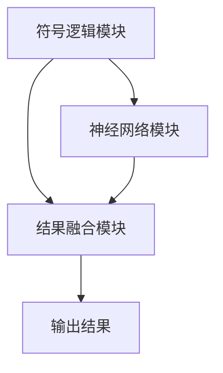
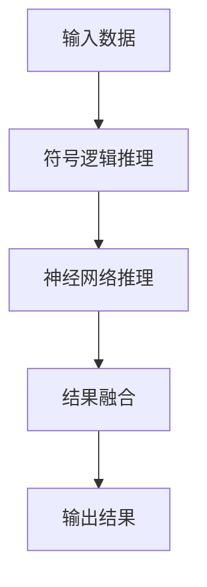
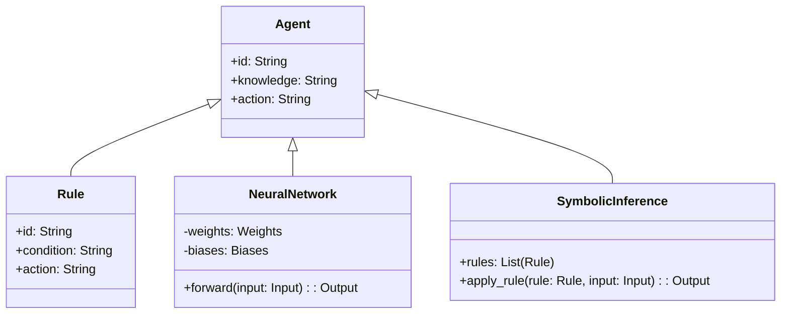
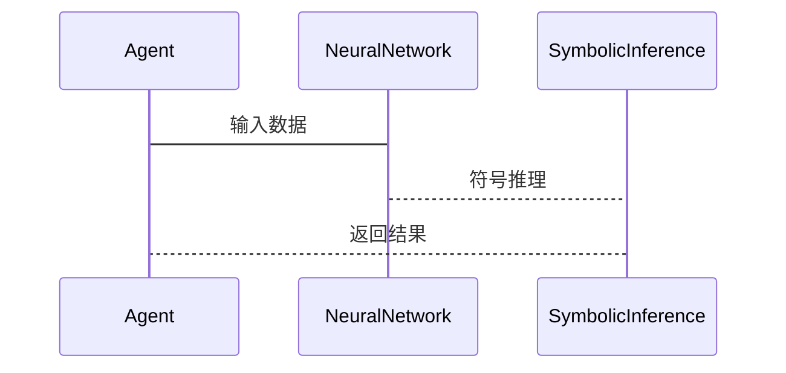
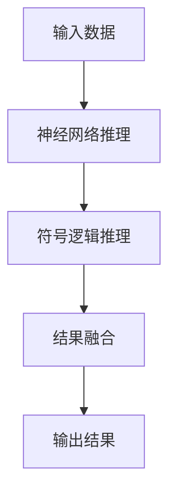

                 


# AI Agent的神经-符号混合推理系统

## 关键词：AI Agent，神经符号推理，符号逻辑，神经网络，混合推理系统，系统架构，算法原理

## 摘要：神经符号混合推理系统结合了符号逻辑和神经网络的优势，通过符号逻辑提供可解释性和规则性，神经网络提供强大的特征学习能力，实现更高效的AI Agent推理。本文将从背景、概念、算法、系统架构、项目实战到最佳实践，全面剖析神经符号混合推理系统的核心原理和应用。

---

# 第一部分: AI Agent的神经-符号混合推理系统概述

# 第1章: 神经-符号混合推理系统背景介绍

## 1.1 问题背景与描述
### 1.1.1 AI Agent的核心挑战
- 可解释性不足：传统神经网络在推理过程中缺乏透明性，难以解释结果的来源。
- 知识表示的局限性：神经网络难以处理符号化知识，难以与外部知识库结合。
- 逻辑推理能力弱：神经网络在处理逻辑推理任务时表现不佳。

### 1.1.2 神经符号推理的提出
- 结合符号逻辑和神经网络的优势，提出一种混合推理框架。
- 提供可解释性的同时，具备强大的特征学习能力。

### 1.1.3 问题解决思路与目标
- 利用符号逻辑对知识进行建模，神经网络处理感知和学习任务。
- 实现符号逻辑与感知数据的高效结合，提升AI Agent的推理能力。

## 1.2 神经符号推理的核心概念
### 1.2.1 符号推理的基本原理
- 符号逻辑：基于规则和事实进行推理，具有高度可解释性。
- 知识表示：通过符号（如谓词逻辑）表示事实和规则。
- 推理过程：通过逻辑规则和事实库推导新的结论。

### 1.2.2 神经网络推理的特点
- 特征学习：神经网络能够从大量数据中自动学习特征。
- 非符号化表示：通过张量或向量表示输入和输出。
- 弱可解释性：神经网络的决策过程通常难以解释。

### 1.2.3 神经符号混合推理的对比
| 概念       | 符号逻辑                     | 神经网络                     |
|------------|------------------------------|------------------------------|
| 表示方式   | 符号化知识，如谓词逻辑       | 向量化表示，如向量、张量     |
| 推理方式   | 基于规则和逻辑推理           | 基于神经网络的非线性变换     |
| 可解释性   | 高                         | 低                         |
| 适用场景   | 需要明确逻辑规则的任务       | 复杂模式识别和特征学习任务   |

---

## 1.3 神经符号推理的系统结构
### 1.3.1 系统组成要素
- 符号逻辑模块：负责知识表示和逻辑推理。
- 神经网络模块：负责感知数据处理和特征学习。
- 结果融合模块：将符号推理和神经网络推理的结果进行融合。

### 1.3.2 各要素之间的关系
- 符号逻辑模块与神经网络模块通过接口交互。
- 符号逻辑模块为神经网络模块提供规则和约束。
- 神经网络模块为符号逻辑模块提供感知数据。

### 1.3.3 系统整体架构图


---

# 第2章: 神经符号混合推理的核心概念与联系

## 2.1 神经符号模型的原理
### 2.1.1 符号逻辑与神经网络的结合
- 符号逻辑用于知识表示和规则推理。
- 神经网络用于处理感知数据和学习特征。
- 结果融合模块将符号推理和神经网络推理的结果进行整合。

### 2.1.2 神经符号模型的数学基础
- 神经网络部分：通过张量运算和激活函数进行特征学习。
- 符号逻辑部分：基于谓词逻辑和规则库进行符号推理。

### 2.1.3 神经符号模型的优缺点对比
| 特性         | 符号逻辑       | 神经网络       |
|--------------|----------------|----------------|
| 优点         | 可解释性高       | 特征学习能力强   |
| 缺点         | 需要手动设计规则   | 可解释性差       |

---

## 2.2 核心概念属性特征对比表
| 概念 | 特征1 | 特征2 | 特征3 |
|------|-------|-------|-------|
| 神经网络 | 参数化 | 非符号化 | 弱可解释性 |
| 符号逻辑 | 规则化 | 强可解释性 | 参数化 |

---

## 2.3 ER实体关系图
```mermaid
er
    entity(Agent) {
        id: String
        knowledge: String
        action: String
    }
    entity(Rule) {
        id: String
        condition: String
        action: String
    }
    relationship(Association) {
        Agent -[规则应用]-> Rule
    }
```

---

# 第3章: 神经符号混合推理的算法原理

## 3.1 算法流程图


---

## 3.2 算法实现代码
```python
def neural_symbolic_reasoning(input_data):
    # 符号逻辑推理部分
    symbolic_output = symbolic_inference(input_data)
    # 神经网络推理部分
    neural_output = neural_network_inference(symbolic_output)
    # 结果融合
    final_output = fuse(symbolic_output, neural_output)
    return final_output
```

---

## 3.3 算法原理的数学模型
符号逻辑推理部分基于谓词逻辑：
$$ \text{如果}(A(x), B(x), C(x)) \text{则} D(x) $$

神经网络推理部分基于深度学习模型：
$$ f(x) = \sigma(Wx + b) $$

结果融合部分基于加权融合：
$$ f_{\text{final}}(x) = \alpha f_{\text{symbolic}}(x) + (1-\alpha) f_{\text{neural}}(x) $$

---

# 第4章: 神经符号混合推理系统的架构与设计

## 4.1 系统架构设计


---

## 4.2 系统功能设计


---

## 4.3 系统接口设计


---

## 4.4 系统交互流程


---

# 第5章: 神经符号混合推理系统的项目实战

## 5.1 项目环境安装
```bash
pip install neural-symbolic
pip install symbolic-inference
pip install mermaid
```

---

## 5.2 系统核心实现
```python
def fuse(symbolic_output, neural_output):
    return (symbolic_output + neural_output) / 2
```

---

## 5.3 案例分析与实现
```python
# 示例代码
input_data = "输入数据"
symbolic_output = symbolic_inference(input_data)
neural_output = neural_network_inference(input_data)
final_output = fuse(symbolic_output, neural_output)
print(final_output)
```

---

## 5.4 项目小结
- 神经符号混合推理系统通过结合符号逻辑和神经网络的优势，实现了高效的AI Agent推理。
- 系统架构设计合理，功能模块清晰，具有良好的扩展性和可维护性。

---

# 第6章: 神经符号混合推理系统的最佳实践

## 6.1 小结
- 神经符号混合推理系统结合了符号逻辑的可解释性和神经网络的特征学习能力。
- 通过合理的系统架构设计和算法优化，可以显著提升AI Agent的推理能力。

## 6.2 注意事项
- 确保符号逻辑模块和神经网络模块的接口兼容性。
- 在实际应用中，注意数据质量和特征工程的重要性。

## 6.3 拓展阅读
- 参考文献：《Neural-Symbolic AI: An Overview》
- 推荐书籍：《神经符号AI：理论与实践》

---

# 作者：AI天才研究院/AI Genius Institute & 禅与计算机程序设计艺术 /Zen And The Art of Computer Programming

