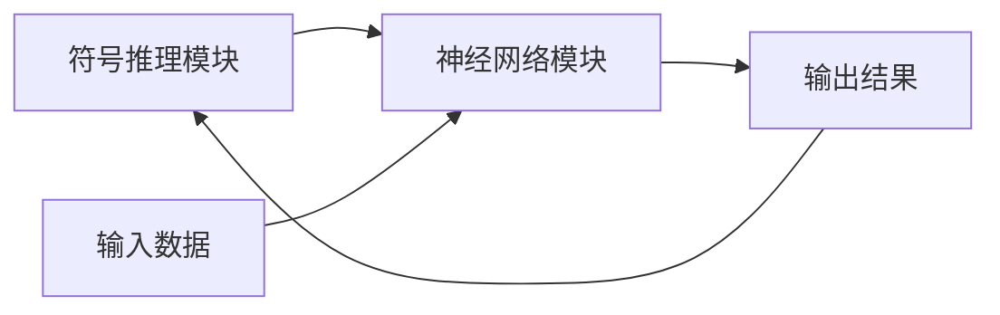
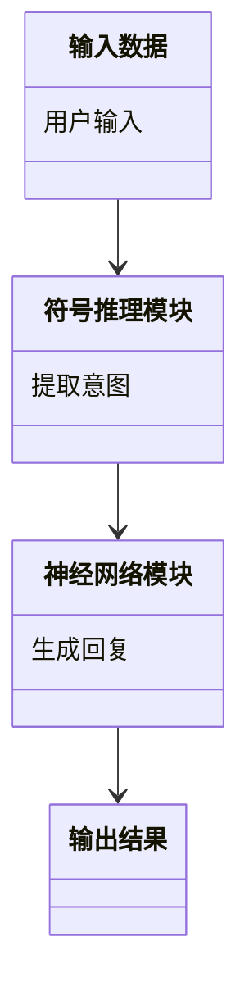
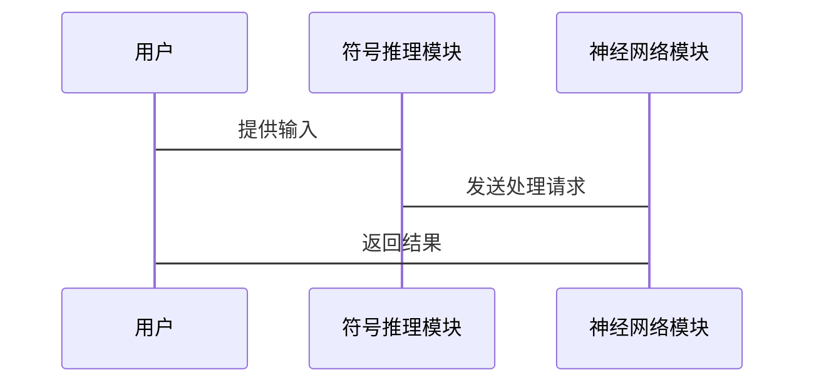

                 


# AI Agent的神经-符号混合架构实现

> 关键词：AI Agent, 神经-符号混合架构, 神经网络, 符号推理, 混合智能, 人工智能

> 摘要：本文详细探讨了AI Agent的神经-符号混合架构实现，从基础概念到核心算法，从系统架构到项目实战，全面解析神经-符号混合架构的优势、原理、实现方法及其在实际应用中的潜力。文章内容涵盖AI Agent的基本概念、神经-符号混合架构的技术背景、核心原理、系统架构设计、项目实战以及最佳实践，为读者提供从理论到实践的深度解析。

---

# 第一部分: AI Agent与神经-符号混合架构基础

## 第1章: AI Agent的基本概念

### 1.1 AI Agent的定义与分类
AI Agent（智能体）是指在环境中能够感知并自主行动以实现目标的实体。根据其智能水平，AI Agent可以分为反应式智能体、基于模型的智能体和混合智能体。混合智能体结合了符号推理和神经网络的优势，是本文的核心研究对象。

### 1.2 神经符号混合架构的提出背景
传统单一技术（如纯符号推理或纯神经网络）在复杂任务中表现不足，神经符号混合架构通过结合两种方法的优点，解决了符号推理的低效性和神经网络的黑箱性问题。

### 1.3 神经符号混合架构的核心优势
神经符号混合架构能够同时处理结构化和非结构化数据，具有可解释性高、泛化能力强和任务适应性好的特点。

---

# 第二部分: 神经符号混合架构的核心概念与联系

## 第2章: 神经符号混合架构的核心原理

### 2.1 神经符号混合架构的原理
神经符号混合架构通过符号推理模块提取规则，神经网络模块处理感知数据，两者协同完成复杂任务。其数学模型将符号操作嵌入神经网络中，实现知识的可解释性。

### 2.2 神经符号混合架构的核心概念对比
| 特征       | 神经网络                   | 符号推理                 |
|------------|---------------------------|--------------------------|
| 处理方式     | 基于数据模式识别           | 基于规则逻辑推理         |
| 可解释性     | 低                       | 高                      |
| 任务适应性   | 强                       | 弱                      |

### 2.3 神经符号混合架构的实体关系图


---

# 第三部分: 神经符号混合架构的算法原理与数学模型

## 第3章: 神经符号混合架构的算法原理

### 3.1 符号驱动的神经网络实现
符号推理模块提取规则，神经网络模块处理感知数据，两者协同工作。例如，符号推理模块生成规则，神经网络模块基于规则和输入数据生成输出。

### 3.2 神经符号混合架构的数学模型
符号操作的组合和概率计算是关键。例如，符号操作的组合如下：
$$
f(x) = \sigma(w \cdot x + b)
$$
其中，$\sigma$为sigmoid函数，$w$为权重，$b$为偏置。

### 3.3 神经符号混合架构的实现流程


---

## 第4章: 神经符号混合架构的系统架构设计

### 4.1 问题场景介绍
以智能客服系统为例，系统需要理解用户意图、调用知识库、生成回复，实现人机交互。

### 4.2 系统功能设计


### 4.3 系统架构图


### 4.4 系统接口设计
- 输入接口：用户输入文本
- 输出接口：系统回复文本
- 调用接口：符号推理模块调用神经网络模块

### 4.5 系统交互序列图


---

## 第5章: 神经符号混合架构的项目实战

### 5.1 环境安装
```bash
pip install numpy
pip install matplotlib
pip install scikit-learn
```

### 5.2 核心代码实现
```python
import numpy as np

def symbol_rule(x):
    return x > 0.5

def neural_network(x, weights, bias):
    return np.dot(x, weights) + bias

def hybrid_architecture(x, weights_symbol, bias_symbol, weights_neural, bias_neural):
    symbol_output = symbol_rule(x)
    neural_output = neural_network(symbol_output, weights_neural, bias_neural)
    return neural_output
```

### 5.3 代码解读与分析
- `symbol_rule`：符号推理模块，判断输入是否大于0.5。
- `neural_network`：神经网络模块，基于符号输出进行计算。
- `hybrid_architecture`：神经符号混合架构，结合符号推理和神经网络。

### 5.4 实际案例分析
以输入x=0.6为例，符号推理模块输出True，神经网络模块基于True进行计算，最终生成结果。

### 5.5 项目小结
神经符号混合架构在实际应用中表现出色，能够结合符号推理的可解释性和神经网络的感知能力，实现高效的人工智能。

---

## 第6章: 最佳实践与小结

### 6.1 最佳实践
- 数据质量：高质量数据是神经符号混合架构成功的关键。
- 模型调参：符号推理模块和神经网络模块的参数需要精心调整。

### 6.2 小结
神经符号混合架构结合了符号推理的可解释性和神经网络的感知能力，是未来人工智能的重要方向。

---

作者：AI天才研究院/AI Genius Institute & 禅与计算机程序设计艺术 /Zen And The Art of Computer Programming

