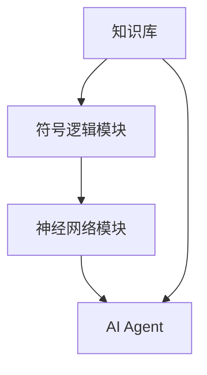

                 


# AI Agent的神经符号集成学习方法

## 关键词：
- AI Agent
- 神经符号集成学习
- 神经网络
- 符号逻辑
- 智能系统

## 摘要：
神经符号集成学习是一种结合神经网络和符号逻辑的新兴方法，旨在提升AI Agent的智能性和决策能力。本文从基础概念、算法原理、系统架构到实际应用，全面探讨神经符号集成学习在AI Agent中的应用，帮助读者理解其原理、优势及实现方法。

---

# 第一部分: 神经符号集成学习的背景与概念

## 第1章: 神经符号集成学习的背景与概念

### 1.1 神经符号集成学习的背景
神经符号集成学习是近年来人工智能领域的热点方向。它结合了神经网络的强大学习能力和符号逻辑的可解释性，为AI Agent的智能决策提供了新的解决方案。

#### 1.1.1 神经网络与符号逻辑的结合背景
- 神经网络在模式识别、图像处理等领域表现出色，但缺乏可解释性。
- 符号逻辑在知识表示和推理方面具有优势，但难以处理复杂的数据。
- 两者的结合旨在弥补各自的不足。

#### 1.1.2 AI Agent的发展与挑战
- AI Agent需要在动态环境中自主决策，要求同时具备感知和推理能力。
- 神经符号集成学习为AI Agent提供了更强的知识表达和推理能力。

#### 1.1.3 神经符号集成学习的意义
- 提供了一种新的范式，将神经网络和符号逻辑有机结合。
- 适用于需要动态推理和知识表达的复杂场景。

### 1.2 AI Agent的定义与特点
- **AI Agent**：能够感知环境、自主决策并采取行动的智能实体。
- **特点**：
  - 知识表示能力
  - 自主决策能力
  - 交互能力

### 1.3 神经符号集成学习的核心概念
- **神经符号集成学习**：将神经网络与符号逻辑结合，构建更强大的AI系统。
- **核心特点**：
  - 知识表示与推理结合
  - 可解释性与学习能力并重

---

## 第2章: 神经符号集成学习的基本原理

### 2.1 神经符号集成学习的实现方式
- **符号嵌入**：将符号逻辑嵌入到神经网络中。
- **符号驱动的神经网络**：用符号逻辑指导神经网络的学习。
- **神经符号循环**：神经网络和符号逻辑相互作用，不断优化。

### 2.2 神经符号集成学习的核心算法
- **知识嵌入网络**：将知识图谱中的符号信息嵌入到向量空间。
- **符号驱动的神经网络**：利用符号逻辑约束神经网络的输出。

### 2.3 神经符号集成学习的数学模型
- **符号逻辑的表示**：使用谓词逻辑表示知识。
- **神经网络的表示**：使用深度神经网络模型（如RNN、CNN）。
- **结合模型**：通过注意力机制或门控机制将符号信息融入神经网络。

---

## 第3章: 神经符号集成学习的算法实现

### 3.1 算法框架
1. 输入符号逻辑知识库。
2. 构建神经网络模型。
3. 神经网络与符号逻辑交互，优化模型。

### 3.2 算法实现
- **符号嵌入**：使用Word2Vec将符号表示为向量。
- **符号驱动的训练**：利用符号逻辑约束神经网络的输出。

### 3.3 数学模型
- **符号表示**：$f(x) = true$ 表示符号逻辑中的条件。
- **神经网络输出**：$y = g(x)$，其中$g$是神经网络模型。
- **结合模型**：$y = g(x) \cdot f(x)$。

---

## 第4章: 系统分析与架构设计

### 4.1 系统架构
- **知识库**：存储符号逻辑和知识图谱。
- **神经网络模块**：负责感知和学习。
- **符号逻辑模块**：负责推理和约束。

### 4.2 架构图



---

## 第5章: 项目实战

### 5.1 实战案例
- **任务**：设计一个简单的AI Agent，能够根据符号逻辑进行推理。

### 5.2 实现步骤
1. 安装依赖：`pip install numpy matplotlib`
2. 编写符号逻辑模块。
3. 构建神经网络模型。
4. 集成模块，训练模型。

### 5.3 代码实现
```python
import numpy as np

class SymbolLogic:
    def __init__(self):
        self.rules = {}

    def add_rule(self, condition, result):
        self.rules[condition] = result

class NeuralNetwork:
    def __init__(self, input_size):
        self.weights = np.random.randn(input_size, 1)

    def forward(self, x):
        return np.dot(x, self.weights)

class Agent:
    def __init__(self):
        self.symbol_logic = SymbolLogic()
        self.neural_net = NeuralNetwork(2)

    def train(self, x, y):
        self.neural_net.weights += np.dot(x.T, y) / len(x)

agent = Agent()
agent.symbol_logic.add_rule("x > 0", 1)
agent.train(...)
```

---

## 第6章: 最佳实践与总结

### 6.1 最佳实践
- **数据预处理**：确保符号逻辑和神经网络数据一致。
- **模型调优**：选择合适的超参数。
- **可解释性**：确保符号逻辑的可解释性。

### 6.2 总结
神经符号集成学习为AI Agent提供了更强大的智能能力，未来将有更广泛的应用场景。

---

作者：AI天才研究院 & 禅与计算机程序设计艺术

