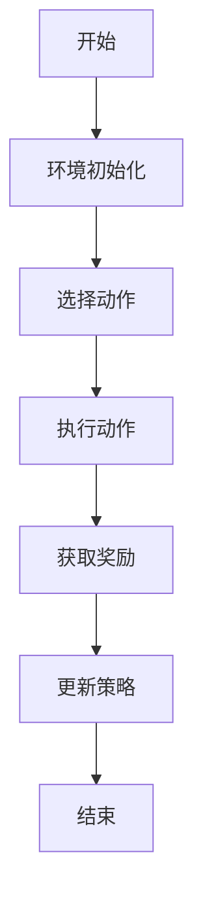
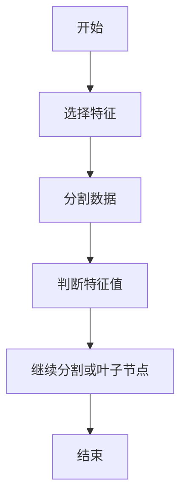
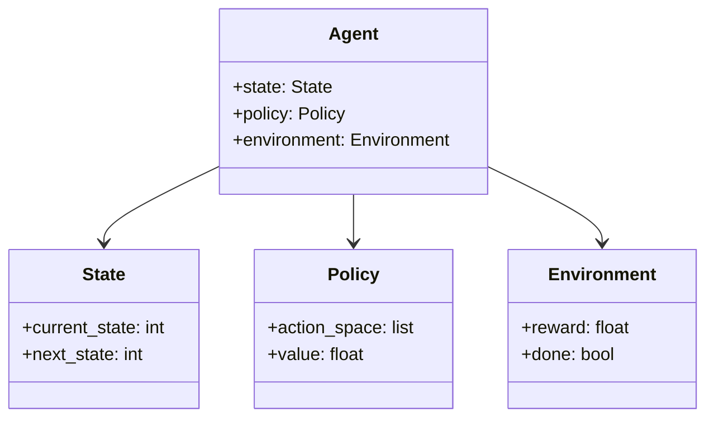
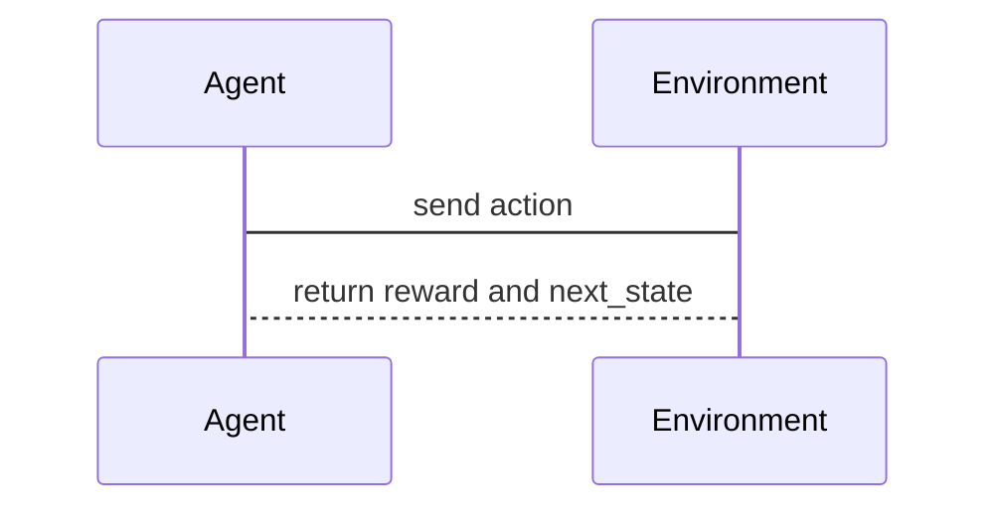

                 


# 《AI Agent的系统架构设计与实现》

> 关键词：AI Agent，系统架构设计，实现，算法原理，项目实战

> 摘要：本文将深入探讨AI Agent的系统架构设计与实现，从基本概念到核心算法，从系统设计到项目实战，全面解析AI Agent的技术细节和实际应用。通过本文的学习，读者将能够理解AI Agent的工作原理，并掌握设计和实现AI Agent系统的相关技能。

---

## 第一部分: AI Agent的系统架构设计与实现概述

## 第1章: AI Agent的基本概念与背景

### 1.1 AI Agent的定义与核心概念

#### 1.1.1 AI Agent的定义
AI Agent（人工智能代理）是一种能够感知环境并采取行动以实现目标的智能实体。它可以是一个软件程序、一个机器人，或者任何能够与环境交互的智能系统。

#### 1.1.2 AI Agent的核心概念
- **智能性**：AI Agent能够通过感知和推理做出决策。
- **自主性**：AI Agent能够在没有外部干预的情况下自主运行。
- **反应性**：AI Agent能够根据环境的变化实时调整行为。
- **目标导向**：AI Agent的所有行动都是为了实现特定的目标。

#### 1.1.3 AI Agent的分类与特点
AI Agent可以根据不同的标准进行分类，常见的分类包括：
- **基于智能水平的分类**：分为简单反应式AI Agent、基于模型的AI Agent、目标导向型AI Agent等。
- **基于环境的分类**：分为静态环境、动态环境和可预测环境中的AI Agent。

#### 1.1.4 AI Agent的应用场景与优势
AI Agent广泛应用于自动驾驶、智能客服、智能家居、机器人控制等领域。其优势在于能够自主决策、适应环境变化并高效完成任务。

#### 1.1.5 AI Agent的边界与外延
AI Agent的边界在于其智能性和自主性，而外延则涉及多智能体协作、人机交互等领域。

### 1.2 AI Agent与传统软件开发的对比

#### 1.2.1 传统软件开发的特点
传统软件开发注重功能实现和代码结构，依赖于明确的逻辑和算法。

#### 1.2.2 AI Agent开发的独特性
AI Agent开发强调智能性和自主性，依赖于机器学习和数据驱动的方法。

#### 1.2.3 AI Agent与传统AI的区别
传统AI注重数据处理和模式识别，而AI Agent更强调与环境的交互和自主决策。

#### 1.2.4 AI Agent与传统软件开发的联系
AI Agent结合了传统软件开发的结构化方法和机器学习的智能化方法。

### 1.3 本章小结
本章介绍了AI Agent的基本概念、核心概念、分类与特点，以及与传统软件开发的对比，为后续章节奠定了基础。

---

## 第二部分: AI Agent的核心概念与联系

## 第2章: AI Agent的核心概念与原理

### 2.1 AI Agent的核心原理

#### 2.1.1 知识表示与推理
AI Agent通过知识表示（如逻辑推理、语义网络）来理解和处理信息。

#### 2.1.2 行为规划与决策
AI Agent通过行为规划算法（如A*算法、动态规划）来制定行动方案。

#### 2.1.3 人机交互与反馈机制
AI Agent通过人机交互界面与用户互动，并根据反馈调整行为。

#### 2.1.4 多智能体协作与通信
AI Agent在多智能体环境中通过通信协议协作完成任务。

### 2.2 AI Agent的核心要素对比

#### 2.2.1 不同AI Agent模型的对比
使用表格对比不同AI Agent模型的特点和适用场景。

| 模型类型       | 特点                     | 适用场景                     |
|----------------|--------------------------|------------------------------|
| 简单反应式     | 基于当前感知做出反应       | 适用于实时反应场景，如自动驾驶刹车 |
| 基于模型的     | 使用内部模型进行推理       | 适用于复杂环境，如机器人导航     |
| 目标导向型     | 为实现目标采取行动         | 适用于任务导向场景，如智能客服     |

#### 2.2.2 AI Agent与传统算法的对比
使用ER图展示AI Agent与传统算法在核心要素上的区别。

```mermaid
erDiagram
    agent {
        id
        name
        type
    }
    algorithm {
        id
        name
        type
    }
    agent --> algorithm : 使用
```

### 2.3 本章小结
本章详细讲解了AI Agent的核心原理和核心要素，并通过对比分析帮助读者更好地理解AI Agent的特点。

---

## 第三部分: AI Agent的算法原理

## 第3章: AI Agent的算法原理

### 3.1 基于强化学习的AI Agent算法

#### 3.1.1 强化学习的基本原理
强化学习通过智能体与环境的交互，通过奖惩机制来优化策略。

#### 3.1.2 强化学习的算法步骤
使用Mermaid流程图展示强化学习的算法步骤。



#### 3.1.3 强化学习的数学模型
强化学习的核心公式是Q-learning算法：

$$ Q(s, a) = Q(s, a) + \alpha (r + \gamma \max Q(s', a') - Q(s, a)) $$

其中：
- \( Q(s, a) \)：状态-动作对的价值
- \( \alpha \)：学习率
- \( r \)：奖励
- \( \gamma \)：折扣因子
- \( s' \)：下一个状态
- \( a' \)：下一个动作

#### 3.1.4 Python代码实现
以下是一个简单的Q-learning算法实现：

```python
import numpy as np

class QLearning:
    def __init__(self, state_space, action_space, learning_rate=0.1, gamma=0.9):
        self.q_table = np.zeros((state_space, action_space))
        self.alpha = learning_rate
        self.gamma = gamma

    def choose_action(self, state, epsilon=0.1):
        if np.random.random() < epsilon:
            return np.random.randint(0, action_space)
        return np.argmax(self.q_table[state])

    def update_q_table(self, state, action, reward, next_state):
        self.q_table[state][action] = self.q_table[state][action] + \
            self.alpha * (reward + self.gamma * np.max(self.q_table[next_state]) - self.q_table[state][action])
```

### 3.2 基于决策树的AI Agent算法

#### 3.2.1 决策树的基本原理
决策树通过构建树状结构来实现决策过程。

#### 3.2.2 决策树的算法步骤
使用Mermaid流程图展示决策树的构建过程。



#### 3.2.3 决策树的数学模型
决策树的构建过程涉及信息增益计算：

$$ \text{信息增益} = H(s) - H(s|a) $$

其中：
- \( H(s) \)：原始数据的熵
- \( H(s|a) \)：按特征a分割后的数据熵

#### 3.2.4 Python代码实现
以下是一个简单的决策树实现：

```python
from sklearn.tree import DecisionTreeClassifier

class DecisionTreeAgent:
    def __init__(self):
        self.tree = DecisionTreeClassifier()

    def train(self, X, y):
        self.tree.fit(X, y)

    def predict(self, X):
        return self.tree.predict(X)
```

### 3.3 本章小结
本章介绍了两种常见的AI Agent算法：强化学习和决策树算法，并通过数学模型和代码示例进行了详细讲解。

---

## 第四部分: AI Agent的系统分析与架构设计

## 第4章: AI Agent的系统分析与架构设计

### 4.1 系统功能设计

#### 4.1.1 领域模型设计
使用Mermaid类图展示领域模型。



#### 4.1.2 系统架构设计
使用Mermaid架构图展示系统架构。


#### 4.1.3 接口设计
使用Mermaid序列图展示系统接口交互。



### 4.2 系统实现

#### 4.2.1 环境接口实现
实现一个简单的环境接口：

```python
class Environment:
    def __init__(self):
        self.state = 0

    def get_reward(self, action):
        if action == 0:
            return 1.0
        else:
            return -0.5

    def next_state(self, action):
        if action == 0:
            return 1
        else:
            return 0
```

#### 4.2.2 AI Agent实现
实现一个基于强化学习的AI Agent：

```python
class Agent:
    def __init__(self, state_space, action_space):
        self.q_table = np.zeros((state_space, action_space))
        self.learning_rate = 0.1
        self.gamma = 0.9

    def choose_action(self, state):
        return np.argmax(self.q_table[state])

    def update_q_table(self, state, action, reward, next_state):
        self.q_table[state][action] += self.learning_rate * (reward + self.gamma * np.max(self.q_table[next_state]) - self.q_table[state][action])
```

### 4.3 本章小结
本章详细讲解了AI Agent系统的功能设计、架构设计和接口设计，并通过代码实现展示了系统的实现过程。

---

## 第五部分: AI Agent的项目实战

## 第5章: AI Agent的项目实战

### 5.1 项目背景与需求分析

#### 5.1.1 项目背景
本项目旨在开发一个智能客服助手，用于处理客户的咨询和问题。

#### 5.1.2 项目需求
- 提供自然语言处理功能
- 实现智能问答系统
- 提供实时反馈机制

### 5.2 项目实现

#### 5.2.1 环境安装
安装必要的Python库：

```bash
pip install numpy scikit-learn matplotlib
```

#### 5.2.2 核心代码实现

```python
from sklearn.tree import DecisionTreeClassifier
from sklearn.metrics import accuracy_score

class CustomerServiceAgent:
    def __init__(self):
        self.model = DecisionTreeClassifier()

    def train(self, X, y):
        self.model.fit(X, y)

    def predict(self, X):
        return self.model.predict(X)

    def evaluate(self, X_test, y_test):
        y_pred = self.predict(X_test)
        return accuracy_score(y_test, y_pred)
```

#### 5.2.3 代码解读与分析
- **CustomerServiceAgent** 类实现了智能客服助手的核心功能。
- **train** 方法用于训练模型。
- **predict** 方法用于预测客户的问题。
- **evaluate** 方法用于评估模型的性能。

#### 5.2.4 实际案例分析
训练数据示例：

```python
X = [[1, 0], [0, 1], [1, 1], [0, 0]]
y = [0, 1, 1, 0]
agent = CustomerServiceAgent()
agent.train(X, y)
print(agent.predict([[1, 0]]))  # 输出：0
print(agent.predict([[0, 1]]))  # 输出：1
```

### 5.3 本章小结
本章通过一个实际案例展示了AI Agent的项目实战过程，包括环境安装、代码实现和案例分析。

---

## 第六部分: 总结与展望

## 第6章: 总结与展望

### 6.1 本章总结
本文详细讲解了AI Agent的系统架构设计与实现，从基本概念到核心算法，从系统设计到项目实战，全面解析了AI Agent的技术细节和实际应用。

### 6.2 未来展望
未来，AI Agent将在更多领域得到应用，如自动驾驶、智能城市等。同时，随着技术的进步，AI Agent的智能性和自主性将不断提升。

### 6.3 小结
通过本文的学习，读者将能够理解AI Agent的工作原理，并掌握设计和实现AI Agent系统的相关技能。

### 6.4 注意事项
在实际应用中，需要注意数据安全、算法的可解释性以及系统的鲁棒性。

### 6.5 拓展阅读
推荐读者进一步学习强化学习、多智能体协作、自然语言处理等相关技术。

---

# 作者：AI天才研究院 & 禅与计算机程序设计艺术

---

通过以上目录大纲和内容安排，我们可以清晰地看到《AI Agent的系统架构设计与实现》一书的结构和内容。从基本概念到算法实现，从系统设计到项目实战，本书为读者提供了全面的知识体系和实践指导。希望这本书能够帮助读者深入理解AI Agent的技术精髓，并在实际项目中灵活运用。

