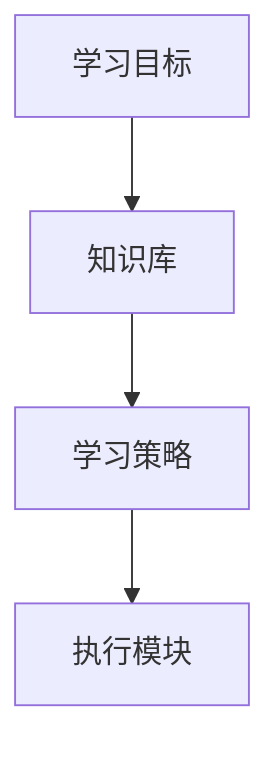
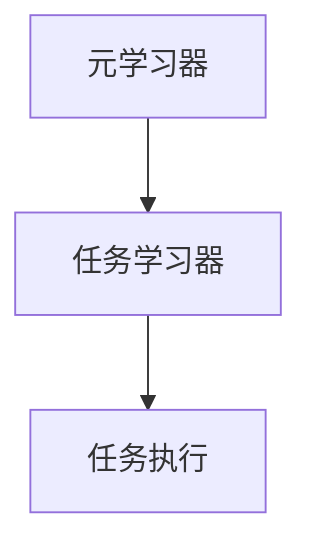
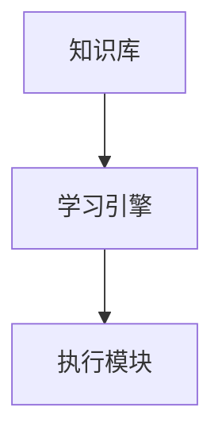
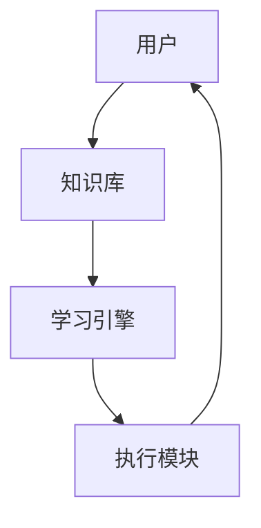

                 


# AI Agent的终身学习系统实现

> 关键词：AI Agent，终身学习，元学习，迁移学习，自适应学习

> 摘要：AI Agent的终身学习系统是一种能够持续学习和适应新环境的智能系统。本文从AI Agent的基本概念出发，详细阐述终身学习系统的实现原理，包括系统架构、核心算法、数据处理和系统设计等方面。通过实际案例分析，深入探讨如何实现一个高效的终身学习系统，并给出最佳实践和注意事项。

---

# 第一部分: AI Agent的终身学习系统概述

## 第1章: AI Agent与终身学习系统概述

### 1.1 AI Agent的基本概念

AI Agent（人工智能代理）是指能够感知环境、自主决策并执行任务的智能实体。AI Agent的核心特征包括自主性、反应性、目标导向和社会能力。终身学习系统是AI Agent的重要扩展，旨在使AI Agent能够持续学习新知识、适应新环境并解决复杂问题。

### 1.2 终身学习系统的技术背景

随着人工智能技术的快速发展，AI Agent的应用场景日益广泛，从智能助手到自动驾驶，再到机器人服务。然而，传统的AI系统在面对新任务和新环境时往往需要重新训练或人工干预，这限制了其实际应用的灵活性和效率。终身学习系统通过使AI Agent能够持续学习和更新知识，解决了这些问题。

### 1.3 终身学习系统的核心目标

终身学习系统的核心目标包括：
1. **自适应学习能力**：AI Agent能够根据新环境和新任务调整其学习策略。
2. **知识更新与扩展**：AI Agent能够持续吸收新知识并更新其知识库。
3. **多任务学习能力**：AI Agent能够在多个任务之间切换，并将学到的知识迁移到新任务中。

## 1.4 本章小结

本章介绍了AI Agent的基本概念和终身学习系统的技术背景，强调了终身学习系统在提升AI Agent智能化水平和适应能力中的重要性。

---

## 第2章: 终身学习系统的核心概念与联系

### 2.1 终身学习系统的概念模型

终身学习系统的概念模型包括以下关键组件：
- **学习目标**：明确学习的方向和目标。
- **知识表示**：将知识以合适的形式存储和表示。
- **学习策略**：选择合适的学习方法和策略。
- **执行模块**：将学到的知识应用到实际任务中。

### 2.2 核心概念对比表

| 概念        | 特性 |
|-------------|------|
| 知识表示     | 显式/隐式 |
| 学习策略     | 监督/无监督 |
| 知识更新     | 定期/实时 |

### 2.3 实体关系图（Mermaid）



### 2.4 本章小结

本章详细阐述了终身学习系统的核心概念，并通过对比表和实体关系图展示了各组件之间的联系。

---

## 第3章: 终身学习系统的算法原理

### 3.1 元学习算法

元学习（Meta-Learning）是一种学习如何学习的方法。其基本原理是通过在多个任务上进行训练，使模型能够快速适应新任务。Meta-LSTM是一种典型的元学习算法，其流程如下：



### 3.2 迁移学习算法

迁移学习（Transfer Learning）是将一个领域中学到的知识迁移到另一个领域。其数学模型如下：

$$ L_{source} = \sum_{i=1}^{n} (y_i - f(x_i))^2 $$
$$ L_{target} = \sum_{i=1}^{m} (y'_i - f(x'_i))^2 $$

### 3.3 自适应学习算法

自适应学习（Adaptive Learning）是一种根据环境反馈动态调整学习策略的方法。其数学模型如下：

$$ w_{t+1} = w_t + \eta \nabla L(w_t) $$

### 3.4 算法对比与选择

不同算法的优缺点对比如下：

| 算法类型    | 优点         | 缺点         |
|-------------|--------------|--------------|
| 元学习       | 快速适应新任务 | 需要多任务训练数据 |
| 迁移学习      | 利用已有知识   | 迁移效果依赖领域相似性 |
| 自适应学习    | 动态调整策略   | 需要频繁反馈 |

---

## 第4章: 终身学习系统的系统架构设计

### 4.1 系统设计

终身学习系统的系统架构包括以下模块：
- **知识库**：存储和管理知识。
- **学习引擎**：执行学习任务。
- **执行模块**：将学到的知识应用到实际任务中。

### 4.2 系统架构图（Mermaid）



### 4.3 系统接口设计

系统接口设计包括：
- **输入接口**：接收新任务和数据。
- **输出接口**：输出学习结果和执行结果。

### 4.4 系统交互流程（Mermaid）



---

## 第5章: 项目实战

### 5.1 环境搭建

- **安装依赖**：
  - Python 3.8+
  - PyTorch 1.9+
  - Transformers 4.12+

### 5.2 核心实现代码

```python
import torch
from transformers import AutoTokenizer, AutoModelForSeq2Seq

class LifelongLearningAgent:
    def __init__(self):
        self.tokenizer = AutoTokenizer.from_pretrained('t5-base')
        self.model = AutoModelForSeq2Seq.from_pretrained('t5-base')
        
    def learn(self, task, examples):
        # 在新任务上微调模型
        optimizer = torch.optim.Adam(self.model.parameters(), lr=1e-4)
        for input_ids, labels in examples:
            outputs = self.model(input_ids=input_ids, labels=labels)
            loss = outputs.loss
            loss.backward()
            optimizer.step()
            
    def execute(self, task, input):
        # 执行任务
        inputs = self.tokenizer(task, input, return_tensors='pt')
        outputs = self.model.generate(inputs.input_ids)
        return self.tokenizer.decode(outputs[0])
```

### 5.3 案例分析

以自然语言处理任务为例，展示如何通过终身学习系统实现多任务学习。

### 5.4 项目小结

本章通过实际案例展示了如何实现一个终身学习系统，并详细讲解了核心代码和系统设计。

---

## 第6章: 最佳实践与注意事项

### 6.1 小结

终身学习系统是一种能够持续学习和适应新环境的智能系统，其关键在于合理设计系统架构和选择合适的算法。

### 6.2 注意事项

- **数据质量**：确保训练数据的多样性和代表性。
- **模型选择**：根据任务需求选择合适的模型和算法。
- **性能优化**：通过并行计算和优化策略提升学习效率。

### 6.3 拓展阅读

- 建议读者进一步阅读《深度学习》和《机器学习实战》等书籍，深入了解相关算法和实现细节。

---

# 作者：AI天才研究院/AI Genius Institute & 禅与计算机程序设计艺术 /Zen And The Art of Computer Programming

