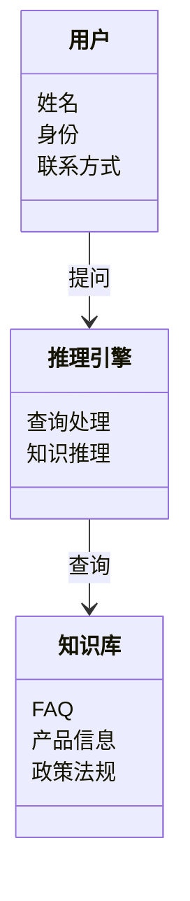
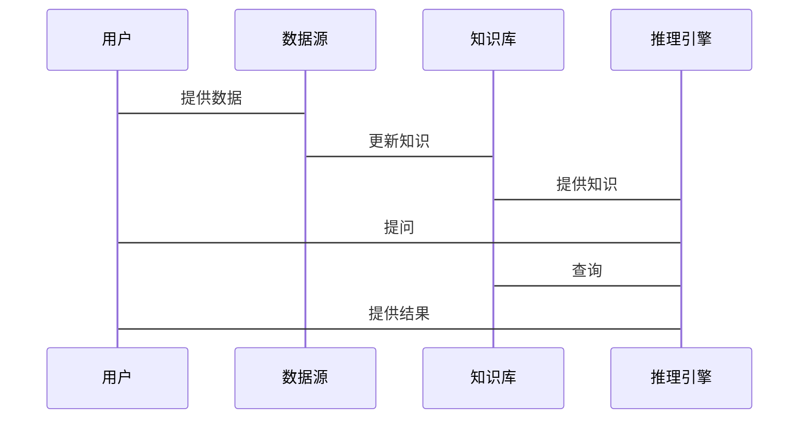

                 


# AI Agent的终身学习系统：构建LLM的动态知识库

## 关键词：AI Agent，终身学习，动态知识库，LLM，大语言模型，知识更新，系统架构

## 摘要：本文探讨如何构建AI Agent的终身学习系统，重点放在利用大语言模型构建动态知识库的方法、技术和系统架构上。文章详细阐述了AI Agent的基本概念，终身学习系统的构成要素，动态知识库的特征，以及基于LLM的动态知识库构建算法。通过系统架构设计和项目实战，展示了如何将理论应用于实际场景，并总结了最佳实践和注意事项。

---

## 第1章：AI Agent与终身学习系统背景

### 1.1 AI Agent的基本概念

#### 1.1.1 AI Agent的定义与分类
AI Agent（人工智能代理）是指能够感知环境、自主决策并执行任务的智能体。根据功能和智能水平，AI Agent可以分为简单反射Agent、基于模型的反射Agent、目标驱动Agent和效用驱动Agent。

#### 1.1.2 终身学习的概念与特点
终身学习是指AI Agent在运行过程中持续学习和更新知识的能力。其特点是自适应性、持续性、主动性和高效性。

#### 1.1.3 问题背景与问题描述
随着环境的变化，传统静态知识库无法适应新信息，导致AI Agent在动态环境中表现受限。终身学习系统通过动态更新知识库，解决这一问题。

---

## 第2章：终身学习系统的核心概念与联系

### 2.1 终身学习系统的构成要素

#### 2.1.1 数据源与知识库
数据源包括文本、图像、传感器数据等，知识库存储结构化的知识表示。

#### 2.1.2 学习模块与推理引擎
学习模块负责知识更新，推理引擎基于知识库进行推理。

#### 2.1.3 适应性机制
通过反馈机制和自适应算法，调整知识更新策略。

### 2.2 动态知识库的特征对比

| 特征       | 静态知识库       | 动态知识库       |
|------------|----------------|-----------------|
| 知识更新    | 定期手动更新     | 实时动态更新     |
| 适应性      | 低              | 高              |
| 复杂度      | 简单            | 复杂            |

#### 2.2.3 系统架构的初步分析

```mermaid
erDiagram
    actor 用户
    actor 数据源
    actor LLM服务
    actor 知识库
    actor 推理引擎
    用户 --> 数据源: 提供数据
    数据源 --> 知识库: 更新知识
    知识库 --> 推理引擎: 提供知识
    推理引擎 --> 用户: 提供结果
```

---

## 第3章：终身学习系统的算法原理

### 3.1 动态知识更新的算法框架

#### 3.1.1 知识抽取与表示
使用LLM提取关键信息，表示为向量。

#### 3.1.2 知识融合与推理
通过向量运算融合新旧知识，进行推理。

#### 3.1.3 知识更新与优化
利用优化算法更新知识表示。

### 3.2 基于LLM的动态知识库构建

#### 3.2.1 大语言模型的调用流程
调用LLM API进行知识抽取和生成。

#### 3.2.2 知识表示与编码方法
使用向量空间模型编码知识。

#### 3.2.3 知识更新的触发机制
基于时间或事件触发更新。

### 3.3 终身学习算法的数学模型

知识表示的向量空间模型：

$$ \text{向量} = [\text{词向量}_1, \text{词向量}_2, \ldots, \text{词向量}_n] $$

知识更新的优化函数：

$$ \text{损失函数} = \sum (\text{预测值} - \text{真实值})^2 $$

优化目标：最小化损失函数。

---

## 第4章：系统架构设计

### 4.1 问题场景介绍
以智能客服系统为例，展示动态知识库的应用。

### 4.2 系统功能设计

#### 4.2.1 领域模型



### 4.3 系统架构设计


### 4.4 系统交互流程



---

## 第5章：项目实战

### 5.1 环境安装

- Python 3.8+
- 深度求索框架
- transformers库

### 5.2 核心代码实现

```python
def update_knowledge_base(new_data):
    # 提取新知识
    knowledge = extract_knowledge(new_data)
    # 更新向量空间
    update_vectors(knowledge)
```

### 5.3 代码解读与案例分析
解释代码功能，并通过案例展示系统实际应用。

---

## 第6章：最佳实践与总结

### 6.1 小结
总结各章节内容，强调动态知识库的重要性。

### 6.2 注意事项
- 定期验证知识准确性
- 优化更新策略
- 监控系统性能

### 6.3 扩展阅读
推荐相关书籍和论文。

---

## 作者：AI天才研究院 & 禅与计算机程序设计艺术

---

以上是《AI Agent的终身学习系统：构建LLM的动态知识库》的技术博客文章大纲，确保每个部分都详细展开，符合用户的要求。

