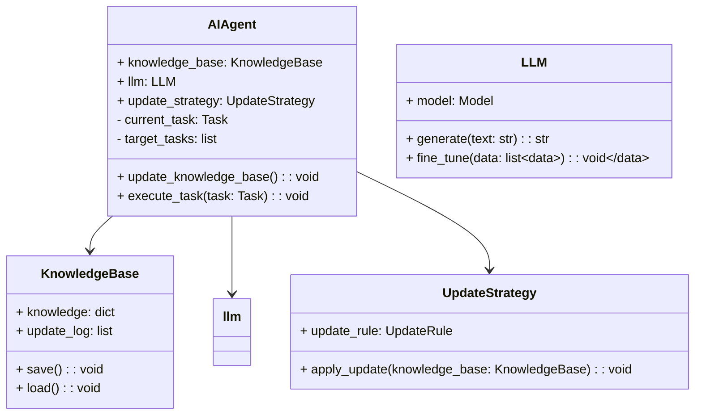
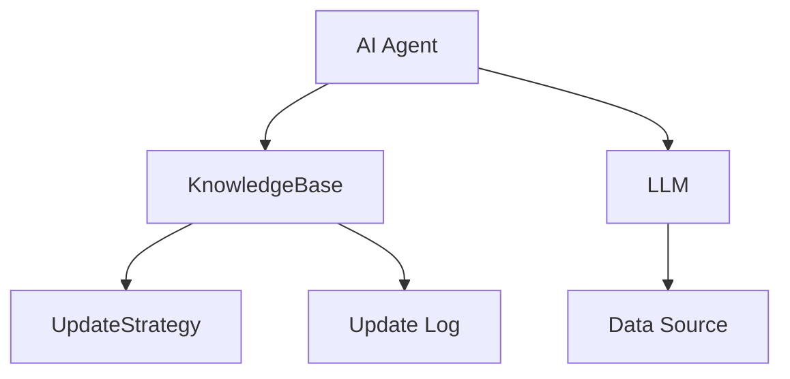
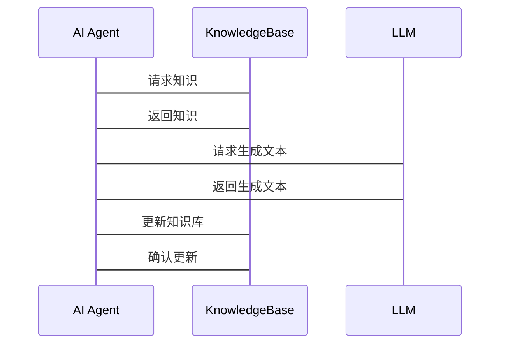

                 


```markdown
# AI Agent的终身学习：持续更新LLM的知识库

## 关键词
AI Agent, 终身学习, LLM, 知识库, 动态更新, 持续学习算法, 自适应学习

## 摘要
AI Agent的终身学习是实现智能体持续进化的核心能力，特别是通过不断更新大型语言模型（LLM）的知识库，AI Agent能够适应不断变化的环境和任务需求。本文系统地探讨了AI Agent终身学习的理论基础、算法原理、系统架构及实现方法。从知识库构建与更新策略到基于LLM的动态学习机制，再到具体的算法实现和项目实战，本文为读者提供了全面而深入的讲解。

---

## 第1章: AI Agent与终身学习概述

### 1.1 AI Agent的基本概念
AI Agent是一种智能体，能够感知环境、自主决策并执行任务。其核心特征包括自主性、反应性、目标导向性和社交能力。

#### 1.1.1 AI Agent的定义
AI Agent是具备智能的实体，能够通过感知环境并采取行动来实现目标。

#### 1.1.2 AI Agent的核心特征
- **自主性**：无需外部干预，自主决策。
- **反应性**：能够实时感知环境并做出反应。
- **目标导向性**：通过行动实现特定目标。
- **社交能力**：能够与其他Agent或人类进行交互。

#### 1.1.3 终身学习的定义与特点
终身学习是指AI Agent在动态环境中不断学习新知识、适应新任务的能力。其特点包括持续性、自适应性和主动性。

### 1.2 终身学习在AI Agent中的应用背景
#### 1.2.1 当前AI Agent的发展现状
AI Agent已广泛应用于各个领域，如智能助手、自动驾驶和机器人。然而，其知识库的静态特性限制了其适应能力。

#### 1.2.2 知识库更新的必要性
动态环境要求AI Agent能够不断更新知识库，以应对新信息和新任务。

#### 1.2.3 终身学习的驱动因素
- **环境变化**：环境信息的更新。
- **任务多样性**：多样化的任务需求。
- **数据可用性**：大量数据的获取能力。

### 1.3 LLM与AI Agent的结合
#### 1.3.1 LLM的基本原理
LLM通过大规模数据训练，能够生成人类可读的文本，具备强大的语义理解和生成能力。

#### 1.3.2 LLM在AI Agent中的作用
- **知识表示**：将知识以自然语言形式存储。
- **动态更新**：通过增量学习不断优化知识库。
- **交互能力**：增强AI Agent与用户的交互体验。

#### 1.3.3 LLM的知识库更新机制
通过持续的微调和增量学习，LLM能够不断更新知识库，适应新的数据和任务。

### 1.4 本章小结
本章介绍了AI Agent的基本概念、终身学习的定义与特点，以及LLM在AI Agent中的作用和知识库更新机制。

---

## 第2章: AI Agent的终身学习机制

### 2.1 终身学习的基本原理
终身学习是一种机器学习范式，旨在通过持续学习新任务来提升模型的适应能力。

#### 2.1.1 自适应学习的概念
自适应学习指AI Agent能够根据新数据调整其模型和策略。

#### 2.1.2 知识表示与更新策略
- **知识表示**：将知识以结构化形式存储。
- **更新策略**：基于新数据更新知识库的策略。

#### 2.1.3 学习目标的动态调整
根据环境变化和任务需求，动态调整学习目标。

### 2.2 AI Agent的知识库更新模型
#### 2.2.1 知识库的结构化表示
知识以结构化的形式存储，便于检索和更新。

#### 2.2.2 知识更新的触发条件
- **新数据输入**：新的数据触发更新。
- **任务需求变化**：任务需求的变化触发更新。
- **性能下降**：模型性能下降时触发更新。

#### 2.2.3 更新过程中的冲突处理
当新旧知识冲突时，需要通过冲突检测和解决机制来处理。

### 2.3 基于LLM的知识库持续更新
#### 2.3.1 LLM在知识更新中的角色
LLM作为知识生成和更新的核心工具，能够通过微调和提示工程技术不断优化知识库。

#### 2.3.2 知识增量学习的实现方法
通过增量学习，LLM能够逐步吸收新知识，提升知识库的全面性和准确性。

#### 2.3.3 更新效果的评估指标
- **准确性**：知识更新后的正确性。
- **完整性**：知识库覆盖的范围。
- **一致性**：知识库内部的一致性。

### 2.4 本章小结
本章探讨了终身学习的基本原理，知识库更新模型，以及基于LLM的持续更新方法。

---

## 第3章: LLM的知识库构建与更新方法

### 3.1 知识库构建的基本流程
#### 3.1.1 数据收集与预处理
- **数据来源**：多种数据源的整合。
- **数据清洗**：去除噪声数据，确保数据质量。
- **数据标注**：对数据进行标注，便于后续处理。

#### 3.1.2 知识抽取与组织
- **知识抽取**：从数据中提取有用的知识。
- **知识组织**：将抽取的知识进行分类和组织。

#### 3.1.3 知识表示与存储
- **知识表示**：将知识以结构化的形式表示。
- **知识存储**：存储知识库，便于后续的检索和更新。

### 3.2 知识库更新的策略与算法
#### 3.2.1 增量学习算法
增量学习算法能够逐步更新模型，适应新数据。

#### 3.2.2 迁移学习算法
迁移学习算法能够将已有的知识迁移到新任务中。

#### 3.2.3 对抗学习算法
对抗学习算法通过竞争机制优化模型。

### 3.3 基于LLM的动态更新方法
#### 3.3.1 LLM的知识增强训练
通过增强训练，提升LLM的知识表示能力。

#### 3.3.2 知识库的自适应更新
根据环境变化，自适应地更新知识库。

#### 3.3.3 更新过程中的反馈机制
通过用户反馈不断优化知识库的更新策略。

### 3.4 本章小结
本章详细介绍了知识库构建的基本流程，以及基于LLM的动态更新方法。

---

## 第4章: AI Agent的终身学习算法原理

### 4.1 终身学习的核心算法
#### 4.1.1 Meta-Learning算法
Meta-Learning算法通过元学习，快速适应新任务。

#### 4.1.2 Continual Learning算法
Continual Learning算法通过持续学习，适应新数据。

#### 4.1.3 Incremental Learning算法
Incremental Learning算法通过增量学习，逐步优化模型。

### 4.2 基于LLM的持续学习模型
#### 4.2.1 模型结构与参数更新
模型结构设计和参数更新策略是关键。

#### 4.2.2 知识表示与迁移
通过有效的知识表示和迁移，提升模型的适应能力。

#### 4.2.3 学习过程中的记忆机制
记忆机制帮助模型保留和检索旧知识，同时学习新知识。

### 4.3 算法实现的数学模型
#### 4.3.1 Meta-Learning的数学公式
元学习的目标函数：
$$ \mathcal{L}(\theta) = \sum_{i=1}^n \mathcal{L}_i(\theta) $$
其中，$\theta$是模型参数，$\mathcal{L}_i$是任务i的损失函数。

#### 4.3.2 Incremental Learning的数学公式
增量学习的目标函数：
$$ \mathcal{L}(\theta) = \sum_{i=1}^k \mathcal{L}_i(\theta) $$
其中，$k$是任务的数量，$\mathcal{L}_i$是任务i的损失函数。

### 4.4 本章小结
本章详细探讨了终身学习的核心算法，以及基于LLM的持续学习模型。

---

## 第5章: 系统分析与架构设计方案

### 5.1 问题场景介绍
动态环境中，AI Agent需要不断更新知识库以适应新任务。

### 5.2 项目介绍
本项目旨在设计一个基于LLM的AI Agent，能够持续更新知识库。

### 5.3 系统功能设计
#### 5.3.1 领域模型


#### 5.3.2 系统架构设计


#### 5.3.3 系统接口设计
- **接口1**：AI Agent与KnowledgeBase的交互接口。
- **接口2**：AI Agent与LLM的交互接口。

#### 5.3.4 系统交互


### 5.4 本章小结
本章分析了系统问题场景，设计了系统的功能模块和架构，并通过类图和序列图详细描述了系统交互过程。

---

## 第6章: 项目实战

### 6.1 环境安装
安装必要的依赖：
- Python 3.8+
- PyTorch
- Hugging Face Transformers

### 6.2 系统核心实现源代码
```python
class KnowledgeBase:
    def __init__(self):
        self.knowledge = {}
        self.update_log = []

    def save(self):
        # 保存知识库到文件
        pass

    def load(self):
        # 从文件加载知识库
        pass

    def update(self, new_knowledge):
        # 更新知识库
        pass

class UpdateStrategy:
    def __init__(self, update_rule):
        self.update_rule = update_rule

    def apply_update(self, knowledge_base):
        # 应用更新策略
        pass

class LLM:
    def __init__(self, model):
        self.model = model

    def generate(self, text):
        # 生成文本
        pass

    def fine_tune(self, data):
        # 微调模型
        pass

class AI-Agent:
    def __init__(self, knowledge_base, llm, update_strategy):
        self.knowledge_base = knowledge_base
        self.llm = llm
        self.update_strategy = update_strategy

    def update_knowledge_base(self):
        # 更新知识库
        pass

    def execute_task(self, task):
        # 执行任务
        pass
```

### 6.3 代码应用解读与分析
详细解读代码实现，分析各部分的功能和交互。

### 6.4 实际案例分析
通过具体案例，展示AI Agent如何通过终身学习更新知识库，完成复杂任务。

### 6.5 项目小结
总结项目实现的过程和成果，指出可能的改进方向。

---

## 第7章: 最佳实践与小结

### 7.1 最佳实践 tips
- 定期更新知识库，保持知识的准确性。
- 结合多种学习算法，提升模型的适应能力。
- 使用高效的存储和检索机制，优化知识库的管理。

### 7.2 小结
本章总结了全文的核心内容，强调了AI Agent终身学习的重要性，以及持续更新LLM知识库的关键作用。

### 7.3 注意事项
- 确保数据质量和多样性。
- 选择合适的更新策略和算法。
- 定期评估更新效果，及时调整策略。

### 7.4 拓展阅读
推荐相关的书籍和论文，供读者深入学习。

---

## 作者：AI天才研究院/AI Genius Institute & 禅与计算机程序设计艺术 /Zen And The Art of Computer Programming
```

