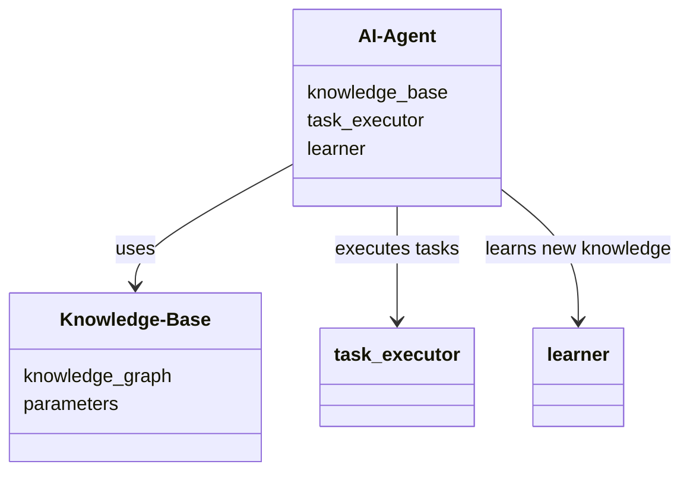
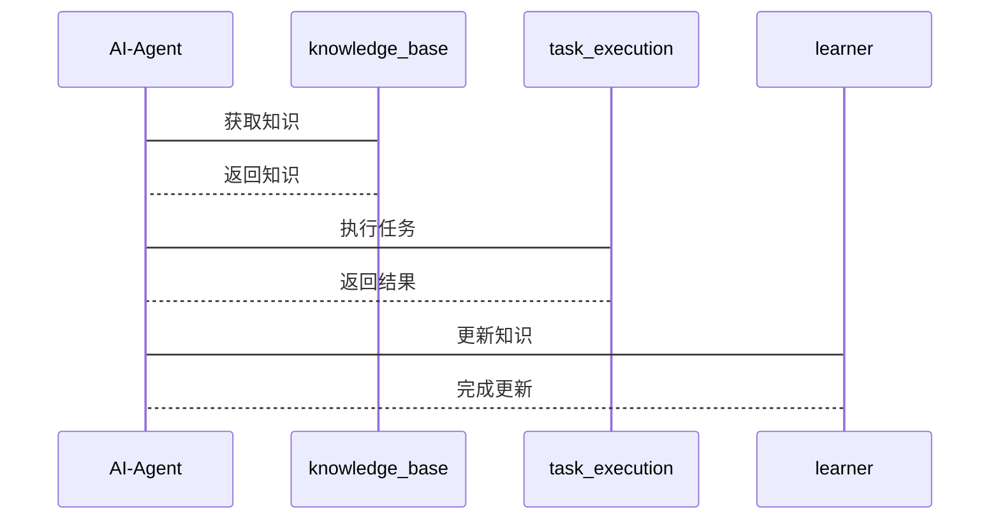

                 


# AI Agent的终身学习：持续适应新知识

## 关键词：AI Agent，终身学习，知识更新，自适应学习，强化学习，迁移学习

## 摘要：AI Agent需要具备持续学习和适应新知识的能力，以应对快速变化的环境和任务需求。本文从背景介绍、核心概念、算法原理、系统架构、项目实战等多个方面，深入剖析AI Agent的终身学习机制，探讨其实现方法和应用场景。

---

# 第1章: AI Agent与终身学习概述

## 1.1 AI Agent的基本概念

### 1.1.1 AI Agent的定义与分类
AI Agent（人工智能代理）是指能够感知环境、自主决策并执行任务的智能体。它可以分为简单反射型Agent、基于模型的规划Agent、实用推理型Agent和目标驱动型Agent。

### 1.1.2 终身学习的定义与特点
终身学习是指AI Agent在运行过程中，能够不断学习新知识、更新知识库，并适应新任务的能力。其特点包括持续性、自适应性和主动性。

### 1.1.3 AI Agent与终身学习的关系
AI Agent通过终身学习能够实现动态适应环境、提升任务执行效率和复杂问题的解决能力。

---

## 1.2 终身学习的必要性

### 1.2.1 知识更新的挑战
随着技术的发展和数据的增加，AI Agent需要不断更新知识库以保持准确性。

### 1.2.2 环境变化的适应需求
环境的动态变化要求AI Agent具备快速学习和调整的能力。

### 1.2.3 任务复杂化的应对策略
复杂任务的解决需要AI Agent具备多任务学习和知识整合能力。

---

## 1.3 终身学习的目标与边界

### 1.3.1 终身学习的核心目标
AI Agent通过终身学习，实现对新知识的快速吸收和高效应用。

### 1.3.2 学习的边界与限制
终身学习的边界包括计算资源限制、数据质量和学习效率。

### 1.3.3 AI Agent学习的适用场景
适用于动态环境、多任务场景和复杂问题求解。

---

## 1.4 终身学习的核心概念拆解

### 1.4.1 知识表示与存储
知识表示是终身学习的基础，常用的知识表示方法包括符号表示、向量表示和图结构表示。

### 1.4.2 知识推理与应用
通过逻辑推理和关联推理，AI Agent能够应用知识解决新问题。

### 1.4.3 知识更新与优化
知识更新包括增量学习和知识遗忘，以保持知识库的高效性和准确性。

---

# 第2章: 终身学习的核心原理

## 2.1 自适应学习机制

### 2.1.1 动态知识库的构建
动态知识库通过持续学习和更新，保持对新知识的吸收。

### 2.1.2 自我监督学习
AI Agent通过自我监督学习，逐步优化知识表示和推理能力。

### 2.1.3 知识遗忘与重学策略
为保持知识库的高效性，AI Agent需要合理管理知识遗忘和重学。

---

## 2.2 知识表示与推理

### 2.2.1 知识图谱的构建
知识图谱是结构化的知识表示形式，能够支持复杂的推理任务。

### 2.2.2 知识表示的学习
基于深度学习的方法，AI Agent能够从数据中自动学习知识表示。

### 2.2.3 知识推理的实现
通过逻辑推理和关联推理，AI Agent能够应用知识解决新问题。

---

## 2.3 迁移学习与增量学习

### 2.3.1 迁移学习的基本原理
迁移学习通过将已有知识迁移到新任务，提升学习效率。

### 2.3.2 增量学习的实现方法
增量学习通过逐步更新知识库，适应新任务的需求。

### 2.3.3 知识整合与优化
通过知识整合和优化，AI Agent能够更好地适应新环境。

---

# 第3章: 终身学习的算法原理

## 3.1 强化学习算法

### 3.1.1 Q-learning算法
Q-learning是一种经典的强化学习算法，通过更新Q值表实现最优策略。

### 3.1.2 Deep Q-Network (DQN)算法
DQN算法通过深度神经网络近似Q值函数，实现更复杂的决策任务。

### 3.1.3 算法实现
```python
class QLearning:
    def __init__(self, state_space, action_space):
        self.state_space = state_space
        self.action_space = action_space
        self.Q = defaultdict(lambda: defaultdict(lambda: 0))
```

---

## 3.2 迁移学习算法

### 3.2.1 迁移学习的基本原理
通过迁移学习，AI Agent能够将已有的知识迁移到新任务中。

### 3.2.2 域适配算法
域适配算法通过调整源域和目标域的数据分布，实现知识迁移。

### 3.2.3 算法实现
```python
def transfer_learning(source_data, target_data):
    # 这里实现具体的迁移学习算法，如使用对抗训练或领域适配方法
```

---

## 3.3 元学习算法

### 3.3.1 元学习的基本原理
元学习通过学习如何学习，实现快速适应新任务的能力。

### 3.3.2 MAML算法
MAML算法通过优化元参数，实现快速适应新任务。

### 3.3.3 算法实现
```python
def maml_learning(meta_batch_size, inner_steps):
    # 这里实现MAML算法的具体步骤，包括梯度计算和元参数更新
```

---

# 第4章: 终身学习的系统架构设计

## 4.1 系统功能设计

### 4.1.1 功能模块
系统包括知识获取模块、知识存储模块、知识推理模块和知识更新模块。

### 4.1.2 领域模型


---

## 4.2 系统架构设计

### 4.2.1 架构设计


---

## 4.3 系统接口设计

### 4.3.1 接口定义
定义AI Agent与知识库、任务执行模块的交互接口。

### 4.3.2 交互流程


---

# 第5章: 项目实战

## 5.1 环境安装

### 5.1.1 安装Python
安装Python 3.8及以上版本。

### 5.1.2 安装依赖库
安装TensorFlow、Keras、Scikit-learn等深度学习库。

---

## 5.2 核心实现

### 5.2.1 知识获取模块
实现从数据源获取新知识的功能。

### 5.2.2 知识推理模块
基于知识图谱进行推理，生成解决方案。

### 5.2.3 知识更新模块
通过增量学习更新知识库。

---

## 5.3 案例分析

### 5.3.1 智能客服系统
通过终身学习，智能客服能够不断更新知识库，提升服务质量。

---

# 第6章: 最佳实践与总结

## 6.1 最佳实践

### 6.1.1 数据质量的重要性
高质量的数据是终身学习的基础。

### 6.1.2 算法选择的策略
根据任务需求选择合适的算法。

### 6.1.3 知识更新的频率
合理安排知识更新的频率，保持知识库的高效性。

---

## 6.2 小结

终身学习是AI Agent适应新知识和环境变化的关键能力。本文从多个方面深入剖析了其实现方法和应用场景。

---

## 6.3 注意事项

### 6.3.1 数据隐私与安全
注意数据隐私和安全问题。

### 6.3.2 算法的可解释性
确保算法的可解释性，便于调试和优化。

### 6.3.3 系统的可扩展性
设计系统时，需考虑其可扩展性。

---

## 6.4 拓展阅读

### 6.4.1 推荐书籍
《机器学习实战》、《深度学习》。

### 6.4.2 推荐论文
《Learning to Learn via Meta-Learning》、《迁移学习综述》。

---

# 作者：AI天才研究院 & 禅与计算机程序设计艺术

