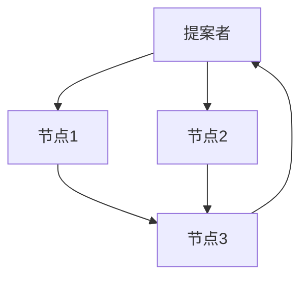

                 


# AI Agent的群体智能与集体决策机制

> 关键词：AI Agent，群体智能，集体决策，一致性算法，分布式计算，协作算法

> 摘要：本文系统地探讨了AI Agent在群体智能与集体决策机制中的核心原理、算法实现及其应用场景。通过分析群体智能与集体决策的核心概念，结合典型的算法案例，深入剖析了其数学模型与实现细节。最后，通过实际案例展示了AI Agent在群体智能与集体决策中的应用价值。

---

# 第一部分: AI Agent的群体智能与集体决策机制概述

## 第1章: AI Agent与群体智能的基本概念

### 1.1 AI Agent的基本概念

#### 1.1.1 什么是AI Agent
AI Agent（人工智能代理）是指能够感知环境并采取行动以实现目标的智能实体。AI Agent可以是软件程序、机器人或其他智能系统，其核心目标是通过与环境交互来完成特定任务。

#### 1.1.2 AI Agent的核心特征
- **自主性**：AI Agent能够自主决策，无需外部干预。
- **反应性**：能够感知环境并实时调整行为。
- **社会性**：能够与其他Agent或人类交互并协作。
- **学习能力**：能够通过经验改进自身性能。

#### 1.1.3 AI Agent的分类与应用场景
- **简单反射型Agent**：基于当前感知做出反应，适用于简单的任务。
- **基于模型的反射型Agent**：利用内部模型进行决策，适用于复杂任务。
- **目标驱动型Agent**：基于目标进行规划和决策。
- **效用驱动型Agent**：通过最大化效用函数进行决策。

应用场景包括自动驾驶、智能助手、机器人协作等。

---

### 1.2 群体智能的基本概念

#### 1.2.1 群体智能的定义
群体智能（Swarm Intelligence）是指通过多个简单个体（如AI Agent）的协作，实现复杂问题求解的智能形式。群体智能的核心在于个体之间的局部交互，通过自组织方式实现全局目标。

#### 1.2.2 群体智能的关键特征
- **分布式**：个体之间无中心控制。
- **自组织**：个体通过简单规则实现复杂行为。
- **协作性**：个体之间通过协作完成共同目标。
- **涌现性**：群体智能的结果是单个个体无法实现的。

#### 1.2.3 群体智能与个体智能的区别
| 特性 | 群体智能 | 个体智能 |
|------|----------|----------|
| 控制方式 | 分布式、去中心化 | 中心化 |
| 信息处理 | 局部交互、涌现性 | 全局信息 |
| 行为方式 | 协作完成复杂任务 | 单一任务完成 |

---

### 1.3 集体决策机制的基本概念

#### 1.3.1 集体决策的定义
集体决策（Collective Decision-Making）是指多个个体通过协作，共同完成决策任务的过程。集体决策的核心在于通过个体意见的整合，形成一个最优或满意的结果。

#### 1.3.2 集体决策的核心要素
- **个体决策**：每个个体基于自身信息做出决策。
- **信息整合**：个体决策通过某种机制整合成一个整体决策。
- **决策优化**：通过优化算法提升决策的准确性和效率。

#### 1.3.3 集体决策与个体决策的区别
| 特性 | 集体决策 | 个体决策 |
|------|----------|----------|
| 决策主体 | 多个个体 | 单个个体 |
| 决策过程 | 协作、整合 | 独立 |
| 决策结果 | 均衡、优化 | 最大化个体利益 |

---

## 1.4 本章小结

本章主要介绍了AI Agent、群体智能和集体决策的基本概念及其核心特征。通过对比分析，明确了群体智能与个体智能、集体决策与个体决策的区别。这些概念为后续章节的深入分析奠定了基础。

---

# 第二部分: 群体智能与集体决策的核心原理

## 第2章: 群体智能的核心原理

### 2.1 群体智能的理论基础

#### 2.1.1 分布式计算理论
分布式计算理论是群体智能的理论基础之一，强调通过去中心化的方式实现任务完成。分布式系统中的每个节点独立运行，通过通信协议完成协作。

#### 2.1.2 自组织理论
自组织理论认为，群体智能系统中的个体通过局部交互规则，能够自发形成复杂的行为模式。自组织系统的核心在于个体之间的简单规则，但整体表现出复杂的涌现性。

#### 2.1.3 协作理论
协作理论强调个体之间的协作是群体智能实现复杂任务的关键。通过协作，个体能够共享信息、分配任务，从而提高整体效率。

---

### 2.2 群体智能的关键算法

#### 2.2.1 一致性算法
一致性算法（Consensus Algorithms）用于多个个体达成一致意见。常见的算法包括：
- **Paxos算法**：用于分布式系统中达成一致的协议。
- **Raft算法**：Paxos的优化版本，更易于理解和实现。

一致性算法的流程如下：
1. 提案者提出一个值。
2. 通过通信协议，提案者与所有其他节点达成一致。
3. 系统进入稳定状态，所有节点同意该值。



#### 2.2.2 分布式决策算法
分布式决策算法（Distributed Decision-Making Algorithms）用于多个个体共同完成决策任务。常见的算法包括：
- **分布式最小值算法**：通过个体之间的消息传递，找到全局最小值。
- **分布式最大值算法**：类似最小值算法，用于寻找全局最大值。

#### 2.2.3 协作算法
协作算法（Collaborative Algorithms）用于个体之间的协作行为。常见的算法包括：
- **蚂蚁算法**：模拟蚂蚁寻找食物的过程，用于路径规划。
- **粒子群优化算法**：模拟鸟群飞行行为，用于优化问题求解。

---

### 2.3 群体智能的数学模型

群体智能的数学模型通常基于概率论和统计学。例如，蚂蚁算法中的信息素更新规则可以用以下公式表示：

$$ \text{信息素}(i,j) = \text{信息素}(i,j) + \frac{1}{\text{路径长度}} $$

粒子群优化算法的更新规则如下：

$$ v_i = v_i + \text{学习因子} \times (\text{全局最优值} - x_i) $$

---

## 2.4 本章小结

本章深入分析了群体智能的理论基础、关键算法及其数学模型。通过一致性算法、分布式决策算法和协作算法的介绍，读者可以理解群体智能的核心原理及其在实际应用中的实现方式。

---

## 第3章: 集体决策机制的核心原理

### 3.1 集体决策的理论基础

#### 3.1.1 社会选择理论
社会选择理论（Social Choice Theory）研究如何将个体偏好转化为集体决策。常见的社会选择方法包括：
- **多数投票规则**：简单多数或多数决。
- **加权投票规则**：根据个体权重进行投票。

#### 3.1.2 博弈论基础
博弈论（Game Theory）为集体决策提供了理论支持。通过分析个体的策略选择，可以找到纳什均衡（Nash Equilibrium），即集体决策的稳定状态。

#### 3.1.3 集体决策的数学模型
集体决策的数学模型通常基于投票机制。例如，加权投票模型可以用以下公式表示：

$$ \text{总权重} = \sum_{i=1}^{n} w_i \times v_i $$

其中，$w_i$ 是个体权重，$v_i$ 是个体投票结果。

---

### 3.2 集体决策的关键算法

#### 3.2.1 一致性算法
一致性算法在集体决策中用于确保所有个体达成一致意见。例如，Paxos算法可以用于分布式系统中的决策达成。

#### 3.2.2 聚类算法
聚类算法（Clustering Algorithms）用于将个体分成若干群体，每个群体内部的个体具有相似性。常见的聚类算法包括：
- **K均值聚类**：将数据分成K个簇。
- **层次聚类**：基于层次结构进行聚类。

#### 3.2.3 加权投票算法
加权投票算法（Weighted Voting Algorithms）用于根据个体权重进行决策。例如，加权投票可以表示为：

$$ \text{总权重} = \sum_{i=1}^{n} w_i \times v_i $$

---

### 3.3 集体决策的数学模型

集体决策的数学模型通常基于投票机制和优化目标。例如，优化目标可以表示为：

$$ \max \sum_{i=1}^{n} w_i \times v_i $$

其中，$w_i$ 是个体权重，$v_i$ 是个体投票结果。

---

## 3.4 本章小结

本章分析了集体决策的理论基础、关键算法及其数学模型。通过一致性算法、聚类算法和加权投票算法的介绍，读者可以理解集体决策的核心原理及其在实际应用中的实现方式。

---

# 第三部分: 群体智能与集体决策的算法实现

## 第4章: 群体智能算法的实现

### 4.1 群体智能算法的实现步骤

#### 4.1.1 算法输入
- 群体规模 $n$
- 个体目标函数 $f_i$
- 收敛条件 $\epsilon$

#### 4.1.2 算法处理
1. 初始化个体位置 $x_i$。
2. 迭代更新个体位置：
   - 计算个体最优位置 $p_i$。
   - 计算全局最优位置 $g$。
   - 更新个体速度 $v_i$ 和位置 $x_i$。
3. 检查收敛条件，若满足则终止。

#### 4.1.3 算法输出
- 全局最优位置 $g$。

### 4.2 群体智能算法的Python实现

以下是一个基于粒子群优化算法的Python实现示例：

```python
import random

class Particle:
    def __init__(self, n_dim, min_val, max_val):
        self.n_dim = n_dim
        self.min_val = min_val
        self.max_val = max_val
        self.position = [random.uniform(min_val, max_val) for _ in range(n_dim)]
        self.velocity = [0.0 for _ in range(n_dim)]
        self.best_pos = self.position.copy()
        self.best_val = float('inf')

def evaluate(position):
    # 定义目标函数
    return sum([x**2 for x in position])

def pso(n_particles, n_dim, min_val, max_val, max_iter):
    particles = [Particle(n_dim, min_val, max_val) for _ in range(n_particles)]
    global_best = particles[0].best_val
    global_best_pos = particles[0].best_pos.copy()

    for _ in range(max_iter):
        for particle in particles:
            # 计算当前值
            current_val = evaluate(particle.position)
            # 更新个体最优
            if current_val < particle.best_val:
                particle.best_val = current_val
                particle.best_pos = particle.position.copy()
            # 更新全局最优
            if current_val < global_best:
                global_best = current_val
                global_best_pos = particle.position.copy()
        # 更新速度和位置
        for particle in particles:
            for i in range(particle.n_dim):
                particle.velocity[i] = 0.1 * particle.velocity[i] + 1.5 * (particle.best_pos[i] - particle.position[i]) + 1.5 * (global_best_pos[i] - particle.position[i])
                particle.position[i] += particle.velocity[i]
    return global_best_pos

# 示例调用
n_particles = 10
n_dim = 3
min_val = -10
max_val = 10
max_iter = 100
result = pso(n_particles, n_dim, min_val, max_val, max_iter)
print("最优位置:", result)
```

### 4.3 群体智能算法的数学模型

粒子群优化算法的数学模型如下：

$$ v_i = v_i + c_1 \times r_1 \times (p_i - x_i) + c_2 \times r_2 \times (g - x_i) $$

$$ x_i = x_i + v_i $$

其中，$v_i$ 是速度，$x_i$ 是位置，$p_i$ 是个体最优位置，$g$ 是全局最优位置，$c_1$ 和 $c_2$ 是学习因子，$r_1$ 和 $r_2$ 是随机数。

---

## 4.4 本章小结

本章通过具体的Python代码实现，展示了群体智能算法的核心步骤及其数学模型。通过粒子群优化算法的示例，读者可以理解群体智能算法的实现过程。

---

## 第5章: 集体决策算法的实现

### 5.1 集体决策算法的实现步骤

#### 5.1.1 算法输入
- 个体决策集合 $D = \{d_1, d_2, ..., d_n\}$
- 决策权重集合 $W = \{w_1, w_2, ..., w_n\}$
- 决策目标 $T$

#### 5.1.2 算法处理
1. 初始化个体决策集合和权重集合。
2. 计算加权投票结果：
   $$ \text{总权重} = \sum_{i=1}^{n} w_i \times d_i $$
3. 确定最终决策 $T$。

#### 5.1.3 算法输出
- 最终决策 $T$

### 5.2 集体决策算法的Python实现

以下是一个加权投票算法的Python实现示例：

```python
def weighted_vote(D, W, T):
    n = len(D)
    total_weight = sum(W)
    # 计算加权和
    weighted_sum = 0.0
    for i in range(n):
        weighted_sum += W[i] * D[i]
    # 确定最终决策
    T = weighted_sum / total_weight
    return T

# 示例调用
D = [1, 2, 3, 4, 5]
W = [2, 3, 1, 4, 2]
T = weighted_vote(D, W, None)
print("最终决策:", T)
```

### 5.3 集体决策的数学模型

加权投票算法的数学模型如下：

$$ \text{总权重} = \sum_{i=1}^{n} w_i \times d_i $$

$$ T = \frac{\sum_{i=1}^{n} w_i \times d_i}{\sum_{i=1}^{n} w_i} $$

---

## 5.4 本章小结

本章通过具体的Python代码实现，展示了集体决策算法的核心步骤及其数学模型。通过加权投票算法的示例，读者可以理解集体决策算法的实现过程。

---

# 第四部分: 总结与展望

## 6章: 总结与展望

### 6.1 本章总结

本文系统地探讨了AI Agent的群体智能与集体决策机制的核心原理、算法实现及其应用场景。通过一致性算法、分布式决策算法和协作算法的介绍，读者可以理解群体智能的核心原理。同时，通过加权投票算法、聚类算法和一致性算法的实现，读者可以掌握集体决策机制的实现方法。

### 6.2 未来展望

随着人工智能技术的不断发展，群体智能与集体决策机制将在更多领域得到应用。未来的研究方向包括：
- **多模态群体智能**：结合视觉、听觉等多种感知方式，提升群体智能的感知能力。
- **自适应集体决策机制**：通过动态调整决策规则，提升集体决策的灵活性和适应性。
- **人机协作决策**：研究人与AI Agent之间的协作决策机制，提升人机协作效率。

---

# 作者

作者：AI天才研究院/AI Genius Institute & 禅与计算机程序设计艺术 /Zen And The Art of Computer Programming

---

以上是《AI Agent的群体智能与集体决策机制》的完整目录大纲和内容概要，涵盖了从基础概念到算法实现的全过程。

