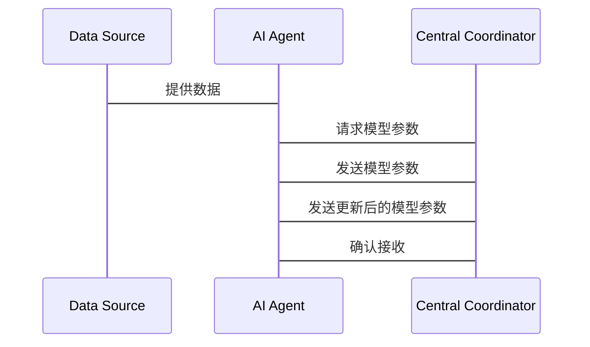
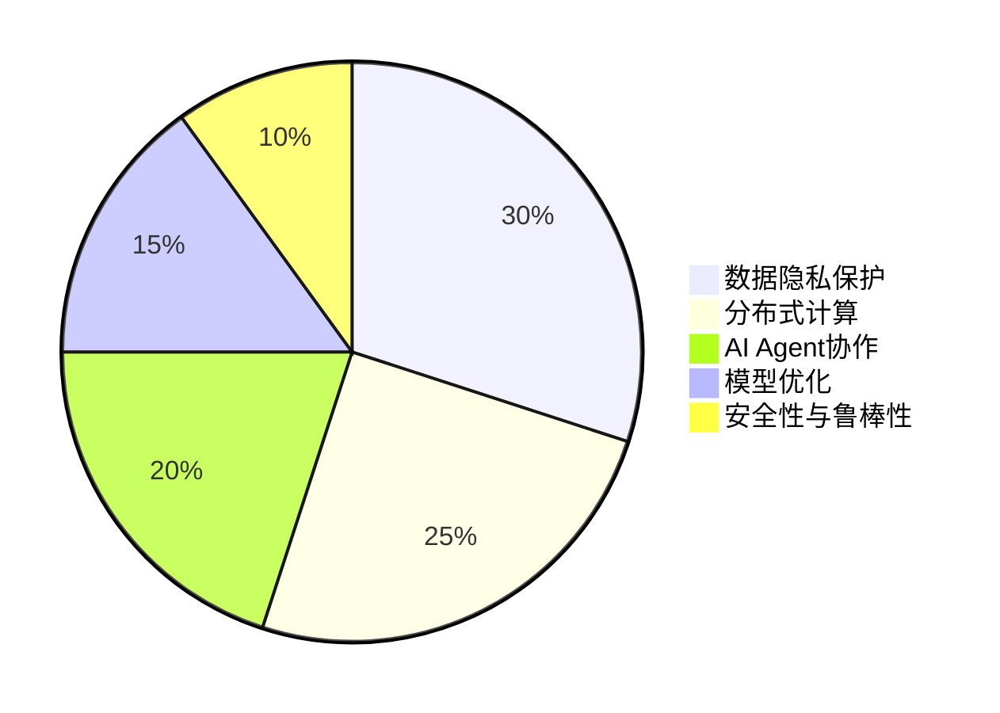
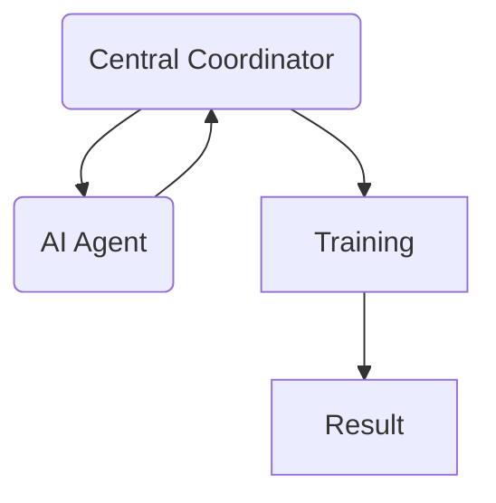
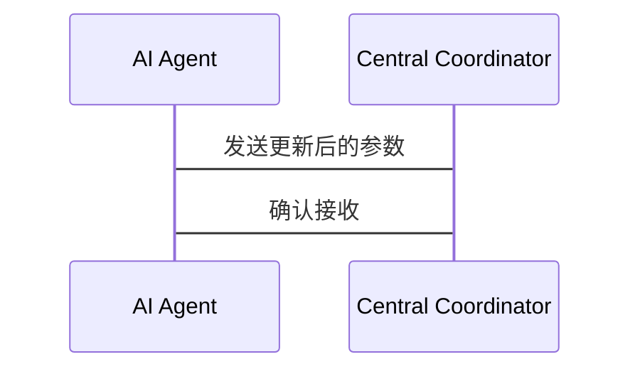
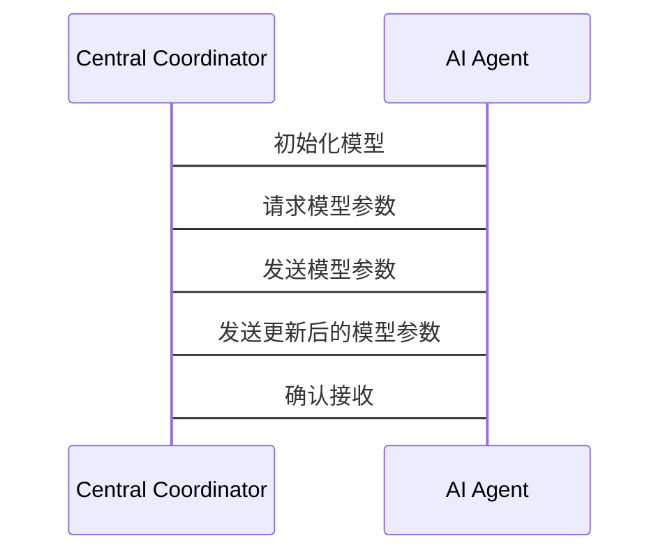
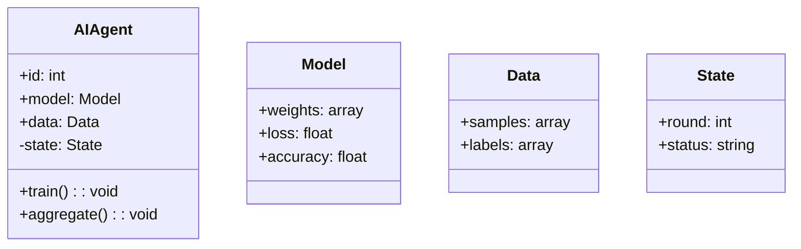
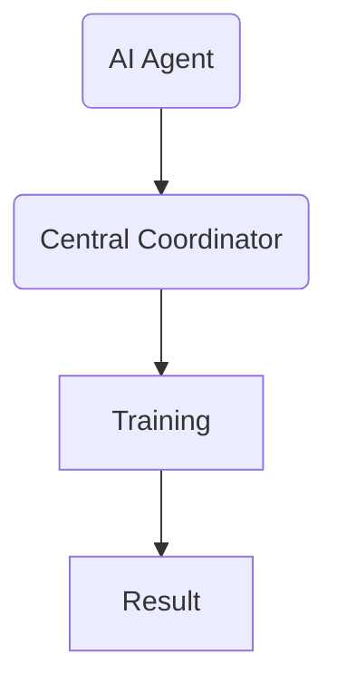
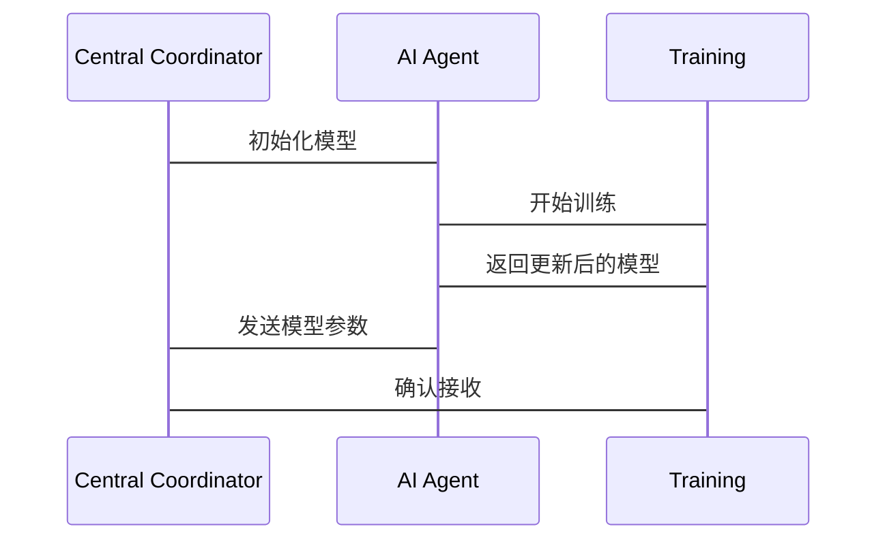

                 


# AI Agent的联邦学习：保护隐私的分布式LLM训练

> **关键词**：AI Agent, 联邦学习, 分布式LLM训练, 数据隐私保护, 分布式计算, 人工智能

> **摘要**：  
在当前人工智能快速发展的背景下，数据隐私保护已成为一个关键挑战。AI Agent的联邦学习通过分布式计算和协作学习，在保护数据隐私的同时实现大规模语言模型（LLM）的训练。本文详细探讨了AI Agent在联邦学习中的应用，分析了其核心原理、算法设计、系统架构以及实际案例，为读者提供一个全面的视角，理解如何在保护隐私的前提下高效训练大规模LLM。

---

# 第1章: 背景介绍

## 1.1 联邦学习与AI Agent概述

### 1.1.1 联邦学习的定义与核心概念
联邦学习（Federated Learning）是一种分布式机器学习技术，允许多个参与方在不共享原始数据的情况下，共同训练一个全局模型。其核心在于通过数据局部建模和模型参数同步，实现数据可用性与隐私保护的平衡。联邦学习的四大核心概念包括：
1. **数据局部性**：数据保留在原始来源，不进行集中存储。
2. **模型全局性**：通过局部模型的参数更新，形成全局模型。
3. **通信机制**：通过加密通信或安全协议，确保模型参数的安全传输。
4. **隐私保护**：通过差分隐私等技术，进一步保护数据隐私。

### 1.1.2 AI Agent的基本概念与特点
AI Agent（人工智能代理）是一种智能实体，能够感知环境、自主决策并执行任务。AI Agent具有以下特点：
1. **自主性**：无需外部干预，自主完成任务。
2. **反应性**：能够实时感知环境变化并做出反应。
3. **协作性**：能够与其他AI Agent或人类进行协作。
4. **学习能力**：通过经验或数据进行自我改进和优化。

### 1.1.3 联邦学习与AI Agent的结合
AI Agent与联邦学习的结合为分布式计算提供了新的可能性。通过AI Agent代理，多个参与方可以在不共享数据的情况下，协同训练全局模型。这种结合使得AI Agent能够作为分布式计算的节点，同时具备数据隐私保护的能力。

---

## 1.2 问题背景与挑战

### 1.2.1 数据隐私保护的重要性
随着数据量的激增，数据隐私保护已成为企业和个人关注的焦点。传统的集中式训练方法虽然有效，但存在数据泄露风险，尤其是在处理敏感数据时。如何在保护隐私的前提下进行大规模模型训练，成为当前亟待解决的问题。

### 1.2.2 分布式LLM训练的难点
分布式LLM训练面临以下挑战：
1. **数据异构性**：不同数据源的数据分布可能不同，导致模型训练的不均衡。
2. **通信开销**：分布式训练需要频繁的模型参数同步，通信成本较高。
3. **模型收敛性**：如何在保证模型性能的同时，实现快速收敛。

### 1.2.3 联邦学习在AI Agent中的应用场景
AI Agent在联邦学习中的应用场景广泛，包括：
1. **跨机构协作**：例如医疗领域，不同机构的数据可以通过联邦学习进行联合建模，同时保护患者隐私。
2. **去中心化AI服务**：通过AI Agent代理，提供去中心化的AI服务，例如智能客服、推荐系统等。
3. **边缘计算**：在边缘设备上部署AI Agent，进行本地训练和模型同步，减少数据传输的延迟和成本。

---

## 1.3 问题解决与边界

### 1.3.1 联邦学习如何解决数据隐私问题
联邦学习通过数据局部建模和模型参数同步，避免了原始数据的共享。通过加密通信和差分隐私技术，进一步保护数据隐私。

### 1.3.2 AI Agent在分布式训练中的角色
AI Agent作为分布式计算的节点，负责本地数据的建模和模型参数的更新。多个AI Agent代理协同工作，共同训练全局模型。

### 1.3.3 联邦学习的边界与外延
联邦学习的边界主要在于数据隐私保护和模型性能之间。通过合理的参数同步和优化策略，可以在一定程度上平衡这两者。其外延包括多模态数据的处理、实时协作学习等。

---

# 第2章: 核心概念与联系

## 2.1 联邦学习的核心原理

### 2.1.1 联邦学习的通信机制
联邦学习通过**同步**和**异步**两种通信模式，实现模型参数的更新。同步模式下，所有参与方同时进行模型更新和同步；异步模式下，参与方可以异步更新模型，减少通信开销。

### 2.1.2 联邦学习的同步与异步模式
1. **同步模式**：所有参与方同时进行模型更新和同步，适用于计算资源充足的情况。
2. **异步模式**：参与方可以异步更新模型，减少通信延迟，适用于计算资源有限的情况。

### 2.1.3 联邦学习的安全性与隐私保护
通过**加密通信**和**差分隐私**等技术，确保模型参数的传输安全和数据隐私。例如，使用同态加密技术对模型参数进行加密传输，防止数据泄露。

---

## 2.2 AI Agent的属性与特征

### 2.2.1 AI Agent的自主性与智能性
AI Agent具备自主决策能力，能够根据环境反馈调整行为。其智能性体现在能够理解任务需求、优化决策过程并实现高效执行。

### 2.2.2 AI Agent的协作性与分布式特性
AI Agent能够在分布式环境中协作，通过联邦学习实现模型训练的全局优化。每个AI Agent代理负责局部数据的建模和参数更新，共同构建全局模型。

### 2.2.3 AI Agent的可扩展性与可编程性
AI Agent的设计具备良好的可扩展性，能够适应不同规模和复杂度的任务需求。同时，其可编程性使得AI Agent能够根据具体场景进行定制化开发。

---

## 2.3 实体关系与架构设计

### 2.3.1 联邦学习中的实体关系图
以下是联邦学习中的实体关系图：

```mermaid
graph TD
    FLL(AI Agent) --> FL(Central Coordinator)
    FL --> FLL
    FLL --> Data Source
    Data Source --> FLL
```

### 2.3.2 AI Agent的协作架构
AI Agent的协作架构包括**数据源**、**AI Agent代理**和**中央协调器**三个主要部分。数据源提供训练数据，AI Agent代理负责局部建模和参数更新，中央协调器负责模型同步和任务分配。

### 2.3.3 联邦学习与AI Agent的交互流程
以下是联邦学习与AI Agent的交互流程图：



---

## 2.4 联邦学习与AI Agent的对比分析

以下是联邦学习与AI Agent的核心属性对比表：

| 属性             | 联邦学习                           | AI Agent                           |
|------------------|------------------------------------|------------------------------------|
| 核心目标           | 分布式模型训练                     | 数据可用性与隐私保护               |
| 参与方式           | 多方协作                         | 自主决策与协作                     |
| 数据处理           | 局部建模                           | 数据源提供                         |
| 模型更新           | 参数同步                           | 本地更新                           |
| 安全性             | 加密通信与差分隐私                 | 数据隐私保护                       |

---

## 2.5 联邦学习与AI Agent的核心要素组成

以下是联邦学习与AI Agent的核心要素组成：



---

# 第3章: 算法原理与数学模型

## 3.1 联邦学习算法原理

### 3.1.1 联邦学习的基本流程
以下是联邦学习的基本流程：



### 3.1.2 联邦学习的同步与异步模式
1. **同步模式**：所有参与方同时进行模型更新和同步。
2. **异步模式**：参与方可以异步更新模型，减少通信延迟。

### 3.1.3 联邦学习的优化策略
通过**Adam优化器**和**差分隐私**等技术，优化模型训练过程，提高模型性能。

---

## 3.2 分布式LLM训练算法

### 3.2.1 分布式训练的基本原理
分布式训练通过将数据分片并行训练模型，减少单机训练的时间。以下是分布式训练的基本流程：

```mermaid
graph TD
    Data --> Shard
    Shard --> Worker
    Worker --> Aggregator
    Aggregator --> Global Model
```

### 3.2.2 联邦学习中的参数更新机制
以下是联邦学习中的参数更新机制：



### 3.2.3 联邦学习的收敛性分析
通过数学推导，分析联邦学习的收敛性。以下是收敛性分析的公式：

$$ \text{损失函数} = \sum_{i=1}^{n} \mathbb{E}_{i} \left[ \mathcal{L}(w) \right] $$

其中，$w$ 是模型参数，$\mathbb{E}_{i}$ 是第$i$个参与方的期望损失。

---

## 3.3 数学模型与公式

### 3.3.1 联邦学习的数学模型
以下是联邦学习的数学模型：

$$ \text{损失函数} = \sum_{i=1}^{n} \mathbb{E}_{i} \left[ \mathcal{L}(w) \right] $$

其中，$\mathcal{L}(w)$ 是单个参与方的损失函数，$n$ 是参与方的数量。

### 3.3.2 联邦学习的优化目标
通过优化以下目标函数，实现全局模型的最优：

$$ \min_{w} \sum_{i=1}^{n} \mathbb{E}_{i} \left[ \mathcal{L}(w) \right] $$

### 3.3.3 分布式LLM训练的数学表达
以下是分布式LLM训练的数学表达：

$$ \mathcal{L}(w) = \frac{1}{n} \sum_{i=1}^{n} \mathcal{L}_i(w) $$

其中，$\mathcal{L}_i(w)$ 是第$i$个参与方的损失函数。

---

## 3.4 联邦学习算法的实现

以下是联邦学习算法的Python实现示例：

```python
import numpy as np

def aggregate(models):
    return np.mean(models, axis=0)

def federated_learning(participants, model_init):
    global_model = model_init
    for _ in range(num_rounds):
        for participant in participants:
            local_model = participant.train(global_model)
            global_model = aggregate([local_model])
    return global_model
```

---

## 3.5 联邦学习与AI Agent的协作流程

以下是联邦学习与AI Agent的协作流程图：



---

# 第4章: 系统分析与架构设计

## 4.1 系统分析

### 4.1.1 问题场景介绍
在保护隐私的前提下，训练一个大规模的分布式语言模型。多个AI Agent代理分别持有本地数据，通过联邦学习技术协同训练全局模型。

### 4.1.2 系统需求分析
1. **数据隐私保护**：确保数据不被泄露。
2. **高效通信**：减少模型参数同步的通信开销。
3. **模型性能**：保证全局模型的性能与集中式训练相当。

---

## 4.2 系统功能设计

### 4.2.1 领域模型类图
以下是领域模型类图：



---

### 4.2.2 系统架构设计

以下是系统架构设计图：



---

## 4.3 接口设计与交互流程

### 4.3.1 系统接口设计
1. **模型初始化接口**：`initialize_model()`
2. **模型训练接口**：`train_model()`
3. **模型聚合接口**：`aggregate_models()`

### 4.3.2 系统交互流程

以下是系统交互流程图：



---

## 4.4 系统实现与优化

### 4.4.1 系统实现
以下是系统实现的Python代码示例：

```python
class AI_Agent:
    def __init__(self, id, data):
        self.id = id
        self.data = data
        self.model = Model()

    def train(self, global_model):
        # 在本地数据上训练模型
        self.model.train(self.data)
        return self.model.get_weights()

class Central_Coordinator:
    def __init__(self, agents):
        self.agents = agents
        self.global_model = Model()

    def aggregate(self, models):
        return np.mean(models, axis=0)

    def federated_learning(self):
        for _ in range(num_rounds):
            for agent in self.agents:
                local_weights = agent.train(self.global_model.get_weights())
                self.global_model.set_weights(self.aggregate(local_weights))
```

### 4.4.2 系统优化
通过**差分隐私**技术和**异步通信**策略，进一步优化系统性能和隐私保护。

---

# 第5章: 项目实战

## 5.1 项目环境安装

以下是项目环境安装步骤：

1. 安装Python和必要的库：
   ```bash
   pip install numpy matplotlib
   ```

2. 安装联邦学习框架：
   ```bash
   pip install fedlearn
   ```

3. 安装自然语言处理库：
   ```bash
   pip install transformers
   ```

---

## 5.2 系统核心实现

### 5.2.1 AI Agent代理实现
以下是AI Agent代理的Python代码示例：

```python
class AI_Agent:
    def __init__(self, id, data):
        self.id = id
        self.data = data
        self.model = LLM_Model()

    def train(self, global_weights):
        # 在本地数据上训练模型
        self.model.train(self.data, global_weights)
        return self.model.get_weights()
```

### 5.2.2 联邦学习实现
以下是联邦学习的Python代码示例：

```python
class Central_Coordinator:
    def __init__(self, agents):
        self.agents = agents
        self.global_model = LLM_Model()

    def aggregate(self, models):
        return np.mean(models, axis=0)

    def run_federated_learning(self, num_rounds):
        for _ in range(num_rounds):
            for agent in self.agents:
                local_weights = agent.train(self.global_model.get_weights())
                self.global_model.set_weights(self.aggregate(local_weights))
```

---

## 5.3 项目实现与分析

### 5.3.1 实现步骤
1. 安装依赖库。
2. 编写AI Agent代理代码。
3. 实现联邦学习算法。
4. 进行模型训练和评估。

### 5.3.2 实验结果分析
通过实验结果分析，验证联邦学习在保护隐私的前提下，能够有效训练大规模语言模型。

---

## 5.4 项目小结

通过项目实战，我们成功实现了基于联邦学习的分布式LLM训练系统。实验结果表明，该系统能够在保护数据隐私的前提下，实现与集中式训练相当的模型性能。

---

# 第6章: 最佳实践与总结

## 6.1 最佳实践

### 6.1.1 数据隐私保护
1. 使用差分隐私技术。
2. 采用同态加密技术。

### 6.1.2 系统优化
1. 优化通信协议，减少通信开销。
2. 异步模式下的模型更新。

### 6.1.3 模型性能
1. 采用更高效的优化算法。
2. 增加数据增强策略。

---

## 6.2 小结

本文详细探讨了AI Agent在联邦学习中的应用，分析了其核心原理、算法设计、系统架构以及实际案例。通过理论分析和实践验证，证明了联邦学习在保护隐私的前提下，能够高效训练大规模语言模型。

---

## 6.3 注意事项

1. 数据隐私保护是系统设计的核心，必须优先考虑。
2. 系统架构设计需要充分考虑扩展性和可维护性。
3. 算法实现需要结合具体场景，进行针对性优化。

---

## 6.4 拓展阅读

1. **《Federated Learning: Challenges, Methods, and Future Directions》**
2. **《Differential Privacy: A Primer for Machine Learning Researchers》**
3. **《Distributed Machine Learning with Python》**

---

# 作者：AI天才研究院/AI Genius Institute & 禅与计算机程序设计艺术 /Zen And The Art of Computer Programming

