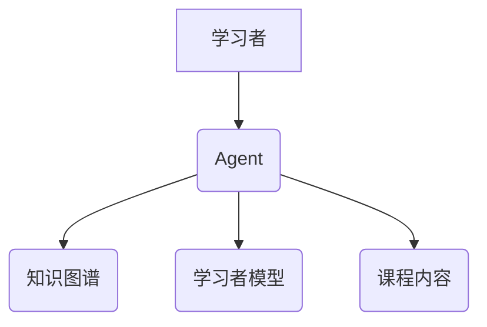

                 


# AI Agent的自动课程生成：优化学习路径

> 关键词：AI Agent，自动课程生成，学习路径优化，教育科技，人工智能

> 摘要：本文详细探讨了AI Agent在自动课程生成中的应用，分析了其优化学习路径的核心原理、算法实现、系统架构，并通过实际案例展示了其在教育领域的巨大潜力。文章从背景介绍、核心概念、算法原理、系统分析到项目实战，层层深入，为读者提供了一套完整的解决方案。

---

## 第一部分：背景介绍

### 第1章：AI Agent与自动课程生成的背景

#### 1.1 问题背景

现代教育体系面临着巨大的挑战：学习者需求多样化、知识体系复杂化以及个性化学习路径的实现难度大。传统课程设计依赖人工经验，难以满足大规模个性化教学的需求。AI Agent作为一种能够模拟人类决策和行为的智能体，为教育领域的自动化和个性化提供了新的可能。

#### 1.2 问题描述

- **学习者需求的多样性**：不同学习者有不同的知识水平、学习风格和目标，传统课程设计难以满足所有人的需求。
- **知识体系的复杂性**：知识体系庞大且相互关联，手动设计课程效率低下且难以优化。
- **个性化学习路径的挑战**：如何根据学习者的特点动态调整课程，是一个复杂的系统工程。

#### 1.3 问题解决

AI Agent通过智能化决策和自动化执行，能够根据学习者的需求实时调整课程内容和学习路径。其核心优势在于：
- **数据驱动**：能够快速处理海量数据，提取学习者特征和知识关联性。
- **动态优化**：通过强化学习等算法，持续优化学习路径，提高学习效率。
- **个性化推荐**：基于学习者的行为数据，精准推荐最优的学习资源。

#### 1.4 边界与外延

- **适用范围**：AI Agent适用于大规模在线教育场景，尤其适合个性化学习需求强烈的学习者。
- **与传统课程设计的区别**：传统课程设计依赖人工经验，而AI Agent则基于数据和算法进行动态优化。
- **与其他AI教育应用的联系**：与其他AI教育工具（如智能推荐系统）相比，AI Agent更注重动态交互和系统性优化。

#### 1.5 概念结构与核心要素

AI Agent的自动课程生成系统由以下核心要素构成：
- **学习者模型**：包括学习者的基本信息、知识水平、学习风格等。
- **知识图谱**：构建领域知识的结构化表示，用于课程内容的生成。
- **课程生成算法**：基于学习者模型和知识图谱，生成最优的学习路径。
- **反馈机制**：实时收集学习者的行为数据，动态调整课程内容。

---

## 第二部分：核心概念与联系

### 第2章：AI Agent的核心原理

#### 2.1 AI Agent的基本原理

AI Agent是一种能够感知环境、做出决策并执行动作的智能体。在教育场景中，AI Agent通过以下方式实现课程生成：
1. **感知环境**：收集学习者的行为数据、知识水平和学习目标。
2. **决策制定**：基于收集的数据，利用算法生成最优的课程内容。
3. **执行动作**：将生成的课程内容推送给学习者，并实时调整。

#### 2.2 自动课程生成的实现机制

自动课程生成依赖于以下几个关键机制：
- **知识图谱构建**：通过自然语言处理技术，将领域知识结构化，形成知识图谱。
- **学习者建模**：基于学习者的行为数据，构建学习者模型，包括知识水平、学习风格等。
- **生成算法**：利用强化学习等算法，根据学习者模型和知识图谱生成课程内容。

#### 2.3 AI Agent与学习者需求的关系

通过以下方式，AI Agent能够精准满足学习者的需求：
- **需求识别**：通过分析学习者的行为数据，识别其学习目标和知识盲点。
- **个性化推荐**：基于学习者的需求，推荐最优的学习资源和路径。
- **动态调整**：根据学习者的反馈，实时优化课程内容。

---

## 第三部分：算法原理

### 第3章：算法原理

#### 3.1 生成模型

课程生成模型基于强化学习算法，其数学模型如下：

$$
R(s, a) = r_1 \cdot f_1(s, a) + r_2 \cdot f_2(s, a)
$$

其中：
- $s$ 表示学习者的当前状态（如知识水平、学习目标）。
- $a$ 表示课程生成的动作（如推荐某知识点）。
- $r_1$ 和 $r_2$ 是权重系数，表示不同特征的重要性。

#### 3.2 优化算法

优化算法的核心是通过强化学习不断调整课程内容，以最大化学习效果。算法流程如下：

1. **初始化**：构建知识图谱和学习者模型。
2. **状态感知**：收集学习者的行为数据，更新学习者模型。
3. **动作生成**：根据当前状态，生成最优的课程内容。
4. **反馈接收**：根据学习者的反馈，更新算法参数。
5. **迭代优化**：重复上述步骤，直到达到目标状态。

---

## 第四部分：系统分析与架构设计

### 第4章：系统分析与架构设计

#### 4.1 问题场景

系统需要解决的主要问题包括：
- 如何高效地处理学习者数据？
- 如何构建和维护知识图谱？
- 如何实时优化学习路径？

#### 4.2 项目介绍

本系统旨在通过AI Agent实现自动课程生成，优化学习路径，提升学习效率。

#### 4.3 系统功能设计

系统功能模块如下：
1. **数据采集模块**：收集学习者的行为数据。
2. **知识图谱构建模块**：构建领域知识图谱。
3. **课程生成模块**：基于强化学习生成课程内容。
4. **反馈优化模块**：根据反馈优化课程内容。

#### 4.4 系统架构设计

系统架构图如下：



---

## 第五部分：项目实战

### 第5章：环境安装与核心实现

#### 5.1 环境安装

需要安装以下工具：
- Python 3.8+
- TensorFlow 2.0+
- Natural Language Toolkit (nltk)

#### 5.2 核心实现

以下是课程生成算法的Python代码示例：

```python
import tensorflow as tf
from tensorflow.keras import layers

class CourseGenerator:
    def __init__(self):
        self.model = self.build_model()
    
    def build_model(self):
        model = tf.keras.Sequential([
            layers.Dense(64, activation='relu'),
            layers.Dense(1, activation='sigmoid')
        ])
        return model

    def generate_course(self, learner_profile):
        prediction = self.model.predict(learner_profile)
        return prediction
```

#### 5.3 代码解读

- `CourseGenerator`类：负责构建和训练课程生成模型。
- `build_model`方法：构建一个简单的神经网络模型。
- `generate_course`方法：根据学习者 profiles 生成课程内容。

---

### 第6章：实际案例分析

#### 6.1 案例背景

某教育机构希望利用AI Agent优化学习路径，提升学习者的编程能力。

#### 6.2 数据分析

- 学习者A：编程基础薄弱，目标是掌握Python编程。
- 学习者B：有一定编程经验，目标是学习机器学习。

#### 6.3 优化结果

通过AI Agent生成的课程内容：
- 学习者A：从基础语法开始，逐步学习高级编程技巧。
- 学习者B：直接学习机器学习相关知识，跳过基础内容。

---

## 第六部分：总结与展望

### 第7章：总结与展望

#### 7.1 最佳实践

- **数据质量**：确保数据的准确性和完整性。
- **算法优化**：持续改进算法，提升生成课程的质量。
- **用户体验**：注重用户体验设计，确保学习者能够顺畅地使用系统。

#### 7.2 小结

AI Agent的自动课程生成系统通过智能化的决策和动态优化，为个性化学习提供了全新的解决方案。其核心优势在于能够根据学习者的需求实时调整课程内容，显著提升学习效率。

#### 7.3 注意事项

- **数据隐私**：确保学习者数据的安全和隐私。
- **算法透明度**：向学习者解释课程生成的逻辑，增强信任。
- **系统稳定性**：确保系统的稳定性和可用性。

#### 7.4 拓展阅读

推荐以下书籍和论文：
- 《深度学习》（Deep Learning）—— Ian Goodfellow 等人
- 《强化学习：理论与应用》（Reinforcement Learning: Theory and Applications）—— Richard S. Sutton 等人

---

## 作者

作者：AI天才研究院/AI Genius Institute & 禅与计算机程序设计艺术 /Zen And The Art of Computer Programming

