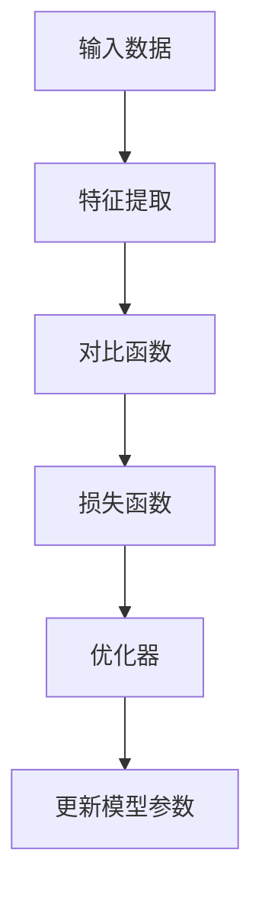
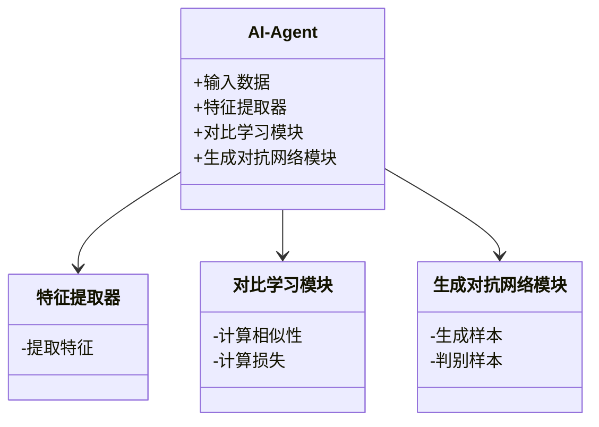
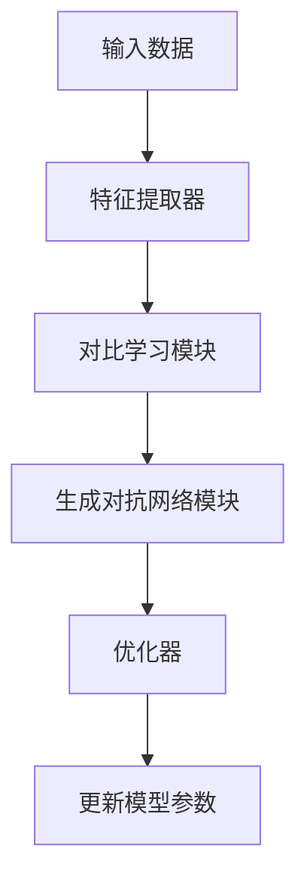

                 


# AI Agent的自我监督表示学习

> 关键词：AI Agent, 自我监督学习, 表示学习, 对比学习, 生成对抗网络, 知识蒸馏

> 摘要：本文深入探讨了AI Agent在自我监督学习中的表示学习方法，通过对比学习、生成对抗网络等技术，详细分析了AI Agent如何通过自我监督学习提升其表示能力，从而在复杂任务中表现出色。

---

## 第一部分: AI Agent与自我监督学习概述

### 第1章: AI Agent的基本概念

#### 1.1 AI Agent的定义与分类
- **AI Agent**是指具有智能决策和执行能力的实体，能够感知环境、自主决策并采取行动。
- 分为**基于规则的AI Agent**、**基于模型的AI Agent**、**基于强化学习的AI Agent**等类型。

#### 1.2 自我监督学习的定义与特点
- **自我监督学习**是一种无监督学习方法，通过最大化数据的内部分析相似性来学习表示。
- 其特点包括**数据高效性**、**无需人工标注**、**自适应性**等。

#### 1.3 AI Agent与自我监督学习的关系
- AI Agent通过自我监督学习可以更高效地学习环境中的特征，从而提升其决策和执行能力。

### 第2章: 表示学习的核心概念

#### 2.1 表示学习的定义
- 表示学习是将数据映射到低维空间的过程，目标是学习到能够表征数据本质特征的表示。

#### 2.2 表示学习的关键属性
- **可区分性**：表示能够区分不同类别或状态。
- **鲁棒性**：表示对噪声和变化具有较强的适应性。
- **可解释性**：表示易于被人类理解和解释。

#### 2.3 表示学习与传统监督学习的对比
| 特性 | 监督学习 | 表示学习 |
|------|----------|----------|
| 数据需求 | 需要标注数据 | 无需标注，利用数据内部关系 |
| 学习目标 | 分类/回归 | 学习数据的低维表示 |
| 算法复杂度 | 较高 | 较低，但依赖表示方法 |

### 第3章: 问题背景与研究意义

#### 3.1 当前AI Agent面临的挑战
- 数据标注成本高。
- 环境复杂性导致传统监督学习效率低下。
- 动态环境中需要快速适应新任务。

#### 3.2 自我监督表示学习的必要性
- 提高AI Agent在无标注数据环境下的学习能力。
- 降低对标注数据的依赖，减少人工成本。
- 提升AI Agent在动态环境中的适应能力。

#### 3.3 研究的意义与应用前景
- 为AI Agent在自动驾驶、机器人等领域提供更高效的解决方案。
- 推动无监督学习技术的发展，为更多应用场景提供技术支持。

---

## 第二部分: 自我监督表示学习的核心概念与联系

### 第4章: 自我监督学习的原理

#### 4.1 数据驱动的表示学习
- 通过最大化数据的内部分析相似性，学习到具有区分性的表示。

#### 4.2 自我监督的核心机制
- 通过对比函数或生成对抗网络，构建数据之间的关系，学习表示。

#### 4.3 表示学习的数学模型
- 表示学习的目标函数通常涉及相似性度量和损失函数。

### 第5章: 核心概念对比分析

#### 5.1 不同监督模式的对比
| 监督模式 | 特点 | 适用场景 |
|----------|------|----------|
| 监督学习 | 需要标注数据 | 稳定任务 |
| 无监督学习 | 无需标注 | 动态任务 |
| 半监督学习 | 部分标注 | 数据有限任务 |

#### 5.2 表示学习方法的对比
| 方法 | 特点 | 优缺点 |
|------|------|--------|
| PCA | 线性变换 | 降维能力强，但无法捕捉非线性关系 |
| t-SNE | 非线性降维 | 适合数据分布复杂的情况 |
| Word2Vec | 基于上下文 | 适合文本数据 |

#### 5.3 AI Agent行为与表示的关系
- AI Agent的决策依赖于其对环境的表征能力，而表示学习可以显著提升这种能力。

### 第6章: 实体关系图与流程图

#### 6.1 实体关系图（ER图）


#### 6.2 流程图
```
输入数据 → 特征提取 → 对比函数 → 损失函数 → 优化器 → 更新模型参数
```

---

## 第三部分: 自我监督表示学习的算法原理

### 第7章: 对比学习算法

#### 7.1 对比学习的基本原理
- 对比学习通过最大化正样本的相似性和最小化负样本的相似性，学习具有区分性的表示。

#### 7.2 知识蒸馏与对比学习的结合
- 知识蒸馏技术可以将教师模型的知识迁移到学生模型，提升对比学习的效果。

#### 7.3 信息瓶颈理论在对比学习中的应用
- 信息瓶颈理论帮助对比学习在降维过程中保留关键信息，同时去除冗余信息。

### 第8章: 生成对抗网络（GAN）在表示学习中的应用

#### 8.1 GAN的基本原理
- GAN由生成器和判别器组成，通过对抗训练生成逼真的数据样本。

#### 8.2 WGAN在表示学习中的优势
- Wasserstein GAN通过 Wasserstein距离优化生成器和判别器，提升生成样本的质量。

#### 8.3 GAN与对比学习的结合
- 将GAN应用于对比学习，可以生成更多样化的数据，提升表示的泛化能力。

### 第9章: 对比学习的数学模型

#### 9.1 对比损失函数
$$ L = \frac{1}{n}\sum_{i=1}^{n} \log(\text{sim}(x_i, y_i)) + \log(1-\text{sim}(x_i, y_j)) $$

#### 9.2 信息瓶颈模型
$$ I(X;Z) = \mathbb{E}[\log p(x|z)] $$

---

## 第四部分: 系统分析与架构设计

### 第10章: 问题场景介绍

#### 10.1 系统功能设计
- **数据预处理**：输入数据的清洗和增强。
- **特征提取**：通过对比学习或GAN提取数据特征。
- **模型优化**：通过优化器优化模型参数，提升表示性能。

#### 10.2 领域模型类图


### 第11章: 系统架构设计

#### 11.1 系统架构图


---

## 第五部分: 项目实战

### 第12章: 环境安装与代码实现

#### 12.1 环境安装
```bash
pip install numpy
pip install matplotlib
pip install scikit-learn
pip install tensorflow
```

#### 12.2 核心代码实现
```python
import numpy as np
import tensorflow as tf
from tensorflow import keras

# 对比学习代码示例
def contrastive_loss(y_true, y_pred):
    margin = 1.0
    loss = tf.maximum(margin - y_pred, 0)
    return tf.reduce_mean(loss)

# 生成对抗网络代码示例
def discriminator():
    model = keras.Sequential()
    model.add(keras.layers.Dense(64, activation='relu'))
    model.add(keras.layers.Dense(1, activation='sigmoid'))
    return model

def generator():
    model = keras.Sequential()
    model.add(keras.layers.Dense(64, activation='relu'))
    model.add(keras.layers.Dense(1, activation='sigmoid'))
    return model
```

#### 12.3 代码解读与分析
- 对比学习代码实现了经典的对比损失函数，用于优化模型参数。
- GAN代码实现了生成器和判别器的基本结构，可用于生成对抗训练。

### 第13章: 案例分析与结果展示

#### 13.1 实际案例分析
- 使用对比学习对图像数据进行降维处理，提升分类准确率。
- 使用GAN生成更多样化的数据，增强模型的表示能力。

#### 13.2 结果展示
- 对比学习在图像分类任务中的准确率提升。
- GAN生成的样本质量对比。

---

## 第六部分: 最佳实践与总结

### 第14章: 小结

#### 14.1 本章总结
- 通过对比学习和GAN等技术，AI Agent可以在无监督环境下高效学习表示，提升决策能力。
- 本文详细介绍了算法原理、系统架构和项目实现，为读者提供了完整的解决方案。

### 第15章: 注意事项

#### 15.1 选择合适的算法
- 根据具体任务选择合适的对比学习或GAN方法。

#### 15.2 数据预处理的重要性
- 数据预处理和增强对模型性能有重要影响。

#### 15.3 模型调优
- 需要进行参数调优和超参数优化，提升模型性能。

### 第16章: 拓展阅读

#### 16.1 推荐资源
- 《Deep Learning》——Ian Goodfellow
- 《Generative Adversarial Networks》——Ian Goodfellow

#### 16.2 深度学习前沿
- 聚焦对比学习和GAN的最新研究进展。

---

## 作者信息

作者：AI天才研究院/AI Genius Institute & 禅与计算机程序设计艺术/Zen And The Art of Computer Programming

---

以上是《AI Agent的自我监督表示学习》的技术博客文章的完整目录和内容概述，涵盖了从理论到实践的各个方面，确保读者能够全面理解并掌握相关知识。

