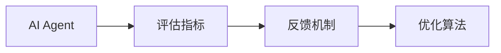

                 


```markdown
# AI Agent的自我评估机制：持续改进性能

> 关键词：AI Agent，自我评估，持续改进，性能优化，算法原理，系统架构

> 摘要：本文详细探讨了AI Agent的自我评估机制，从基本概念到算法实现，再到系统设计与项目实战，系统地分析了如何通过自我评估机制实现AI Agent的持续性能改进。

---

## 第一部分：AI Agent的自我评估机制概述

### 第1章：AI Agent的基本概念与背景

#### 1.1 AI Agent的定义与特点
- AI Agent的定义
  - AI Agent是一种能够感知环境并采取行动以实现目标的智能实体。
- AI Agent的核心特点
  - 自主性：能够在没有外部干预的情况下独立运作。
  - 反应性：能够根据环境的变化调整自身的行为。
  - 目标导向：所有的行动都以实现特定目标为导向。
  - 学习能力：通过经验或数据不断优化自身的行为策略。

#### 1.2 自我评估机制的必要性
- 问题背景
  - AI Agent在运行过程中可能会遇到各种意外情况，导致性能下降。
  - 需要一种机制来实时监控和评估自身的性能表现。
- 问题描述
  - 如何量化AI Agent的行为效果？
  - 如何获取有效的反馈信息以指导优化？
- 问题解决方法
  - 引入自我评估机制，通过评估指标和反馈机制实现持续优化。

#### 1.3 持续改进性能的意义
- 性能改进的必要性
  - 提高AI Agent的决策准确性和效率，确保其长期稳定运行。
- 性能改进的实现方式
  - 通过评估指标量化表现，利用反馈机制优化策略。
- 性能改进的边界与外延
  - 了解自我评估的局限性，明确改进的范围和方向。

### 第2章：自我评估机制的核心概念

#### 2.1 自我评估机制的原理
- 评估指标的选择
  - 评估指标应具有可量化、可测量的特点。
  - 常见的评估指标包括准确率、召回率、F1值等。
- 反馈机制的实现
  - 反馈机制是连接评估结果和优化策略的关键纽带。
  - 反馈机制可以通过奖励或惩罚的形式指导优化方向。
- 优化算法的运用
  - 使用强化学习等算法，根据反馈调整策略参数。

#### 2.2 核心概念对比分析
- 评估指标对比分析表
  | 评估指标 | 优点 | 缺点 |
  |----------|------|------|
  | 准确率   | 简单直观 | 易受类别分布影响 |
  | 召回率   | 关注 minority class | 计算依赖正确标注数据 |
  | F1值     | 综合考虑精确率和召回率 | 不适用于多标签分类问题 |
- 反馈机制对比分析表
  | 反馈机制 | 优点 | 缺点 |
  |----------|------|------|
  | 奖励机制 | 明确指导优化方向 | 需要设计合理的奖励函数 |
  | 惩罚机制 | 控制风险 | 可能抑制探索行为 |
  | 综合机制 | 综合考虑多种因素 | 实现复杂度较高 |

#### 2.3 实体关系图


---

## 第二部分：自我评估机制的算法原理

### 第3章：算法原理的详细分析

#### 3.1 基于强化学习的评估算法
- 强化学习的基本原理
  - 通过与环境交互，学习最优策略。
  - 使用奖励函数指导优化方向。
- 算法流程
  ```mermaid
  graph LR
  A[状态] --> B[动作]
  B --> C[奖励]
  C --> D[策略更新]
  ```

#### 3.2 算法实现代码
- 评估函数的实现
  ```python
  def evaluate_agent(agent, env):
      rewards = []
      for _ in range(10):
          reward = 0
          state = env.reset()
          done = False
          while not done:
              action = agent.act(state)
              state, r, done = env.step(action)
              reward += r
          rewards.append(reward)
      return sum(rewards) / len(rewards)
  ```

#### 3.3 数学模型与公式
- 损失函数
  $$L = \sum_{i=1}^{n} (y_i - \hat{y_i})^2$$
- 优化目标
  $$\min_{\theta} \mathbb{E}_{x,y}[L(x,y,\theta)]$$

---

## 第三部分：系统分析与架构设计

### 第4章：系统架构的实现

#### 4.1 系统功能设计
- 系统功能模块
  - 感知层：负责数据采集和环境感知。
  - 决策层：根据评估结果优化策略。
  - 执行层：根据优化后的策略采取行动。
- 领域模型
  ```mermaid
  classDiagram
  class AI-Agent {
      - 状态感知
      - 行为决策
      - 性能评估
  }
  ```

#### 4.2 系统架构设计
- 系统架构图
  ```mermaid
  graph LR
  A[感知层] --> B[决策层]
  B --> C[执行层]
  C --> D[反馈机制]
  D --> A
  ```

#### 4.3 系统接口设计
- API接口
  - 输入：环境状态
  - 输出：评估结果
  - 调用示例
    ```python
    result = agent_api.evaluate(state)
    ```

#### 4.4 系统交互流程
- 交互流程图
  ```mermaid
  sequenceDiagram
  participant A as AI Agent
  participant B as 环境
  A->B: 获取状态
  B->A: 返回状态
  A->B: 采取行动
  B->A: 返回奖励
  ```

---

## 第四部分：项目实战

### 第5章：项目实现与分析

#### 5.1 项目环境安装
- 环境需求
  - Python 3.8+
  - PyTorch或TensorFlow
  - Gym库或其他AI环境模拟库

#### 5.2 核心代码实现
- 评估函数的实现
  ```python
  def evaluate_agent(agent, env):
      rewards = []
      for _ in range(10):
          reward = 0
          state = env.reset()
          done = False
          while not done:
              action = agent.act(state)
              state, r, done = env.step(action)
              reward += r
          rewards.append(reward)
      return sum(rewards) / len(rewards)
  ```

#### 5.3 代码功能分析
- 功能模块
  - 状态获取
  - 行为决策
  - 奖励计算
- 功能流程
  ```mermaid
  graph LR
  A[开始] --> B[获取状态]
  B --> C[采取行动]
  C --> D[获取奖励]
  D --> E[评估性能]
  E --> F[优化策略]
  ```

#### 5.4 实际案例分析
- 案例描述
  - 在自然语言处理任务中，评估AI Agent的文本生成质量。
- 分析步骤
  1. 确定评估指标（如 BLEU 分值）。
  2. 设计奖励机制（如基于生成文本的流畅性）。
  3. 实现评估函数并进行多次实验。
  4. 根据评估结果优化生成策略。

#### 5.5 项目小结
- 项目成果
  - 成功实现了AI Agent的自我评估机制。
  - 通过实验验证了评估方法的有效性。
- 经验总结
  - 合适的评估指标和反馈机制是实现持续优化的关键。
  - 系统架构设计应充分考虑扩展性和可维护性。

---

## 第五部分：总结与展望

### 第6章：总结与最佳实践

#### 6.1 最佳实践
- 选择合适的评估指标
  - 根据任务需求选择适当的评估指标。
- 设计有效的反馈机制
  - 确保反馈能够准确指导优化方向。
- 定期监控与调整
  - 定期评估系统性能，及时调整优化策略。

#### 6.2 小结
- 本文系统地介绍了AI Agent的自我评估机制。
- 从理论到实践，详细讲解了如何实现持续性能改进。

#### 6.3 注意事项
- 避免过度优化，防止过拟合。
- 定期进行系统维护和更新。
- 注意保护用户隐私和数据安全。

#### 6.4 拓展阅读
- 推荐书籍：《强化学习（深入浅出）》、《机器学习实战》。
- 推荐论文：相关领域的最新研究成果。

---

## 作者信息

作者：AI天才研究院/AI Genius Institute & 禅与计算机程序设计艺术 /Zen And The Art of Computer Programming

---

# THE END
```

