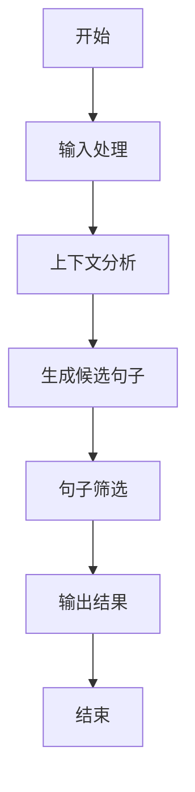
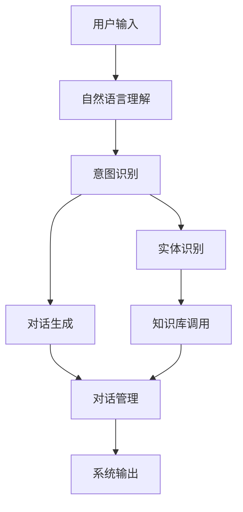

                 


# AI Agent的自然语言接口优化技术

> 关键词：AI Agent, 自然语言接口, 对话生成, 意图理解, 对话管理, 优化技术

> 摘要：本文系统地探讨了AI Agent的自然语言接口优化技术，从核心概念到算法原理，从系统架构到项目实战，全面解析了如何提升自然语言接口的准确性和流畅性。通过详细的技术分析和实际案例，本文为AI Agent的开发者提供了实用的优化策略和实现方法。

---

# 第一部分: AI Agent的自然语言接口优化技术基础

## 第1章: AI Agent与自然语言接口概述

### 1.1 AI Agent的基本概念
#### 1.1.1 AI Agent的定义与分类
AI Agent（智能代理）是指能够感知环境、自主决策并执行任务的智能系统。根据功能和应用场景的不同，AI Agent可以分为以下几类：
- **简单反应式Agent**：基于当前感知做出反应，适用于简单的任务。
- **基于模型的反应式Agent**：维护环境模型，用于复杂任务的决策。
- **目标驱动型Agent**：基于明确的目标执行任务。
- **效用驱动型Agent**：通过最大化效用函数来优化决策。

#### 1.1.2 自然语言处理技术的发展历程
自然语言处理（NLP）技术的发展经历了以下几个阶段：
1. **基于规则的NLP（20世纪50年代-70年代）**：依赖人工制定规则，实现简单的文本处理任务。
2. **统计驱动的NLP（20世纪80年代-90年代）**：利用统计模型分析文本，开始出现基于概率的语言模型。
3. **深度学习驱动的NLP（21世纪初至今）**：引入神经网络和大模型（如BERT、GPT），显著提升了语言理解与生成的准确性。

#### 1.1.3 自然语言接口在AI Agent中的作用
自然语言接口（NLI）是AI Agent与用户交互的核心模块，负责将用户的自然语言输入转化为系统可理解的指令或信息。其作用包括：
- 提供友好的用户交互界面。
- 支持多轮对话，维护对话上下文。
- 适应不同领域和场景的语义需求。

### 1.2 自然语言接口的核心问题
#### 1.2.1 语言理解的准确性问题
自然语言理解（NLU）的关键在于准确识别用户的意图和需求。常见的挑战包括：
- **歧义性**：同一句话可能有多种解释。
- **领域限制**：在特定领域内理解更准确，但在通用场景下可能表现不佳。
- **上下文依赖**：某些语义需要结合上下文才能准确理解。

#### 1.2.2 语言生成的流畅性问题
自然语言生成（NLG）的目标是生成连贯、流畅且符合用户期望的回复。主要挑战包括：
- **生成多样性**：如何生成多种可能的回复，避免重复。
- **上下文一致性**：在多轮对话中保持语义连贯。
- **语境适应性**：根据对话场景调整语气和风格。

#### 1.2.3 对话上下文的理解与关联
对话上下文的理解是多轮对话中至关重要的一环。系统需要能够：
- **维护对话历史**：记录用户和系统的对话记录。
- **关联意图**：理解用户当前意图与历史意图的关系。
- **推理隐含需求**：根据对话内容推断用户的深层需求。

### 1.3 自然语言接口优化的背景与意义
#### 1.3.1 当前技术的局限性
尽管NLP技术取得了显著进步，但在实际应用中仍面临诸多挑战：
- **数据依赖性**：深度学习模型依赖大量标注数据，小样本场景表现不佳。
- **领域适应性**：模型在特定领域内表现较好，但跨领域迁移能力较弱。
- **实时性与效率**：复杂场景下的实时响应仍存在瓶颈。

#### 1.3.2 优化目标与价值
优化自然语言接口的目标是：
- 提高NLU的准确性和鲁棒性。
- 提升NLG的生成质量和用户体验。
- 实现更智能的对话管理，增强交互的自然性。

优化后的自然语言接口能够显著提升AI Agent的用户体验，降低误识率和对话失败率，增强用户满意度。

#### 1.3.3 应用场景与未来趋势
当前，自然语言接口广泛应用于智能客服、智能助手、智能音箱等领域。未来的发展趋势包括：
- **多模态交互**：结合视觉、听觉等多模态信息，提升交互的丰富性。
- **个性化定制**：根据用户偏好和习惯，提供个性化交互体验。
- **实时推理与学习**：通过在线学习和推理，动态优化对话策略。

### 1.4 本章小结
本章从AI Agent的基本概念出发，介绍了自然语言接口的核心问题和优化意义。通过对当前技术挑战和未来发展趋势的分析，为后续的技术细节探讨奠定了基础。

---

## 第2章: 对话生成技术

### 2.1 对话生成的基本原理
#### 2.1.1 基于规则的生成方法
基于规则的对话生成方法通过预定义的语法规则和模板生成回复。这种方法适用于简单场景，但灵活性和创造性有限。

#### 2.1.2 统计模型与数据驱动的生成方法
统计模型通过分析大量对话数据，学习语言模式和语义关联，生成概率最高的回复。这种方法依赖数据质量，但能够处理复杂场景。

#### 2.1.3 基于大模型的生成技术
基于大模型（如GPT、BERT）的生成技术通过预训练和微调，能够生成高质量、多样化的回复。这种方法在准确性和流畅性上表现优异。

### 2.2 对话生成的优化策略
#### 2.2.1 基于上下文的生成优化
通过维护对话历史，结合上下文信息，生成更连贯的回复。常用的技术包括：
- **上下文编码器**：将对话历史编码为固定长度的向量。
- **注意力机制**：聚焦于重要的对话内容。

#### 2.2.2 多轮对话中的生成策略
在多轮对话中，生成策略需要考虑：
- **上下文一致性**：确保每轮回复与前文语义连贯。
- **对话状态跟踪**：维护当前对话的状态，包括用户意图、已提供的信息等。
- **知识库调用**：根据对话内容，调用相关知识库中的信息。

#### 2.2.3 领域知识的融合与应用
通过融合领域知识（如医疗、金融等），提升对话生成的准确性和专业性。常用方法包括：
- **知识图谱调用**：利用知识图谱中的实体关系生成回复。
- **领域特定模型**：训练针对特定领域的对话生成模型。

### 2.3 对话生成的算法流程图


### 2.4 本章小结
本章详细探讨了对话生成技术的基本原理和优化策略，通过流程图和具体方法的介绍，为后续的算法实现奠定了基础。

---

## 第3章: 意图理解技术

### 3.1 意图理解的定义与分类
#### 3.1.1 意图理解的基本概念
意图理解是指通过分析用户输入的自然语言，识别用户的意图和需求。意图可以是显式的（如“预订酒店”）或隐含的（如“寻找高性价比酒店”）。

#### 3.1.2 基于规则的意图识别
基于规则的意图识别方法通过预定义的关键词和规则匹配用户的输入，识别意图。这种方法适用于简单场景，但灵活性有限。

#### 3.1.3 统计模型与深度学习的意图识别
统计模型通过分析语言特征，学习意图的分布规律。深度学习模型（如LSTM、Transformer）能够捕捉更复杂的语义信息，提升意图识别的准确性。

### 3.2 意图理解的关键技术
#### 3.2.1 基于词袋模型的意图识别
词袋模型通过统计文本中关键词的出现频率，学习意图。这种方法简单但效果有限。

#### 3.2.2 基于序列模型的意图识别
序列模型（如LSTM、Transformer）能够捕捉文本的序列信息，提升意图识别的准确性。

#### 3.2.3 基于预训练模型的意图识别
预训练模型（如BERT、GPT）通过大规模预训练，掌握了丰富的语言知识，能够有效识别意图。

### 3.3 意图理解的优化方法
#### 3.3.1 数据增强技术
通过数据增强（如同义词替换、句式变换）提升数据多样性，增强模型的鲁棒性。

#### 3.3.2 领域知识的迁移学习
通过迁移学习，将其他领域的知识迁移到当前领域，提升模型的适应性。

#### 3.3.3 多任务学习的应用
多任务学习通过同时学习多个相关任务，共享知识，提升意图识别的准确性和效率。

### 3.4 本章小结
本章深入探讨了意图理解的关键技术，通过对比不同方法的优缺点，为优化自然语言接口提供了理论支持。

---

## 第4章: 对话管理技术

### 4.1 对话管理的定义与作用
#### 4.1.1 对话管理的基本概念
对话管理是指在多轮对话中，维护对话状态，协调系统与用户之间的交互。其作用包括：
- **保持对话连贯性**：确保每轮对话与前文相关。
- **优化对话流程**：通过智能决策，引导对话走向最优路径。
- **处理异常情况**：在对话中识别并处理潜在的问题。

#### 4.1.2 对话管理在AI Agent中的作用
对话管理是AI Agent实现高效交互的核心模块，直接影响用户体验。

### 4.2 对话管理的实现方法
#### 4.2.1 基于状态的对话管理
基于状态的对话管理通过维护对话状态，进行意图识别和回复生成。常用的状态表示方法包括：
- **状态机模型**：通过状态转移实现对话管理。
- **上下文向量表示**：将对话历史编码为向量，用于状态表示。

#### 4.2.2 基于策略的对话管理
基于策略的对话管理通过制定策略，指导对话的进行。常用的策略包括：
- **贪心策略**：每一步选择当前最优的回复。
- **基于模型的策略**：通过训练模型生成回复策略。

#### 4.2.3 基于强化学习的对话管理
基于强化学习的对话管理通过定义奖励函数，优化对话策略。这种方法能够处理复杂的对话场景，但训练成本较高。

### 4.3 对话管理的优化策略
#### 4.3.1 对话状态跟踪
对话状态跟踪是对话管理的核心任务，常用方法包括：
- **基于规则的状态跟踪**：通过预定义的规则更新对话状态。
- **基于模型的状态跟踪**：通过神经网络模型学习对话状态。

#### 4.3.2 对话策略优化
对话策略优化的目标是提升对话的成功率和用户体验。常用方法包括：
- **基于经验的策略优化**：通过积累对话数据，优化策略。
- **基于模型的策略优化**：通过训练模型生成最优策略。

#### 4.3.3 多轮对话中的异常处理
在多轮对话中，可能出现用户偏离主题或意图模糊等情况。系统需要能够识别并处理这些异常，确保对话顺利进行。

### 4.4 本章小结
本章详细探讨了对话管理的实现方法和优化策略，为构建高效的对话系统提供了理论支持。

---

## 第5章: 自然语言接口优化的算法实现

### 5.1 基于Seq2Seq模型的对话生成
#### 5.1.1 Seq2Seq模型的基本原理
Seq2Seq模型通过编码器和解码器的组合，实现从输入到输出的映射。编码器将输入序列编码为向量，解码器将向量解码为输出序列。

#### 5.1.2 注意力机制的引入
注意力机制通过关注输入中的重要部分，提升模型的生成能力。在Seq2Seq模型中，注意力机制能够帮助模型聚焦于关键信息。

#### 5.1.3 基于预训练模型的Seq2Seq实现
基于预训练模型（如BERT、GPT）的Seq2Seq实现能够充分利用大规模预训练的知识，提升生成质量。

### 5.2 基于强化学习的对话管理
#### 5.2.1 强化学习的基本原理
强化学习通过定义奖励函数，训练智能体在环境中采取最优动作。在对话管理中，奖励函数通常定义为对话的成功率和用户体验的提升。

#### 5.2.2 对话管理的强化学习框架
对话管理的强化学习框架通常包括以下几个部分：
- **状态空间**：对话的状态表示。
- **动作空间**：系统可采取的回复动作。
- **奖励函数**：对话的奖励评估。

#### 5.2.3 基于Actor-Critic算法的对话管理
Actor-Critic算法通过同时学习策略和价值函数，优化对话管理的策略。这种方法能够有效处理复杂的对话场景。

### 5.3 自然语言接口优化的代码实现
#### 5.3.1 环境配置
- **Python版本**：建议使用Python 3.8及以上。
- **依赖库安装**：需要安装PyTorch、Hugging Face Transformers等库。

#### 5.3.2 对话生成的代码实现
```python
from transformers import AutoTokenizer, AutoModelForSeq2Seq
import torch

model_name = "facebook/bart-large"
tokenizer = AutoTokenizer.from_pretrained(model_name)
model = AutoModelForSeq2Seq.from_pretrained(model_name)

def generate_response(input_text):
    inputs = tokenizer(input_text, return_tensors="pt")
    outputs = model.generate(inputs.input_ids, max_length=50)
    response = tokenizer.decode(outputs[0], skip_special_tokens=True)
    return response
```

#### 5.3.3 对话管理的代码实现
```python
import torch
import torch.nn as nn
import torch.optim as optim

class DialogManager:
    def __init__(self, vocab_size):
        self.vocab_size = vocab_size
        self.hidden_size = 128
        self.encoder = nn.Embedding(vocab_size, self.hidden_size)
        self.decoder = nn.Linear(self.hidden_size, vocab_size)
    
    def forward(self, input_seq):
        # 编码
        encoder_output = self.encoder(input_seq)
        # 解码
        output = self.decoder(encoder_output)
        return output

# 初始化对话管理器
vocab_size = 1000
dialog_manager = DialogManager(vocab_size)

# 定义损失函数和优化器
criterion = nn.CrossEntropyLoss()
optimizer = optim.Adam(dialog_manager.parameters(), lr=0.001)

# 训练
def train(input_seq, target_seq):
    optimizer.zero_grad()
    outputs = dialog_manager.forward(input_seq)
    loss = criterion(outputs, target_seq)
    loss.backward()
    optimizer.step()
    return loss.item()

# 示例训练
input_seq = torch.randint(0, vocab_size, (16,))
target_seq = torch.randint(0, vocab_size, (16,))
loss = train(input_seq, target_seq)
print(f"Loss: {loss}")
```

### 5.4 本章小结
本章通过具体的算法实现，详细展示了自然语言接口优化的技术细节。通过对Seq2Seq模型和强化学习算法的代码实现，读者可以更好地理解和应用这些技术。

---

## 第6章: 自然语言接口优化的系统架构与设计

### 6.1 系统架构设计
#### 6.1.1 系统功能模块
- **自然语言理解模块**：负责解析用户的输入，识别意图和实体。
- **对话生成模块**：根据理解的意图生成回复。
- **对话管理模块**：维护对话状态，优化对话流程。
- **知识库模块**：提供领域知识支持。

#### 6.1.2 系统架构图


#### 6.1.3 接口设计
- **输入接口**：接收用户的自然语言输入。
- **输出接口**：生成并返回回复内容。
- **知识库接口**：调用知识库获取相关信息。

### 6.2 系统交互流程
#### 6.2.1 用户发起对话
用户通过输入文本或语音启动对话。

#### 6.2.2 系统解析输入
系统对用户的输入进行自然语言理解，识别意图和实体。

#### 6.2.3 系统生成回复
系统根据解析结果，生成回复内容。

#### 6.2.4 维护对话状态
系统维护对话历史，确保每轮对话的连贯性。

### 6.3 系统优化策略
#### 6.3.1 系统性能优化
- **并行计算**：通过并行计算提升系统的响应速度。
- **缓存机制**：缓存高频查询，减少重复计算。

#### 6.3.2 系统可扩展性优化
- **模块化设计**：通过模块化设计，提升系统的可扩展性。
- **接口标准化**：定义统一的接口标准，方便模块的替换和扩展。

### 6.4 本章小结
本章从系统架构的角度，详细探讨了自然语言接口优化的实现方案，为构建高效、可靠的对话系统提供了设计指导。

---

## 第7章: 项目实战——自然语言接口优化的实现

### 7.1 项目背景与目标
本项目旨在通过优化自然语言接口，提升AI Agent的对话能力。项目目标包括：
- 提高意图识别的准确率。
- 提升对话生成的流畅性。
- 实现高效的对话管理。

### 7.2 项目环境配置
#### 7.2.1 环境配置
- **Python版本**：Python 3.8及以上。
- **依赖库安装**：需要安装PyTorch、Hugging Face Transformers、Flask等库。

#### 7.2.2 开发工具
- **代码编辑器**：推荐使用PyCharm或VS Code。
- **版本控制工具**：推荐使用Git进行代码管理。

### 7.3 项目核心实现
#### 7.3.1 自然语言理解模块
```python
from transformers import pipeline

nlp = pipeline("text-classification", model="snli")
def get_intents(text):
    result = nlp(text)
    return result
```

#### 7.3.2 对话生成模块
```python
from transformers import AutoTokenizer, AutoModelForSeq2Seq
import torch

tokenizer = AutoTokenizer.from_pretrained("facebook/bart-large")
model = AutoModelForSeq2Seq.from_pretrained("facebook/bart-large")

def generate_response(input_text):
    inputs = tokenizer(input_text, return_tensors="pt")
    outputs = model.generate(inputs.input_ids, max_length=50)
    response = tokenizer.decode(outputs[0], skip_special_tokens=True)
    return response
```

#### 7.3.3 对话管理模块
```python
class DialogManager:
    def __init__(self):
        self.dialog_history = []
    
    def add_to_history(self, text):
        self.dialog_history.append(text)
    
    def get_history(self):
        return self.dialog_history
```

### 7.4 项目实现与测试
#### 7.4.1 系统功能实现
通过上述代码实现，系统能够完成以下功能：
- 接收用户的自然语言输入。
- 解析输入，识别意图和实体。
- 生成回复内容。
- 维护对话历史，确保对话连贯性。

#### 7.4.2 系统测试
测试内容包括：
- **意图识别测试**：测试系统对不同意图的识别准确率。
- **对话生成测试**：测试系统生成回复的流畅性和准确性。
- **对话管理测试**：测试系统维护对话状态的能力。

#### 7.4.3 测试结果与优化
通过对测试结果的分析，不断优化系统的性能和用户体验。

### 7.5 本章小结
本章通过一个具体的项目案例，详细展示了自然语言接口优化的实现过程。通过代码实现和测试，读者可以更好地理解和应用这些技术。

---

## 第8章: 自然语言接口优化的最佳实践与注意事项

### 8.1 最佳实践
#### 8.1.1 数据 preprocessing
- **数据清洗**：去除噪音数据，提升数据质量。
- **数据增强**：通过数据增强技术，提升模型的鲁棒性。

#### 8.1.2 模型优化
- **模型调参**：通过调整模型参数，优化性能。
- **模型融合**：通过融合多种模型，提升整体性能。

#### 8.1.3 系统部署
- **服务器部署**：将系统部署到服务器，确保稳定运行。
- **负载均衡**：通过负载均衡技术，提升系统的扩展性。

### 8.2 注意事项
#### 8.2.1 数据隐私与安全
在处理用户数据时，需要注意数据隐私和安全，确保用户信息不被泄露。

#### 8.2.2 系统容错与异常处理
在系统设计中，需要考虑异常情况的处理，确保系统的健壮性。

#### 8.2.3 用户体验优化
通过优化用户体验，提升用户的满意度和忠诚度。

### 8.3 本章小结
本章总结了自然语言接口优化的最佳实践和注意事项，为读者在实际应用中提供了宝贵的指导。

---

## 第9章: 总结与展望

### 9.1 总结
本文系统地探讨了AI Agent的自然语言接口优化技术，从核心概念到算法实现，从系统架构到项目实战，全面解析了如何提升自然语言接口的准确性和流畅性。通过对Seq2Seq模型、注意力机制和强化学习的深入分析，为读者提供了丰富的技术细节和实现方案。

### 9.2 展望
未来，自然语言接口优化技术将朝着以下几个方向发展：
- **多模态交互**：结合视觉、听觉等多模态信息，提升交互的丰富性。
- **个性化定制**：根据用户偏好和习惯，提供个性化交互体验。
- **实时推理与学习**：通过在线学习和推理，动态优化对话策略。

---

# 作者：AI天才研究院/AI Genius Institute & 禅与计算机程序设计艺术 /Zen And The Art of Computer Programming

