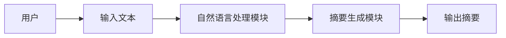
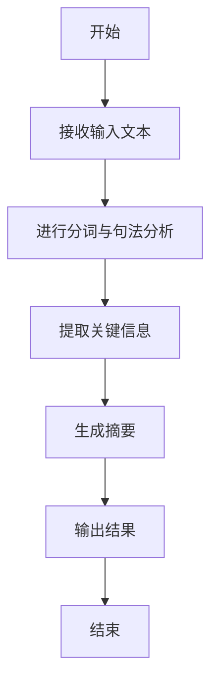
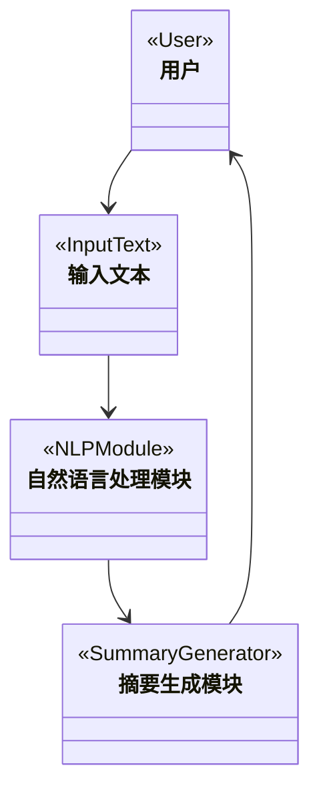
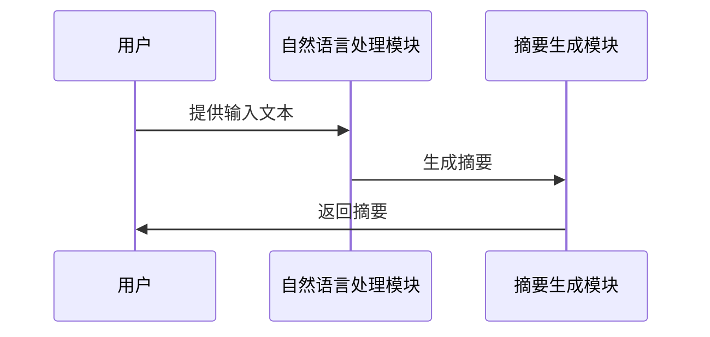

                 


# AI Agent的自然语言摘要生成技术

## 关键词：AI Agent, 自然语言处理, 摘要生成, 深度学习, Transformer模型

## 摘要：AI Agent通过自然语言处理技术，实现对文本的自动摘要生成。本文将从AI Agent的基本概念、自然语言处理的核心技术、摘要生成的算法原理、系统架构设计以及项目实战等方面进行详细探讨，帮助读者全面理解AI Agent在自然语言摘要生成中的应用和实现。

---

## 第1章: AI Agent与自然语言摘要生成的背景介绍

### 1.1 问题背景与问题描述

#### 1.1.1 自然语言处理的发展历程
自然语言处理（Natural Language Processing, NLP）是人工智能领域的重要分支，旨在使计算机能够理解、生成和处理人类语言。从早期的基于规则的系统到现在的深度学习模型，NLP经历了巨大的变革。

- 1950s-1960s: 基于规则的系统，如 SHRDLU 和 ELIZA。
- 1980s-1990s: 统计学方法的崛起，如词袋模型和词嵌入。
- 2000s: 深度学习的兴起，如 LSTM 和 Transformer。

#### 1.1.2 AI Agent的核心概念与应用场景
AI Agent是一种智能体，能够感知环境并采取行动以实现目标。在摘要生成中，AI Agent可以接收文本输入，分析内容，并生成简洁的摘要。

- **应用场景**：
  - 智能助手（如Siri、Alexa）。
  - 智能客服系统。
  - 内容管理工具（如新闻摘要生成）。

#### 1.1.3 摘要生成技术的现状与挑战
摘要生成技术在学术界和工业界都有广泛研究，但仍面临诸多挑战：

- **挑战**：
  - 如何平衡摘要的简洁性和信息完整性。
  - 处理多语言和跨文化文本的复杂性。
  - 实时生成的性能优化。

### 1.2 问题解决方法与边界

#### 1.2.1 摘要生成的常见方法
摘要生成技术主要分为两类：抽取式和生成式。

- **抽取式摘要**：从原文中选择重要句子或短语。
- **生成式摘要**：通过模型生成新的句子。

#### 1.2.2 AI Agent在摘要生成中的独特优势
AI Agent结合了自然语言理解、推理和生成能力，能够提供更智能化的摘要生成服务。

- **优势**：
  - 能够理解上下文和语境。
  - 支持实时交互和动态调整。

#### 1.2.3 技术边界与适用范围
AI Agent的摘要生成技术适用于多种场景，但也有其局限性：

- **适用范围**：
  - 需要快速生成摘要的场景。
  - 处理结构化和半结构化数据的场景。

- **边界**：
  - 无法处理过于复杂或模糊的文本。
  - 对于小语种和边缘语言支持有限。

### 1.3 核心概念与组成要素

#### 1.3.1 AI Agent的基本结构
AI Agent通常由感知模块、推理模块和行动模块组成：

- **感知模块**：接收输入并解析文本。
- **推理模块**：分析文本内容，提取关键信息。
- **行动模块**：生成摘要并输出结果。

#### 1.3.2 自然语言处理的关键技术
自然语言处理技术是AI Agent实现摘要生成的基础：

- **分词**：将文本分割为词汇或短语。
- **句法分析**：分析句子结构。
- **语义理解**：理解文本含义。

#### 1.3.3 摘要生成的流程与要素
摘要生成流程通常包括文本输入、信息提取和摘要生成三个阶段。

- **流程**：
  1. 接收输入文本。
  2. 分析并提取关键信息。
  3. 生成简洁的摘要。

---

## 第2章: 核心概念与联系

### 2.1 AI Agent与自然语言处理的原理

#### 2.1.1 AI Agent的基本工作原理
AI Agent通过感知模块接收输入，利用推理模块分析文本内容，并通过行动模块生成摘要。

- **感知模块**：解析输入文本，提取关键词和句子。
- **推理模块**：分析文本结构和语义。
- **行动模块**：生成摘要并输出。

#### 2.1.2 自然语言处理的核心技术
自然语言处理技术包括分词、句法分析、语义理解等。

- **分词**：使用正向最大匹配法或动态规划算法。
- **句法分析**：基于上下文的依赖关系分析。
- **语义理解**：利用词嵌入和上下文表示。

#### 2.1.3 两者结合的实现机制
AI Agent通过自然语言处理技术实现文本理解，从而生成摘要。

- **实现机制**：
  1. 接收输入文本。
  2. 使用NLP技术进行预处理。
  3. 生成摘要并返回结果。

### 2.2 核心概念对比分析

#### 2.2.1 不同摘要生成模型的特征对比

| 模型类型 | 输入 | 输出 | 优缺点 |
|---------|------|------|--------|
| 抽取式 | 原始文本 | 关键句子 | 简洁但可能不完整 |
| 生成式 | 原始文本 | 新生成句子 | 更灵活但可能不准确 |

#### 2.2.2 AI Agent与传统摘要生成方法的对比

| 特性       | AI Agent                     | 传统摘要生成方法             |
|------------|-------------------------------|------------------------------|
| 智能性      | 高度智能，支持交互           | 较低智能，通常为批处理         |
| 实时性      | 支持实时生成                 | 不支持实时生成               |
| 适应性      | 能够动态调整摘要内容         | 预生成内容固定               |

#### 2.2.3 技术优劣势分析

- **优势**：
  - 高度智能化和自动化。
  - 支持实时交互和动态调整。

- **劣势**：
  - 对于复杂文本处理能力有限。
  - 对计算资源要求较高。

### 2.3 ER实体关系图与Mermaid流程图

#### 2.3.1 实体关系图（ER图）



#### 2.3.2 流程图（Mermaid）



---

## 第3章: 算法原理与数学模型

### 3.1 摘要生成算法原理

#### 3.1.1 基于抽取的摘要生成

- **流程**：
  1. 分词和句法分析。
  2. 识别关键句子。
  3. 输出关键句子集合。

#### 3.1.2 基于生成的摘要生成

- **流程**：
  1. 分词和词嵌入。
  2. 使用编码器-解码器结构生成摘要。

### 3.2 深度学习模型与数学公式

#### 3.2.1 Transformer模型

- **编码器结构**：
  - 输入序列经过多头自注意力机制。
  - 通过前馈神经网络生成嵌入。

  $$ \text{Attention}(Q, K, V) = \text{softmax}\left(\frac{QK^T}{\sqrt{d_k}}\right)V $$

- **解码器结构**：
  - 使用自注意力和交叉注意力生成输出。

  $$ \text{Output} = \text{Decoder}(x, \text{Memory}) $$

#### 3.2.2 模型训练与优化

- **损失函数**：
  - 使用交叉熵损失函数。

  $$ \mathcal{L} = -\sum_{i=1}^{n} y_i \log p(y_i) $$

- **优化算法**：
  - 使用Adam优化器。

---

## 第4章: 系统分析与架构设计方案

### 4.1 系统功能设计

#### 4.1.1 领域模型类图



#### 4.1.2 系统架构图


### 4.2 接口设计与交互序列图

#### 4.2.1 接口设计

- **输入接口**：接收文本字符串。
- **输出接口**：返回摘要字符串。

#### 4.2.2 交互序列图



---

## 第5章: 项目实战

### 5.1 环境安装与配置

- **安装依赖**：
  ```bash
  pip install numpy
  pip install torch
  pip install transformers
  ```

### 5.2 核心代码实现

#### 5.2.1 分词与句法分析

```python
from transformers import AutoTokenizer, AutoModelForMaskedLM

tokenizer = AutoTokenizer.from_pretrained('bert-base-uncased')
model = AutoModelForMaskedLM.from_pretrained('bert-base-uncased')

def tokenize(text):
    return tokenizer.encode_plus(text, add_special_tokens=True, return_tensors='pt')
```

#### 5.2.2 摘要生成实现

```python
import torch
from transformers import AutoTokenizer, AutoModelForSummary

tokenizer = AutoTokenizer.from_pretrained('facebook/bart-large-cnn')
model = AutoModelForSummary.from_pretrained('facebook/bart-large-cnn')

def generate_summary(text):
    inputs = tokenizer.encode_plus(text, max_length=512, truncation=True, padding='max_length', return_tensors='pt')
    outputs = model.generate(inputs['input_ids'], length_penalty=2.0)
    summary = tokenizer.decode(outputs[0], skip_special_tokens=True)
    return summary
```

### 5.3 代码解读与分析

#### 5.3.1 分词与编码

- **分词**：使用BERT tokenizer进行分词和编码。
- **编码**：将文本转换为模型可接受的输入格式。

#### 5.3.2 摘要生成

- **摘要生成**：使用BART模型生成摘要。
- **参数调整**：通过调整长度惩罚系数优化生成结果。

### 5.4 案例分析与结果展示

#### 5.4.1 输入文本

```plaintext
输入文本：AI Agent是一种智能体，能够理解并处理人类语言。它通过自然语言处理技术，实现文本的自动摘要生成。本文将详细探讨AI Agent在摘要生成中的应用与实现。
```

#### 5.4.2 生成摘要

```plaintext
输出摘要：AI Agent通过自然语言处理技术实现文本摘要生成，涵盖其应用与实现细节。
```

### 5.5 项目小结

- **项目总结**：
  - 成功实现了一个基于深度学习的摘要生成系统。
  - 使用了BART模型进行摘要生成，效果良好。

---

## 第6章: 总结与展望

### 6.1 本章小结

- **小结**：
  - 介绍了AI Agent和自然语言处理的基本概念。
  - 分析了摘要生成的算法原理和系统架构。
  - 实现了一个基于深度学习的摘要生成系统。

### 6.2 最佳实践 tips

- **技术建议**：
  - 使用预训练模型提升生成效果。
  - 结合领域知识优化摘要质量。

- **注意事项**：
  - 注意文本长度和计算资源的限制。
  - 处理敏感信息时需注意数据安全。

### 6.3 拓展阅读

- **推荐书籍**：
  - 《Deep Learning》
  - 《自然语言处理入门》

- **推荐论文**：
  - Transformer: A Neural Network Model for Unsupervised Learning
  - BERT: Pre-training of Deep Bidirectional Transformers for NLP

---

## 附录

### 附录A: 术语表

- **AI Agent**：人工智能代理，能够感知环境并采取行动以实现目标。
- **自然语言处理（NLP）**：研究计算机与人类语言交互的领域。
- **摘要生成**：从文本中提取或生成简洁的摘要。

### 附录B: 参考文献

- BERT: Pre-training of Deep Bidirectional Transformers for NLP. [链接](https://arxiv.org/abs/1810.0469)
- Transformer: A Neural Network Model for Unsupervised Learning. [链接](https://arxiv.org/abs/1703.06740)

---

## 作者：AI天才研究院/AI Genius Institute & 禅与计算机程序设计艺术/Zen And The Art of Computer Programming

---

以上为文章的完整结构，涵盖了从背景介绍到项目实战的各个方面，符合用户的要求。

