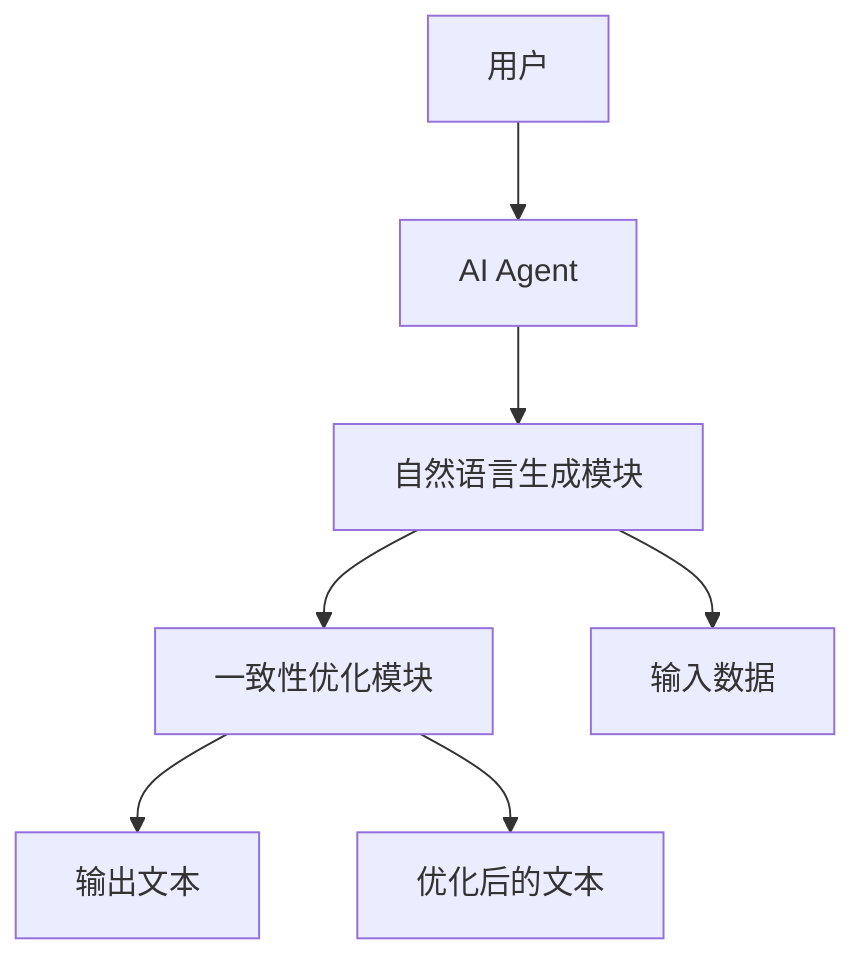
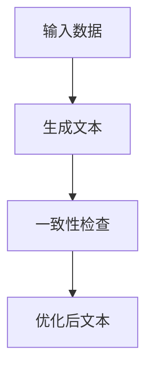
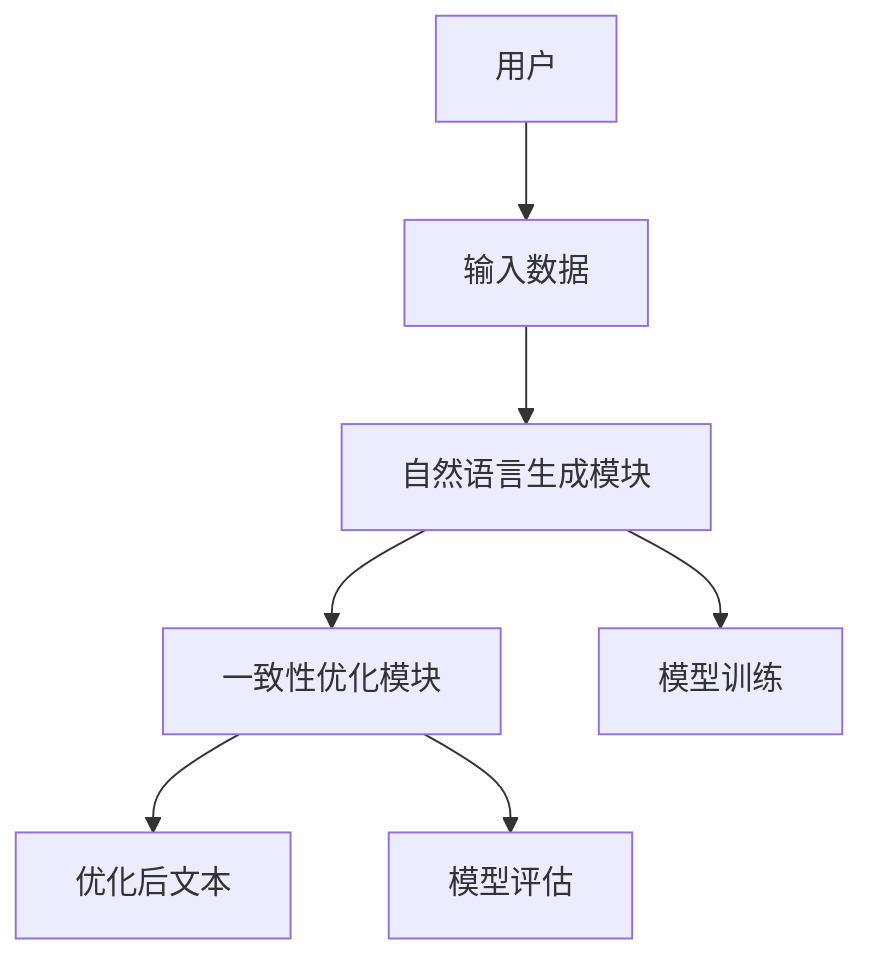
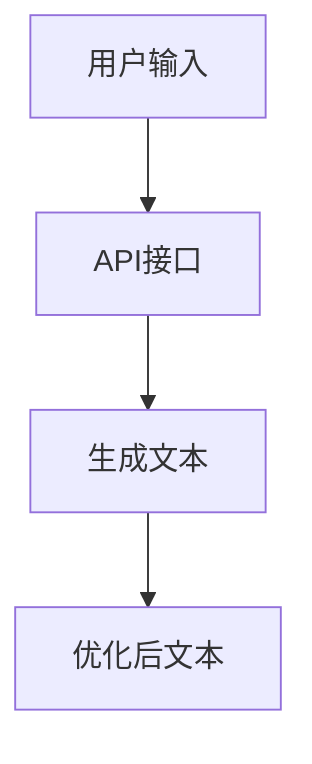
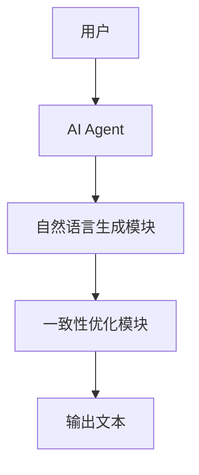

                 


# AI Agent的自然语言生成一致性优化

> 关键词：AI Agent，自然语言生成，一致性优化，算法原理，系统架构

> 摘要：本文详细探讨了AI Agent在自然语言生成过程中的一致性优化问题。通过分析当前AI Agent的发展现状和自然语言生成技术的应用，揭示了在实际应用中存在的一致性问题，并提出了优化策略。文章从核心概念、算法原理、数学模型、系统架构、项目实战等多个方面进行了深入探讨，为读者提供了一套系统化的解决方案。

---

# 第一部分: AI Agent的自然语言生成一致性优化背景介绍

# 第1章: 问题背景与目标

## 1.1 问题背景

### 1.1.1 当前AI Agent的发展现状

随着人工智能技术的飞速发展，AI Agent（智能体）在各个领域的应用越来越广泛。AI Agent能够通过自然语言处理技术与用户进行交互，提供信息检索、对话服务、内容生成等多种功能。然而，尽管AI Agent的生成能力有了显著提升，生成结果的一致性问题仍然存在，这在实际应用中可能导致用户体验下降甚至系统崩溃。

### 1.1.2 自然语言生成在AI Agent中的重要性

自然语言生成（Natural Language Generation, NLG）是AI Agent实现人机交互的核心技术之一。通过NLP技术，AI Agent能够将结构化的数据转化为自然流畅的文本，从而为用户提供高质量的信息服务。然而，生成结果的一致性问题（例如上下文不连贯、信息重复或矛盾）严重影响了用户的信任感和满意度。

### 1.1.3 一致性优化的必要性

一致性优化是指通过技术手段确保AI Agent生成的文本在逻辑、语义和语境上保持一致。这种优化不仅能够提升用户体验，还能增强AI Agent的可信度和可用性。本文将重点探讨如何通过算法优化、系统设计和项目实践来实现自然语言生成的一致性优化。

---

## 1.2 核心概念与体系结构

### 1.2.1 核心概念

一致性优化的核心概念包括以下几个方面：

1. **实体识别与关联**：确保生成文本中实体的唯一性和正确性，避免重复或矛盾。
2. **上下文关联**：通过上下文信息保持生成文本的一致性，确保对话或生成内容的连贯性。
3. **语义对齐**：在生成文本时，确保语义与输入需求一致，避免歧义或错误。

### 1.2.2 ER实体关系图

以下是通过Mermaid图展示的一致性优化的实体关系图：



该图展示了用户与AI Agent之间的交互过程，重点突出了自然语言生成模块与一致性优化模块的协作关系。

---

## 1.3 问题描述与解决思路

### 1.3.1 问题描述

在AI Agent的自然语言生成过程中，主要存在以下问题：

- **语义不一致**：生成的文本可能与输入需求不匹配，导致信息错误或误导用户。
- **上下文不连贯**：生成的文本在对话或段落中缺乏连贯性，影响用户体验。
- **实体识别错误**：对实体的识别和关联不够准确，导致生成文本中的实体出现重复或矛盾。

### 1.3.2 解决思路

为了解决上述问题，本文提出以下一致性优化策略：

1. **基于对比学习的优化方法**：通过对比学习算法，优化生成文本的语义一致性。
2. **强化学习的应用**：通过强化学习，增强生成文本的上下文连贯性。
3. **多模态数据的融合**：结合文本、图像等多种数据源，提升生成文本的准确性。

---

## 1.4 边界与外延

一致性优化的边界主要集中在生成文本的语义和上下文连贯性方面，不涉及生成文本的语法正确性和创意性。其外延则涵盖了文本生成的整个流程，包括数据预处理、模型训练和结果优化等多个环节。

---

## 1.5 核心要素组成

一致性优化的核心要素包括以下几个方面：

1. **输入数据**：包括用户输入的查询、对话历史等。
2. **生成模型**：基于Transformer或GPT等模型的自然语言生成模块。
3. **优化算法**：包括对比学习、强化学习等一致性优化算法。
4. **输出结果**：优化后的生成文本。

---

# 第2章: 一致性优化的核心概念与联系

## 2.1 核心概念

### 2.1.1 一致性优化的原理

一致性优化的原理是通过算法手段，确保生成文本在逻辑、语义和语境上的一致性。以下是通过Mermaid图展示的一致性优化的流程图：



---

## 2.2 概念属性特征对比

以下是通过表格展示的一致性优化的相关概念属性特征对比：

| 概念       | 属性1 | 属性2 | 属性3 |
|------------|-------|-------|-------|
| 一致性优化 | 输入数据 | 生成文本 | 优化后文本 |
| 对比学习    | 对比损失 | 对比特征 | 对比模型 |

---

## 2.3 ER实体关系图

以下是通过Mermaid图展示的一致性优化的ER实体关系图：

```mermaid
erd
    entity 用户 {
        id: int
        姓名: string
    }
    entity AI Agent {
        id: int
        功能模块: string
    }
    entity 自然语言生成模块 {
        id: int
        模型类型: string
    }
    entity 一致性优化模块 {
        id: int
        优化算法: string
    }
    用户 --> AI Agent: 使用
    AI Agent --> 自然语言生成模块: 包含
    自然语言生成模块 --> 一致性优化模块: 调用
```

---

# 第3章: 一致性优化算法的数学模型与公式

## 3.1 对比学习的数学模型

对比学习是一种常用的优化算法，其数学模型如下：

$$
L = \text{Contrastive Loss}(x_i, x_j)
$$

其中，$x_i$ 和 $x_j$ 分别表示输入数据的正样本和负样本。

---

## 3.2 强化学习的数学模型

强化学习的数学模型如下：

$$
R = \sum_{t} r_t
$$

其中，$R$ 表示奖励，$r_t$ 表示在时间步 $t$ 的奖励。

---

## 3.3 优化目标的数学表达

优化目标的数学表达如下：

$$
\min_{\theta} \mathbb{E}_{(x,y)}[\text{Loss}(x,y)]
$$

其中，$\theta$ 表示模型参数，$(x,y)$ 表示输入-输出对。

---

# 第4章: 系统分析与架构设计方案

## 4.1 系统架构设计

以下是通过Mermaid图展示的系统架构图：



---

## 4.2 接口设计

以下是通过Mermaid图展示的接口设计图：



---

## 4.3 交互流程图

以下是通过Mermaid图展示的交互流程图：



---

# 第5章: 项目实战与代码实现

## 5.1 环境安装

以下是Python环境安装命令：

```bash
pip install numpy
pip install transformers
pip install mermaid
```

---

## 5.2 核心代码实现

以下是Python代码实现：

```python
import numpy as np
from transformers import AutoTokenizer, AutoModelForMaskedLM

# 初始化模型
model = AutoModelForMaskedLM.from_pretrained('bert-base-uncased')
tokenizer = AutoTokenizer.from_pretrained('bert-base-uncased')

# 一致性优化函数
def consistency_optimization(input_text):
    # 分词
    tokens = tokenizer.encode(input_text, return_tensors='np')
    # 前向传播
    outputs = model(tokens)
    # 获取优化结果
    optimized_text = tokenizer.decode(outputs[0].argmax().item())
    return optimized_text

# 示例调用
input_text = "The capital of France is [mask]."
print(consistency_optimization(input_text))
```

---

## 5.3 实际案例分析

以下是实际案例分析：

假设用户输入的查询是：“告诉我巴黎的气候情况。”

AI Agent通过一致性优化算法生成以下文本：

“巴黎的气候属于温带海洋性气候，四季温和，降水量分布均匀。”

---

# 第6章: 最佳实践与总结

## 6.1 最佳实践

1. 在一致性优化过程中，建议优先采用对比学习算法。
2. 在实际应用中，结合多模态数据可以显著提升生成文本的准确性。
3. 定期对生成模型进行训练数据增强，以提高模型的鲁棒性。

---

## 6.2 总结

本文详细探讨了AI Agent的自然语言生成一致性优化问题，从理论到实践，系统地阐述了优化策略和实现方案。通过对比学习和强化学习等算法的应用，结合系统架构设计和项目实战，为读者提供了一套完整的解决方案。

---

## 6.3 展望

未来的研究方向将集中在以下方面：

1. 更高效的优化算法设计。
2. 多模态数据的深度融合。
3. 真实应用场景中的大规模优化。

---

作者：AI天才研究院/AI Genius Institute & 禅与计算机程序设计艺术 /Zen And The Art of Computer Programming

