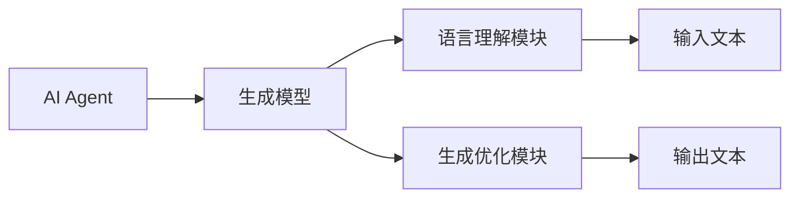
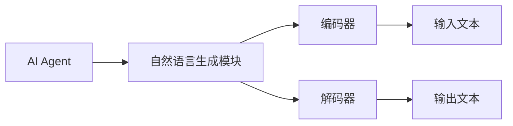
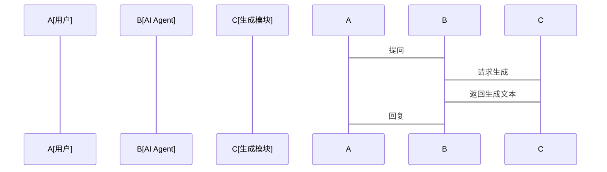

                 


# AI Agent的自然语言生成质量优化

## 关键词：AI Agent, 自然语言生成, 质量优化, 深度学习, NLP

## 摘要：  
本文深入探讨了AI Agent在自然语言生成（NLP）中的质量优化问题，分析了当前生成模型的挑战与解决方案，结合算法原理与实际案例，提出了优化策略。

---

# 第一部分: AI Agent的自然语言生成质量优化背景与概念

## 第1章: AI Agent与自然语言生成概述

### 1.1 AI Agent的基本概念
#### 1.1.1 AI Agent的定义与特点
AI Agent是具有感知、推理、规划和行动能力的智能体，具备主动性、反应性和社会性。

#### 1.1.2 自然语言生成的基本原理
自然语言生成是将结构化数据转化为自然语言文本的过程，涉及编码、解码和生成三个阶段。

#### 1.1.3 AI Agent在自然语言生成中的作用
AI Agent通过理解和分析输入，生成符合语境和用户需求的自然语言输出。

### 1.2 自然语言生成的质量优化问题
#### 1.2.1 自然语言生成的常见问题
包括语法错误、内容不相关、语义不明确等问题。

#### 1.2.2 质量优化的目标与挑战
目标是提高生成文本的准确性和流畅性，挑战包括模型的泛化能力和数据质量。

#### 1.2.3 质量优化的边界与外延
明确优化的范围和应用领域，避免过度优化。

### 1.3 本章小结

---

# 第二部分: AI Agent的自然语言生成核心概念与联系

## 第2章: AI Agent与自然语言生成的核心概念

### 2.1 AI Agent的原理与实现
#### 2.1.1 AI Agent的感知与决策机制
通过感知环境信息，进行分析和决策，驱动生成过程。

#### 2.1.2 自然语言生成的模型选择
选择适合的模型，如GPT系列，考虑生成效果和计算资源。

#### 2.1.3 AI Agent与生成模型的结合
AI Agent利用生成模型进行文本生成，实现与用户的交互。

### 2.2 自然语言生成的质量评估指标
#### 2.2.1 基于语言学的评估指标
如BLEU、ROUGE等，衡量生成文本的质量。

#### 2.2.2 基于任务的评估指标
通过实际任务效果评估生成质量。

#### 2.2.3 综合评估指标的对比分析
结合多种指标，全面评估生成质量。

### 2.3 AI Agent与生成模型的实体关系图


### 2.4 本章小结

---

# 第三部分: 自然语言生成算法原理与优化方法

## 第3章: 自然语言生成的算法原理

### 3.1 基于Transformer的生成模型
#### 3.1.1 Transformer模型的基本结构
包括编码器和解码器，利用自注意力机制处理序列数据。

#### 3.1.2 解码器的生成机制
通过自回归方式逐词生成文本。

#### 3.1.3 注意力机制的作用
提升模型对上下文的理解能力，生成相关文本。

### 3.2 GPT系列模型的实现原理
#### 3.2.1 GPT模型的训练目标
最大化条件概率，生成上下文相关的文本。

#### 3.2.2 生成过程的数学模型
$$ P(y|x) = \prod_{i=1}^{n} P(y_i|y_{<i}, x) $$

#### 3.2.3 模型的优化策略
采用大规模数据训练和分布式计算，提升生成质量。

### 3.3 自然语言生成的质量优化算法
#### 3.3.1 基于奖励的优化方法
通过人类反馈，调整生成模型的奖励机制。

#### 3.3.2 贪婪搜索与束搜索
优化生成过程，提升生成结果的质量。

---

# 第四部分: 系统分析与架构设计方案

## 第4章: 系统功能设计与架构

### 4.1 系统功能设计
#### 4.1.1 领域模型设计
构建领域模型，明确系统功能模块。

#### 4.1.2 系统架构设计
采用微服务架构，模块化设计，提升系统扩展性。

### 4.2 系统架构设计


### 4.3 系统接口设计
定义清晰的接口规范，确保模块间高效协作。

### 4.4 系统交互设计


### 4.5 本章小结

---

# 第五部分: 项目实战

## 第5章: 项目实战与案例分析

### 5.1 环境安装与配置
安装必要的库和框架，如Python、TensorFlow等。

### 5.2 系统核心实现源代码
```python
import tensorflow as tf
from tensorflow.keras import layers

# 定义编码器
def encoder():
    inputs = layers.Input(shape=(None, 100))
    x = layers.SimpleRNN(64)(inputs)
    return tf.keras.Model(inputs=inputs, outputs=x)

# 定义解码器
def decoder():
    inputs = layers.Input(shape=(None, 64))
    x = layers.Dense(64, activation='relu')(inputs)
    x = layers.RepeatVector(10)(x)
    x = layers.SimpleRNN(64, return_sequences=True)(x)
    x = layers.Dense(10, activation='softmax')(x)
    return tf.keras.Model(inputs=inputs, outputs=x)

# 组合模型
encoder_model = encoder()
decoder_model = decoder()
```

### 5.3 代码应用解读与分析
详细解读代码实现，分析模型的结构和工作原理。

### 5.4 实际案例分析
通过具体案例，展示优化后的生成效果和改进之处。

### 5.5 项目小结

---

# 第六部分: 最佳实践与总结

## 第6章: 最佳实践与总结

### 6.1 最佳实践
- 定期更新模型，引入新数据
- 监控生成质量，及时调整优化策略
- 组合使用多种优化方法

### 6.2 小结
总结全文内容，强调优化生成质量的重要性。

### 6.3 注意事项
注意数据隐私和模型安全，避免滥用AI Agent。

### 6.4 拓展阅读
推荐相关领域的书籍和论文，供读者深入学习。

---

# 作者：AI天才研究院/AI Genius Institute & 禅与计算机程序设计艺术 /Zen And The Art of Computer Programming

