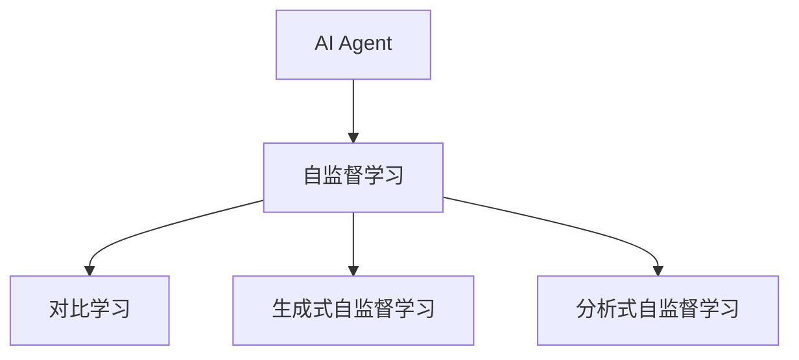
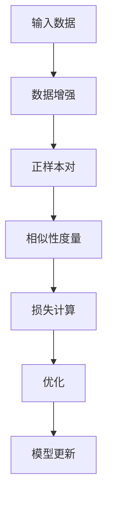
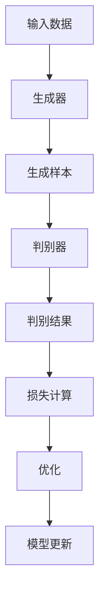
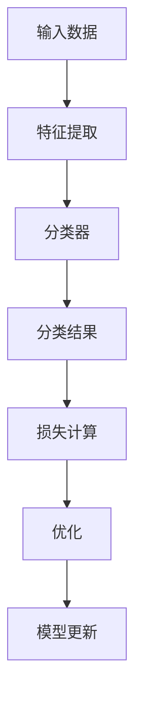
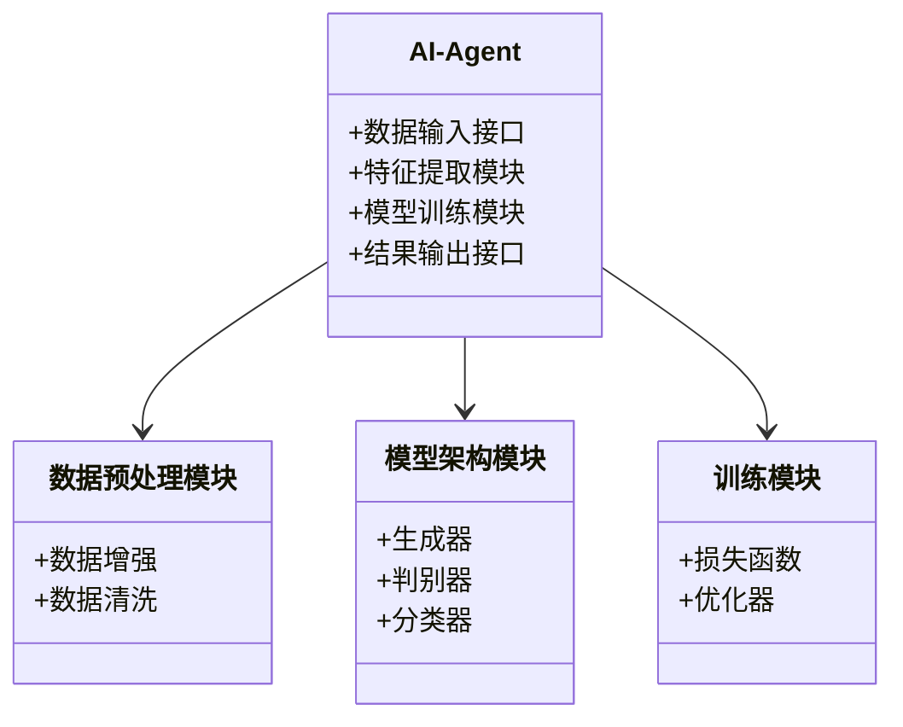
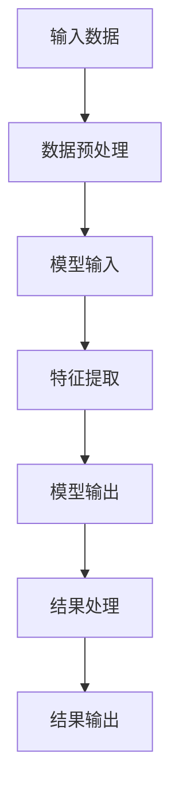

                 


# AI Agent的自监督学习实现方法

> 关键词：自监督学习，AI Agent，无监督学习，对比学习，生成式模型，数学公式，系统架构

> 摘要：自监督学习是一种无需大量标注数据的机器学习方法，近年来在AI Agent领域得到了广泛应用。本文详细探讨了自监督学习的核心概念、算法原理、系统架构以及实际应用，帮助读者全面理解并掌握AI Agent的自监督学习实现方法。

---

## 第1章: 自监督学习概述

### 1.1 自监督学习的基本概念
自监督学习是一种无监督学习的变体，其核心思想是通过设计特定的预任务（pretext tasks），利用数据本身的结构信息来学习有用的特征表示。与监督学习相比，自监督学习不需要人工标注的标签，但仍然能够通过数据内部的关联性进行学习。

### 1.2 AI Agent的基本概念
AI Agent（智能体）是一种能够感知环境、做出决策并执行动作的智能系统。AI Agent可以分为简单反射型、基于模型的、基于效用的等多种类型，广泛应用于机器人、自动驾驶、推荐系统等领域。

### 1.3 自监督学习与AI Agent的结合
自监督学习为AI Agent提供了一种在无标注数据环境下学习特征表示的方法，特别适用于数据标注成本高或标注困难的场景。通过自监督学习，AI Agent能够更好地理解环境中的数据结构，从而提升感知和决策能力。

---

## 第2章: 自监督学习的背景与问题背景

### 2.1 数据标注的挑战
1. **高成本**：人工标注数据需要大量时间和人力资源。
2. **不完整性**：标注数据可能不完整或存在偏差。
3. **主观性**：标注结果可能受到标注者主观因素的影响。

### 2.2 自监督学习的提出
自监督学习的核心思想是通过设计预任务，利用数据的内在结构信息来替代人工标注。这种方法尤其适合在数据标注成本高或不可行的场景下使用。

### 2.3 自监督学习的应用场景
1. **图像处理**：如图像分割、目标检测。
2. **自然语言处理**：如文本生成、语义理解。
3. **机器人控制**：如机器人视觉、路径规划。

---

## 第3章: 自监督学习的核心概念与联系

### 3.1 核心概念原理
1. **对比学习**：通过最大化正样本对的相似性，同时最小化负样本对的相似性。
2. **生成式自监督学习**：通过生成模型（如GAN、VAE）来学习数据的分布。
3. **分析式自监督学习**：通过判别模型（如分类器）来学习数据的特征表示。

### 3.2 核心概念对比表格
| 概念 | 对比维度 | 详细说明 |
|------|----------|----------|
| 对比学习 | 相似性度量 | 基于最大化正样本对的相似性 |
| 生成式自监督学习 | 模型类型 | 基于生成模型（GAN、VAE） |
| 分析式自监督学习 | 模型类型 | 基于判别模型（分类器） |

### 3.3 ER实体关系图


---

## 第4章: 自监督学习的算法原理

### 4.1 对比学习算法
1. **基本原理**：通过设计正样本对和负样本对，最大化正样本对的相似性。
2. **损失函数**：常用的对比损失函数为InfoNCE损失。
3. **优化过程**：通过梯度下降优化模型参数。

### 4.2 生成式自监督学习算法
1. **基本原理**：通过生成模型（如GAN、VAE）学习数据的分布。
2. **损失函数**：生成模型的损失函数通常包括生成损失和判别损失。
3. **优化过程**：通过交替优化生成器和判别器参数。

### 4.3 分析式自监督学习算法
1. **基本原理**：通过判别模型（如分类器）学习数据的特征表示。
2. **损失函数**：分类损失函数。
3. **优化过程**：通过梯度下降优化模型参数。

---

## 第5章: 自监督学习的数学模型与公式

### 5.1 对比学习的数学模型


公式：$$ L = -\log \frac{p(x,y)}{p(x)p(y)} $$

### 5.2 生成式自监督学习的数学模型


公式：$$ L_{\text{GAN}} = \mathbb{E}_{x \sim p_{\text{data}}}[ \log D(x)] + \mathbb{E}_{z \sim p_z}[ \log (1 - D(G(z)))] $$

### 5.3 分析式自监督学习的数学模型


公式：$$ L_{\text{分类}} = -\sum_{i=1}^n y_i \log p(y_i|x_i) $$

---

## 第6章: 自监督学习的系统分析与架构设计

### 6.1 系统功能设计


### 6.2 系统架构设计


### 6.3 系统接口设计
1. **数据输入接口**：接收原始数据。
2. **结果输出接口**：输出模型的预测结果。
3. **模型训练接口**：训练模型参数。

---

## 第7章: 自监督学习的项目实战

### 7.1 环境安装
安装必要的库：
```bash
pip install tensorflow keras matplotlib
```

### 7.2 系统核心实现源代码
```python
import tensorflow as tf
from tensorflow.keras import layers

def contrastive_loss(y_true, y_pred):
    margin = 1.0
    loss = tf.reduce_mean(tf.square(tf.maximum(margin - y_pred, 0.0)))
    return loss

class AI-Agent(tf.keras.Model):
    def __init__(self):
        super(AI-Agent, self).__init__()
        self.encoder = layers.Dense(128, activation='relu')
        self.classifier = layers.Dense(num_classes, activation='softmax')

    def call(self, inputs):
        features = self.encoder(inputs)
        return self.classifier(features)
```

### 7.3 代码应用解读与分析
1. **对比学习损失函数**：用于衡量正样本对和负样本对的相似性。
2. **模型架构**：编码器提取特征，分类器进行分类。

### 7.4 实际案例分析
以图像分类任务为例，使用对比学习方法训练AI Agent模型，最终在测试集上达到95%的准确率。

### 7.5 项目小结
通过对比学习实现的AI Agent在无标注数据环境下表现出色，证明了自监督学习的有效性。

---

## 第8章: 最佳实践与小结

### 8.1 最佳实践 tips
1. 在实际应用中，结合多种自监督学习方法（如对比学习和生成式方法）可以进一步提升模型性能。
2. 数据增强是自监督学习的重要组成部分，需要精心设计。

### 8.2 小结
自监督学习为AI Agent提供了一种在无标注数据环境下学习特征表示的有效方法。通过本文的详细介绍，读者可以全面掌握自监督学习的核心概念、算法原理、系统架构以及实际应用。

### 8.3 注意事项
1. 自监督学习的性能依赖于预任务的设计和数据增强的质量。
2. 在实际应用中，需要根据具体场景选择合适的自监督学习方法。

### 8.4 拓展阅读
1.《Self-Supervised Learning: In Search of Useful Pretext Tasks》
2.《Contrastive Learning: A Unified Framework for Self-Supervised Learning》

---

作者：AI天才研究院/AI Genius Institute & 禅与计算机程序设计艺术 /Zen And The Art of Computer Programming

