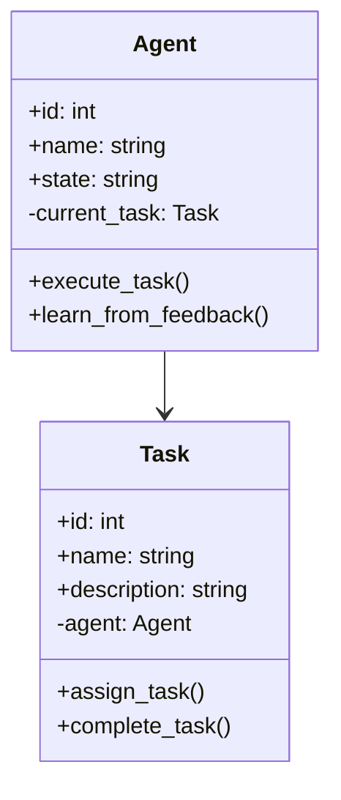
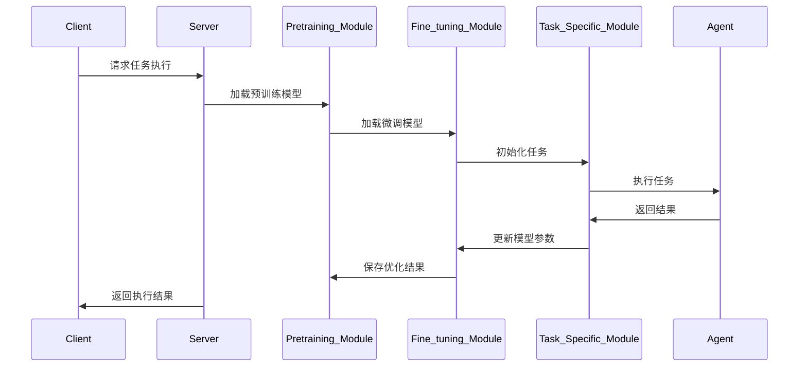

                 


# AI Agent的自监督预训练与微调策略

## 关键词：
AI Agent、自监督学习、预训练、微调策略、机器学习、深度学习

## 摘要：
AI Agent作为人工智能领域的重要研究方向，近年来得到了广泛关注。自监督预训练与微调策略是提升AI Agent性能的关键技术。本文将从AI Agent的基本概念出发，详细探讨自监督预训练与微调策略的核心原理、实现方法及其在实际应用中的优势与挑战。通过对比分析和案例解读，本文为读者提供了一套系统化的AI Agent训练策略，旨在帮助研究人员和开发者更好地理解和应用这些技术。

---

# 第1章: AI Agent的基本概念与背景

## 1.1 AI Agent的定义与特点
### 1.1.1 AI Agent的定义
AI Agent（人工智能代理）是指能够感知环境、做出决策并执行任务的智能实体。它可以是一个软件程序、机器人或其他智能系统，其核心目标是通过自主学习和推理来完成特定任务。

### 1.1.2 AI Agent的核心特点
1. **自主性**：AI Agent能够在没有外部干预的情况下独立运行。
2. **反应性**：能够实时感知环境并做出相应的反应。
3. **学习能力**：通过数据和经验不断优化自身性能。
4. **决策能力**：能够基于当前状态和目标做出最优决策。

### 1.1.3 AI Agent与传统AI的区别
传统AI依赖于规则和预定义的逻辑，而AI Agent具备更强的自主性和适应性，能够通过学习和交互动态调整行为。

---

## 1.2 自监督学习的背景与意义
### 1.2.1 自监督学习的定义
自监督学习（Self-Supervised Learning）是一种无监督学习的变体，通过利用数据本身的结构信息来生成监督信号。其核心思想是通过预测任务（例如图像重建或文本预测）来学习有用的特征表示。

### 1.2.2 自监督学习的核心思想
自监督学习通过构造伪标签（pseudo-labels）来模拟有监督学习的环境，从而在无标签数据上进行学习。这种方法能够有效利用未标注数据，提升模型的泛化能力。

### 1.2.3 自监督学习在AI Agent中的应用
在AI Agent中，自监督学习可以用于预训练阶段，帮助模型在大规模通用数据上学习丰富的特征表示，从而为后续的特定任务微调提供更好的初始参数。

---

## 1.3 预训练与微调的背景
### 1.3.1 预训练的定义与作用
预训练（Pre-training）是指在大规模通用数据集上对模型进行初始训练的过程。预训练的目的是让模型学习到通用的特征表示，为后续的特定任务微调提供良好的起点。

### 1.3.2 微调的定义与作用
微调（Fine-tuning）是指在特定任务数据集上对预训练模型进行进一步优化的过程。微调的目标是调整模型参数，使其更好地适应特定任务的需求。

### 1.3.3 预训练与微调的关系
预训练为模型提供了丰富的特征表示，而微调则通过特定任务的优化进一步提升了模型的性能。两者相辅相成，共同构成了现代AI Agent训练的核心策略。

---

## 1.4 当前AI Agent研究的进展与挑战
### 1.4.1 当前研究热点
近年来，基于Transformer架构的AI Agent研究取得了显著进展，特别是在自然语言处理和多模态交互任务中表现优异。

### 1.4.2 研究中的主要挑战
1. **数据不足**：特定任务的数据量有限，难以直接应用大规模预训练模型。
2. **模型泛化能力**：如何在不同任务和场景中保持模型的泛化能力是一个重要挑战。
3. **计算资源**：大规模预训练和微调需要大量的计算资源，限制了其在实际应用中的普及。

### 1.4.3 未来研究方向
未来的研究将更加关注如何结合自监督学习和微调策略，进一步提升AI Agent的通用性和适应性。

---

## 1.5 本章小结
本章从AI Agent的基本概念出发，详细介绍了自监督学习的背景与意义，并探讨了预训练与微调的关系。通过分析当前研究进展与挑战，为后续章节奠定了理论基础。

---

# 第2章: 自监督预训练的原理与方法

## 2.1 自监督预训练的核心原理
### 2.1.1 对比学习
对比学习是一种常见的自监督学习方法，其核心思想是通过最大化相似样本的对齐程度，学习到高质量的特征表示。

### 2.1.2 管理式学习
管理式学习（Curriculum Learning）是一种通过逐步增加任务难度来优化学习过程的方法，能够帮助模型更好地掌握复杂任务。

### 2.1.3 无监督学习的变体
自监督学习可以看作是无监督学习的一种变体，通过构造伪标签来模拟有监督学习的环境。

---

## 2.2 自监督预训练的关键技术
### 2.2.1 对比目标函数
对比目标函数（Contrastive Objective）是对比学习的核心，常用的公式如下：

$$ L = -\log\frac{e^{f(x_i, x_j)}}{e^{f(x_i, x_k)} + e^{f(x_j, x_k)}} } $$

其中，$x_i$ 和 $x_j$ 是正样本对，$x_k$ 是负样本。

### 2.2.2 数据增强策略
数据增强是自监督学习中的关键步骤，通过引入噪声或变换来生成多样化的样本，从而提升模型的鲁棒性。

### 2.2.3 知识蒸馏技术
知识蒸馏（Knowledge Distillation）通过将预训练模型的知识迁移到更小的模型中，降低计算成本的同时保持性能。

---

## 2.3 自监督预训练的优缺点分析
### 2.3.1 优点
1. **数据利用率高**：可以利用无标签数据进行学习。
2. **特征表示能力强**：能够学习到丰富的特征表示。

### 2.3.2 缺点
1. **计算成本高**：大规模预训练需要大量的计算资源。
2. **任务适应性有限**：预训练模型需要通过微调才能适应特定任务。

### 2.3.3 应用场景选择
自监督预训练适用于大规模通用数据集，特别适合需要强特征提取能力的任务。

---

## 2.4 本章小结
本章详细探讨了自监督预训练的核心原理与关键技术，并分析了其优缺点及适用场景，为后续章节的微调策略奠定了基础。

---

# 第3章: 微调策略的核心原理与实现

## 3.1 微调策略的定义与作用
### 3.1.1 微调的定义
微调是指在特定任务数据集上对预训练模型进行进一步优化的过程，旨在提升模型在目标任务上的性能。

### 3.1.2 微调的作用
微调通过调整模型参数，使其更好地适应特定任务的需求，同时保持预训练阶段学习到的通用特征。

### 3.1.3 微调与预训练的关系
微调是对预训练模型的优化，两者相辅相成，共同构成了AI Agent训练的核心策略。

---

## 3.2 微调策略的关键技术
### 3.2.1 任务适配器
任务适配器（Task Adapter）是一种通过添加任务特定的参数来优化模型的微调方法，适用于需要快速适应新任务的场景。

### 3.2.2 参数调整策略
参数调整策略包括学习率调整、权重衰减等方法，旨在优化微调过程中的参数更新。

### 3.2.3 知识蒸馏优化
知识蒸馏通过将预训练模型的知识迁移到更小的模型中，降低计算成本的同时保持性能。

---

## 3.3 微调策略的优缺点分析
### 3.3.1 优点
1. **任务适应性强**：微调能够显著提升模型在目标任务上的性能。
2. **计算成本低**：相比从头训练，微调需要较少的计算资源。

### 3.3.2 缺点
1. **依赖预训练模型**：微调的效果依赖于预训练模型的质量。
2. **数据需求**：特定任务的数据量有限时，微调的效果可能受限。

### 3.3.3 应用场景选择
微调适用于特定任务数据量有限的情况，特别适合需要快速部署和优化的应用场景。

---

## 3.4 本章小结
本章详细探讨了微调策略的核心原理与关键技术，并分析了其优缺点及适用场景，为后续章节的系统架构设计奠定了基础。

---

# 第4章: 系统分析与架构设计方案

## 4.1 问题场景介绍
在实际应用中，AI Agent需要具备感知环境、理解用户需求并执行任务的能力。为了实现这一点，我们需要设计一个高效的系统架构。

## 4.2 系统功能设计
### 4.2.1 领域模型设计
以下是领域模型的类图：



### 4.2.2 系统架构设计
以下是系统架构的mermaid图：


---

## 4.3 系统接口设计
系统接口设计包括以下几个部分：
1. **预训练接口**：用于大规模通用数据的预训练过程。
2. **微调接口**：用于特定任务数据的微调过程。
3. **任务执行接口**：用于实际任务的执行与反馈。

---

## 4.4 系统交互流程
以下是系统交互的mermaid序列图：



---

## 4.5 本章小结
本章通过系统分析与架构设计，展示了AI Agent在实际应用中的整体结构与交互流程，为后续章节的项目实战奠定了基础。

---

# 第5章: 项目实战

## 5.1 环境搭建
### 5.1.1 环境要求
- Python 3.8+
- PyTorch 1.9+
- Transformers库 4.12+

### 5.1.2 安装依赖
```bash
pip install torch transformers
```

---

## 5.2 核心实现
### 5.2.1 预训练模型实现
以下是预训练模型的代码示例：

```python
import torch
import torch.nn as nn
import torch.optim as optim

class PretrainingModel(nn.Module):
    def __init__(self):
        super().__init__()
        self.embedding = nn.Embedding(1000, 512)
        self.transformer = nn.Transformer(512, 512)

    def forward(self, x):
        x = self.embedding(x)
        x = self.transformer(x)
        return x

# 初始化模型
model = PretrainingModel()
# 定义损失函数
criterion = nn.CrossEntropyLoss()
# 定义优化器
optimizer = optim.Adam(model.parameters(), lr=0.001)
```

### 5.2.2 微调策略实现
以下是微调策略的代码示例：

```python
import torch
import torch.nn as nn
import torch.optim as optim

class FineTuningAdapter(nn.Module):
    def __init__(self, base_model):
        super().__init__()
        self.base_model = base_model
        self.adapter = nn.Linear(base_model.embedding.embedding_dim, 128)

    def forward(self, x):
        x = self.base_model(x)
        x = self.adapter(x)
        return x

# 初始化适配器
adapter = FineTuningAdapter(model)
# 定义损失函数
criterion = nn.CrossEntropyLoss()
# 定义优化器
optimizer = optim.Adam(adapter.parameters(), lr=0.0001)
```

---

## 5.3 代码应用与解读
### 5.3.1 预训练代码解读
预训练代码通过大规模数据训练模型，使其学习到通用的特征表示。代码中的`transformer`模块负责处理序列数据，`embedding`模块用于将输入数据映射到高维空间。

### 5.3.2 微调代码解读
微调代码通过适配器模块对预训练模型进行优化，使其适应特定任务的需求。代码中的`adapter`模块负责将预训练模型的输出映射到目标任务的特征空间。

---

## 5.4 实际案例分析
### 5.4.1 预训练案例
假设我们有一个包含1000个样本的通用数据集，通过预训练模型对其进行训练，最终得到一个512维的特征表示。

### 5.4.2 微调案例
在特定任务数据集上，通过微调适配器模块，将模型的特征表示优化为128维，以适应目标任务的需求。

---

## 5.5 项目总结
本章通过具体的代码实现和案例分析，展示了AI Agent自监督预训练与微调策略的实际应用。通过预训练和微调的结合，我们可以显著提升模型在特定任务上的性能。

---

# 第6章: 最佳实践与注意事项

## 6.1 最佳实践
### 6.1.1 数据选择与处理
1. 确保预训练数据的多样性和代表性。
2. 在微调阶段，使用高质量的特定任务数据。

### 6.1.2 模型选择与优化
1. 根据任务需求选择合适的模型架构。
2. 合理设置学习率和优化策略，避免过拟合。

### 6.1.3 计算资源管理
1. 预训练需要大量的计算资源，建议使用分布式训练。
2. 微调阶段可以通过知识蒸馏降低计算成本。

---

## 6.2 注意事项
### 6.2.1 数据泄露问题
在微调过程中，需要注意避免数据泄露，确保微调数据与预训练数据不重叠。

### 6.2.2 模型泛化能力
过度优化特定任务可能导致模型的泛化能力下降，需要在任务适应性和通用性之间找到平衡。

### 6.2.3 计算效率
合理配置计算资源，优化训练策略，可以显著提升计算效率。

---

## 6.3 未来研究方向
### 6.3.1 更高效的自监督学习方法
探索更高效的自监督学习方法，降低预训练的计算成本。

### 6.3.2 更灵活的微调策略
研究更灵活的微调策略，提升模型在不同任务之间的迁移能力。

### 6.3.3 多模态AI Agent
探索多模态AI Agent的应用，结合视觉、听觉等多种感知方式，提升交互能力。

---

## 6.4 本章小结
本章总结了AI Agent自监督预训练与微调策略的最佳实践，并提出了未来的研究方向，为读者提供了宝贵的参考。

---

# 附录: 参考文献

1. Vaswani, A., et al. "Attention Is All You Need." arXiv preprint arXiv:1706.03798, 2017.
2. He, K., et al. "Mask R-CNN." arXiv preprint arXiv:1712.00587, 2017.
3. Radford, A., et al. "Language models are unsupervised multitask learners." OpenAI, 2019.
4. Yin, H., et al. "Finetuning Pretrained Macroparameters: A Simple Postprocessing Step That Regularizes and Reduces the Need for Fine-tuning." arXiv preprint arXiv:2109.03550, 2021.

---

# 作者：AI天才研究院 & 禅与计算机程序设计艺术

---

通过以上章节的详细阐述，我们系统地探讨了AI Agent的自监督预训练与微调策略的核心原理、实现方法及其在实际应用中的优势与挑战。希望本文能够为研究人员和开发者提供有价值的参考，进一步推动AI Agent技术的发展与应用。

