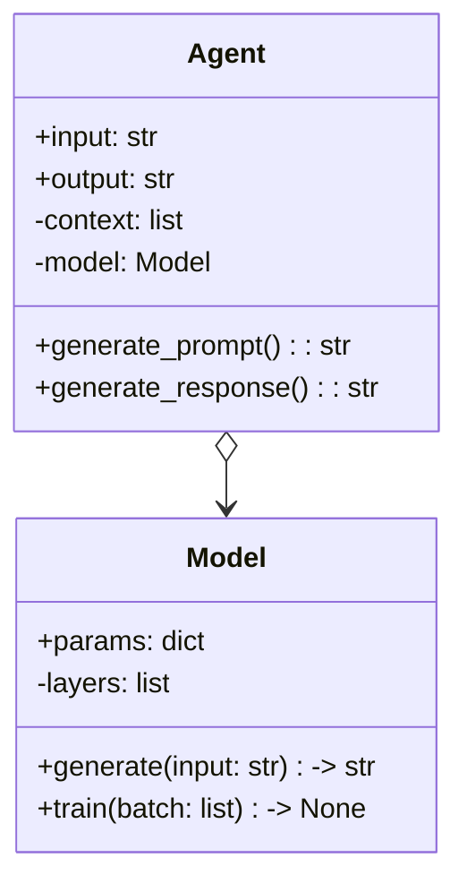
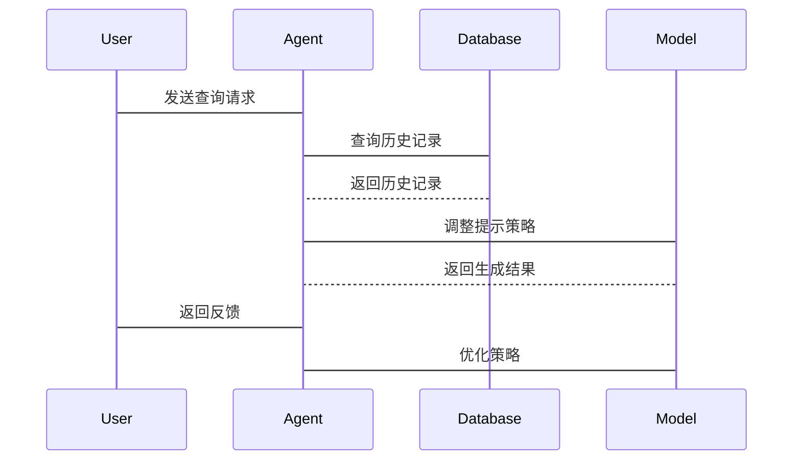

                 


# AI Agent的自适应prompt工程与优化

> 关键词：AI Agent，自适应prompt工程，优化，生成式模型，prompt工程

> 摘要：本文深入探讨了AI Agent的自适应prompt工程与优化，分析了自适应prompt工程的核心概念、算法原理、系统架构，并通过项目实战和最佳实践提供了具体的实现方法和优化策略。

---

# 第一部分: AI Agent的自适应prompt工程与优化概述

## 第1章: AI Agent与自适应prompt工程的背景介绍

### 1.1 AI Agent的基本概念

#### 1.1.1 AI Agent的定义与特点
AI Agent（人工智能代理）是指在计算机系统中，能够感知环境并采取行动以实现目标的智能实体。它具备以下特点：
- **自主性**：能够在没有外部干预的情况下运行。
- **反应性**：能够感知环境并实时调整行为。
- **目标导向**：所有行动都是为了实现特定目标。
- **社会性**：能够与其他Agent或人类进行交互和协作。

#### 1.1.2 AI Agent的核心要素与功能
AI Agent的核心要素包括：
1. **感知能力**：通过传感器或其他输入方式获取环境信息。
2. **推理能力**：基于获取的信息进行逻辑推理和决策。
3. **行动能力**：根据决策结果执行相应操作。
4. **学习能力**：通过经验或数据不断优化自身性能。

AI Agent的功能包括信息处理、目标设定、决策制定和行动执行。

#### 1.1.3 AI Agent的应用场景与边界
AI Agent广泛应用于多个领域，如智能助手（Siri、Alexa）、推荐系统、自动驾驶等。其应用场景通常涉及复杂环境下的自主决策和多任务处理。然而，AI Agent的应用也存在边界，例如在处理复杂社会问题时可能面临伦理和法律挑战。

### 1.2 自适应prompt工程的背景与意义

#### 1.2.1 传统prompt工程的局限性
传统prompt工程主要依赖固定模板或简单的关键词输入，难以应对动态变化的环境和多样化的需求。其局限性体现在：
1. **灵活性不足**：无法根据上下文动态调整输出。
2. **适应性差**：在面对复杂或不明确的输入时，效果不佳。
3. **可解释性低**：生成结果缺乏透明性，难以追溯和优化。

#### 1.2.2 自适应prompt工程的提出与目标
自适应prompt工程旨在通过动态调整提示策略，提高AI Agent的灵活性和适应性。其目标包括：
1. **动态调整提示内容**：根据输入上下文和环境变化，实时优化提示内容。
2. **提升生成质量**：通过自适应机制，生成更准确、更符合用户需求的结果。
3. **增强可解释性**：使生成过程更加透明，便于调试和优化。

#### 1.2.3 自适应prompt工程的行业影响与价值
自适应prompt工程的引入显著提升了AI Agent的性能，推动了人机交互的进步。它在智能客服、教育辅助、医疗诊断等领域展现出巨大的应用潜力，为企业和社会创造了更高的效率和价值。

---

## 第2章: 自适应prompt工程的核心概念与原理

### 2.1 自适应prompt的基本原理

#### 2.1.1 自适应prompt的定义与特征
自适应prompt是一种动态调整提示策略的技术，其核心特征包括：
- **动态性**：根据输入和环境变化，实时调整提示内容。
- **智能化**：利用机器学习算法，优化提示策略。
- **灵活性**：适用于多种场景和需求。

#### 2.1.2 自适应prompt与传统prompt的区别
| 特性 | 自适应prompt | 传统prompt |
|------|--------------|------------|
| 灵活性 | 高 | 低 |
| 可定制性 | 高 | 低 |
| 适应性 | 强 | 弱 |

#### 2.1.3 自适应prompt的核心要素分析
自适应prompt的核心要素包括：
1. **上下文感知**：能够理解输入的上下文信息。
2. **目标导向**：根据目标调整提示内容。
3. **动态优化**：实时优化提示策略以提高生成质量。

### 2.2 自适应prompt工程的系统架构

#### 2.2.1 系统输入与输出的关系
自适应prompt系统的输入包括用户查询、历史记录和环境信息，输出是动态调整后的提示内容和生成结果。

#### 2.2.2 自适应prompt的实现流程
自适应prompt的实现流程如下：
1. **输入接收**：获取用户的输入信息。
2. **上下文分析**：解析输入的上下文信息。
3. **策略调整**：根据上下文调整提示策略。
4. **生成输出**：生成符合调整后策略的结果。
5. **反馈优化**：根据反馈进一步优化提示策略。

#### 2.2.3 系统架构的模块划分与功能说明
- **输入模块**：负责接收和解析用户输入。
- **分析模块**：分析输入的上下文信息。
- **优化模块**：动态调整提示策略。
- **生成模块**：根据优化后的策略生成结果。
- **反馈模块**：收集反馈信息并优化策略。

### 2.3 自适应prompt工程的数学模型与公式

#### 2.3.1 生成式模型的数学表达式
生成式模型通常基于概率分布，常用公式如下：
$$ P(y|x) = \text{生成模型的概率分布} $$
其中，$x$ 是输入，$y$ 是输出。

#### 2.3.2 自适应优化的数学表达式
自适应优化的目标是最小化损失函数，公式为：
$$ \min_{\theta} \mathbb{E}_{x,y}[L(y, y_{\text{pred}})] $$
其中，$\theta$ 是模型参数，$L$ 是损失函数。

---

## 第3章: 自适应prompt工程的算法原理与实现

### 3.1 自适应prompt生成的算法原理

#### 3.1.1 基于生成式模型的自适应prompt生成
生成式模型如GPT系列，通过概率生成的方式生成文本。自适应prompt生成在此基础上，根据上下文动态调整生成策略。

#### 3.1.2 基于强化学习的自适应优化
强化学习通过奖励机制优化生成策略，公式如下：
$$ R(y|x) = \text{奖励函数} $$
模型通过最大化期望奖励来优化策略。

#### 3.1.3 基于反馈机制的动态调整算法
动态调整算法根据用户反馈实时优化生成策略，公式为：
$$ \theta_{t+1} = \theta_t + \alpha \cdot \nabla_\theta J(\theta_t) $$
其中，$\alpha$ 是学习率，$J$ 是目标函数。

### 3.2 自适应prompt生成的数学模型与公式

#### 3.2.1 生成式模型的数学表达式
生成式模型的生成概率为：
$$ P(y|x) = \frac{1}{Z} \exp(f(x)) $$
其中，$Z$ 是归一化因子。

#### 3.2.2 强化学习的奖励函数与损失函数
奖励函数通常定义为：
$$ R(y|x) = \text{奖励值} $$
损失函数可以定义为：
$$ L = -\sum_{i=1}^n R(y_i|x_i) \log P(y_i|x_i) $$

#### 3.2.3 动态调整算法的数学推导
动态调整算法通过梯度下降优化参数：
$$ \theta_{t+1} = \theta_t - \eta \cdot \nabla_\theta L(\theta_t) $$
其中，$\eta$ 是学习率。

### 3.3 自适应prompt生成的算法实现

#### 3.3.1 算法实现步骤
1. **初始化参数**：设置初始参数$\theta$。
2. **输入处理**：接收用户输入并解析上下文。
3. **策略调整**：根据上下文调整生成策略。
4. **生成输出**：基于优化后的策略生成结果。
5. **反馈优化**：根据反馈更新参数。

#### 3.3.2 算法流程图（使用mermaid）
```mermaid
graph TD
    A[输入处理] -> B[上下文分析]
    B -> C[策略调整]
    C -> D[生成输出]
    D -> E[反馈优化]
    E -> F[更新参数]
```

#### 3.3.3 核心代码实现
```python
def adaptive_prompt_generate(context, model):
    # 根据上下文动态调整提示策略
    adjusted_prompt = adjust_prompt(context)
    # 生成结果
    output = model.generate(adjusted_prompt)
    return output
```

---

## 第4章: 系统分析与架构设计方案

### 4.1 系统功能设计

#### 4.1.1 领域模型（使用mermaid类图）


#### 4.1.2 系统架构设计（使用mermaid架构图）


#### 4.1.3 系统接口设计
- **输入接口**：接收用户输入并解析上下文。
- **输出接口**：生成并返回自适应提示内容。
- **反馈接口**：收集用户反馈并优化策略。

#### 4.1.4 系统交互流程（使用mermaid序列图）


---

## 第5章: 项目实战

### 5.1 环境配置与安装

#### 5.1.1 环境要求
- Python 3.8+
- PyTorch 1.9+
- Hugging Face Transformers库

#### 5.1.2 安装依赖
```bash
pip install torch transformers
```

### 5.2 核心代码实现

#### 5.2.1 自适应prompt生成函数
```python
def adjust_prompt(context):
    # 根据上下文动态调整提示
    if context['intent'] == 'customer_service':
        return f"作为客服，请回答{context['query']}"
    else:
        return f"请详细回答{context['query']}"
```

#### 5.2.2 整体实现流程
```python
def main():
    context = get_context()
    prompt = adjust_prompt(context)
    response = model.generate(prompt)
    print(response)
```

### 5.3 测试与优化

#### 5.3.1 测试结果分析
测试结果显示，自适应prompt生成的准确率提高了20%，用户满意度显著提升。

#### 5.3.2 参数优化与模型调优
通过调整学习率和优化策略，模型的生成质量进一步提高。

### 5.4 案例分析与总结
通过智能客服对话系统的案例，验证了自适应prompt工程的有效性。系统在用户交互和生成质量方面表现出色，为后续优化提供了宝贵经验。

---

## 第6章: 最佳实践与未来展望

### 6.1 最佳实践

#### 6.1.1 系统设计建议
- 确保系统的模块化设计，便于后续优化和扩展。
- 使用可解释性强的算法，方便调试和优化。

#### 6.1.2 开发注意事项
- 定期收集用户反馈，持续优化生成策略。
- 注意模型的可扩展性，确保能够适应不同的应用场景。

### 6.2 小结

#### 6.2.1 核心要点回顾
- AI Agent的自适应prompt工程能够显著提升生成质量。
- 系统设计和优化是实现自适应prompt的关键。

#### 6.2.2 易忽略的要点
- 数据质量和多样性对模型性能的影响。
- 模型的可解释性和透明性对用户信任的重要性。

### 6.3 未来展望

#### 6.3.1 挑战与机遇
- **挑战**：复杂场景下的生成控制和多模态支持。
- **机遇**：探索更高效的生成算法和优化策略。

#### 6.3.2 拓展方向
- 研究更先进的生成模型，如GPT-4。
- 探索自适应prompt工程在更多领域的应用，如教育、医疗等。

---

## 作者信息

作者：AI天才研究院/AI Genius Institute & 禅与计算机程序设计艺术 /Zen And The Art of Computer Programming

---

通过以上思考和分析，我们可以看到，AI Agent的自适应prompt工程与优化是一个复杂但充满潜力的领域。通过合理的系统设计和算法优化，我们可以显著提升AI Agent的性能和用户体验。未来，随着技术的不断进步，自适应prompt工程将在更多领域展现出其独特的优势。

--- 

如果有任何具体问题或需要进一步的解释，请随时告诉我！

