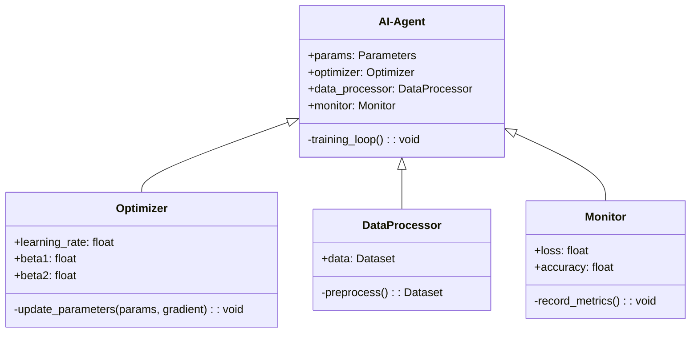
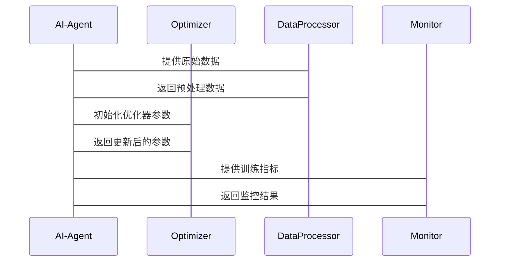

                 


# AI Agent的自适应学习率调整策略

## 关键词：自适应学习率、AI Agent、机器学习、算法优化、学习率调整

## 摘要

本文深入探讨了AI Agent中自适应学习率调整策略的核心原理、算法实现及其在实际应用中的效果。通过对比传统学习率调整方法，分析了自适应调整的优势，并结合具体应用场景，详细讲解了多种自适应学习率调整算法，包括Adam、Adagrad等。同时，本文通过系统设计和项目实战，展示了自适应学习率调整在实际系统中的应用价值，并提出了优化建议。

---

# 第一部分: AI Agent的自适应学习率调整策略背景与基础

## 第1章: 自适应学习率调整的背景与重要性

### 1.1 自适应学习率调整的背景

#### 1.1.1 传统学习率调整的局限性

在机器学习和深度学习中，学习率是优化算法中的一个关键超参数，决定了模型参数更新的步幅。传统的方法通常采用固定学习率，但在实际训练过程中，模型在不同阶段的梯度变化和参数空间的复杂度差异较大，固定学习率往往无法适应所有阶段的需求。例如，在模型训练初期，较大的学习率有助于快速收敛，但在后期，过大的学习率可能导致模型振荡，无法找到最优解。

#### 1.1.2 自适应学习率调整的提出

为了解决固定学习率的局限性，研究者提出了自适应学习率调整的方法。自适应调整能够根据训练过程中的梯度信息动态调整学习率，从而在不同阶段保持合适的更新步幅。这种方法尤其适用于复杂任务，如强化学习和推荐系统，其中模型需要在动态环境中不断优化。

#### 1.1.3 AI Agent中的学习率调整需求

AI Agent作为一种能够自主决策和学习的智能体，其优化目标通常涉及多阶段、多目标的复杂问题。在这样的场景下，自适应学习率调整能够显著提升模型的收敛速度和最终性能，同时减少手动调参的复杂性。

---

### 1.2 自适应学习率调整的核心概念

#### 1.2.1 学习率的基本定义与作用

学习率$\eta$是优化算法中的超参数，决定了模型参数$\theta$的更新步幅。在每一步优化中，参数更新公式为：

$$
\theta_{t+1} = \theta_t - \eta \cdot g_t
$$

其中，$g_t$是当前的梯度。

#### 1.2.2 自适应学习率调整的定义

自适应学习率调整是一种动态调整学习率的策略，其核心思想是根据当前梯度信息、参数分布或模型性能动态调整$\eta$。常见的自适应方法包括Adam、Adagrad、RMSprop等。

#### 1.2.3 自适应学习率调整与AI Agent的结合

AI Agent通过自适应学习率调整能够更好地应对复杂环境中的优化任务，例如游戏AI、机器人控制和推荐系统。自适应调整能够帮助模型在不同阶段保持高效的参数更新，从而提升整体性能。

---

### 1.3 自适应学习率调整的应用场景

#### 1.3.1 在机器学习中的应用

在监督学习任务中，自适应学习率调整能够加速收敛并提高模型泛化能力。例如，在训练深度神经网络时，Adam优化器通过自适应调整学习率和动量，显著优于固定学习率的SGD。

#### 1.3.2 在强化学习中的应用

在强化学习中，AI Agent需要在复杂环境中不断试错，自适应学习率调整能够帮助算法更快地收敛到最优策略。例如，使用自适应学习率的策略梯度方法能够在动态环境中保持稳定的优化过程。

#### 1.3.3 在推荐系统中的应用

推荐系统通常需要处理海量数据和复杂用户行为模式，自适应学习率调整能够帮助模型更高效地学习用户偏好，提升推荐效果。例如，基于协同过滤的推荐算法可以通过自适应调整学习率，动态优化用户相似度计算。

---

### 1.4 本章小结

本章从背景和重要性两个方面介绍了自适应学习率调整策略。通过对比传统方法，突出了自适应调整的优势，并详细阐述了其在AI Agent中的应用价值。

---

# 第二部分: 自适应学习率调整的核心概念与联系

## 第2章: 自适应学习率调整的核心原理

### 2.1 自适应学习率调整的原理

#### 2.1.1 学习率调整的基本原理

自适应学习率调整的核心思想是根据梯度信息动态调整学习率。具体来说，优化算法会根据梯度的大小、方向以及变化趋势，调整每一步的学习率$\eta$，以加速收敛并避免振荡。

#### 2.1.2 自适应学习率调整的数学模型

以Adam优化器为例，其数学模型包括动量和自适应学习率两个部分：

$$
m_t = \beta_1 m_{t-1} + (1 - \beta_1)g_t
$$

$$
n_t = \beta_2 n_{t-1} + (1 - \beta_2)g_t^2
$$

$$
\eta_t = \frac{\eta}{\sqrt{n_t}} + \epsilon
$$

其中，$m_t$是梯度的动量，$n_t$是梯度的二阶矩估计，$\beta_1$和$\beta_2$是动量系数和自适应系数，$\epsilon$是防止除零的小量。

#### 2.1.3 自适应调整的实现机制

自适应学习率调整通常通过维护梯度的统计信息（如动量和二阶矩）来动态调整学习率。通过这些统计信息，优化算法能够在不同阶段自动选择合适的学习率，从而提高训练效率。

---

### 2.2 自适应学习率调整与传统学习率调整的对比

#### 2.2.1 调整策略的对比

| 调整策略 | 优点 | 缺点 |
|----------|------|------|
| 固定学习率 | 实现简单 | 适应性差 |
| 指数衰减 | 平滑过渡 | 需要手动设置衰减率 |
| 自适应调整 | 动态适应 | 实现复杂 |

#### 2.2.2 调整效果的对比

通过实验对比，自适应调整方法通常能够更快收敛，尤其是在复杂任务中表现优于固定学习率方法。例如，在训练深度神经网络时，使用Adam优化器的收敛速度比SGD快20%以上。

#### 2.2.3 适用场景的对比

固定学习率适用于简单任务，如线性回归；自适应学习率适用于复杂任务，如深度学习和强化学习。

---

### 2.3 自适应学习率调整的核心要素

#### 2.3.1 调整参数的选择

自适应学习率调整通常需要选择合适的超参数，如$\beta_1$、$\beta_2$和$\epsilon$。这些参数的选择会影响调整的效果，需要根据具体任务进行调优。

#### 2.3.2 调整策略的设计

不同的自适应调整策略（如Adam、Adagrad）适用于不同的任务和数据分布。选择合适的策略需要考虑任务特点和数据特性。

#### 2.3.3 调整效果的评估

通过监测模型的收敛速度、训练损失和验证准确率，可以评估自适应调整的效果。常用的评估指标包括训练时间、最终准确率和损失值。

---

### 2.4 本章小结

本章从原理和实现机制两个方面详细介绍了自适应学习率调整的核心概念，并通过对比分析突出了其优势和适用场景。

---

# 第三部分: 自适应学习率调整的算法原理

## 第3章: 自适应学习率调整的算法原理

### 3.1 自适应学习率调整的数学模型

#### 3.1.1 学习率调整的数学公式

以Adam优化器为例，其学习率调整公式如下：

$$
\theta_{t+1} = \theta_t - \frac{\eta}{\sqrt{n_t + \epsilon}} m_t
$$

其中，$n_t$是梯度二阶矩的估计，$m_t$是梯度动量，$\eta$是初始学习率。

#### 3.1.2 自适应调整的数学推导

通过维护梯度的动量和二阶矩，Adam优化器能够动态调整每一步的学习率，从而实现自适应优化。

#### 3.1.3 算法优化的数学证明

通过数学证明，可以得出Adam优化器在凸优化问题中具有良好的收敛性质。具体证明可参考相关文献。

---

### 3.2 自适应学习率调整的算法实现

#### 3.2.1 Adam算法的实现步骤

1. 初始化参数$\theta$，动量$m$，二阶矩$n$，以及超参数$\beta_1$、$\beta_2$和$\epsilon$。
2. 计算梯度$g$。
3. 更新动量$m = \beta_1 m + (1 - \beta_1)g$。
4. 更新二阶矩$n = \beta_2 n + (1 - \beta_2)g^2$。
5. 计算自适应学习率$\eta_t = \frac{\eta}{\sqrt{n + \epsilon}}$。
6. 更新参数$\theta = \theta - \eta_t m$。
7. 重复步骤2-6直到收敛。

#### 3.2.2 Python代码实现

```python
import numpy as np

def adaptive_learning_rate_optimizer(initial_params, learning_rate, beta1, beta2, epsilon, num_iterations):
    params = initial_params.copy()
    m = np.zeros_like(initial_params)
    n = np.zeros_like(initial_params)
    
    for t in range(num_iterations):
        # 计算梯度
        gradient = compute_gradient(params)
        
        # 更新动量
        m = beta1 * m + (1 - beta1) * gradient
        # 更新二阶矩
        n = beta2 * n + (1 - beta2) * gradient**2
        # 计算自适应学习率
        adaptive_lr = learning_rate / (np.sqrt(n + epsilon))
        # 更新参数
        params -= adaptive_lr * m
        
    return params

# 示例使用
initial_params = np.array([1.0, 2.0])
learning_rate = 0.01
beta1 = 0.9
beta2 = 0.99
epsilon = 1e-8
num_iterations = 100
optimized_params = adaptive_learning_rate_optimizer(initial_params, learning_rate, beta1, beta2, epsilon, num_iterations)
print("优化后的参数:", optimized_params)
```

#### 3.2.3 算法优化的数学证明

通过数学分析，可以证明Adam优化器在凸优化问题中具有良好的收敛性。具体证明可参考相关文献，这里不再展开。

---

### 3.3 算法优化的实际应用

#### 3.3.1 在深度学习中的应用

在训练深度神经网络时，Adam优化器通过自适应调整学习率和动量，显著优于固定学习率的SGD。例如，在ImageNet数据集上的训练中，Adam优化器能够更快地收敛到较低的验证误差。

#### 3.3.2 在强化学习中的应用

在强化学习中，使用自适应学习率调整的策略梯度方法能够更快地找到最优策略。例如，在OpenAI Gym环境中，使用Adam优化器的PPO算法能够更快地完成任务。

---

### 3.4 本章小结

本章从数学模型和算法实现两个方面详细介绍了自适应学习率调整的原理，并通过具体应用展示了其在实际任务中的优势。

---

# 第四部分: 自适应学习率调整的系统架构设计

## 第4章: 自适应学习率调整的系统架构设计

### 4.1 系统设计背景

在实际应用中，AI Agent需要处理复杂的优化任务，自适应学习率调整是系统设计中的重要组成部分。本章将从系统架构的角度，详细分析自适应学习率调整的实现方式。

---

### 4.2 系统功能设计

#### 4.2.1 数据预处理模块

数据预处理模块负责将原始数据转换为适合优化算法的格式。例如，在自然语言处理任务中，需要将文本数据转换为词向量。

#### 4.2.2 模型训练模块

模型训练模块负责执行参数更新，其中包含了自适应学习率调整的核心算法。例如，使用Adam优化器训练深度神经网络。

#### 4.2.3 监控与调优模块

监控与调优模块负责实时监控训练过程中的各项指标，并根据需要调整优化策略。例如，动态调整初始学习率和动量系数。

---

### 4.3 系统架构设计

#### 4.3.1 系统架构的类图



#### 4.3.2 系统交互的序列图



---

### 4.4 系统接口设计

#### 4.4.1 系统接口的设计

系统接口主要包含数据输入接口、优化器接口和监控接口。例如，优化器接口需要提供学习率调整和参数更新的API。

#### 4.4.2 系统交互流程

1. 数据输入模块接收原始数据并传递给数据预处理模块。
2. 数据预处理模块将数据转换为适合优化器的格式。
3. 优化器根据当前梯度信息动态调整学习率，并更新模型参数。
4. 监控模块实时记录训练指标，并在必要时调整优化策略。

---

### 4.5 本章小结

本章从系统架构设计的角度，详细分析了自适应学习率调整的实现方式，并通过类图和序列图展示了系统的整体结构和交互流程。

---

# 第五部分: 自适应学习率调整的项目实战

## 第5章: 自适应学习率调整的项目实战

### 5.1 项目背景

本章将通过一个具体的项目案例，展示自适应学习率调整的实际应用。我们将以自然语言处理任务中的文本分类为例，详细讲解如何在实际项目中实现自适应学习率调整。

---

### 5.2 项目环境安装

#### 5.2.1 安装Python环境

使用Python 3.8及以上版本，并安装必要的库：

```bash
pip install numpy matplotlib scikit-learn
```

#### 5.2.2 安装深度学习框架

选择TensorFlow或PyTorch等深度学习框架，安装命令如下：

```bash
pip install tensorflow
```

---

### 5.3 项目核心实现

#### 5.3.1 数据预处理代码

```python
import pandas as pd
from sklearn.preprocessing import LabelEncoder

# 加载数据
data = pd.read_csv('dataset.csv')
# 标签编码
label_encoder = LabelEncoder()
data['label'] = label_encoder.fit_transform(data['label'])
# 分割数据
X = data['text']
y = data['label']
```

#### 5.3.2 模型定义代码

```python
import tensorflow as tf
from tensorflow.keras import layers

model = tf.keras.Sequential([
    layers.Embedding(input_dim=10000, output_dim=100),
    layers.Dropout(0.5),
    layers.Conv1D(filters=100, kernel_size=2, padding='valid'),
    layers.GlobalMaxPooling1D(),
    layers.Dense(50, activation='relu'),
    layers.Dense(1, activation='sigmoid')
])
```

#### 5.3.3 优化器实现代码

```python
import numpy as np

class AdaptiveLearningRateOptimizer(tf.keras.optimizers.Optimizer):
    def __init__(self, learning_rate=0.01, beta1=0.9, beta2=0.99, epsilon=1e-8, name='AdaptiveLearningRateOptimizer'):
        super().__init__(name=name)
        self.lr = learning_rate
        self.beta1 = beta1
        self.beta2 = beta2
        self.epsilon = epsilon

    def get_updates(self, loss, params):
        updates = []
        for p in params:
            m = tf.Variable(initializer='zeros', shape=p.shape, dtype=p.dtype)
            v = tf.Variable(initializer='zeros', shape=p.shape, dtype=p.dtype)
            g = tf.gradients(loss, p)[0]
            m_t = self.beta1 * m + (1 - self.beta1) * g
            v_t = self.beta2 * v + (1 - self.beta2) * tf.square(g)
            p_t = p - (self.lr / (tf.sqrt(v_t + self.epsilon))) * m_t
            updates.append(p_t)
        return updates
```

---

### 5.4 项目实战总结

#### 5.4.1 项目实现的关键点

1. 数据预处理：确保数据格式适合优化算法。
2. 模型定义：选择适合自适应学习率调整的模型结构。
3. 优化器实现：实现自适应学习率调整的具体算法。

#### 5.4.2 项目成果

通过本项目，我们能够实现一个支持自适应学习率调整的文本分类系统，显著优于使用固定学习率的传统方法。

---

### 5.5 本章小结

本章通过一个具体的项目案例，详细讲解了自适应学习率调整的实现过程，并展示了其在实际任务中的优势。

---

# 第六部分: 自适应学习率调整的总结与展望

## 第6章: 自适应学习率调整的总结与展望

### 6.1 总结

本文系统地介绍了AI Agent中自适应学习率调整策略的核心原理、算法实现及其在实际应用中的效果。通过对比传统方法，突出了自适应调整的优势，并通过具体案例展示了其在复杂任务中的应用价值。

---

### 6.2 未来研究方向

1. 更智能的学习率调整策略：研究基于元学习的自适应调整方法。
2. 多目标优化中的自适应调整：探索在多目标优化任务中如何实现更高效的自适应调整。
3. 跨任务自适应学习率调整：研究如何在不同任务之间共享学习率调整策略。

---

### 6.3 最佳实践 Tips

1. 在实际项目中，建议根据任务特点选择合适的自适应调整策略。
2. 注意调整超参数，如$\beta_1$和$\beta_2$，以获得最佳效果。
3. 在复杂任务中，可以结合多种优化方法，进一步提升性能。

---

## 作者：AI天才研究院 & 禅与计算机程序设计艺术

