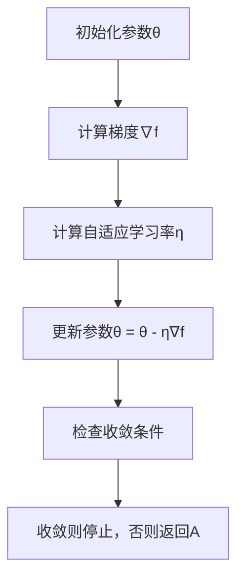
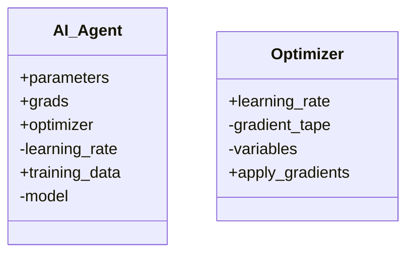
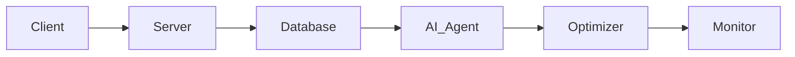
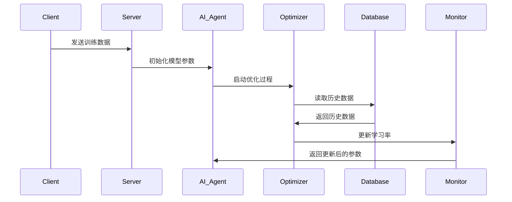

                 


# AI Agent的自适应学习率：优化训练过程

## 关键词：AI Agent, 自适应学习率, 机器学习, 优化算法, 深度学习

## 摘要：  
在AI Agent的训练过程中，自适应学习率是一种能够动态调整优化步长的技术，能够有效提升模型收敛速度和训练效果。本文从AI Agent的基本概念出发，详细探讨自适应学习率的重要性，分析其在不同优化算法中的实现原理，结合实际案例，深入讲解如何通过自适应学习率优化训练过程，为AI Agent的应用提供理论支持和实践指导。

---

## 第一部分：AI Agent的自适应学习率背景与基础

### 第1章：AI Agent概述

#### 1.1 AI Agent的基本概念  
AI Agent（人工智能代理）是一种能够感知环境、自主决策并执行任务的智能体。它通过感知输入数据，利用算法进行分析和推理，做出最优决策，并通过执行器与环境交互。AI Agent广泛应用于自动驾驶、智能助手、机器人控制等领域。  

**核心特征：**  
1. **自主性**：AI Agent能够自主决策，无需外部干预。  
2. **反应性**：能够实时感知环境并做出响应。  
3. **学习能力**：通过经验或数据优化自身行为。  
4. **社交能力**：能够与其他AI Agent或人类交互协作。  

**分类与应用场景：**  
- **简单反射型AI Agent**：基于规则的简单决策，如自动门。  
- **基于模型的AI Agent**：利用内部模型进行预测和规划，如自动驾驶系统。  
- **强化学习型AI Agent**：通过与环境互动，学习最优策略，如游戏AI。  

---

#### 1.2 自适应学习率的重要性  
在AI Agent的训练过程中，学习率是优化算法的核心参数，决定了模型参数更新的步幅。  

**学习率在AI Agent训练中的作用：**  
- 学习率决定了优化算法的收敛速度和稳定性。  
- 固定学习率可能导致训练初期更新过快，后期更新过慢，甚至无法收敛。  
- 自适应学习率能够根据训练过程中的梯度变化动态调整步幅，避免上述问题。  

**自适应学习率的优势：**  
1. **加快收敛速度**：通过动态调整学习率，优化算法能够在不同阶段更高效地更新参数。  
2. **提升训练稳定性**：自适应学习率能够缓解不同梯度规模下的优化难题。  
3. **增强模型性能**：通过更精细的参数调整，提升模型的泛化能力和准确率。  

---

#### 1.3 自适应学习率的历史与发展  
自适应学习率的概念起源于优化算法的研究，经历了以下几个阶段：  

1. **早期研究：学习率固定化**  
   早期的优化算法（如SGD）采用固定学习率，但在训练过程中，固定学习率难以适应不同阶段的梯度变化。  

2. **自适应优化算法的兴起**  
   2010年后，自适应优化算法（如AdaGrad、Adam）逐渐兴起，通过动态调整学习率，解决了固定学习率的局限性。  

3. **当前研究热点**  
   当前研究集中在如何进一步优化自适应学习率的调整机制，如引入动量、自适应矩估计等技术。  

**未来趋势：**  
随着AI Agent的复杂性和任务多样性的增加，自适应学习率的研究将更加注重全局优化和多目标平衡。  

---

## 第2章：自适应学习率的核心概念与原理  

### 2.1 自适应学习率的数学模型  

#### 2.1.1 学习率的基本公式  
优化算法中的学习率通常表示为$\eta$，其基本更新公式为：  
$$\theta_{t+1} = \theta_t - \eta \cdot \nabla f(\theta_t)$$  
其中，$\theta_t$表示第$t$步的参数，$\nabla f(\theta_t)$表示梯度。  

#### 2.1.2 自适应学习率的数学表达  
自适应学习率的核心思想是根据梯度信息动态调整$\eta$。例如，AdaGrad算法通过累加梯度的平方来动态调整学习率：  
$$\eta_t = \frac{\eta_0}{\sqrt{\sum_{i=1}^t g_i^2 + \epsilon}}$$  
其中，$g_i$表示第$i$步的梯度，$\epsilon$为防止除以零的常数。  

#### 2.1.3 不同优化算法中的学习率调整机制  
- **SGD**：固定学习率，无法适应不同梯度规模。  
- **AdaGrad**：基于梯度平方和动态调整学习率。  
- **Adam**：结合动量和自适应学习率，适用于非平稳目标函数。  

---

### 2.2 自适应学习率的核心算法对比  

#### 2.2.1 SGD与自适应学习率的区别  
- SGD采用固定学习率，适合简单的优化任务。  
- 自适应学习率算法能够动态调整学习率，适合复杂的优化任务。  

#### 2.2.2 AdaGrad、Adam、Adagrad等算法的对比  
| 算法名称 | 核心思想 | 优缺点 |  
|----------|----------|--------|  
| SGD      | 固定学习率 | 简单，但收敛慢，易震荡 |  
| AdaGrad  | 累积梯度平方和，动态调整学习率 | 收敛快，适合稀疏数据 |  
| Adam     | 结合动量和自适应学习率 | 适合非平稳目标函数，收敛快 |  

#### 2.2.3 自适应学习率算法的优缺点分析  
- **优点**：  
  - 动态调整学习率，加快收敛速度。  
  - 提高训练稳定性，避免梯度爆炸或消失。  
- **缺点**：  
  - 参数调整复杂，需要额外的超参数配置。  
  - 计算开销较大，尤其是在大规模数据集上。  

---

### 2.3 自适应学习率的流程图  



---

## 第3章：自适应学习率的算法原理  

### 3.1 SGD算法  

#### 3.1.1 SGD的基本原理  
SGD（随机梯度下降）是一种简单的优化算法，通过随机选取小批量数据更新参数。其更新公式为：  
$$\theta_{t+1} = \theta_t - \eta \cdot \nabla f(\theta_t)$$  

**优缺点：**  
- 优点：计算简单，适合在线学习。  
- 缺点：收敛速度慢，易震荡。  

### 3.2 AdaGrad算法  

#### 3.2.1 AdaGrad的核心思想  
AdaGrad通过累加梯度的平方和来动态调整学习率：  
$$\eta_t = \frac{\eta_0}{\sqrt{\sum_{i=1}^t g_i^2 + \epsilon}}$$  

**代码实现：**  
```python
learning_rate = 0.1
epsilon = 1e-8
params = [theta]
 grads = [gradient]

for param, grad in zip(params, grads):
    param.data -= learning_rate * grad.data / (np.sqrt(param.grad_sum + epsilon))
```

---

## 第4章：系统分析与架构设计  

### 4.1 项目背景  
本项目旨在通过自适应学习率优化AI Agent的训练过程，提升模型的收敛速度和准确率。  

### 4.2 系统功能设计  

#### 4.2.1 领域模型（类图）  


### 4.3 系统架构设计  

#### 4.3.1 系统架构图  


### 4.4 接口设计  

#### 4.4.1 序列图  


---

## 第5章：项目实战  

### 5.1 环境安装  
- 安装Python和相关库（如TensorFlow、Keras）。  

### 5.2 核心代码实现  

#### 5.2.1 自适应学习率实现代码  
```python
import numpy as np

class AdaptiveLearningRate:
    def __init__(self, eta0=0.1, epsilon=1e-8):
        self.eta0 = eta0
        self.epsilon = epsilon
        self.grad_sum = 0

    def update(self, theta, gradient):
        self.grad_sum += np.mean(gradient**2)
        learning_rate = self.eta0 / np.sqrt(self.grad_sum + self.epsilon)
        theta -= learning_rate * gradient
        return theta
```

---

## 第6章：最佳实践与总结  

### 6.1 最佳实践  
1. 在训练过程中，建议使用Adam优化器，因为它结合了动量和自适应学习率的优点。  
2. 动态调整学习率时，需注意防止数值不稳定，可以通过设置合理的$\epsilon$值来避免除以零。  

### 6.2 小结  
自适应学习率通过动态调整优化步长，显著提升了AI Agent的训练效率和模型性能。  

### 6.3 注意事项  
- 自适应学习率的计算需要额外的内存和计算开销，需权衡性能和效果。  
- 在实际应用中，需根据具体任务调整超参数，如学习率初始值和$\epsilon$值。  

---

## 作者  
作者：AI天才研究院 & 禅与计算机程序设计艺术  

---

通过以上内容，我们详细探讨了AI Agent的自适应学习率的原理、算法实现和实际应用，帮助读者全面理解并掌握这一技术。

