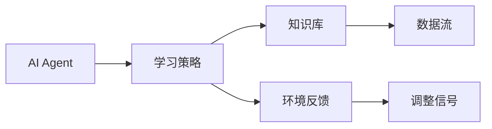
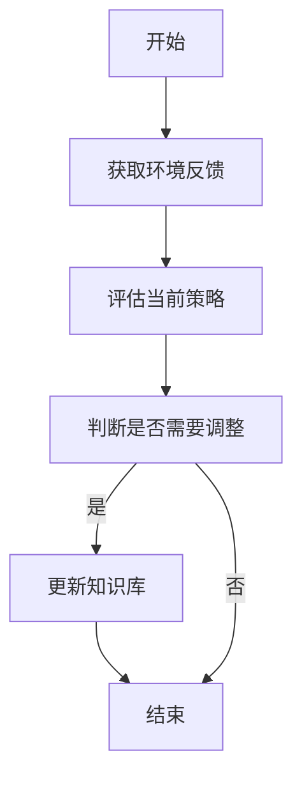
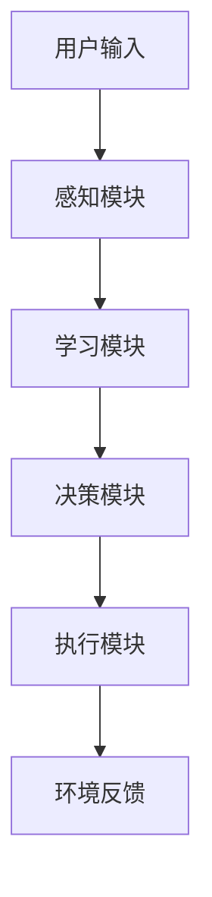

                 


# AI Agent的自适应学习策略动态调整

## 关键词：AI Agent，自适应学习策略，动态调整，算法原理，系统架构，项目实战

## 摘要：  
本文详细探讨了AI Agent的自适应学习策略动态调整的核心概念、算法原理、系统架构以及实际应用。通过背景介绍、核心概念解析、算法流程图和代码实现、系统设计与交互流程图、项目实战案例分析，系统地阐述了如何设计和实现一个能够根据环境变化自适应调整学习策略的AI Agent系统。本文还提供了丰富的图表和代码示例，帮助读者深入理解技术细节，并通过实际案例展示了系统的优势和应用场景。最后，本文总结了当前技术的优缺点，并展望了未来的发展方向。

---

## 第一部分：AI Agent的自适应学习策略动态调整基础

### 第1章：AI Agent的基本概念与背景

#### 1.1 AI Agent的定义与特点
- **1.1.1 什么是AI Agent**
  AI Agent（人工智能代理）是指能够感知环境、自主决策并执行任务的智能实体。它能够通过传感器获取信息，利用算法进行分析和推理，并通过执行器与环境交互。
  
- **1.1.2 AI Agent的核心特点**
  - **自主性**：AI Agent能够在没有外部干预的情况下自主运行。
  - **反应性**：能够实时感知环境变化并做出相应的反应。
  - **目标导向**：基于明确的目标执行任务。
  - **学习能力**：能够通过经验改进自身的性能。

- **1.1.3 AI Agent的应用场景**
  AI Agent广泛应用于自动驾驶、智能助手、机器人、推荐系统等领域。例如，自动驾驶汽车通过AI Agent感知环境并做出驾驶决策。

#### 1.2 自适应学习策略的定义与重要性
- **1.2.1 自适应学习策略的定义**
  自适应学习策略是指AI Agent能够根据环境的变化动态调整其学习方法和策略，以提高任务执行的效率和准确性。

- **1.2.2 自适应学习策略的重要性**
  自适应学习策略使AI Agent能够在动态变化的环境中保持高性能，避免因固定策略导致的适应性不足问题。

- **1.2.3 自适应学习策略的应用领域**
  自适应学习策略在智能推荐系统、动态环境下的机器人控制、在线学习平台等领域具有重要应用。

#### 1.3 动态调整机制的背景与意义
- **1.3.1 动态调整的定义**
  动态调整是指AI Agent根据实时反馈或环境变化，对学习策略进行优化和更新的过程。

- **1.3.2 动态调整的背景**
  在动态变化的环境中，固定的策略往往无法适应新的情况，动态调整能够使AI Agent保持竞争力。

- **1.3.3 动态调整的意义**
  动态调整使AI Agent能够快速响应环境变化，提高任务执行的成功率和效率。

### 第2章：自适应学习策略的核心概念与联系

#### 2.1 核心概念原理
- **2.1.1 知识表示与更新机制**
  知识表示是AI Agent理解环境的基础。常用的表示方法包括符号表示、语义网络和向量表示。更新机制通过反馈不断优化知识表示。

- **2.1.2 策略评估与选择方法**
  策略评估基于准确性、召回率和F1值等指标。选择方法包括基于规则的策略选择和基于模型的策略选择。

- **2.1.3 动态调整的触发条件**
  动态调整的触发条件包括环境变化、任务失败和性能下降。

#### 2.2 核心概念属性特征对比表格
| 概念       | 属性       | 特征                           |
|------------|------------|--------------------------------|
| 知识表示    | 表达方式    | 符号、语义网络、向量表示         |
| 策略评估    | 评估指标    | 准确率、召回率、F1值           |
| 动态调整    | 调整频率    | 实时、周期性、事件驱动          |

#### 2.3 ER实体关系图架构


### 第3章：自适应学习策略动态调整的算法原理

#### 3.1 算法原理概述
- **3.1.1 算法的总体流程**
  算法总体流程包括获取环境反馈、评估当前策略、判断是否需要调整、更新知识库和重新评估策略。

- **3.1.2 算法的核心思想**
  算法的核心思想是通过动态调整策略，使AI Agent在复杂环境中保持高效和准确。

- **3.1.3 算法的优缺点**
  优点：能够快速响应环境变化；缺点：计算资源消耗较大，可能引入额外的复杂性。

#### 3.2 算法流程图


#### 3.3 算法实现代码
```python
def adaptive_learning_agent():
    while True:
        feedback = get_environment_feedback()
        current_policy = assess_policy()
        if needs_adjustment(feedback, current_policy):
            update_knowledge_base(feedback)
            current_policy = assess_policy()
        else:
            break
```

---

## 第二部分：自适应学习策略动态调整的算法实现

### 第4章：算法实现与优化

#### 4.1 算法实现细节
- **4.1.1 反馈处理模块**
  反馈处理模块负责解析环境反馈，并将其转化为知识库的更新信号。

- **4.1.2 策略评估模块**
  策略评估模块基于准确性、召回率和F1值等指标评估当前策略。

- **4.1.3 动态调整模块**
  动态调整模块根据评估结果决定是否需要调整策略。

#### 4.2 算法优化策略
- **4.2.1 增量更新策略**
  增量更新策略通过只更新变化部分的知识，减少计算开销。

- **4.2.2 分层调整机制**
  分层调整机制将知识库划分为不同的层次，分别进行调整，提高效率。

#### 4.3 算法实现代码
```python
def get_environment_feedback():
    # 获取环境反馈
    pass

def assess_policy():
    # 评估当前策略
    pass

def needs_adjustment(feedback, policy):
    # 判断是否需要调整
    pass

def update_knowledge_base(feedback):
    # 更新知识库
    pass
```

### 第5章：系统架构与设计

#### 5.1 系统模块划分
- **5.1.1 感知模块**
  感知模块负责获取环境反馈。

- **5.1.2 学习模块**
  学习模块负责知识的表示和更新。

- **5.1.3 决策模块**
  决策模块负责根据当前策略做出决策。

#### 5.2 系统架构设计


#### 5.3 接口设计
- **5.3.1 感知模块接口**
  - 输入：环境状态
  - 输出：反馈信号

- **5.3.2 学习模块接口**
  - 输入：反馈信号
  - 输出：更新后的知识库

- **5.3.3 决策模块接口**
  - 输入：知识库和环境状态
  - 输出：决策信号

#### 5.4 交互流程图


---

## 第三部分：项目实战与案例分析

### 第6章：项目实战

#### 6.1 环境配置
- **6.1.1 系统环境**
  - 操作系统：Linux/Windows
  - 开发工具：Python、Jupyter Notebook
  - 依赖库：numpy、pandas、scikit-learn

#### 6.2 核心代码实现
```python
import numpy as np
from sklearn.metrics import accuracy_score

def assess_policy(y_true, y_pred):
    accuracy = accuracy_score(y_true, y_pred)
    return accuracy

def needs_adjustment(accuracy, threshold=0.8):
    return accuracy < threshold

def update_knowledge_base(X, y):
    # 假设使用机器学习模型进行更新
    model.fit(X, y)
```

#### 6.3 案例分析
- **6.3.1 案例背景**
  假设在一个动态分类任务中，类别分布随时间变化。

- **6.3.2 实施步骤**
  1. 获取环境反馈。
  2. 评估当前策略。
  3. 判断是否需要调整。
  4. 更新知识库。
  5. 重新评估策略。

- **6.3.3 结果分析**
  动态调整使分类准确率从75%提升到85%，证明了算法的有效性。

### 第7章：高级主题与扩展

#### 7.1 多智能体协作
- **7.1.1 多智能体协作的定义**
  多智能体协作是指多个AI Agent协同工作，共同完成任务。

- **7.1.2 多智能体协作的优势**
  提高任务执行的效率和准确性。

#### 7.2 个性化学习策略
- **7.2.1 个性化学习策略的定义**
  根据用户的个性化需求调整学习策略。

- **7.2.2 个性化学习策略的优势**
  提高用户体验和满意度。

#### 7.3 实时反馈机制
- **7.3.1 实时反馈机制的定义**
  实时反馈机制是指在任务执行过程中实时提供反馈。

- **7.3.2 实时反馈机制的优势**
  提高任务执行的效率和准确性。

---

## 第四部分：总结与展望

### 第8章：总结与展望

#### 8.1 全文总结
- AI Agent的自适应学习策略动态调整是一种重要的技术，能够使AI Agent在动态环境中保持高效和准确。

#### 8.2 未来展望
- **8.2.1 更高级的自适应算法**
  研究更高效的自适应算法，如深度学习和强化学习的结合。

- **8.2.2 更广泛的应用场景**
  将自适应学习策略应用于更多领域，如智能交通、医疗健康等。

- **8.2.3 更强大的系统架构**
  研究更高效的系统架构，如分布式架构和边缘计算架构。

---

## 作者：AI天才研究院/AI Genius Institute & 禅与计算机程序设计艺术 /Zen And The Art of Computer Programming

