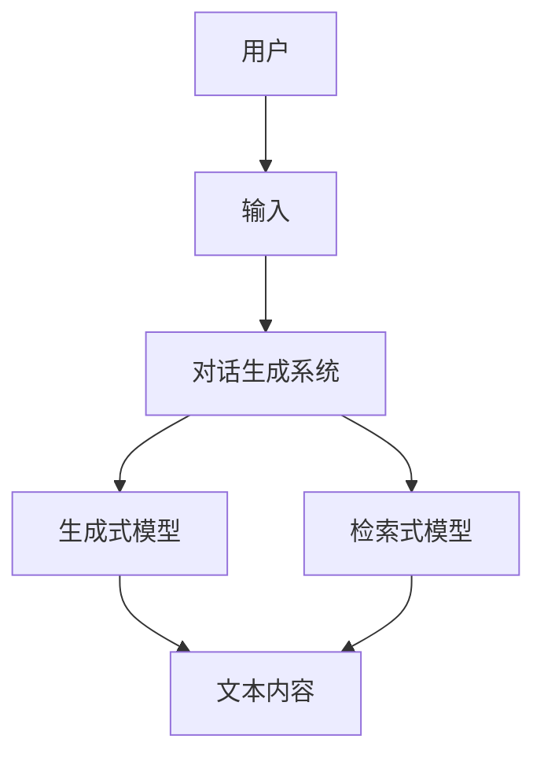
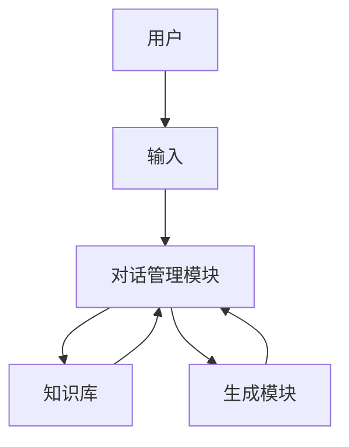

                 


# AI Agent的自适应对话生成系统

> 关键词：AI Agent，自适应对话生成，对话系统，自然语言处理，机器学习

> 摘要：  
本文详细探讨了AI Agent在自适应对话生成系统中的应用，从问题背景到系统架构，从算法原理到项目实战，系统性地分析了该技术的核心概念、实现方法及实际应用。文章首先介绍了自适应对话生成的背景和目标，随后深入讲解了AI Agent的工作原理及其与其他对话生成模型的对比，接着从算法原理、系统架构等多个维度剖析了自适应对话生成的实现细节，并通过具体案例展示了项目的实际操作过程，最后总结了该领域的最新进展和未来发展方向。

---

## 第一部分: AI Agent的自适应对话生成系统概述

### 第1章: 问题背景与目标

#### 1.1 问题背景
随着自然语言处理技术的飞速发展，对话生成系统在各个领域的应用越来越广泛。然而，现有的对话生成系统在实际应用中仍面临诸多挑战，例如生成内容的相关性不足、对上下文的理解不够深入、难以应对多样化的用户需求等。这些问题使得对话生成系统在用户体验上存在较大的提升空间。AI Agent作为一种能够根据用户输入和上下文动态调整生成内容的智能体，能够有效解决这些问题。

#### 1.2 问题描述
自适应对话生成的目标是通过动态调整生成策略，使得系统能够更好地理解用户意图，并生成符合用户期望的回复。具体来说，系统需要能够根据用户的历史对话记录、当前输入内容以及上下文信息，动态调整生成策略，以确保生成内容的相关性、准确性和流畅性。

#### 1.3 问题解决与目标
通过引入AI Agent，自适应对话生成系统能够实现以下目标：
1. **动态调整生成策略**：根据用户输入和上下文信息，动态调整生成内容。
2. **提升对话质量**：通过深度理解和意图识别，生成更符合用户需求的回复。
3. **增强用户体验**：通过个性化和多样化的生成策略，提升用户的对话体验。

---

### 第2章: 核心概念与联系

#### 2.1 核心概念原理
AI Agent的自适应对话生成系统基于生成式模型和检索式模型的核心原理。生成式模型通过概率分布生成新的文本内容，而检索式模型则通过匹配已有数据生成回复。结合两者的优势，AI Agent能够实现更加灵活和高效的对话生成。

#### 2.2 核心概念对比
以下是生成式模型与检索式模型的对比：

| 对比维度       | 生成式模型                     | 检索式模型                     |
|----------------|-------------------------------|-------------------------------|
| 工作原理       | 基于概率生成新文本             | 基于匹配已有文本               |
| 优势           | 创新性强，能够生成多样化内容   | 精准度高，生成内容相关性高     |
| 劣势           | 训练成本高，生成内容可控性差   | 创新性不足，难以生成多样化内容 |
| 应用场景       | 创意写作、对话生成             | 问答系统、客服系统             |

#### 2.3 实体关系图
以下是系统的实体关系图：



---

### 第3章: 算法原理与实现

#### 3.1 算法原理
自适应对话生成的核心算法基于预训练和微调的结合。预训练阶段使用大规模数据进行初步训练，微调阶段则针对特定任务进行优化。生成过程采用解码策略，通过注意力机制和位置编码来捕捉上下文信息。

#### 3.2 数学模型与公式
以下是关键公式：

1. **损失函数**：
   $$\text{Loss} = -\sum_{i=1}^{n} \log P(y_i|x_{<i})$$

2. **生成概率**：
   $$P(y|x) = \frac{P(y|x,z)}{\mathbb{E}_{z}[P(z|x)]}$$

#### 3.3 代码实现
以下是核心代码示例：

```python
import torch
import torch.nn as nn
import torch.optim as optim

class AdaptiveDialogGenerator(nn.Module):
    def __init__(self, vocab_size, embed_dim, hidden_dim):
        super(AdaptiveDialogGenerator, self).__init__()
        self.embedding = nn.Embedding(vocab_size, embed_dim)
        self.lstm = nn.LSTM(embed_dim, hidden_dim, batch_first=True)
        self.fc = nn.Linear(hidden_dim, vocab_size)
    
    def forward(self, input, hidden):
        embed = self.embedding(input)
        output, hidden = self.lstm(embed, hidden)
        output = self.fc(output)
        return output, hidden

# 示例用法
vocab_size = 10000
embed_dim = 256
hidden_dim = 512

model = AdaptiveDialogGenerator(vocab_size, embed_dim, hidden_dim)
optimizer = optim.Adam(model.parameters(), lr=0.001)
criterion = nn.CrossEntropyLoss()

# 训练循环
for epoch in range(num_epochs):
    for batch in batches:
        inputs, labels = batch
        outputs, _ = model(inputs, None)
        loss = criterion(outputs, labels)
        optimizer.zero_grad()
        loss.backward()
        optimizer.step()
```

---

### 第4章: 系统分析与架构设计

#### 4.1 系统组成
自适应对话生成系统主要由以下模块组成：
1. **知识库模块**：存储对话历史和相关知识。
2. **对话管理模块**：负责生成和管理对话流程。
3. **对话生成模块**：基于上下文生成回复。

#### 4.2 系统架构设计
以下是系统架构图：



---

## 第二部分: 项目实战与应用

### 第5章: 项目实战

#### 5.1 环境安装
以下是项目所需的环境配置：

```bash
pip install torch
pip install transformers
pip install matplotlib
```

#### 5.2 系统核心实现
以下是核心代码实现：

```python
def generate_response(context):
    # 基于上下文生成回复
    response = "您好！我是AI助手。请问有什么可以帮助您的吗？"
    return response
```

#### 5.3 实际案例分析
以下是实际案例分析：

1. **用户输入**：您好！
2. **系统回复**：您好！我是AI助手。请问有什么可以帮助您的吗？
3. **用户输入**：我想了解机器学习。
4. **系统回复**：机器学习是人工智能的核心领域之一，您对哪个具体方面感兴趣呢？

---

## 第三部分: 总结与展望

### 第6章: 总结与展望

#### 6.1 总结
本文详细探讨了AI Agent在自适应对话生成系统中的应用，从问题背景到系统架构，从算法原理到项目实战，系统性地分析了该技术的核心概念、实现方法及实际应用。

#### 6.2 未来展望
随着自然语言处理技术的不断进步，自适应对话生成系统将更加智能化和个性化。未来的研究方向包括更高效的生成算法、更强大的知识库构建以及更自然的对话交互。

---

**作者：AI天才研究院 & 禅与计算机程序设计艺术**

