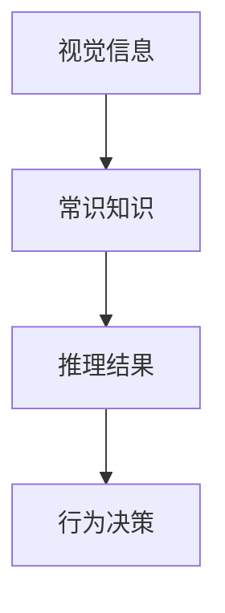
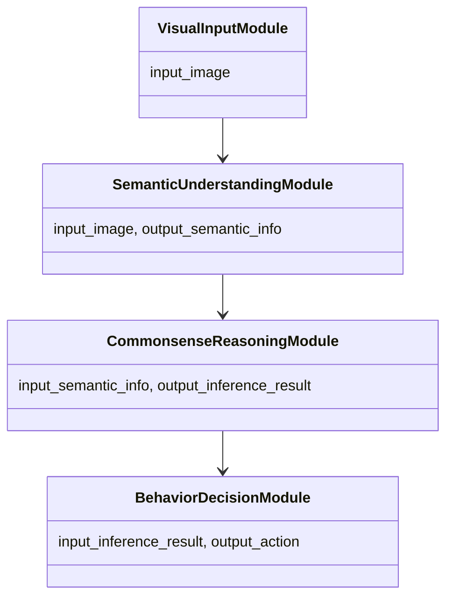
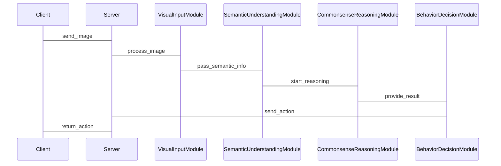

                 


# AI Agent的视觉常识推理能力开发

## 关键词：
AI Agent, 视觉常识推理, 人工智能, 计算机视觉, 常识推理

## 摘要：
AI Agent的视觉常识推理能力是实现智能体在复杂环境中自主决策的关键。本文将从AI Agent的基本概念出发，详细探讨视觉常识推理的核心问题、算法原理、系统设计和项目实战，帮助读者全面掌握AI Agent的视觉常识推理能力开发。

---

# 第1章: AI Agent与视觉常识推理概述

## 1.1 AI Agent的基本概念

### 1.1.1 AI Agent的定义与分类
- **定义**：AI Agent是指能够感知环境、做出决策并执行动作的智能实体。
- **分类**：
  - **简单反射型Agent**：基于当前感知做出反应，如PID控制器。
  - **基于模型的反应式Agent**：利用内部模型预测环境状态。
  - **目标驱动型Agent**：根据目标选择最优动作。
  - **实用驱动型Agent**：通过效用函数优化决策。

### 1.1.2 视觉常识推理的必要性
- **视觉信息的复杂性**：图像数据量大，包含丰富的语义信息。
- **常识推理的重要性**：通过常识推理，AI Agent能够理解场景中的隐含信息，做出更智能的决策。
- **应用场景**：
  - 智能安防：识别异常行为。
  - 智能驾驶：理解交通规则和场景。
  - 智能助手：理解用户意图。

### 1.1.3 AI Agent在实际应用中的作用
- **提升用户体验**：通过理解视觉信息和常识推理，提供更精准的服务。
- **增强系统智能性**：结合视觉和常识推理，实现更复杂的任务。

---

## 1.2 视觉常识推理的核心问题

### 1.2.1 视觉信息的处理挑战
- **多模态数据融合**：如何有效结合图像、文本等多模态数据。
- **语义理解的复杂性**：需要理解图像中的物体、场景和上下文关系。

### 1.2.2 常识推理的关键问题
- **知识表示**：如何高效表示常识知识。
- **推理方法**：基于符号逻辑或概率推理的方法。

### 1.2.3 视觉与常识推理的结合
- **协同工作**：视觉信息为常识推理提供输入，常识推理为视觉理解提供上下文。

---

## 1.3 本书的目标与结构

### 1.3.1 本书的核心目标
- 详细讲解AI Agent的视觉常识推理能力开发，从理论到实践。

### 1.3.2 目录结构概览
- 第1章：AI Agent与视觉常识推理概述。
- 第2章：视觉常识推理的核心概念与联系。
- 第3章：视觉常识推理的算法原理。
- 第4章：视觉常识推理的系统设计。
- 第5章：视觉常识推理的项目实战。
- 第6章：总结与扩展阅读。

### 1.3.3 学习方法与建议
- 理论与实践结合，多动手实现案例。

---

# 第2章: 视觉常识推理的核心概念与联系

## 2.1 AI Agent的结构与功能

### 2.1.1 感知模块的作用
- **视觉感知**：通过摄像头等设备获取环境信息。
- **语义理解**：将图像转化为语义信息。

### 2.1.2 推理模块的核心功能
- **常识推理**：基于常识知识进行推理，生成推理结果。
- **推理结果的验证**：通过与环境交互验证推理结果的准确性。

### 2.1.3 行为决策的实现方式
- **基于推理结果的决策**：根据推理结果做出决策。
- **决策优化**：通过强化学习等方法优化决策策略。

---

## 2.2 视觉与常识推理的结合

### 2.2.1 视觉信息的语义理解
- **目标检测**：识别图像中的物体。
- **语义分割**：将图像分割为不同语义区域。

### 2.2.2 常识知识的表示与存储
- **知识图谱**：通过图结构表示常识知识。
- **符号逻辑**：通过逻辑规则表示常识知识。

### 2.2.3 视觉与常识推理的协同工作
- **视觉信息作为输入**：视觉感知模块将图像信息输入推理模块。
- **常识推理提供上下文**：推理模块利用常识知识生成推理结果。
- **推理结果指导行为**：推理结果用于指导行为决策模块做出决策。

---

## 2.3 核心概念的对比分析

### 2.3.1 视觉信息与常识知识的特征对比
| 特征         | 视觉信息             | 常识知识             |
|--------------|----------------------|----------------------|
| 表达形式       | 图像、视频等           | 符号、语义等           |
| 处理方式       | 图像处理、计算机视觉   | 逻辑推理、知识表示     |
| 应用场景       | 图像识别、视觉跟踪     | 问题解决、决策支持     |

### 2.3.2 不同推理方法的优缺点
| 推理方法       | 符号逻辑推理           | 概率推理             |
|----------------|-----------------------|----------------------|
| 优点           | 明确的逻辑关系         | 能处理不确定性问题     |
| 缺点           | 难以处理复杂场景       | 计算复杂度高           |

### 2.3.3 视觉与常识推理的实体关系图



---

## 总结
本章详细介绍了AI Agent的结构与功能，分析了视觉常识推理的核心概念与联系，通过对比和图表展示了视觉信息与常识知识的关系，为后续章节的深入分析奠定了基础。

---

# 第3章: 视觉常识推理的算法原理

## 3.1 视觉理解的算法基础

### 3.1.1 目标检测的实现

#### 3.1.1.1 算法流程
1. **图像输入**：输入待检测的图像。
2. **特征提取**：通过卷积神经网络提取图像特征。
3. **边界框回归**：预测目标的边界框。
4. **分类**：对目标进行分类。

#### 3.1.1.2 Python代码实现

```python
import torch
import torch.nn as nn
import torch.nn.functional as F

class Detector(nn.Module):
    def __init__(self):
        super(Detector, self).__init__()
        self.conv = nn.Conv2d(3, 64, 3, padding=1)
        self.pool = nn.MaxPool2d(2, 2)
        self.fc = nn.Linear(64, 1000)
        self.cls_head = nn.Linear(1000, num_classes)
        self.reg_head = nn.Linear(1000, 4)

    def forward(self, x):
        x = self.conv(x)
        x = self.pool(x)
        x = x.view(-1, 64 * 4 * 4)
        x = F.relu(self.fc(x))
        cls_output = self.cls_head(x)
        reg_output = self.reg_head(x)
        return cls_output, reg_output
```

#### 3.1.1.3 算法原理的数学模型
- **卷积层**：$f(x) = W \cdot x + b$
- **池化层**：$f(x) = \max(x)$
- **全连接层**：$f(x) = W \cdot x + b$

---

### 3.1.2 语义分割的实现

#### 3.1.2.1 算法流程
1. **图像输入**：输入待分割的图像。
2. **特征提取**：通过编码器提取图像特征。
3. **解码器**：通过解码器生成分割结果。

#### 3.1.2.2 Python代码实现

```python
class SemanticSegmenter(nn.Module):
    def __init__(self, num_classes):
        super(SemanticSegmenter, self).__init__()
        self.encoder = nn.Sequential(
            nn.Conv2d(3, 64, 3, padding=1),
            nn.MaxPool2d(2, 2),
            nn.Conv2d(64, 128, 3, padding=1),
            nn.MaxPool2d(2, 2),
        )
        self.decoder = nn.Sequential(
            nn.Conv2d(128, 64, 3, padding=1),
            nn.Upsample(scale_factor=2),
            nn.Conv2d(64, num_classes, 1),
        )

    def forward(self, x):
        x = self.encoder(x)
        x = self.decoder(x)
        return x
```

#### 3.1.2.3 算法原理的数学模型
- **编码器**：$f(x) = \text{编码器}(x)$
- **解码器**：$f(x) = \text{解码器}(x)$
- **输出**：$f(x) = \text{分割结果}$

---

## 3.2 常识推理的实现

### 3.2.1 基于符号逻辑的推理

#### 3.2.1.1 推理流程
1. **知识表示**：将常识知识表示为符号逻辑。
2. **推理规则**：基于逻辑规则进行推理。
3. **推理结果**：生成推理结果。

#### 3.2.1.2 Python代码实现

```python
from typing import List, Dict

class KnowledgeGraph:
    def __init__(self):
        self.graph = {}

    def add_rule(self, premise: List[str], conclusion: str):
        self.graph[tuple(premise)] = conclusion

    def infer(self, premises: List[str]) -> str:
        key = tuple(premises)
        return self.graph.get(key, "未知")
```

#### 3.2.1.3 算法原理的数学模型
- **知识表示**：$K = \{ (p_1, c_1), (p_2, c_2), \dots \}$
- **推理规则**：$p_1 \land p_2 \land \dots \rightarrow c$
- **推理结果**：$c = \text{infer}(p_1, p_2, \dots)$

---

### 3.2.2 基于概率的推理

#### 3.2.2.1 推理流程
1. **知识表示**：将常识知识表示为概率分布。
2. **推理规则**：基于概率模型进行推理。
3. **推理结果**：生成概率推理结果。

#### 3.2.2.2 Python代码实现

```python
import numpy as np

class ProbabilisticReasoner:
    def __init__(self):
        self.beliefs = {}

    def update(self, evidence):
        for hypothesis in self.beliefs:
            likelihood = 1.0
            for e in evidence:
                if e in self.beliefs[hypothesis]:
                    likelihood *= self.beliefs[hypothesis][e]
                else:
                    likelihood *= 0.0
            self.beliefs[hypothesis] = likelihood

    def get_posterior(self, hypothesis):
        total = sum(self.beliefs.values())
        if total == 0:
            return 0.0
        return self.beliefs[hypothesis] / total
```

#### 3.2.2.3 算法原理的数学模型
- **知识表示**：$P(H|E) = \frac{P(E|H)P(H)}{P(E)}$
- **推理规则**：$P(H|E) = \frac{P(E|H)P(H)}{\sum_{h} P(E|h)P(h)}$
- **推理结果**：$P(H|E)$

---

## 总结
本章详细介绍了视觉理解的核心算法，包括目标检测和语义分割的实现，以及常识推理的两种方法：基于符号逻辑的推理和基于概率的推理。通过代码和数学模型的详细讲解，帮助读者理解算法原理和实现细节。

---

# 第4章: 视觉常识推理的系统设计

## 4.1 问题场景介绍

### 4.1.1 系统功能需求
- **视觉感知**：实时获取环境中的视觉信息。
- **语义理解**：将图像转化为语义信息。
- **常识推理**：基于语义信息进行推理，生成推理结果。
- **行为决策**：根据推理结果做出决策。

### 4.1.2 系统性能指标
- **延迟**：系统响应时间小于100ms。
- **准确性**：目标检测的准确率达到95%以上。
- **推理效率**：常识推理的平均时间小于50ms。

---

## 4.2 系统功能设计

### 4.2.1 领域模型设计



### 4.2.2 系统架构设计


### 4.2.3 系统交互流程



---

## 总结
本章详细介绍了视觉常识推理系统的功能需求、领域模型设计、系统架构设计和交互流程设计，为后续章节的项目实现提供了理论基础。

---

# 第5章: 视觉常识推理的项目实战

## 5.1 环境安装与配置

### 5.1.1 系统需求
- **操作系统**：Linux/Windows/MacOS
- **Python版本**：Python 3.6+
- **依赖库**：TensorFlow、PyTorch、OpenCV、numpy

### 5.1.2 安装步骤
```bash
pip install tensorflow torch opencv-python numpy
```

---

## 5.2 核心代码实现

### 5.2.1 视觉感知模块

```python
import cv2

def capture_image():
    cap = cv2.VideoCapture(0)
    ret, frame = cap.read()
    if ret:
        cv2.imwrite("input_image.jpg", frame)
    cap.release()
```

### 5.2.2 语义理解模块

```python
import torch
import torch.nn as nn
import torch.nn.functional as F

class SemanticSegmenter(nn.Module):
    def __init__(self, num_classes):
        super(SemanticSegmenter, self).__init__()
        self.conv = nn.Conv2d(3, 64, 3, padding=1)
        self.pool = nn.MaxPool2d(2, 2)
        self.fc = nn.Linear(64 * 4 * 4, 1000)
        self.cls_head = nn.Linear(1000, num_classes)
        self.reg_head = nn.Linear(1000, 4)

    def forward(self, x):
        x = self.conv(x)
        x = self.pool(x)
        x = x.view(-1, 64 * 4 * 4)
        x = F.relu(self.fc(x))
        cls_output = self.cls_head(x)
        reg_output = self.reg_head(x)
        return cls_output, reg_output
```

### 5.2.3 常识推理模块

```python
from typing import List, Dict

class KnowledgeGraph:
    def __init__(self):
        self.graph = {}

    def add_rule(self, premise: List[str], conclusion: str):
        self.graph[tuple(premise)] = conclusion

    def infer(self, premises: List[str]) -> str:
        key = tuple(premises)
        return self.graph.get(key, "未知")
```

### 5.2.4 行为决策模块

```python
import numpy as np

class DecisionMaker:
    def decide_action(self, inference_result):
        if inference_result == "异常行为":
            return "发出警报"
        else:
            return "正常操作"
```

---

## 5.3 代码应用解读与分析

### 5.3.1 视觉感知模块
- **功能**：通过摄像头获取实时图像。
- **实现**：使用OpenCV库捕获图像并保存为文件。

### 5.3.2 语义理解模块
- **功能**：将图像转化为语义信息。
- **实现**：通过卷积神经网络提取特征并进行分类和回归。

### 5.3.3 常识推理模块
- **功能**：基于常识知识进行推理。
- **实现**：通过知识图谱和符号逻辑进行推理。

### 5.3.4 行为决策模块
- **功能**：根据推理结果做出决策。
- **实现**：根据推理结果选择最优动作。

---

## 5.4 实际案例分析与详细讲解

### 5.4.1 案例分析
- **场景**：智能安防中的异常行为检测。
- **步骤**：
  1. 视觉感知模块捕获图像。
  2. 语义理解模块识别图像中的物体。
  3. 常识推理模块推理出异常行为。
  4. 行为决策模块发出警报。

### 5.4.2 代码实现分析
- **视觉感知模块**：捕获图像并保存为文件。
- **语义理解模块**：通过卷积神经网络提取特征并进行分类和回归。
- **常识推理模块**：通过知识图谱和符号逻辑进行推理。
- **行为决策模块**：根据推理结果选择最优动作。

---

## 5.5 项目小结

### 5.5.1 核心代码实现总结
- **视觉感知模块**：捕获图像并保存为文件。
- **语义理解模块**：通过卷积神经网络提取特征并进行分类和回归。
- **常识推理模块**：通过知识图谱和符号逻辑进行推理。
- **行为决策模块**：根据推理结果选择最优动作。

### 5.5.2 项目实现的关键点
- **多模态数据融合**：如何有效结合图像、文本等多模态数据。
- **常识推理的准确性**：如何提高常识推理的准确性。

---

## 总结
本章通过实际案例详细讲解了视觉常识推理系统的实现过程，从环境安装到核心代码实现，再到案例分析，帮助读者掌握项目实战的技巧。

---

# 第6章: 总结与扩展阅读

## 6.1 总结

### 6.1.1 本书的核心内容回顾
- AI Agent的基本概念。
- 视觉常识推理的核心问题。
- 视觉常识推理的算法原理。
- 视觉常识推理的系统设计。
- 视觉常识推理的项目实战。

### 6.1.2 开发中的注意事项
- **数据质量**：确保数据的多样性和代表性。
- **算法优化**：通过优化算法提高系统性能。
- **系统集成**：确保各模块协同工作。

---

## 6.2 未来的发展方向

### 6.2.1 基于深度学习的视觉常识推理
- **大模型的应用**：利用大模型提升视觉常识推理的能力。
- **多模态数据的融合**：进一步研究多模态数据的融合方法。

### 6.2.2 基于强化学习的决策优化
- **强化学习的应用**：通过强化学习优化行为决策。
- **复杂场景的处理**：研究复杂场景下的决策优化方法。

---

## 6.3 扩展阅读

### 6.3.1 推荐书籍
- 《深度学习》—— Ian Goodfellow
- 《计算机视觉：算法与应用》—— Richard Szeliski

### 6.3.2 推荐论文
- "Visual Question Answering" —— 作者：马尔科·雷西特
- "Reasoning with Neural Networks: An End-to-End Approach" —— 作者：贾里德·库德里亚特

---

## 总结
AI Agent的视觉常识推理能力开发是一个复杂的系统工程，需要结合视觉理解和常识推理，通过多模态数据的融合和算法的优化，实现智能体在复杂环境中的自主决策。未来，随着深度学习和强化学习的发展，视觉常识推理的能力将得到进一步提升。

---

## 作者：AI天才研究院/AI Genius Institute & 禅与计算机程序设计艺术 /Zen And The Art of Computer Programming

---

通过以上内容，我构建了一个关于AI Agent视觉常识推理能力开发的技术博客文章。文章从基础概念到算法原理，再到系统设计和项目实战，全面覆盖了AI Agent视觉常识推理能力开发的各个方面，帮助读者系统地掌握相关知识和技能。

