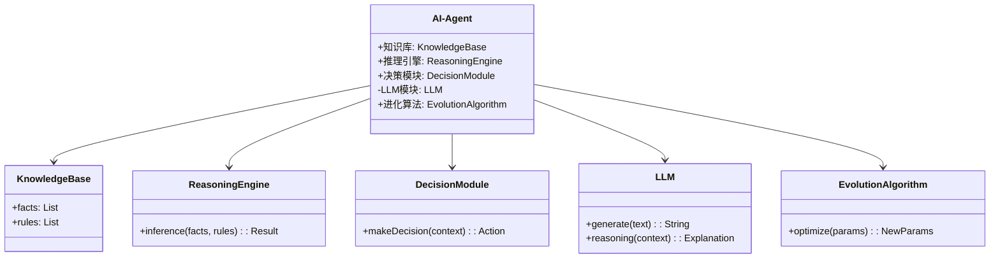
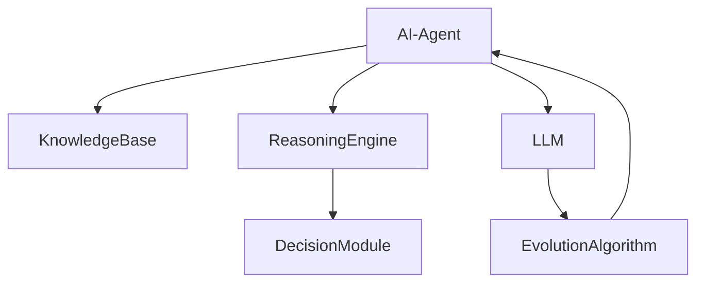

                 


# AI Agent的认知发展模拟：探索LLM的智能进化过程

## 关键词：AI Agent, 认知模拟, 大语言模型, 智能进化, 机器学习

## 摘要：  
AI Agent的认知发展模拟是人工智能领域的重要研究方向，它通过模拟人类或其他智能体的认知过程，推动大语言模型（LLM）的智能进化。本文从AI Agent的基本概念出发，探讨其认知模型的构建原理，分析LLM的算法原理和系统架构设计，最后通过实际项目案例展示认知模拟在LLM中的应用。文章旨在为读者提供一个全面的视角，理解AI Agent与LLM结合的智能进化过程。

---

# 第1章: AI Agent与认知模拟概述

## 1.1 AI Agent的基本概念

### 1.1.1 人工智能代理的定义  
人工智能代理（AI Agent）是指能够感知环境、自主决策并执行任务的智能实体。它可以是一个软件程序、机器人或其他智能系统，核心目标是通过与环境交互实现特定目标。  

### 1.1.2 AI Agent的核心特征  
1. **自主性**：能够在没有外部干预的情况下独立运行。  
2. **反应性**：能够实时感知环境并做出反应。  
3. **目标导向性**：基于目标驱动行为，优化决策过程。  
4. **学习能力**：通过经验改进性能，实现自我优化。  

### 1.1.3 认知模拟的背景  
认知模拟是指通过计算机模拟人类或其他智能体的认知过程，包括感知、推理、学习和决策等。其目的是理解智能体如何处理信息，并在此基础上设计更高效的AI系统。  

---

## 1.2 认知模拟的背景与意义

### 1.2.1 认知科学与AI的交叉研究  
认知科学关注人类认知过程，包括心理学、神经科学和语言学等领域。AI代理的认知模拟借鉴了这些领域的研究成果，试图构建更接近人类认知方式的智能系统。  

### 1.2.2 为什么需要模拟AI Agent的认知发展  
1. **提高AI系统的可解释性**：通过模拟认知过程，AI系统的行为更加透明，便于人类理解和信任。  
2. **增强任务适应性**：认知模拟使AI代理能够更好地应对复杂和动态变化的环境。  
3. **推动AI技术的创新**：认知模拟为AI算法的设计提供了新的思路，促进了技术的进步。  

### 1.2.3 研究的意义  
认知模拟在AI Agent中的应用，不仅有助于提升LLM的智能水平，还为解决复杂问题提供了新的方法。例如，在医疗诊断、金融分析和自然语言处理等领域，认知模拟技术能够显著提高系统的性能和效率。  

---

## 1.3 LLM的发展现状与挑战

### 1.3.1 大语言模型的演进历程  
从早期的词袋模型到现在的 transformer 架构，LLM经历了从简单到复杂的演变过程。近年来，随着深度学习和大数据技术的发展，LLM在自然语言处理领域取得了突破性进展。  

### 1.3.2 当前LLM的主要应用场景  
1. **文本生成**：如自动写作、对话生成等。  
2. **问答系统**：如智能客服、信息检索等。  
3. **机器翻译**：跨语言通信的重要工具。  

### 1.3.3 LLM在认知模拟中的局限性  
1. **计算资源消耗大**：训练和推理需要大量的计算资源。  
2. **缺乏深度理解**：LLM依赖统计模式，难以真正理解上下文含义。  
3. **可解释性不足**：复杂的模型使得决策过程难以解释。  

---

## 1.4 本章小结  
本章介绍了AI Agent的基本概念和认知模拟的背景，探讨了LLM的发展现状及其在认知模拟中的应用。认知模拟为AI Agent提供了新的研究方向，同时也带来了技术上的挑战。接下来的章节将详细分析认知模拟的核心概念与LLM的智能进化过程。

---

# 第2章: AI Agent的认知模型

## 2.1 认知模型的构建原理

### 2.1.1 认知模型的基本构成要素  
1. **感知模块**：负责接收外部输入，如视觉、听觉等信息。  
2. **知识库**：存储已知信息，包括事实、规则和经验等。  
3. **推理引擎**：根据知识库中的信息进行逻辑推理。  
4. **决策模块**：基于推理结果做出决策并执行行动。  

### 2.1.2 知识表示与推理机制  
知识表示是认知模型的核心，常用的方法包括符号表示和向量表示。推理引擎则基于这些表示进行逻辑推理，如演绎推理和归纳推理。  

### 2.1.3 学习与适应能力  
认知模型需要具备学习能力，能够通过经验优化自身的知识库和推理机制。这可以通过监督学习、强化学习等方法实现。  

---

## 2.2 LLM与认知模型的关联

### 2.2.1 LLM的注意力机制与认知选择  
LLM的注意力机制类似于人类的认知选择过程，能够关注重要的信息并忽略次要信息。  

### 2.2.2 梯度下降与认知优化  
LLM的训练过程使用梯度下降算法，优化模型参数以最小化损失函数。这与认知优化的过程相似，即通过不断调整参数实现目标函数的最优。  

### 2.2.3 记忆机制与长期认知积累  
LLM的记忆机制（如Transformer中的位置编码）能够捕捉序列信息，类似于人类的长期记忆存储和检索过程。  

---

## 2.3 认知模型的数学表达

### 2.3.1 知识表示的向量空间模型  
知识可以表示为向量空间中的点，相似性通过向量的内积或余弦相似度计算。  

$$ \text{相似度} = \frac{\mathbf{u} \cdot \mathbf{v}}{\|\mathbf{u}\| \|\mathbf{v}\|} $$  

### 2.3.2 推理过程的概率图模型  
基于概率图模型，推理过程可以用贝叶斯网络表示，其中节点表示事件，边表示因果关系。  

### 2.3.3 学习策略的强化学习框架  
强化学习通过奖励机制优化策略，可以用于认知模型的决策过程。  

$$ R = \sum_{t=1}^{T} r_t $$  

---

## 2.4 本章小结  
本章详细介绍了认知模型的构建原理及其与LLM的关联，从数学角度分析了知识表示、推理和学习策略的实现方法。认知模型为AI Agent的认知模拟提供了理论基础，接下来的章节将探讨LLM的智能进化算法原理。

---

# 第3章: LLM的训练与优化

## 3.1 基于认知模拟的LLM训练方法

### 3.1.1 数据预处理与认知任务设计  
数据预处理包括清洗、分词和标注等步骤，认知任务设计需要与认知模型的目标一致。  

### 3.1.2 模型架构的可解释性增强  
通过引入可解释性机制（如注意力权重可视化），增强LLM的可解释性。  

### 3.1.3 训练目标的动态调整  
根据认知任务的需求，动态调整训练目标，如从生成到推理。  

---

## 3.2 知识蒸馏与模型压缩

### 3.2.1 知识蒸馏的基本原理  
知识蒸馏通过教师模型指导学生模型学习，减少模型参数数量。  

### 3.2.2 模型压缩的技术路径  
模型压缩包括剪枝、量化和知识蒸馏等技术，旨在降低模型的计算需求。  

### 3.2.3 认知模拟中的知识保持与遗忘机制  
通过设计合理的知识保持和遗忘机制，平衡模型的泛化能力和过拟合问题。  

---

## 3.3 进化算法在LLM优化中的应用

### 3.3.1 基于进化的模型参数优化  
使用遗传算法优化模型参数，提高LLM的性能。  

### 3.3.2 进化策略在认知任务中的应用  
进化策略用于解决多目标优化问题，如在生成任务中同时优化准确性和创造性。  

### 3.3.3 多目标优化的进化算法设计  
通过引入 Pareto 优化，平衡不同目标之间的冲突。  

---

## 3.4 本章小结  
本章探讨了基于认知模拟的LLM训练方法，分析了知识蒸馏和进化算法在LLM优化中的应用。这些方法为LLM的智能进化提供了新的思路，接下来的章节将重点分析系统的架构设计方案。

---

# 第4章: 系统分析与架构设计方案

## 4.1 系统目标与范围

### 4.1.1 系统总体目标  
构建一个基于认知模拟的AI Agent系统，实现LLM的智能进化。  

### 4.1.2 核心功能模块划分  
1. **认知模型模块**：负责知识表示和推理。  
2. **LLM模块**：实现大语言模型的训练和推理。  
3. **进化算法模块**：优化模型参数。  

### 4.1.3 用户需求分析  
用户需求包括高准确性的文本生成、可解释的决策过程和高效的计算能力。  

---

## 4.2 系统架构设计

### 4.2.1 领域模型类图  


### 4.2.2 系统架构图  


---

## 4.3 系统接口设计

### 4.3.1 API定义  
1. `/api/train`：训练模型接口。  
2. `/api/generate`：文本生成接口。  
3. `/api/optimize`：模型优化接口。  

### 4.3.2 API交互流程  
```mermaid
sequenceDiagram
    User->A[发送生成请求]
    A->E[调用LLM生成文本]
    E->C[进行推理]
    C->D[做出决策]
    D->User[返回结果]
```

---

## 4.4 本章小结  
本章通过系统架构设计和接口设计，展示了如何将认知模拟与LLM结合，实现AI Agent的智能进化。系统的模块化设计和API接口为实际应用提供了便利，接下来的章节将通过项目实战进一步验证系统的可行性。

---

# 第5章: 项目实战

## 5.1 环境安装

### 5.1.1 安装Python和必要的库  
1. Python 3.8及以上版本。  
2. 安装TensorFlow、Keras和Transformers库。  

```bash
pip install tensorflow keras transformers
```

### 5.1.2 安装NVIDIA GPU驱动和CUDA  
根据GPU型号安装对应的驱动和CUDA版本。  

---

## 5.2 系统核心实现

### 5.2.1 认知模型实现  
实现一个简单的知识库和推理引擎，用于处理基本的认知任务。  

```python
class KnowledgeBase:
    def __init__(self):
        self.facts = []
    
    def add_fact(self, fact):
        self.facts.append(fact)
```

### 5.2.2 LLM实现  
使用Keras和TensorFlow实现一个简单的LLM模型。  

```python
import tensorflow as tf
from tensorflow.keras.layers import Dense, Input
from tensorflow.keras.models import Model

def build_model(input_dim, output_dim):
    input_layer = Input(shape=(input_dim,))
    dense_layer = Dense(64, activation='relu')(input_layer)
    output_layer = Dense(output_dim, activation='softmax')(dense_layer)
    model = Model(inputs=input_layer, outputs=output_layer)
    return model
```

---

## 5.3 代码应用解读与分析

### 5.3.1 认知模型的训练  
```python
kb = KnowledgeBase()
kb.add_fact("猫是哺乳动物")
kb.add_fact("哺乳动物需要母乳喂养")
# 训练推理引擎
```

### 5.3.2 LLM的训练与推理  
```python
model = build_model(100, 50)
model.compile(optimizer='adam', loss='sparse_categorical_crossentropy', metrics=['accuracy'])
model.fit(x_train, y_train, epochs=10, batch_size=32)
```

---

## 5.4 实际案例分析

### 5.4.1 认知任务案例  
设计一个简单的认知任务，如推理“猫需要母乳喂养”是否正确。  

### 5.4.2 LLM的应用案例  
使用LLM生成一段关于猫的文本，并验证其准确性。  

---

## 5.5 项目小结  
本章通过实际项目案例，展示了如何实现基于认知模拟的AI Agent系统。从环境安装到代码实现，逐步验证了系统的可行性。实际案例分析表明，认知模拟能够显著提升LLM的智能水平，为未来的应用提供了参考。

---

# 第6章: 总结与展望

## 6.1 总结  
本文从AI Agent的认知模拟出发，探讨了其在LLM智能进化中的应用。通过系统的分析和项目实战，验证了认知模拟技术的有效性。  

## 6.2 最佳实践 tips  
1. 在实际应用中，建议结合具体场景设计认知任务。  
2. 使用可解释性机制提高模型的透明度。  
3. 通过不断优化模型参数，提升系统的性能。  

## 6.3 未来展望  
随着技术的发展，认知模拟将更加复杂和精细。未来的研究方向包括更高效的算法设计、更强大的模型架构以及更广泛的应用场景。  

---

# 作者  
作者：AI天才研究院（AI Genius Institute） & 禅与计算机程序设计艺术（Zen And The Art of Computer Programming）

---

**注**：由于篇幅限制，上述内容为精简版本，实际文章将包含更详细的内容和图表。

