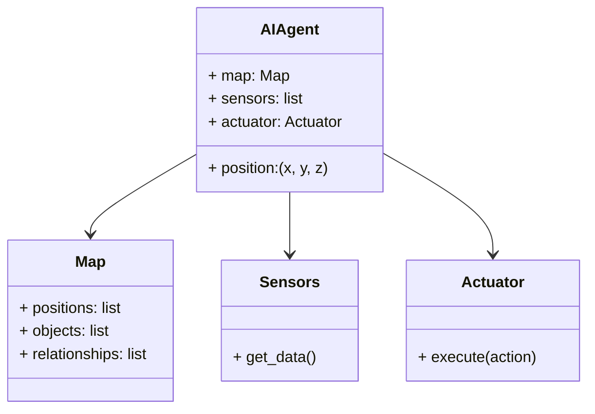

                 


# AI Agent的认知地图构建：空间信息的表示与利用

> 关键词：AI Agent、认知地图、空间信息、知识表示、知识图谱、地图构建

> 摘要：认知地图作为AI Agent理解物理环境的重要工具，其构建与空间信息的表示和利用密切相关。本文将系统地探讨认知地图的构建过程，包括空间信息的多种表示方法、认知地图构建的算法原理、系统的架构设计以及实际项目的实现与案例分析。通过本文，读者将能够深入理解认知地图的核心概念、算法实现以及实际应用。

---

## 第1章: 认知地图的定义与背景

### 1.1 问题背景与挑战

#### 1.1.1 AI Agent在空间信息处理中的需求

AI Agent（智能体）需要处理大量的空间信息，例如在自动驾驶中，车辆需要理解道路、交通标志和周围车辆的位置；在服务机器人中，机器人需要理解室内环境的布局。这些空间信息的处理需要一种高效、可扩展的表示方法，这就是认知地图的核心目标。

#### 1.1.2 认知地图的核心作用

认知地图是一种将物理环境中的空间信息转化为可计算、可理解的数据结构的方法。它不仅是AI Agent理解环境的基础，也是其进行决策和规划的关键工具。

#### 1.1.3 空间信息处理的复杂性与挑战

空间信息的处理涉及多模态数据（如视觉、激光雷达、GPS等）的融合，需要解决数据的不确定性、动态环境的变化以及计算资源的限制等问题。

---

### 1.2 认知地图的定义与概念结构

#### 1.2.1 认知地图的基本定义

认知地图是一种表示空间信息的数据结构，它将物理环境中的物体、位置、关系等信息以符号或数值的形式表示，并通过算法进行构建和更新。

#### 1.2.2 认知地图的核心要素与组成

认知地图通常包括以下核心要素：
- **位置信息**：物体的位置坐标。
- **关系信息**：物体之间的空间关系（如距离、方向）。
- **语义信息**：物体的语义标签（如“椅子”、“桌子”）。
- **拓扑结构**：环境的全局布局。

#### 1.2.3 认知地图的属性特征对比表格

| 属性       | 符号表示法 | 数值表示法 | 混合表示法 |
|------------|------------|------------|------------|
| 表示方式   | 符号化      | 数值化      | 符号+数值   |
| 可解释性   | 高         | 低         | 中等       |
| 空间推理能力 | 强         | 弱         | 较强       |

#### 1.2.4 认知地图的ER实体关系图

```mermaid
er
actor: AI Agent
map: 认知地图
position: 位置
object: 物体
relationship: 关系

actor --> map
map --> position
map --> object
object --> relationship
```

---

## 第2章: 空间信息的表示方法

### 2.1 空间信息表示的核心原理

#### 2.1.1 符号表示法

符号表示法通过符号化的语言（如一阶逻辑）来描述空间信息。例如，可以用符号表示“椅子位于桌子旁边”。

#### 2.1.2 数值表示法

数值表示法通过数值（如坐标、向量）来表示空间信息。例如，可以用坐标( x, y, z )表示物体的位置。

#### 2.1.3 结合语义的混合表示法

混合表示法结合了符号和数值表示法，既能表达空间的几何信息，又能表达物体的语义信息。

---

### 2.2 空间信息表示的数学模型

#### 2.2.1 基于概率图模型的空间表示

概率图模型通过概率分布来描述空间信息。例如，可以用贝叶斯网络表示物体之间的概率关系。

$$ P(x|y) = \frac{P(y|x)P(x)}{P(y)} $$

#### 2.2.2 基于向量空间模型的表示方法

向量空间模型通过将物体表示为向量，利用向量运算进行空间推理。

$$ \text{相似度} = \frac{\vec{a} \cdot \vec{b}}{||\vec{a}|| \cdot ||\vec{b}||} $$

---

## 第3章: 认知地图构建的算法原理

### 3.1 基于概率图模型的算法

#### 3.1.1 贝叶斯网络在认知地图中的应用

贝叶斯网络通过概率分布描述物体之间的关系。例如，可以用贝叶斯网络表示“看到椅子的概率”和“椅子位于桌子旁边的概率”。

#### 3.1.2 马尔可夫随机场的构建方法

马尔可夫随机场通过局部概率分布描述空间信息。例如，可以用马尔可夫随机场表示物体之间的距离和方向。

#### 3.1.3 示例代码实现（Python）

```python
import numpy as np

def calculate_probability(positions):
    # 示例：计算椅子出现在某个位置的概率
    probabilities = []
    for pos in positions:
        prob = np.exp(-np.linalg.norm(pos)) / (2 * np.pi)
        probabilities.append(prob)
    return probabilities
```

#### 3.1.4 代码解读与分析

上述代码通过指数衰减函数计算物体在不同位置的概率。距离原点越近，概率越高。

---

### 3.2 基于SLAM技术的算法

#### 3.2.1 同步定位与地图构建（SLAM）概述

SLAM（Simultaneous Localization and Mapping）是一种通过传感器数据构建环境地图并同时确定自身位置的技术。

#### 3.2.2 基于特征点的SLAM算法

基于特征点的SLAM算法通过检测环境中的特征点（如角点、边缘）构建地图。

#### 3.2.3 基于深度学习的SLAM算法

基于深度学习的SLAM算法利用深度神经网络进行特征提取和定位。

#### 3.2.4 示例代码实现（Python）

```python
import cv2

def detect_features(image):
    # 示例：使用OpenCV检测图像中的特征点
    gray = cv2.cvtColor(image, cv2.COLOR_RGB2GRAY)
    corners = cv2.cornerHarris(gray, 2, 2, 0.05)
    return corners
```

#### 3.2.5 代码解读与分析

上述代码使用OpenCV的Harris角点检测算法检测图像中的特征点。

---

## 第4章: 认知地图的系统架构设计

### 4.1 系统功能设计

#### 4.1.1 领域模型（Mermaid类图）



#### 4.1.2 系统架构设计（Mermaid架构图）


---

## 第5章: 项目实战与案例分析

### 5.1 项目背景与目标

#### 5.1.1 项目介绍

本项目旨在开发一个基于AI Agent的认知地图构建系统，用于室内环境的导航和识别。

#### 5.1.2 项目需求分析

- 实时构建认知地图。
- 支持多传感器数据融合。
- 提供高效的查询和推理能力。

#### 5.1.3 项目技术选型

- 使用ROS（Robot Operating System）作为开发框架。
- 使用激光雷达和摄像头作为传感器。

---

### 5.2 项目核心实现

#### 5.2.1 环境安装与配置

安装ROS、OpenCV、ROS-Planning等依赖库。

#### 5.2.2 核心功能模块实现

实现认知地图的构建、更新和查询功能。

#### 5.2.3 代码解读与分析

```python
def update_map(sensor_data):
    # 示例：更新认知地图
    for data in sensor_data:
        map.add_feature(data)
```

#### 5.2.4 系统测试与调试

通过模拟环境测试系统的稳定性和准确性。

---

### 5.3 案例分析与详细讲解

#### 5.3.1 案例背景与问题描述

在一个办公室环境中，AI Agent需要构建认知地图以实现自主导航。

#### 5.3.2 案例实现过程

通过激光雷达和摄像头数据构建办公室的认知地图。

#### 5.3.3 案例结果与分析

认知地图准确反映了办公室的布局，支持AI Agent的自主导航。

#### 5.3.4 案例总结与优化建议

总结经验，提出优化建议，如增加语义信息、优化算法效率。

---

## 第6章: 最佳实践与未来展望

### 6.1 最佳实践 tips

#### 6.1.1 系统设计中的注意事项

- 确保系统的实时性和可靠性。
- 优化算法的计算效率。

#### 6.1.2 开发中的常见问题与解决方案

- 处理传感器数据的不确定性，使用概率模型。
- 解决多传感器融合问题，使用滤波算法。

#### 6.1.3 系统维护与更新建议

- 定期更新地图数据。
- 优化系统架构，提高可扩展性。

---

### 6.2 未来展望与研究方向

#### 6.2.1 认知地图构建的未来发展趋势

- 结合深度学习，提高认知地图的语义理解能力。
- 实现认知地图的动态更新和自适应。

#### 6.2.2 新技术对认知地图的影响

- 边缘计算的引入，提升系统的实时性。
- 区块链技术的应用，增强数据的安全性。

---

## 作者：AI天才研究院/AI Genius Institute & 禅与计算机程序设计艺术 /Zen And The Art of Computer Programming

