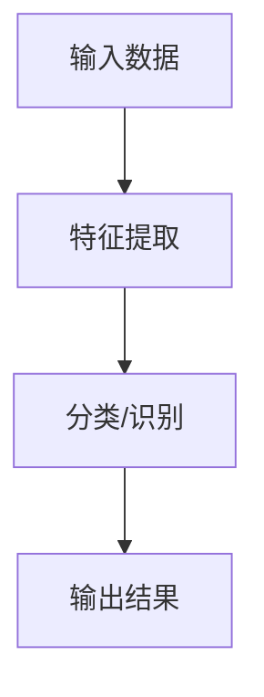
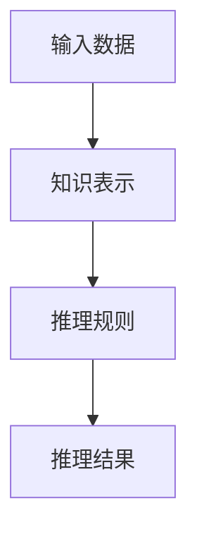
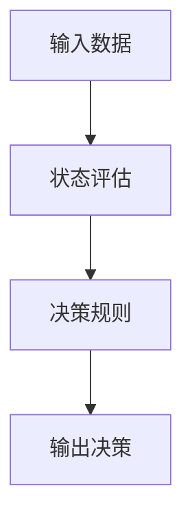
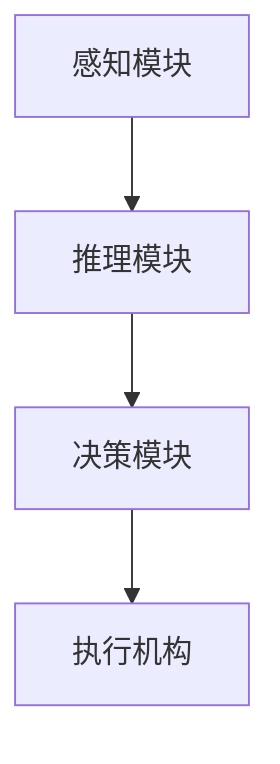
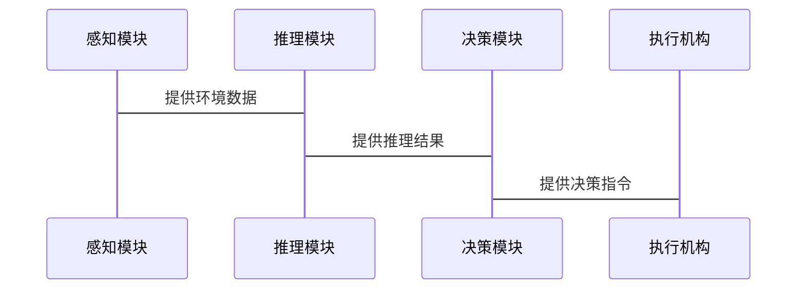

                 


# AI Agent的认知架构：从感知到决策的全流程设计

## 关键词：AI Agent、认知架构、感知、决策、算法原理、系统架构、项目实战

## 摘要：  
本文将详细探讨AI Agent的认知架构，从感知到决策的全流程设计。通过分析AI Agent的核心概念、算法原理、系统架构以及项目实战，全面揭示AI Agent从数据输入到最终决策的完整流程。文章结合理论与实践，通过具体的代码实现和案例分析，帮助读者深入理解AI Agent的认知架构设计。

---

# 第1章: AI Agent认知架构的背景介绍

## 1.1 问题背景与描述
### 1.1.1 AI Agent的定义与核心概念
AI Agent（人工智能代理）是指能够感知环境、自主决策并执行任务的智能实体。它通过与环境交互，利用感知数据进行推理和决策，以实现特定目标。AI Agent的核心概念包括：
- **自主性**：能够在没有外部干预的情况下独立运行。
- **反应性**：能够实时感知环境并做出响应。
- **目标导向**：所有行为都以实现特定目标为导向。

### 1.1.2 AI Agent在现代人工智能中的地位
AI Agent是实现人工智能应用的重要组成部分，广泛应用于自动驾驶、智能助手、机器人控制等领域。它通过整合感知、推理和决策模块，构建了一个从数据输入到目标实现的完整闭环系统。

### 1.1.3 从感知到决策的全流程问题描述
AI Agent的认知架构需要解决的核心问题包括：
1. **感知**：如何从环境中获取有效信息。
2. **推理**：如何基于感知数据进行逻辑推理。
3. **决策**：如何根据推理结果制定最优决策。

---

## 1.2 问题解决与边界
### 1.2.1 AI Agent的核心问题解决方法
AI Agent通过以下方法解决问题：
- **感知模块**：利用传感器或数据源获取环境信息。
- **推理模块**：基于知识库或规则系统进行逻辑推理。
- **决策模块**：根据推理结果选择最优行动方案。

### 1.2.2 认知架构的边界与外延
AI Agent的认知架构边界包括：
- **输入**：感知数据。
- **输出**：决策指令。
- **内部处理**：推理和决策过程。

认知架构的外延则包括与外部系统的交互接口和执行机构。

### 1.2.3 AI Agent与其他人工智能技术的区分
AI Agent与传统的人工智能技术相比，具有更强的自主性和目标导向性。它不仅仅是一个静态的知识库或算法，而是一个能够动态适应环境的智能实体。

---

## 1.3 概念结构与核心要素
### 1.3.1 AI Agent的认知模型
AI Agent的认知模型可以分为以下几个层次：
1. **感知层**：负责数据的采集和初步处理。
2. **推理层**：负责基于感知数据进行逻辑推理。
3. **决策层**：负责根据推理结果制定决策。

### 1.3.2 感知、推理、决策的核心要素
- **感知**：传感器或数据源。
- **推理**：知识库和推理规则。
- **决策**：决策策略和执行机构。

### 1.3.3 架构的层次与模块划分
AI Agent的认知架构可以分为以下几个模块：
1. **感知模块**：负责数据采集和特征提取。
2. **推理模块**：负责逻辑推理和知识处理。
3. **决策模块**：负责制定决策并输出指令。

---

## 1.4 本章小结
本章介绍了AI Agent的认知架构的背景、核心概念和基本结构。通过分析感知、推理和决策的核心要素，为后续章节的详细讨论奠定了基础。

---

# 第2章: AI Agent认知架构的核心概念与联系

## 2.1 核心概念原理
### 2.1.1 感知模块的原理
感知模块通过传感器或数据源获取环境信息，并对其进行特征提取和初步处理。例如，计算机视觉中的图像识别任务可以通过感知模块获取图像数据并提取关键特征。

### 2.1.2 推理模块的机制
推理模块基于知识库或规则系统，对感知数据进行逻辑推理。例如，自然语言处理中的语义理解任务可以通过推理模块分析文本语义并生成逻辑推理结果。

### 2.1.3 决策模块的策略
决策模块根据推理结果制定最优决策。例如，自动驾驶系统可以根据环境感知和逻辑推理结果，决策车辆的转向和加速。

---

## 2.2 核心概念属性对比
### 2.2.1 感知与推理的对比分析
| 属性 | 感知 | 推理 |
|------|------|------|
| 输入 | 环境数据 | 感知结果 |
| 输出 | 特征数据 | 推理结果 |
| 功能 | 数据采集 | 逻辑推理 |

### 2.2.2 推理与决策的关联性
推理模块的输出是决策模块的输入，两者之间存在密切的逻辑关系。推理结果的质量直接影响决策的正确性。

### 2.2.3 决策与执行的协同关系
决策模块的输出是执行机构的指令，决策的正确性依赖于执行机构的反馈。

---

## 2.3 ER实体关系图
```mermaid
er
actor(Agent, 感知数据, 推理结果, 决策指令)
```

---

## 2.4 本章小结
本章通过对比分析和ER实体关系图，详细探讨了AI Agent认知架构的核心概念及其之间的联系。

---

# 第3章: AI Agent认知架构的算法原理

## 3.1 感知算法
### 3.1.1 感知算法的流程图


### 3.1.2 感知算法的代码实现
```python
def 感知算法(输入数据):
    特征 = 提取特征(输入数据)
    结果 = 分类(特征)
    return 结果
```

---

## 3.2 推理算法
### 3.2.1 推理算法的流程图


### 3.2.2 推理算法的数学模型
$$ 推理结果 = 知识库 \times 推理规则 $$

---

## 3.3 决策算法
### 3.3.1 决策算法的流程图


### 3.3.2 决策算法的代码实现
```python
def 决策算法(输入数据):
    状态 = 状态评估(输入数据)
    决策 = 决策规则(状态)
    return 决策
```

---

## 3.4 算法实现代码示例
```python
def 分类(特征):
    return 分类器预测(特征)

def 知识表示(输入数据):
    return 知识库查询(输入数据)

def 推理规则(知识):
    return 推理引擎推理(知识)
```

---

## 3.5 本章小结
本章通过流程图和代码示例，详细介绍了AI Agent认知架构中感知、推理和决策算法的实现原理。

---

# 第4章: AI Agent认知架构的系统分析与架构设计

## 4.1 系统分析
### 4.1.1 问题场景介绍
以自动驾驶为例，AI Agent需要感知道路环境、推理车辆状态并做出决策。

### 4.1.2 系统功能设计
自动驾驶系统的功能包括：
1. 感知：车道线检测、障碍物识别。
2. 推理：车辆状态评估、路径规划。
3. 决策：转向控制、加速控制。

---

## 4.2 系统架构设计
### 4.2.1 系统架构图


### 4.2.2 接口设计
- 感知模块接口：提供环境数据。
- 推理模块接口：提供推理结果。
- 决策模块接口：提供决策指令。

---

## 4.3 交互流程
### 4.3.1 交互流程图


---

## 4.4 本章小结
本章通过系统分析和架构设计，详细探讨了AI Agent认知架构在实际应用中的实现方式。

---

# 第5章: AI Agent认知架构的项目实战

## 5.1 环境安装
安装所需的开发环境和依赖库，例如Python、TensorFlow、OpenCV等。

---

## 5.2 核心代码实现
### 5.2.1 感知模块实现
```python
import cv2

def 提取特征(图像):
    return cv2.cvtColor(图像, cv2.COLOR_BGR2GRAY)
```

### 5.2.2 推理模块实现
```python
from rules import 推理规则

def 推理(知识):
    return 推理规则(知识)
```

### 5.2.3 决策模块实现
```python
def 决策(状态):
    if 状态 == '危险':
        return '紧急制动'
    else:
        return '正常行驶'
```

---

## 5.3 案例分析
以自动驾驶为例，详细分析感知、推理和决策模块的实际应用。

---

## 5.4 项目总结
通过项目实战，验证了AI Agent认知架构的可行性和有效性。

---

## 5.5 本章小结
本章通过项目实战，展示了AI Agent认知架构在实际应用中的具体实现。

---

# 第6章: AI Agent认知架构的最佳实践与展望

## 6.1 最佳实践Tips
- **模块化设计**：确保各模块之间的耦合性低。
- **数据质量管理**：确保感知数据的准确性和完整性。
- **算法优化**：通过不断优化算法提升系统性能。

## 6.2 小结
AI Agent的认知架构是一个复杂的系统工程，需要从感知、推理到决策的全流程设计。

## 6.3 注意事项
- 确保系统安全性。
- 处理好模块之间的边界问题。
- 定期更新知识库和规则系统。

## 6.4 拓展阅读
推荐相关领域的书籍和论文，帮助读者进一步深入学习。

---

# 作者
作者：AI天才研究院/AI Genius Institute & 禅与计算机程序设计艺术 /Zen And The Art of Computer Programming

