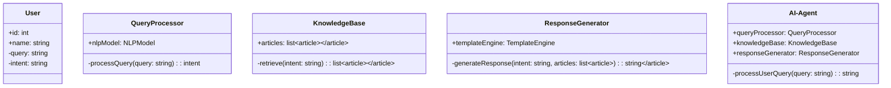
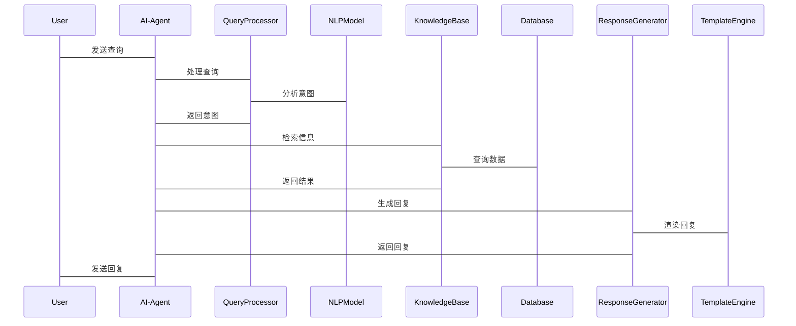

                 


# AI Agent的认知架构：模拟人类思维过程

**关键词**：AI Agent, 认知架构, 人类思维, 人工智能, 算法原理

**摘要**：  
本文将探讨AI Agent的认知架构，模拟人类思维过程，从背景介绍、核心概念到算法原理、系统架构，再到项目实战和最佳实践，全面解析AI Agent的认知架构设计与实现。通过深入分析认知架构的核心要素、算法原理、系统设计和实际应用，帮助读者理解如何构建具备人类思维能力的AI Agent。

---

# 引言

AI Agent（人工智能代理）是一种能够感知环境、自主决策并执行任务的智能实体。它模拟人类思维过程，通过感知、推理、决策和行动来完成目标。本文将从认知架构的角度，详细探讨AI Agent的设计与实现，帮助读者理解其背后的原理和应用。

---

## 第1章: AI Agent的基本概念与背景

### 1.1 AI Agent的定义与起源

#### 1.1.1 什么是AI Agent
AI Agent是一种能够感知环境、自主决策并执行任务的智能实体。它通过与环境交互，利用感知信息进行推理，制定决策并执行动作，以实现特定目标。

#### 1.1.2 AI Agent的起源与发展
AI Agent的概念起源于人工智能研究的早期，经历了从基于规则的专家系统到基于学习和推理的智能体的演变。近年来，随着深度学习和强化学习的兴起，AI Agent的能力得到了显著提升。

#### 1.1.3 当前AI Agent的应用现状
当前，AI Agent广泛应用于自动驾驶、智能助手、机器人、游戏AI等领域。它通过模拟人类思维，能够处理复杂任务，提供智能化服务。

---

### 1.2 AI Agent的认知架构

#### 1.2.1 认知架构的定义
认知架构是AI Agent的核心，它定义了代理如何处理信息、推理和决策。认知架构通过整合感知、知识表示、推理、决策和行动模块，模拟人类的认知过程。

#### 1.2.2 AI Agent的认知模型
AI Agent的认知模型包括感知模块、知识表示模块、推理模块、决策模块和行动模块。这些模块协同工作，实现从感知到行动的闭环。

#### 1.2.3 认知架构的核心要素
认知架构的核心要素包括：
- **感知**：获取环境信息。
- **知识表示**：存储和表示知识。
- **推理**：基于知识进行推理。
- **决策**：制定行动方案。
- **行动**：执行决策。

---

### 1.3 AI Agent的分类与应用领域

#### 1.3.1 基于任务的AI Agent
基于任务的AI Agent专注于完成特定任务，例如自动邮件分类器和文档处理系统。

#### 1.3.2 基于知识的AI Agent
基于知识的AI Agent利用知识库进行推理和决策，例如智能问答系统和专家系统。

#### 1.3.3 基于学习的AI Agent
基于学习的AI Agent通过机器学习算法从数据中学习知识，例如图像识别和自然语言处理中的AI Agent。

---

## 第2章: AI Agent的认知模型与数学基础

### 2.1 认知模型的数学表示

#### 2.1.1 状态空间模型
状态空间模型将环境表示为一个状态空间，AI Agent通过感知当前状态，选择动作以达到目标状态。数学表示为：
$$ s_{t+1} = f(s_t, a_t) $$
其中，$s_t$ 表示当前状态，$a_t$ 表示动作，$f$ 表示状态转移函数。

#### 2.1.2 行为模型
行为模型描述AI Agent的动作如何影响环境。数学表示为：
$$ r_t = R(s_t, a_t) $$
其中，$R$ 表示奖励函数，$r_t$ 表示奖励值。

#### 2.1.3 目标函数与优化
目标函数定义了AI Agent的优化目标。例如，强化学习中的目标函数可以表示为：
$$ J(\theta) = \mathbb{E}[R] $$
其中，$\theta$ 表示参数，$\mathbb{E}[R]$ 表示奖励的期望值。

---

### 2.2 AI Agent的决策过程

#### 2.2.1 知识表示与推理
知识表示是认知架构的核心，常用的表示方法包括谓词逻辑、语义网络和描述逻辑。推理过程可以通过逻辑推理算法实现，例如：
$$ \text{如果 } P \text{ 且 } Q，那么 R $$
其中，$P$、$Q$ 和 $R$ 是逻辑命题。

#### 2.2.2 感知与状态识别
感知模块通过传感器或数据输入获取环境信息，并将其转换为状态表示。例如，图像识别任务中，AI Agent通过卷积神经网络（CNN）将图像转换为特征向量。

#### 2.2.3 决策与行动
决策模块基于当前状态和目标，选择最优动作。例如，强化学习中的策略函数可以表示为：
$$ \pi(a|s) = P(a|s) $$
其中，$\pi$ 表示策略函数，$a$ 表示动作，$s$ 表示状态。

---

### 2.3 AI Agent的认知架构核心算法

#### 2.3.1 逻辑推理算法
逻辑推理算法基于谓词逻辑进行推理，例如：
$$ \text{如果 } A \text{ 并且 } B，那么 C $$
其中，$A$、$B$ 和 $C$ 是逻辑命题。

#### 2.3.2 学习算法
学习算法包括监督学习、无监督学习和强化学习。例如，监督学习中的线性回归模型可以表示为：
$$ y = \theta x + b $$
其中，$\theta$ 表示权重，$x$ 表示输入，$b$ 表示偏置。

#### 2.3.3 行为决策算法
行为决策算法包括基于规则的决策树和基于学习的策略网络。例如，决策树可以表示为：
$$ \text{如果 } X > Y，那么 \text{执行动作 } A \text{，否则执行动作 } B $$

---

## 第3章: AI Agent的核心算法原理

### 3.1 逻辑推理算法

#### 3.1.1 基于逻辑的推理模型
基于逻辑的推理模型通过谓词逻辑进行推理，例如：
$$ \text{如果 } P(a) \text{ 并且 } Q(b)，那么 R(a, b) $$
其中，$P$ 和 $Q$ 是谓词，$a$ 和 $b$ 是个体。

#### 3.1.2 逻辑推理的数学表示
逻辑推理的数学表示可以使用逻辑符号表示，例如：
$$ P \land Q \rightarrow R $$
其中，$\land$ 表示逻辑与，$\rightarrow$ 表示逻辑蕴含。

#### 3.1.3 逻辑推理的实现步骤
1. 建立知识库。
2. 推理引擎通过谓词逻辑进行推理。
3. 输出推理结果。

---

### 3.2 学习算法

#### 3.2.1 监督学习算法
监督学习算法通过训练数据学习模型参数，例如：
$$ y = \theta x + b $$
其中，$\theta$ 和 $b$ 是模型参数，$x$ 是输入，$y$ 是输出。

#### 3.2.2 无监督学习算法
无监督学习算法通过聚类或降维技术发现数据的内在结构，例如：
$$ z = \mu + \sigma \cdot \epsilon $$
其中，$\mu$ 是均值，$\sigma$ 是标准差，$\epsilon$ 是随机噪声。

#### 3.2.3 强化学习算法
强化学习算法通过与环境交互学习策略，例如：
$$ Q(s, a) = r + \gamma \max_{a'} Q(s', a') $$
其中，$Q$ 表示Q值函数，$s$ 表示状态，$a$ 表示动作，$\gamma$ 表示折扣因子。

---

### 3.3 行为决策算法

#### 3.3.1 基于规则的决策算法
基于规则的决策算法通过预定义的规则进行决策，例如：
$$ \text{如果 } P \text{ 并且 } Q，那么 R $$
其中，$P$ 和 $Q$ 是条件，$R$ 是动作。

#### 3.3.2 基于学习的决策算法
基于学习的决策算法通过机器学习模型学习决策策略，例如：
$$ \pi(a|s) = \text{softmax}(W s) $$
其中，$W$ 是权重矩阵，$s$ 是状态向量。

#### 3.3.3 基于模糊逻辑的决策算法
基于模糊逻辑的决策算法通过模糊推理进行决策，例如：
$$ \text{如果 } X \text{ 是 } A，那么 Y \text{ 是 } B $$
其中，$A$ 和 $B$ 是模糊集合，$X$ 和 $Y$ 是变量。

---

## 第4章: AI Agent的认知架构系统设计

### 4.1 问题场景介绍

假设我们正在开发一个智能助手AI Agent，用于处理用户的自然语言查询。AI Agent需要能够理解用户的意图，检索相关信息，并生成自然的回复。

---

### 4.2 系统功能设计

#### 4.2.1 领域模型类图
以下是领域模型类图：



---

#### 4.2.2 系统架构设计

以下是系统架构图：


---

#### 4.2.3 系统接口设计

以下是系统接口设计：



---

## 第5章: AI Agent的认知架构项目实战

### 5.1 环境安装

安装Python和必要的库：
```bash
pip install numpy
pip install scikit-learn
pip install tensorflow
```

---

### 5.2 核心代码实现

以下是实现AI Agent的Python代码示例：

```python
import numpy as np
from sklearn.tree import DecisionTreeClassifier
from tensorflow.keras.models import Sequential
from tensorflow.keras.layers import Dense

# 示例：基于规则的决策算法
def rule_based_decision(x):
    if x > 0.5:
        return "执行动作A"
    else:
        return "执行动作B"

# 示例：基于学习的决策算法
def neural_network_decision(x):
    model = Sequential()
    model.add(Dense(1, input_dim=1, activation='sigmoid'))
    model.compile(loss='binary_crossentropy', optimizer='adam')
    model.fit(x, y, epochs=100)
    return model.predict(x)

# 示例：基于逻辑的推理算法
def logical_reasoning(p, q):
    if p and q:
        return "结果R"
    else:
        return "结果S"
```

---

### 5.3 代码解读与分析

1. **基于规则的决策算法**：通过预定义规则进行决策，简单易懂，但缺乏灵活性。
2. **基于学习的决策算法**：通过神经网络学习决策策略，能够处理复杂任务，但需要大量数据和计算资源。
3. **基于逻辑的推理算法**：通过逻辑推理得出结论，适用于规则明确的任务。

---

### 5.4 实际案例分析

以智能助手为例，用户输入查询“附近的餐厅”，AI Agent需要：
1. **感知**：接收查询内容。
2. **推理**：分析用户的意图。
3. **决策**：选择最优餐厅。
4. **行动**：返回餐厅信息。

---

## 第6章: AI Agent的认知架构最佳实践

### 6.1 小结

本文从认知架构的角度，详细探讨了AI Agent的设计与实现。通过背景介绍、核心概念、算法原理、系统设计和项目实战，帮助读者理解如何构建具备人类思维能力的AI Agent。

---

### 6.2 注意事项

- **数据质量**：确保训练数据的准确性和多样性。
- **模型选择**：根据任务需求选择合适的算法。
- **系统优化**：优化系统性能和用户体验。

---

### 6.3 拓展阅读

- 《人工智能：一种现代方法》
- 《机器学习实战》
- 《深度学习》

---

## 结语

AI Agent的认知架构模拟了人类思维过程，通过感知、推理和决策实现智能化任务。随着技术的发展，AI Agent将在更多领域得到应用，为人类创造更大的价值。

---

**作者：AI天才研究院/AI Genius Institute & 禅与计算机程序设计艺术 /Zen And The Art of Computer Programming**

