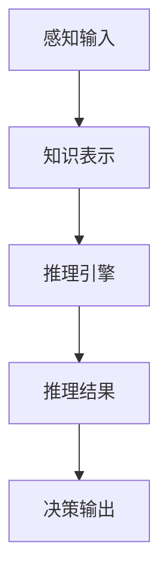
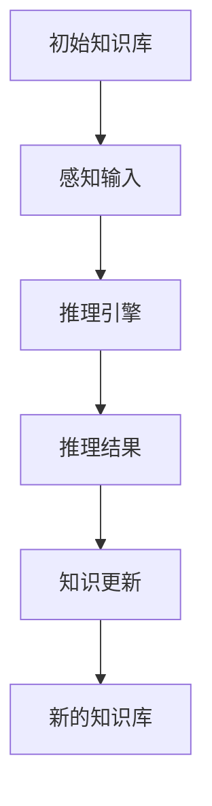
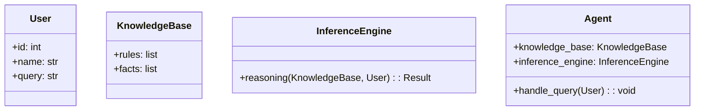
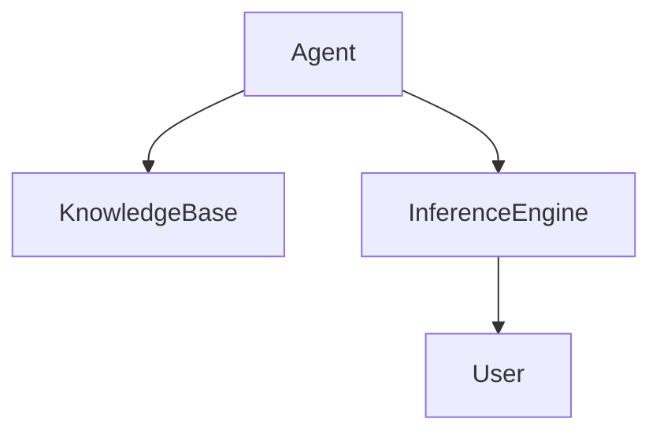
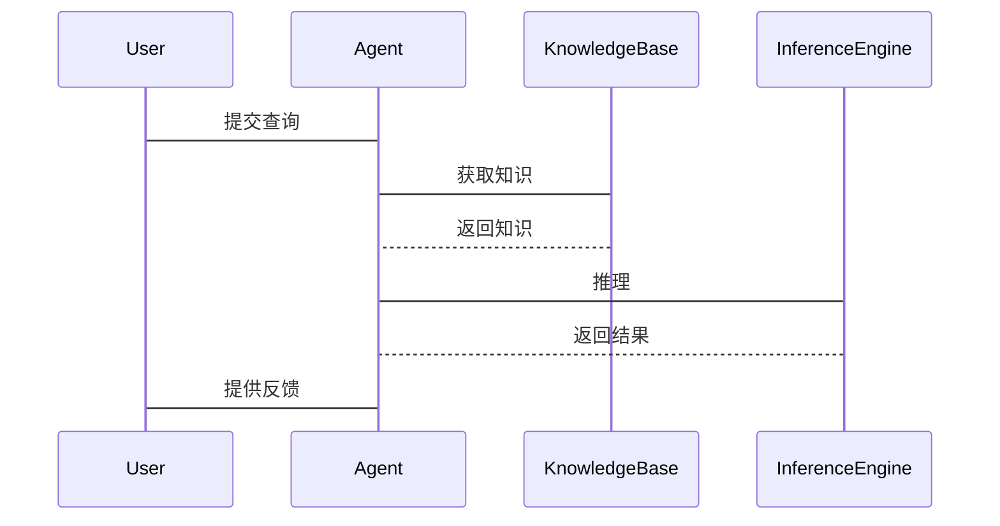

                 


# AI Agent的认知计算与心智模型构建

> 关键词：AI Agent, 认知计算, 心智模型, 算法原理, 系统架构, 项目实战

> 摘要：本文将探讨AI Agent的认知计算与心智模型构建的各个方面，从背景介绍到算法原理，再到系统设计和项目实战，帮助读者全面理解这一领域的核心概念和技术实现。

---

## 第一部分: AI Agent的认知计算与心智模型背景

### 第1章: AI Agent的定义与背景

#### 1.1 AI Agent的基本概念
AI Agent（人工智能代理）是指能够感知环境、自主决策并执行任务的智能实体。它可以是一个软件程序、机器人或其他智能系统，具备以下核心特征：
- **自主性**：无需外部干预，自主决策。
- **反应性**：能实时感知环境并做出反应。
- **目标导向**：通过目标驱动行为。
- **学习能力**：通过经验改进性能。

AI Agent的应用场景广泛，包括自动驾驶、智能助手、机器人控制、游戏AI等。

#### 1.2 认知计算的背景与发展
认知计算是一种模拟人类认知过程的计算方式，旨在通过模拟人类的感知、推理、学习等能力，实现更智能的系统。其发展历程可以分为以下几个阶段：
1. **符号逻辑阶段**：基于逻辑推理的AI研究。
2. **机器学习阶段**：通过数据学习模式。
3. **深度学习阶段**：利用神经网络模拟人类学习。
4. **认知计算阶段**：结合符号逻辑和深度学习，实现更复杂的认知任务。

认知计算与传统计算的主要区别在于，认知计算强调模拟人类思维过程，而非单纯基于规则的计算。

#### 1.3 心智模型构建的背景
心智模型是描述人类认知过程的数学模型，旨在模拟人类如何感知、推理、决策和学习。在AI领域，心智模型构建的目标是让AI Agent具备类似人类的思维能力，从而更好地理解和处理复杂任务。

---

## 第二部分: AI Agent的认知计算与心智模型的核心概念

### 第2章: 认知计算的核心概念

#### 2.1 认知计算的原理
认知计算通过模拟人类的认知过程，结合符号逻辑和机器学习，实现更智能的决策。其主要原理包括：
- **符号推理**：通过逻辑规则进行推理。
- **知识表示**：将知识表示为符号或概念图。
- **学习与适应**：通过机器学习技术更新知识库。

认知计算的核心是将符号逻辑与机器学习相结合，实现更高效的知识处理和推理。

#### 2.2 心智模型的构建要素
心智模型的构建需要考虑以下几个要素：
- **感知**：通过传感器或数据输入获取信息。
- **推理**：基于知识库进行逻辑推理。
- **决策**：根据推理结果做出决策。
- **学习**：通过经验更新知识库和推理模型。

心智模型的层次结构通常包括感知层、知识层、推理层和决策层。

---

## 第三部分: AI Agent的认知计算与心智模型的算法原理

### 第3章: 认知计算的核心算法

#### 3.1 认知推理算法
认知推理算法通过符号逻辑和概率推理，结合机器学习技术，实现更准确的推理。以下是认知推理算法的流程：



算法代码实现：

```python
def cognitive_inference(knowledge_base, input_data):
    # 知识库表示为符号逻辑
    knowledge = parse_knowledge_base(knowledge_base)
    # 推理过程
    result = inference_engine(knowledge, input_data)
    return result
```

数学模型：

$$ \text{推理结果} = f(\text{知识库}, \text{输入数据}) $$

#### 3.2 心智模拟算法
心智模拟算法通过模拟人类的认知过程，实现心智模型的构建和更新。以下是心智模拟算法的流程：



算法代码实现：

```python
def mind_simulation(knowledge_base, input_data, learning_rate):
    # 知识库更新
    updated_knowledge = update_knowledge(knowledge_base, input_data, learning_rate)
    return updated_knowledge
```

数学模型：

$$ \text{知识更新} = g(\text{知识库}, \text{输入数据}, \text{学习率}) $$

---

## 第四部分: AI Agent的认知计算与心智模型的系统设计

### 第4章: 系统分析与架构设计

#### 4.1 问题场景介绍
我们以一个智能客服系统为例，探讨如何构建AI Agent的认知模型。系统需要处理用户的咨询、解决问题并提供反馈。

#### 4.2 系统功能设计
系统功能包括：
- 用户咨询处理
- 自然语言理解
- 问题推理与解决
- 反馈生成

领域模型类图：



系统架构图：



接口设计和交互流程图：



---

## 第五部分: AI Agent的认知计算与心智模型的项目实战

### 第5章: 项目实战

#### 5.1 环境安装
- 安装Python和必要的库（如TensorFlow、Numpy等）
- 安装Mermaid和相关工具

#### 5.2 系统核心实现
以下是认知推理引擎的代码实现：

```python
class InferenceEngine:
    def __init__(self, knowledge_base):
        self.knowledge_base = knowledge_base

    def reason(self, input_data):
        # 简单的推理逻辑
        for rule in self.knowledge_base['rules']:
            if rule['condition'](input_data):
                return rule['action'](input_data)
        return default_response
```

代码解读：
- `InferenceEngine`类初始化时加载知识库。
- `reason`方法根据输入数据进行推理，返回结果。

#### 5.3 实际案例分析
以用户查询“如何重置密码？”为例，系统会根据知识库中的规则进行推理，提供相应的解决方案。

#### 5.4 项目小结
通过实战项目，我们可以看到认知计算与心智模型在实际应用中的潜力，但也需要解决知识库构建、推理效率等问题。

---

## 第六部分: 最佳实践

### 第6章: 小结与注意事项

- **小结**：本文详细介绍了AI Agent的认知计算与心智模型构建，涵盖从理论到实践的各个方面。
- **注意事项**：
  - 知识库的质量直接影响推理的准确性。
  - 推理算法的效率影响系统的实时性。
  - 数据隐私和安全问题需高度重视。

### 第7章: 拓展阅读

- 推荐书籍：《The Society of Mind》、《Cognitive Computing》
- 推荐论文：相关领域的最新研究成果
- 在线资源：相关课程和工具的使用指南

---

## 作者信息

作者：AI天才研究院/AI Genius Institute & 禅与计算机程序设计艺术 /Zen And The Art of Computer Programming

---

通过以上目录和内容，读者可以系统地了解AI Agent的认知计算与心智模型构建的各个方面，从理论到实践，逐步掌握这一领域的核心技术和应用方法。

