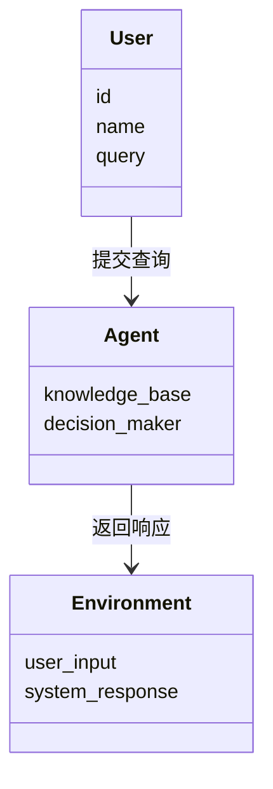
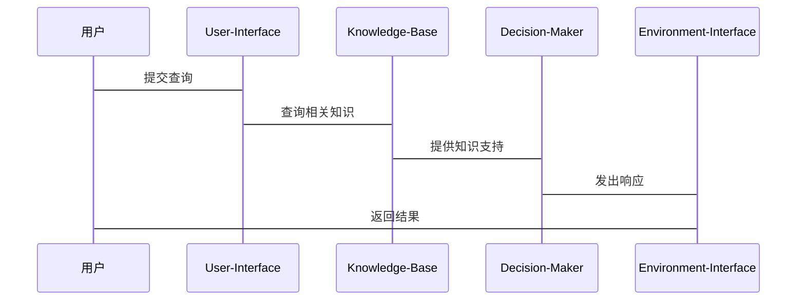

                 


```markdown
# AI Agent的认知计算：模拟人类思维过程

> 关键词：AI Agent，认知计算，知识表示，逻辑推理，强化学习，系统架构，项目实战

> 摘要：AI Agent作为一种模拟人类思维过程的智能体，其认知计算能力是实现智能化的关键。本文详细探讨了AI Agent的核心概念、算法原理、系统架构以及项目实战，通过理论与实践相结合的方式，帮助读者深入理解AI Agent的认知计算过程。

---

## 第一部分: AI Agent的认知计算基础

### 第1章: AI Agent的基本概念

#### 1.1 什么是AI Agent
AI Agent（智能体）是一种能够感知环境并采取行动以实现目标的实体。它通过与环境交互，利用感知信息进行推理和决策，最终完成特定任务。

#### 1.2 AI Agent的核心特征
- **自主性**：能够在没有外部干预的情况下独立运作。
- **反应性**：能够实时感知环境并做出反应。
- **目标导向性**：基于目标驱动行为。
- **学习能力**：通过经验改进自身性能。

#### 1.3 AI Agent与传统AI的区别
传统AI主要依赖规则和预设程序，而AI Agent具备自主性和适应性，能够根据环境动态调整行为。

### 第2章: 认知计算的基本原理

#### 2.1 认知计算的定义
认知计算是模拟人类认知过程的计算方式，涉及感知、推理、学习等多方面。

#### 2.2 认知计算的核心要素
- **知识表示**：将知识以结构化形式存储。
- **推理机制**：从已知信息推导出新结论。
- **学习能力**：通过经验改进认知模型。

#### 2.3 AI Agent的认知模型
AI Agent的认知模型包括知识表示、感知与决策、学习与自适应三个主要部分。

---

## 第二部分: AI Agent的认知计算核心概念

### 第3章: 知识表示与推理

#### 3.1 知识表示的多样性
知识可以以多种方式表示，包括符号表示、语义网络、知识图谱等。

#### 3.2 推理机制的分类
- **逻辑推理**：基于逻辑规则进行推导。
- **概率推理**：基于概率论进行推断。
- **默认推理**：基于常识和默认假设进行推导。

#### 3.3 知识图谱的应用
知识图谱通过结构化的知识表示，为AI Agent提供了丰富的背景知识。

### 第4章: 感知与决策

#### 4.1 感知系统的层次结构
感知系统通常包括数据采集、特征提取、理解与解释三个层次。

#### 4.2 决策树与策略网络
- **决策树**：基于规则的决策方法。
- **策略网络**：基于深度学习的端到端决策模型。

#### 4.3 多目标优化
在复杂的环境中，AI Agent需要同时优化多个目标，采用多目标优化算法。

### 第5章: 学习与自适应

#### 5.1 监督学习与无监督学习
- **监督学习**：基于标记数据进行学习。
- **无监督学习**：从无标记数据中发现模式。

#### 5.2 强化学习的机制
通过与环境交互，AI Agent通过试错学习，优化其行为策略。

#### 5.3 迁移学习的应用
将已有的知识迁移到新任务中，提高学习效率。

---

## 第三部分: AI Agent的认知计算算法原理

### 第6章: 知识表示与推理算法

#### 6.1 逻辑推理算法
- **命题逻辑推理**：基于命题逻辑进行推导。
- **谓词逻辑推理**：基于谓词逻辑进行推导。

#### 6.2 概率推理算法
- **贝叶斯网络**：基于概率图模型进行推理。
- **马尔可夫链**：基于马尔可夫假设进行推理。

#### 6.3 知识图谱构建算法
- **本体构建算法**：通过本体构建工具构建知识图谱。
- **图嵌入算法**：将知识图谱中的实体和关系表示为向量。

### 第7章: 感知与决策算法

#### 7.1 基于感知的决策树算法
通过感知信息构建决策树，进行分类或回归。

#### 7.2 基于强化学习的策略网络
使用深度强化学习算法，如DQN，训练策略网络。

#### 7.3 多目标优化算法
使用多目标优化算法，如Pareto优化，同时优化多个目标。

### 第8章: 学习与自适应算法

#### 8.1 监督学习算法
- **线性回归**：用于回归任务。
- **支持向量机**：用于分类任务。

#### 8.2 强化学习算法
- **Q-learning**：基于Q值的强化学习算法。
- **Deep Q-Networks (DQN)**：基于深度神经网络的强化学习算法。

#### 8.3 迁移学习算法
- **迁移学习框架**：将知识迁移到新任务中。
- **领域适配算法**：调整模型以适应新领域。

---

## 第四部分: AI Agent的认知计算系统架构

### 第9章: 问题场景介绍

#### 9.1 问题背景
假设我们正在开发一个智能客服AI Agent，能够理解用户问题并提供解决方案。

#### 9.2 项目介绍
项目目标是设计一个基于认知计算的智能客服系统。

### 第10章: 系统功能设计

#### 10.1 领域模型设计
使用Mermaid类图描述系统功能模块及其关系。



#### 10.2 系统架构设计
使用Mermaid架构图描述系统架构。


#### 10.3 系统接口设计
系统接口包括用户接口、知识库接口、环境接口等。

#### 10.4 系统交互设计
使用Mermaid序列图描述系统交互流程。



---

## 第五部分: AI Agent的认知计算项目实战

### 第11章: 环境安装与配置

#### 11.1 安装Python环境
使用Anaconda安装Python 3.8及以上版本。

#### 11.2 安装依赖库
安装numpy、pandas、scikit-learn、tensorflow等库。

### 第12章: 核心代码实现

#### 12.1 知识表示与推理代码
```python
class KnowledgeBase:
    def __init__(self):
        self.graph = {}

    def add_edge(self, source, target):
        if source not in self.graph:
            self.graph[source] = []
        self.graph[source].append(target)

    def get_neighbors(self, node):
        return self.graph.get(node, [])
```

#### 12.2 强化学习代码
```python
import numpy as np

class DQN:
    def __init__(self, state_size, action_size):
        self.state_size = state_size
        self.action_size = action_size
        self.gamma = 0.99
        self.epsilon = 1.0
        self.model = self._build_model()

    def _build_model(self):
        # 简单的神经网络模型
        model = tf.keras.Sequential([
            tf.keras.layers.Dense(32, activation='relu', input_dim=self.state_size),
            tf.keras.layers.Dense(self.action_size, activation='linear')
        ])
        model.compile(optimizer='adam', loss='mean_squared_error')
        return model

    def remember(self, state, action, reward, next_state):
        # 简单记忆机制，实际应用中需要更复杂的实现
        pass

    def act(self, state):
        if np.random.random() < self.epsilon:
            return np.random.randint(self.action_size)
        prediction = self.model.predict(np.array([state]))
        return np.argmax(prediction[0])

    def replay(self, batch_size):
        # 简单的重放机制，实际应用中需要更复杂的实现
        pass
```

#### 12.3 系统交互代码
```python
class Agent:
    def __init__(self):
        self.knowledge_base = KnowledgeBase()
        self.dqn = DQN(state_size=..., action_size=...)

    def process_query(self, query):
        # 简单的处理逻辑，实际应用中需要更复杂的实现
        pass
```

### 第13章: 代码解读与分析

#### 13.1 知识表示代码解读
KnowledgeBase类用于管理知识图谱，支持添加边和获取邻居节点。

#### 13.2 强化学习代码解读
DQN类实现了深度强化学习的基本结构，包括模型构建、记忆机制和重放机制。

### 第14章: 实际案例分析

#### 14.1 案例背景
设计一个智能客服系统，帮助用户解答技术问题。

#### 14.2 系统实现
实现用户查询处理、知识库查询、决策制定和系统响应等模块。

#### 14.3 代码实现
```python
def main():
    agent = Agent()
    while True:
        query = input("请输入问题：")
        agent.process_query(query)

if __name__ == "__main__":
    main()
```

### 第15章: 项目小结

#### 15.1 核心实现总结
- 知识表示与推理
- 强化学习算法实现
- 系统交互设计

#### 15.2 经验与教训
- 知识库构建的复杂性
- 强化学习算法的训练难度
- 系统交互的协调性

---

## 第六部分: AI Agent的认知计算最佳实践

### 第16章: 小结与总结

#### 16.1 小结
AI Agent的认知计算涉及知识表示、推理、感知、决策、学习和自适应等多个方面。

#### 16.2 总结
通过理论与实践的结合，我们深入理解了AI Agent的认知计算过程，并掌握了其实现方法。

### 第17章: 注意事项

#### 17.1 开发注意事项
- 确保知识表示的准确性
- 设计高效的推理算法
- 选择合适的强化学习算法

#### 17.2 部署注意事项
- 确保系统的可扩展性
- 保证系统的健壮性
- 定期更新知识库

### 第18章: 拓展阅读

#### 18.1 推荐书籍
- 《人工通用智能：概念、算法与技术》
- 《深度学习》

#### 18.2 推荐论文
- "A Survey on Deep Learning for NLP"
- "Reinforcement Learning: Theory and Algorithms"

---

## 作者

作者：AI天才研究院/AI Genius Institute & 禅与计算机程序设计艺术 /Zen And The Art of Computer Programming

---

**注**：以上内容是一个详细的目录大纲和文章草稿示例，实际文章需要根据具体需求进一步扩展和细化。如果需要更详细的某个部分，请进一步明确需求。
```

