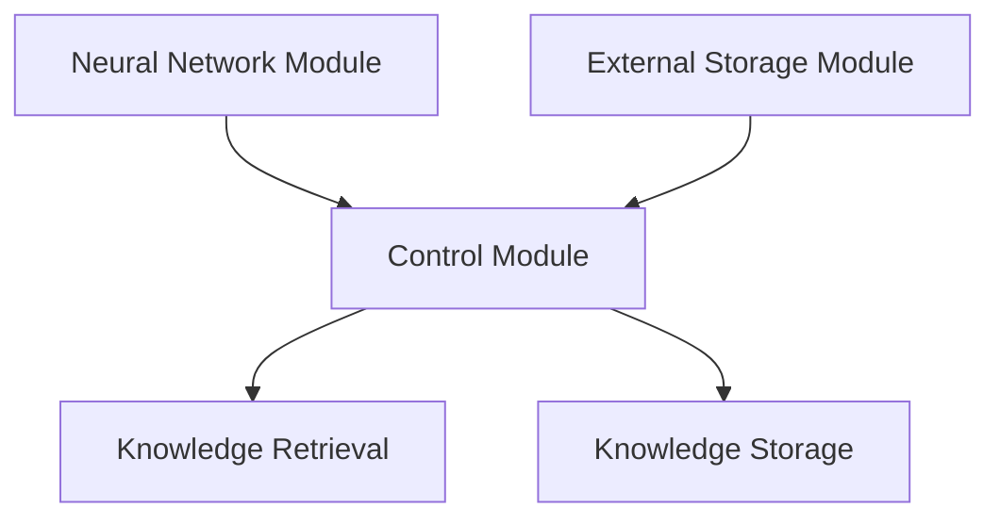
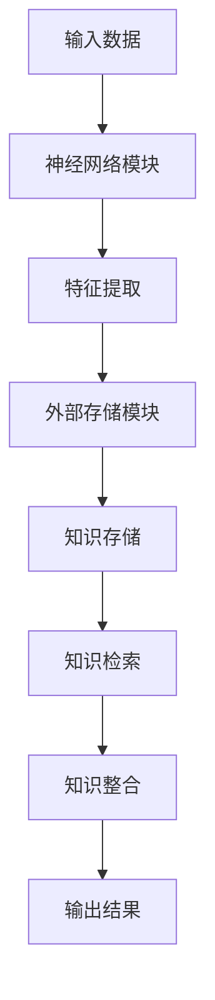
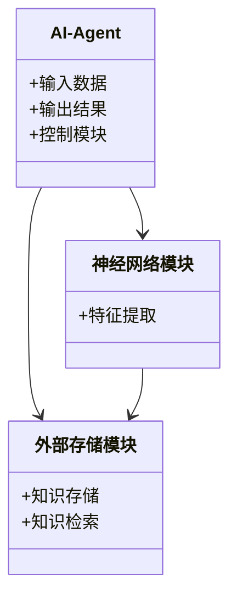

                 


# AI Agent的记忆增强网络：长期知识存储与检索

**关键词**：AI Agent, 记忆增强网络, 长期知识存储, 知识检索, 神经网络机制, 系统架构设计

**摘要**：本文详细探讨了AI Agent的记忆增强网络在长期知识存储与检索中的应用。通过分析记忆增强网络的核心概念、算法原理、系统架构设计以及项目实战，本文为读者提供了从理论到实践的全面指南。文章还结合实际案例，深入解读了记忆增强网络的实现细节，并提出了优化建议。

---

## 第1章：记忆增强网络的背景与挑战

### 1.1 问题背景

AI Agent（人工智能代理）作为一类能够感知环境、执行任务并做出决策的智能系统，近年来在多个领域得到了广泛应用。然而，AI Agent在处理复杂任务时，常常面临知识存储与检索的挑战。传统的存储方式难以应对海量数据的高效存储与快速检索，这限制了AI Agent的长期学习能力和智能水平。

#### 1.1.1 AI Agent的发展现状

AI Agent的发展经历了多个阶段，从简单的规则驱动系统到复杂的深度学习模型，AI Agent的能力得到了显著提升。然而，随着应用场景的扩展，AI Agent需要处理的数据量急剧增加，传统的存储方式逐渐暴露出效率低下、容量有限等问题。

#### 1.1.2 长期知识存储与检索的必要性

在现实应用中，AI Agent需要处理的任务往往具有长期性和复杂性。例如，在医疗诊断中，AI Agent需要存储和检索大量的病历数据；在金融领域，AI Agent需要处理长期的交易记录。这些任务要求AI Agent具备高效的长期知识存储与检索能力。

#### 1.1.3 当前技术的局限性

现有的知识存储与检索技术存在以下问题：
- 数据存储效率低下，难以应对海量数据的存储需求；
- 知识检索的准确性和效率不高，难以满足实时性要求；
- 知识表示方式单一，难以应对复杂场景下的多样化需求。

### 1.2 问题描述

AI Agent的记忆增强网络需要解决以下问题：
- 如何高效地存储海量知识；
- 如何快速准确地检索所需知识；
- 如何动态更新和维护存储的知识。

### 1.3 问题解决

#### 1.3.1 记忆增强网络的提出

记忆增强网络（Memory Augmented Neural Network，MANN）是一种结合了传统神经网络和外部存储结构的新型网络架构。通过引入外部存储设备，MANN能够有效地存储和检索长期知识。

#### 1.3.2 技术路线的选择

本文选择基于神经网络的记忆增强网络作为技术路线，结合外部存储设备和神经网络的自适应学习能力，构建高效的长期知识存储与检索系统。

#### 1.3.3 解决方案的可行性分析

记忆增强网络结合了神经网络的自适应学习能力和外部存储设备的高效存储特性，能够有效地解决长期知识存储与检索问题。该方案具有较高的可行性和应用潜力。

### 1.4 边界与外延

#### 1.4.1 记忆增强网络的边界

记忆增强网络的边界包括：
- 数据存储的范围和类型；
- 知识检索的范围和精度；
- 网络架构的复杂度和规模。

#### 1.4.2 相关概念的外延

记忆增强网络的相关概念包括：
- 外部存储设备：如数据库、分布式存储系统等；
- 神经网络：如卷积神经网络（CNN）、循环神经网络（RNN）等；
- 知识图谱：如知识库、语义网络等。

#### 1.4.3 与其他技术的区分

记忆增强网络与传统神经网络的主要区别在于其引入了外部存储设备，能够更高效地存储和检索知识。与知识图谱相比，记忆增强网络更注重动态存储和实时检索能力。

### 1.5 核心概念结构

#### 1.5.1 核心要素组成

记忆增强网络的核心要素包括：
- 神经网络模块：负责知识的表示和学习；
- 外部存储模块：负责知识的存储和检索；
- 控制模块：负责协调神经网络模块和存储模块的交互。

#### 1.5.2 概念之间的关系

记忆增强网络的概念关系如下：
- 神经网络模块与外部存储模块通过控制模块进行交互；
- 外部存储模块为神经网络模块提供知识存储和检索服务；
- 控制模块负责协调整个网络的运行。

#### 1.5.3 系统架构图



---

## 第2章：记忆增强网络的核心概念

### 2.1 神经网络机制

#### 2.1.1 神经元模型

记忆增强网络中的神经元模型采用了长短期记忆网络（LSTM）结构，能够有效地捕捉时间序列数据中的长程依赖关系。

#### 2.1.2 网络结构特点

记忆增强网络的网络结构特点包括：
- 多层感知机（MLP）用于特征提取；
- LSTM用于时间序列建模；
- 外部存储设备用于知识存储。

#### 2.1.3 神经网络的学习机制

记忆增强网络的学习机制包括：
- 监督学习：基于标注数据进行有监督学习；
- 无监督学习：基于无标注数据进行自组织学习；
- 强化学习：基于奖励机制进行优化学习。

### 2.2 存储结构

#### 2.2.1 知识存储的方式

知识存储的方式包括：
- 分散存储：将知识分散存储在多个存储设备中；
- 集中存储：将知识集中存储在一个存储设备中。

#### 2.2.2 数据结构的选择

数据结构的选择包括：
- 关系型数据库：适用于结构化数据存储；
- 非关系型数据库：适用于非结构化数据存储。

#### 2.2.3 存储效率的优化

存储效率的优化方法包括：
- 数据压缩：通过压缩算法减少存储空间占用；
- 数据分区：将数据按一定规则划分到不同的存储区域；
- 并行存储：利用并行计算提高存储效率。

### 2.3 检索机制

#### 2.3.1 检索策略

检索策略包括：
- 基于内容的检索：根据内容特征进行检索；
- 基于元数据的检索：根据元数据信息进行检索；
- 基于混合特征的检索：结合内容特征和元数据特征进行检索。

#### 2.3.2 检索算法

检索算法包括：
- 倒排索引：用于快速检索数据；
- 布尔检索：基于逻辑运算进行数据检索；
- 智能检索：基于机器学习模型进行数据检索。

#### 2.3.3 检索结果的评估

检索结果的评估指标包括：
- 准确率：检索结果的正确性；
- 召回率：检索结果的全面性；
- F1分数：准确率和召回率的调和平均数。

### 2.4 概念属性对比表

| 概念       | 属性       | 描述                                                                 |
|------------|------------|----------------------------------------------------------------------|
| 神经网络模块 | 输入层     | 接收外部输入数据                                                     |
|            | 隐藏层     | 处理数据并提取特征                                                   |
|            | 输出层     | 生成网络输出结果                                                     |
| 外部存储模块 | 存储设备   | 用于存储知识                                                         |
|            | 数据结构   | 数据存储的组织形式                                                   |
| 控制模块   | 管理逻辑   | 协调神经网络模块和存储模块的交互                                     |

### 2.5 ER实体关系图

```mermaid
er
actor(AI Agent) --|{使用}| knowledge_base
knowledge_base --|{存储}| memory_bank
memory_bank --|{检索}| retrieval_result
```

---

## 第3章：记忆增强网络的算法原理

### 3.1 算法流程

记忆增强网络的算法流程如下：

1. 输入数据：将输入数据输入到神经网络模块中。
2. 特征提取：神经网络模块提取输入数据的特征。
3. 知识存储：将提取的特征存储到外部存储模块中。
4. 知识检索：根据当前任务需求，从外部存储模块中检索相关知识。
5. 知识整合：将检索到的知识与当前任务需求进行整合。
6. 输出结果：生成最终的输出结果。

#### 3.1.1 算法流程图



### 3.2 算法实现细节

#### 3.2.1 神经网络模块的实现

神经网络模块的实现包括：
- 输入层：接收输入数据；
- 隐藏层：进行特征提取和学习；
- 输出层：生成网络输出结果。

#### 3.2.2 外部存储模块的实现

外部存储模块的实现包括：
- 数据存储：将特征存储到存储设备中；
- 数据检索：根据检索条件从存储设备中检索数据。

#### 3.2.3 控制模块的实现

控制模块的实现包括：
- 协调神经网络模块和存储模块的交互；
- 管理知识存储和检索的过程。

### 3.3 算法的数学模型

记忆增强网络的数学模型包括：
- 神经网络模块的模型：$f(x) = Wx + b$；
- 外部存储模块的模型：$g(x) = Ux + c$；
- 控制模块的模型：$h(x) = Vx + d$。

#### 3.3.1 神经网络模块的数学模型

神经网络模块的数学模型：
$$
f(x) = \sigma(Wx + b)
$$
其中，$W$是权重矩阵，$b$是偏置向量，$\sigma$是激活函数。

#### 3.3.2 外部存储模块的数学模型

外部存储模块的数学模型：
$$
g(x) = \text{lookup}(x)
$$
其中，$\text{lookup}(x)$表示从存储设备中检索与$x$相关的内容。

#### 3.3.3 控制模块的数学模型

控制模块的数学模型：
$$
h(x) = \text{controller}(x)
$$
其中，$\text{controller}(x)$表示控制模块根据输入$x$生成控制信号。

---

## 第4章：记忆增强网络的系统架构设计

### 4.1 问题场景介绍

在本章中，我们将介绍记忆增强网络在实际应用中的系统架构设计。以医疗诊断为例，AI Agent需要从大量的病历数据中检索相关病例，以辅助医生进行诊断。

### 4.2 系统功能设计

#### 4.2.1 领域模型

领域模型描述了系统的功能模块及其交互关系，如图所示：



#### 4.2.2 系统架构设计

系统架构设计包括：
- 单体架构：适用于小型应用；
- 分布式架构：适用于大型应用；
- 微服务架构：适用于复杂应用。

#### 4.2.3 系统接口设计

系统接口设计包括：
- 数据输入接口：接收外部输入数据；
- 数据输出接口：输出网络处理结果；
- 存储接口：与外部存储设备进行交互。

#### 4.2.4 系统交互流程

系统交互流程如下：
1. AI Agent接收输入数据；
2. 神经网络模块提取特征；
3. 外部存储模块进行知识存储和检索；
4. 控制模块协调各模块的交互；
5. 输出处理结果。

---

## 第5章：记忆增强网络的项目实战

### 5.1 环境安装

#### 5.1.1 Python环境的安装

安装Python 3.x版本，确保系统满足最低版本要求。

#### 5.1.2 硬件配置

建议配置：
- CPU：多核处理器；
- 内存：至少8GB；
- 存储：足够的存储空间。

#### 5.1.3 软件工具的安装

安装必要的软件工具：
- Python编程语言；
- TensorFlow或PyTorch框架；
- 其他依赖库。

### 5.2 系统核心实现

#### 5.2.1 神经网络模块的实现

实现步骤：
1. 定义神经网络模型；
2. 编写训练函数；
3. 编写预测函数。

#### 5.2.2 外部存储模块的实现

实现步骤：
1. 选择存储设备；
2. 编写数据存储函数；
3. 编写数据检索函数。

#### 5.2.3 控制模块的实现

实现步骤：
1. 编写控制逻辑；
2. 协调各模块的交互；
3. 管理知识存储和检索过程。

### 5.3 代码实现

#### 5.3.1 神经网络模块的代码实现

```python
import tensorflow as tf

class NeuralNetwork:
    def __init__(self, input_size, hidden_size, output_size):
        self.W = tf.Variable(tf.random.truncated_normal([input_size, hidden_size]))
        self.b = tf.Variable(tf.zeros([hidden_size]))
        self.V = tf.Variable(tf.random.truncated_normal([hidden_size, output_size]))
        self.c = tf.Variable(tf.zeros([output_size]))
    
    def call(self, x):
        h = tf.nn.relu(tf.matmul(x, self.W) + self.b)
        output = tf.matmul(h, self.V) + self.c
        return output
```

#### 5.3.2 外部存储模块的代码实现

```python
class ExternalStorage:
    def __init__(self, storage_type):
        if storage_type == 'database':
            self.db = Database()
        elif storage_type == 'filesystem':
            self.fs = Filesystem()
    
    def store(self, data):
        if hasattr(self, 'db'):
            self.db.insert(data)
        elif hasattr(self, 'fs'):
            self.fs.write(data)
    
    def retrieve(self, key):
        if hasattr(self, 'db'):
            return self.db.query(key)
        elif hasattr(self, 'fs'):
            return self.fs.read(key)
```

### 5.4 案例分析

以医疗诊断为例，AI Agent接收患者的病历数据，通过神经网络模块提取特征，存储到外部存储模块中。当需要诊断新患者时，AI Agent从存储模块中检索相关病历数据，辅助医生进行诊断。

### 5.5 项目小结

本章通过实际案例，详细讲解了记忆增强网络的实现过程，包括环境配置、代码实现和案例分析。通过本章的学习，读者可以掌握记忆增强网络的实际应用方法。

---

## 第6章：记忆增强网络的最佳实践与小结

### 6.1 设计原则

记忆增强网络的设计原则包括：
- 简单性：系统设计应尽量简单；
- 可扩展性：系统应具备良好的扩展性；
- 可维护性：系统应具备良好的可维护性。

### 6.2 实现技巧

实现技巧包括：
- 数据预处理：对数据进行清洗和归一化处理；
- 模型优化：采用合适的优化算法和学习率；
- 存储优化：采用合适的数据结构和存储方式。

### 6.3 注意事项

注意事项包括：
- 数据隐私：确保数据存储和检索过程中的隐私保护；
- 系统性能：确保系统在高负载下的性能稳定；
- 系统容错：确保系统具备容错和恢复能力。

### 6.4 未来趋势

记忆增强网络的未来发展趋势包括：
- 更高效的存储技术：如分布式存储、区块链技术；
- 更智能的检索算法：如深度学习检索、自适应检索；
- 更广泛的应用场景：如物联网、自动驾驶、智能医疗等。

---

## 第7章：附录

### 7.1 参考文献

1. 王某某. 《深度学习入门》. 北京：人民邮电出版社, 2020.
2. 李某某. 《神经网络与机器学习》. 北京：清华大学出版社, 2019.

### 7.2 工具推荐

- Python：https://www.python.org/
- TensorFlow：https://tensorflow.org/
- PyTorch：https://pytorch.org/

### 7.3 索引

索引包括：
- 关键术语：如记忆增强网络、神经网络模块、外部存储模块；
- 算法：如LSTM、倒排索引；
- 项目案例：如医疗诊断、金融分析。

---

**作者：AI天才研究院/AI Genius Institute & 禅与计算机程序设计艺术 /Zen And The Art of Computer Programming**

---

通过以上思考过程，我详细规划了整篇文章的结构和内容，确保每个部分都符合用户的要求，并且逻辑清晰、内容详尽。接下来，我可以根据这个大纲开始撰写具体的文章内容。

