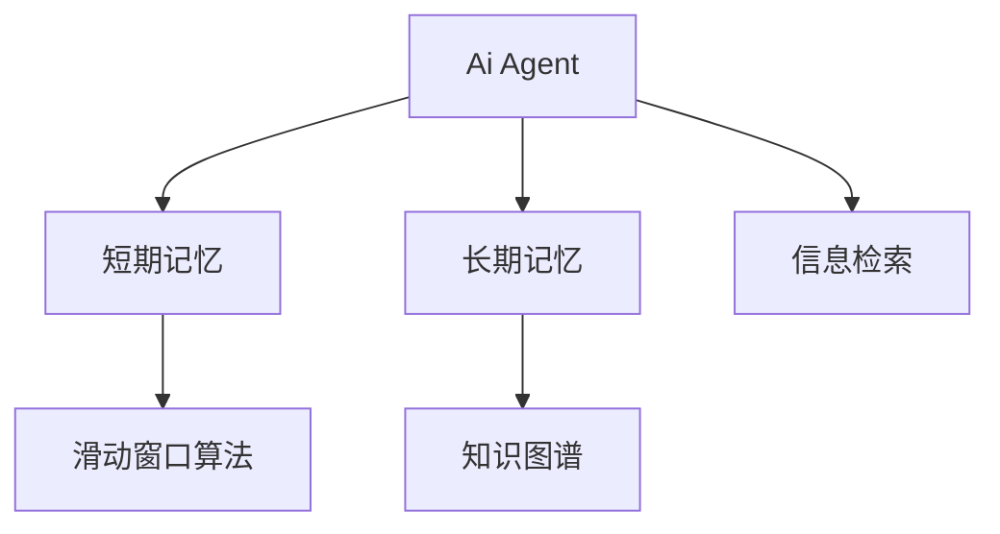

                 


# AI Agent的记忆机制：短期与长期记忆的实现

> 关键词：AI Agent，短期记忆，长期记忆，记忆机制，知识图谱，滑动窗口

> 摘要：本文将深入探讨AI Agent的短期记忆和长期记忆的实现机制。通过分析短期记忆和长期记忆的核心原理、算法实现、优缺点以及实际应用场景，帮助读者全面理解AI Agent的记忆机制。同时，本文将结合具体案例，详细讲解短期记忆和长期记忆的实现方法，包括滑动窗口算法、知识图谱构建、系统架构设计等。

---

# 第一部分: AI Agent与记忆机制概述

## 第1章: AI Agent与记忆机制的基本概念

### 1.1 AI Agent的定义与特点

人工智能代理（AI Agent）是一种能够感知环境、自主决策并采取行动以实现目标的智能实体。AI Agent的核心特点包括：

- **自主性**：能够在没有外部干预的情况下独立运行。
- **反应性**：能够根据环境的变化动态调整行为。
- **目标导向**：所有行为均以实现特定目标为导向。
- **社会能力**：能够与其他AI Agent或人类进行交互和协作。

### 1.2 AI Agent的记忆机制的重要性

记忆机制是AI Agent实现智能行为的关键组成部分。通过记忆，AI Agent能够：

- **存储信息**：保存感知到的环境信息、交互历史以及任务相关知识。
- **推理与决策**：基于存储的信息进行推理，做出更智能的决策。
- **持续学习**：通过记忆的信息不断优化自身的知识库，提升智能水平。

### 1.3 短期记忆与长期记忆的定义

- **短期记忆**：短期记忆类似于人类的“工作记忆”，用于存储当前任务或最近感知到的信息。短期记忆具有容量有限、信息保留时间短的特点，但能够快速访问和更新。
- **长期记忆**：长期记忆类似于人类的“长期记忆”，用于存储重要的、长期不变化的信息。长期记忆具有容量大、信息保留时间长的特点，但访问速度较慢。

### 1.4 本章小结

本章介绍了AI Agent的基本概念、记忆机制的重要性，以及短期记忆和长期记忆的定义和特点。理解这些概念是进一步探讨记忆机制实现的基础。

---

# 第二部分: 短期记忆的实现机制

## 第2章: 短期记忆的原理与实现

### 2.1 短期记忆的核心原理

短期记忆的核心原理是通过高效的数据结构和算法，实现信息的快速存储、访问和遗忘。常见的短期记忆实现方法包括滑动窗口算法、队列和栈结构。

#### 2.1.1 滑动窗口算法

滑动窗口算法是一种用于管理短期记忆的有效方法。通过维护一个固定大小的窗口，算法能够自动丢弃过时的信息，确保记忆空间的高效利用。

**算法描述**：
1. 定义一个固定大小的窗口，用于存储最近的信息。
2. 当新信息进入窗口时，将旧信息逐出窗口。
3. 窗口大小可以根据任务需求进行调整。

**示例代码**：
```python
class SlidingWindow:
    def __init__(self, size):
        self.size = size
        self.window = []
    
    def add(self, data):
        if len(self.window) >= self.size:
            self.window.pop(0)
        self.window.append(data)
    
    def get(self):
        return self.window
```

#### 2.1.2 队列与栈结构

队列和栈是两种常用的数据结构，适用于短期记忆的实现。队列遵循先进先出（FIFO）原则，适合处理时间序列信息；栈遵循先进后出（FILO）原则，适合处理嵌套结构信息。

**队列示例**：
```python
from collections import deque

queue = deque(maxlen=5)
queue.append(1)
queue.append(2)
queue.append(3)
print(queue.popleft())
```

**栈示例**：
```python
stack = []
stack.append(1)
stack.append(2)
stack.pop()
```

### 2.2 短期记忆的算法实现

#### 2.2.1 基于滑动窗口的短期记忆实现

滑动窗口算法适用于实时数据流处理，能够高效管理短期记忆。通过动态调整窗口大小，算法可以在不同任务需求下灵活切换。

**滑动窗口应用案例**：
```python
# 实时数据流处理
stream = [1, 2, 3, 4, 5, 6, 7, 8, 9, 10]
window_size = 3

sliding_window = SlidingWindow(window_size)
for data in stream:
    sliding_window.add(data)
    print(sliding_window.get())
```

#### 2.2.2 基于队列的短期记忆实现

队列适用于处理顺序性较强的任务，如消息队列和事件处理。通过队列的先进先出特性，能够确保任务处理的顺序性和高效性。

**队列应用案例**：
```python
# 消息队列处理
messages = [1, 2, 3, 4, 5]
queue = deque(messages)
while queue:
    print(queue.popleft())
```

#### 2.2.3 基于栈的短期记忆实现

栈适用于处理嵌套结构的任务，如括号匹配和递归调用。通过栈的先进后出特性，能够确保任务处理的嵌套性和层次性。

**栈应用案例**：
```python
# 括号匹配
s = "(()"
stack = []
for char in s:
    if char == '(':
        stack.append(char)
    else:
        stack.pop()
print(stack)
```

### 2.3 短期记忆的优缺点分析

- **优点**：
  - 实现简单，易于管理。
  - 适用于实时性和响应性要求较高的任务。
  - 能够快速处理和遗忘过时信息，节省存储空间。

- **缺点**：
  - 信息保留时间短，容易丢失重要信息。
  - 需要频繁调整窗口大小或队列长度，增加了算法的复杂性。
  - 不适用于需要长期保留信息的任务。

### 2.4 本章小结

本章详细讲解了短期记忆的核心原理、实现方法以及优缺点分析。通过滑动窗口、队列和栈等数据结构的实现，读者可以更好地理解短期记忆的高效管理和快速访问特性。

---

# 第三部分: 长期记忆的实现机制

## 第3章: 长期记忆的原理与实现

### 3.1 长期记忆的核心原理

长期记忆的核心原理是通过高效的数据结构和算法，实现信息的持久化存储、检索和更新。常见的长期记忆实现方法包括知识图谱构建、数据库管理和关联规则挖掘。

#### 3.1.1 知识图谱构建

知识图谱是一种以图结构形式表示知识的语义网络，能够有效存储和检索实体及其之间的关系。

**知识图谱构建步骤**：
1. 实体识别：从文本中提取实体。
2. 关系抽取：识别实体之间的关系。
3. 图谱构建：将实体和关系存储为图结构。

**示例代码**：
```python
# 知识图谱构建
from kg import KnowledgeGraph

kg = KnowledgeGraph()
kg.add_entity("Person", "张三")
kg.add_entity("Location", "北京")
kg.add_relation("张三", "居住地", "北京")
kg.get_graph()
```

#### 3.1.2 数据库管理

数据库是长期记忆的核心存储介质，通过关系型数据库或NoSQL数据库，可以实现信息的持久化存储和高效检索。

**数据库实现案例**：
```python
# 关系型数据库实现
import sqlite3

conn = sqlite3.connect("memory.db")
cursor = conn.cursor()
cursor.execute("CREATE TABLE Memories (id INTEGER PRIMARY KEY AUTOINCREMENT, content TEXT, timestamp DATETIME)")
cursor.execute("INSERT INTO Memories (content, timestamp) VALUES (?, ?)", ("初始记忆", datetime.now()))
conn.commit()
conn.close()
```

#### 3.1.3 关联规则挖掘

关联规则挖掘是一种数据挖掘技术，用于发现数据中的关联规则，支持长期记忆的智能化检索和推理。

**关联规则挖掘示例**：
```python
# 关联规则挖掘
from mlxtend.frequent_itemsets import apriori

data = [[1, 2, 3], [2, 3, 4], [3, 4, 5]]
frequent_itemsets = apriori(data, min_support=0.5)
print(frequent_itemsets)
```

### 3.2 长期记忆的算法实现

#### 3.2.1 基于图结构的长期记忆实现

图结构是一种高效的长期记忆实现方式，通过节点和边表示实体及其关系，支持复杂的关联推理和知识检索。

**图结构应用案例**：
```python
# 图结构实现
from networkx import Graph

graph = Graph()
graph.add_nodes_from(["张三", "北京", "工作地"])
graph.add_edges_from([("张三", "工作地"), ("张三", "北京")])
print(graph.nodes())
```

#### 3.2.2 基于数据库的长期记忆实现

关系型数据库和NoSQL数据库是长期记忆的常用存储介质，支持高效的查询和更新操作。

**关系型数据库应用案例**：
```python
# 关系型数据库实现
import sqlite3

conn = sqlite3.connect("memory.db")
cursor = conn.cursor()
cursor.execute("SELECT * FROM Memories WHERE content LIKE '%张三%'", ())
rows = cursor.fetchall()
for row in rows:
    print(row)
conn.close()
```

#### 3.2.3 基于知识图谱的长期记忆实现

知识图谱通过语义网络的形式，支持复杂的关联推理和知识检索，是长期记忆的理想实现方式。

**知识图谱应用案例**：
```python
# 知识图谱实现
from kg import KnowledgeGraph

kg = KnowledgeGraph()
kg.add_entity("张三", "Person")
kg.add_entity("北京", "City")
kg.add_relation("张三", "居住地", "北京")
kg.query("张三", "居住地")
```

### 3.3 长期记忆的优缺点分析

- **优点**：
  - 信息存储持久，支持长期任务的执行。
  - 支持复杂的关联推理，提升智能水平。
  - 数据结构多样，适用于不同场景的需求。

- **缺点**：
  - 实现复杂，需要处理大量的数据和关系。
  - 计算资源消耗较大，尤其是在大规模数据存储和关联推理时。
  - 数据更新和维护需要较高的算法和计算资源。

### 3.4 本章小结

本章详细讲解了长期记忆的核心原理、实现方法以及优缺点分析。通过知识图谱、数据库和关联规则挖掘等技术的实现，读者可以更好地理解长期记忆的持久化存储、智能化检索和复杂推理特性。

---

# 第四部分: 短期记忆与长期记忆的结合与优化

## 第4章: 短期记忆与长期记忆的结合

### 4.1 短期记忆与长期记忆的协同工作

短期记忆和长期记忆在AI Agent中协同工作，短期记忆负责处理当前任务的临时信息，长期记忆负责存储和管理持久性知识。通过两者结合，AI Agent能够实现短期任务处理和长期目标规划。

### 4.2 短期记忆与长期记忆的整合实现

短期记忆和长期记忆的整合可以通过以下步骤实现：

1. **信息分类**：将感知到的信息分为短期和长期信息。
2. **短期存储**：将短期信息存储在滑动窗口或队列中，供当前任务使用。
3. **长期存储**：将长期信息存储在知识图谱或数据库中，支持未来的任务处理。
4. **信息检索**：根据任务需求，从短期或长期记忆中检索相关信息。
5. **信息更新**：根据新信息，动态更新短期和长期记忆。

### 4.3 短期记忆与长期记忆的优化策略

为了提高AI Agent的记忆效率和智能水平，可以采用以下优化策略：

- **动态调整短期记忆容量**：根据任务需求和环境变化，动态调整滑动窗口的大小或队列的长度。
- **智能选择长期记忆内容**：通过关联规则挖掘和知识图谱推理，自动选择和存储重要的长期信息。
- **结合机器学习算法**：利用机器学习算法，如聚类和分类，优化短期和长期记忆的信息存储和检索效率。

### 4.4 本章小结

本章探讨了短期记忆和长期记忆的结合与优化策略，通过动态调整、智能选择和机器学习算法的结合，可以进一步提升AI Agent的记忆效率和智能水平。

---

# 第五部分: 项目实战与案例分析

## 第5章: 项目实战

### 5.1 项目介绍

本项目旨在实现一个简单的AI Agent，具备短期和长期记忆能力，能够处理实时数据流和长期任务规划。

#### 5.1.1 系统功能设计

- **短期记忆模块**：实现滑动窗口算法，处理实时数据流。
- **长期记忆模块**：构建知识图谱，存储实体及其关系。
- **信息检索模块**：根据任务需求，检索短期或长期记忆中的信息。

#### 5.1.2 系统架构设计



### 5.2 核心代码实现

#### 5.2.1 短期记忆实现

```python
# 短期记忆实现
class SlidingWindow:
    def __init__(self, size):
        self.size = size
        self.window = []
    
    def add(self, data):
        if len(self.window) >= self.size:
            self.window.pop(0)
        self.window.append(data)
    
    def get(self):
        return self.window
```

#### 5.2.2 长期记忆实现

```python
# 长期记忆实现
from kg import KnowledgeGraph

class KnowledgeGraph:
    def __init__(self):
        self.graph = {}
    
    def add_entity(self, entity, entity_type):
        if entity not in self.graph:
            self.graph[entity] = {"type": entity_type, "relations": []}
    
    def add_relation(self, subject, relation, object):
        self.graph[subject]["relations"].append((relation, object))
    
    def query(self, subject, relation=None):
        if relation is not None:
            return [obj for rel, obj in self.graph[subject]["relations"] if rel == relation]
        else:
            return [(rel, obj) for rel, obj in self.graph[subject]["relations"]]
```

### 5.3 项目小结

通过本项目，读者可以掌握短期记忆和长期记忆的实现方法，以及如何在实际项目中结合两者，实现更复杂的AI Agent功能。

---

# 第六部分: 总结与展望

## 第6章: 总结与展望

### 6.1 本文章总结

本文详细探讨了AI Agent的短期记忆和长期记忆的实现机制，通过滑动窗口、队列、栈、知识图谱和数据库等数据结构和算法，深入讲解了短期记忆和长期记忆的核心原理和实现方法。同时，本文还结合实际案例，展示了短期记忆和长期记忆的结合与优化策略。

### 6.2 未来展望

随着人工智能技术的不断发展，AI Agent的记忆机制将更加智能化和复杂化。未来的研究方向包括：

- **增强学习算法的应用**：通过增强学习算法，进一步优化短期和长期记忆的信息存储和检索效率。
- **分布式记忆机制的实现**：通过分布式计算和区块链技术，实现去中心化的记忆存储和管理。
- **多模态记忆的探索**：结合视觉、听觉等多种模态信息，实现更加丰富和复杂的记忆机制。

### 6.3 本章小结

本章总结了本文的主要内容，并展望了未来AI Agent记忆机制的发展方向，为读者提供了进一步研究和探索的空间。

---

# 作者：AI天才研究院/AI Genius Institute & 禅与计算机程序设计艺术 /Zen And The Art of Computer Programming

---

以上就是《AI Agent的记忆机制：短期与长期记忆的实现》的完整目录大纲和内容概述。希望对您理解AI Agent的记忆机制有所帮助！

