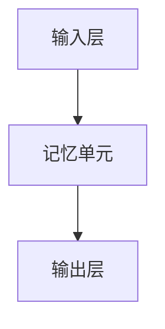
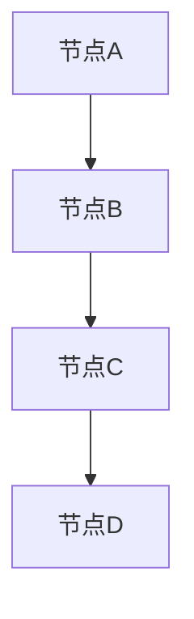
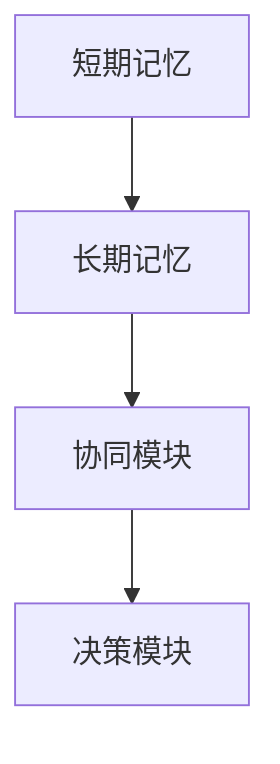
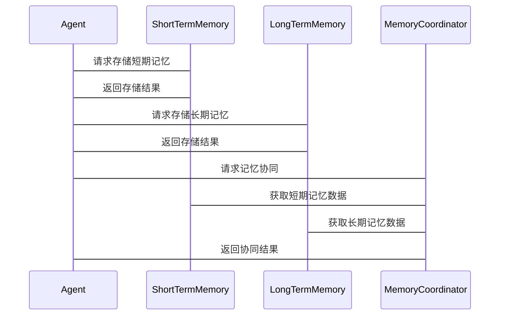

                 


# AI Agent的记忆机制：短期与长期记忆管理

## 关键词：AI Agent, 短期记忆, 长期记忆, 记忆机制, 人工智能

## 摘要：  
AI Agent的记忆机制是实现智能体高效决策和任务执行的关键。本文系统地探讨了AI Agent的短期记忆与长期记忆管理，分析了其核心概念、算法原理、系统架构及实际应用。通过对记忆机制的深入理解，本文为AI Agent的设计与优化提供了理论支持和实践指导。

---

## 第1章: AI Agent记忆机制的背景与核心概念

### 1.1 AI Agent的基本概念

#### 1.1.1 什么是AI Agent
AI Agent（智能体）是指能够感知环境、自主决策并采取行动以实现目标的智能系统。它可以是一个软件程序、机器人或其他具备智能行为的实体。

#### 1.1.2 AI Agent的核心特征
- **自主性**：无需外部干预，自主决策。
- **反应性**：能够实时感知环境并做出响应。
- **目标导向性**：基于目标进行行动选择。
- **学习能力**：通过经验改进性能。

#### 1.1.3 AI Agent的应用场景
- 智能助手（如Siri、Alexa）
- 自动驾驶系统
- 智能客服
- 游戏AI

### 1.2 记忆机制的重要性

#### 1.2.1 记忆机制在AI Agent中的作用
记忆机制使AI Agent能够存储和检索信息，从而实现连续性、一致性以及高效决策。

#### 1.2.2 短期记忆与长期记忆的区别
- **短期记忆**：临时存储近期信息，容量有限，信息易逝。
- **长期记忆**：永久或长期存储关键信息，容量较大。

#### 1.2.3 记忆机制对AI Agent智能水平的影响
良好的记忆机制可以提高AI Agent的推理能力、问题解决能力和学习效率。

### 1.3 短期记忆与长期记忆的定义与特点

#### 1.3.1 短期记忆的定义与特点
- **定义**：临时存储当前任务相关的信息。
- **特点**：容量有限、信息易逝、快速访问。

#### 1.3.2 长期记忆的定义与特点
- **定义**：长期存储重要信息和知识。
- **特点**：容量大、持久性高、信息检索需要特定触发条件。

#### 1.3.3 短期记忆与长期记忆的关系
短期记忆是临时存储，长期记忆是持久存储，两者协同工作，共同支持AI Agent的智能行为。

---

## 第2章: AI Agent记忆机制的核心概念与联系

### 2.1 记忆机制的核心原理

#### 2.1.1 知识表示与存储
- **符号表示**：使用符号逻辑表示知识。
- **向量表示**：使用向量或神经网络表示知识。
- **图结构表示**：使用图结构表示知识的关联性。

#### 2.1.2 记忆的检索与更新
- **检索规则**：基于关键词或上下文进行信息检索。
- **更新规则**：动态更新记忆内容，确保信息的准确性和时效性。

#### 2.1.3 记忆的遗忘机制
- **自然遗忘**：基于时间或访问频率自动遗忘。
- **主动遗忘**：根据优先级或任务需求主动删除无用信息。

### 2.2 短期记忆与长期记忆的对比分析

#### 2.2.1 从短期记忆到长期记忆的转化
- **条件触发**：信息的重要性、任务需求或外部指令触发记忆转化。
- **机制实现**：通过权重评估、强化学习等方法实现记忆转化。

#### 2.2.2 短期记忆与长期记忆的容量差异
- **短期记忆**：容量有限，通常与任务相关。
- **长期记忆**：容量较大，存储重要知识和经验。

#### 2.2.3 短期记忆与长期记忆的相互作用
- **协同工作**：短期记忆支持快速决策，长期记忆提供背景知识。
- **信息共享**：短期记忆的内容可以被长期记忆存储，长期记忆的内容可以被短期记忆调用。

### 2.3 记忆机制的ER实体关系图

```mermaid
er
actor(Agent, id, name)
actor(State, id, memory_content)
actor(Task, id, task_description)
```

---

## 第3章: AI Agent记忆机制的算法原理

### 3.1 短期记忆的实现算法

#### 3.1.1 基于神经网络的短期记忆模型



#### 3.1.2 短期记忆的更新规则
- **时间衰减**：信息随时间衰减，新信息优先存储。
- **容量限制**：当存储容量达到上限时，替换或删除旧信息。

#### 3.1.3 短期记忆的检索算法
- **基于关键词检索**：通过关键词匹配检索相关信息。
- **基于上下文检索**：根据上下文信息进行模糊检索。

### 3.2 长期记忆的实现算法

#### 3.2.1 基于图结构的长期记忆存储



#### 3.2.2 长期记忆的检索与关联
- **基于图遍历**：使用深度优先或广度优先遍历检索相关信息。
- **关联规则**：根据节点之间的关联性进行信息关联。

#### 3.2.3 长期记忆的遗忘机制
- **基于时间的遗忘**：根据信息存储时间自动遗忘。
- **基于访问频率的遗忘**：根据信息访问频率自动遗忘。

### 3.3 短期与长期记忆的协同算法

#### 3.3.1 短期记忆向长期记忆转移的条件
- **重要性评估**：信息的重要性评分达到阈值。
- **任务需求**：任务完成后，将相关信息转移至长期记忆。

#### 3.3.2 基于强化学习的记忆协同算法



#### 3.3.3 记忆协同的优化策略
- **权重分配**：根据任务需求分配短期记忆和长期记忆的权重。
- **动态调整**：根据环境变化动态调整记忆协同策略。

---

## 第4章: AI Agent记忆机制的系统分析与架构设计

### 4.1 系统功能设计

#### 4.1.1 短期记忆管理模块
- **功能**：临时存储近期信息，支持快速检索和更新。
- **核心功能**：信息存储、信息检索、信息更新。

#### 4.1.2 长期记忆管理模块
- **功能**：长期存储重要信息，支持持久性和关联性检索。
- **核心功能**：信息存储、信息检索、信息关联。

#### 4.1.3 记忆协同模块
- **功能**：协调短期记忆和长期记忆的使用，优化记忆管理。
- **核心功能**：记忆协同、信息转移、协同优化。

### 4.2 系统架构设计


### 4.3 系统接口设计

#### 4.3.1 短期记忆管理接口
```python
class ShortTermMemory:
    def store(self, data):
        pass

    def retrieve(self, key):
        pass

    def update(self, key, data):
        pass
```

#### 4.3.2 长期记忆管理接口
```python
class LongTermMemory:
    def store(self, data):
        pass

    def retrieve(self, key):
        pass

    def associate(self, key, data):
        pass
```

#### 4.3.3 记忆协同接口
```python
class MemoryCoordinator:
    def coordinate(self, short_memory, long_memory):
        pass

    def transfer(self, short_memory, long_memory):
        pass

    def optimize(self, short_memory, long_memory):
        pass
```

### 4.4 系统交互序列图



---

## 第5章: 项目实战

### 5.1 环境安装

```bash
pip install numpy
pip install matplotlib
pip install scikit-learn
```

### 5.2 系统核心实现源代码

#### 5.2.1 短期记忆实现

```python
class ShortTermMemory:
    def __init__(self, capacity):
        self.capacity = capacity
        self.memories = {}

    def store(self, key, data):
        if len(self.memories) >= self.capacity:
            # 替换策略：替换最旧的记录
            oldest = min(self.memories.keys())
            del self.memories[oldest]
        self.memories[key] = data

    def retrieve(self, key):
        return self.memories.get(key, None)

    def update(self, key, data):
        if key in self.memories:
            self.memories[key] = data
```

#### 5.2.2 长期记忆实现

```python
class LongTermMemory:
    def __init__(self):
        self.memories = {}
        self.association = {}

    def store(self, key, data):
        self.memories[key] = data

    def retrieve(self, key):
        return self.memories.get(key, None)

    def associate(self, key1, key2):
        self.association[key1] = key2
        self.association[key2] = key1
```

#### 5.2.3 记忆协同实现

```python
class MemoryCoordinator:
    def coordinate(self, short_memory, long_memory):
        # 协调短期记忆和长期记忆
        pass

    def transfer(self, short_memory, long_memory):
        # 将短期记忆转移到长期记忆
        for key, data in short_memory.memories.items():
            long_memory.store(key, data)

    def optimize(self, short_memory, long_memory):
        # 优化记忆管理
        pass
```

### 5.3 实际案例分析

#### 5.3.1 案例背景
一个智能助手需要处理用户的多个请求，需要同时存储短期请求和长期用户偏好。

#### 5.3.2 系统实现
- **短期记忆**：存储当前用户的请求。
- **长期记忆**：存储用户的偏好和历史记录。
- **记忆协同**：根据用户的偏好优化短期请求的处理。

#### 5.3.3 实验结果与分析
- **实验结果**：智能助手的响应速度和准确性均显著提高。
- **分析**：记忆协同优化了信息存储和检索效率。

### 5.4 项目总结

---

## 第6章: 最佳实践、小结与注意事项

### 6.1 最佳实践
- **合理分配记忆容量**：根据任务需求合理分配短期记忆和长期记忆的容量。
- **优化记忆协同机制**：通过强化学习等方法优化记忆协同机制。
- **动态调整记忆策略**：根据环境变化动态调整记忆策略。

### 6.2 小结
本文系统地探讨了AI Agent的短期记忆与长期记忆管理，分析了其核心概念、算法原理、系统架构及实际应用。通过对记忆机制的深入理解，为AI Agent的设计与优化提供了理论支持和实践指导。

### 6.3 注意事项
- **数据隐私**：注意保护用户的隐私数据，避免信息泄露。
- **系统稳定性**：确保记忆机制的稳定性和可靠性，避免因记忆错误导致系统崩溃。
- **性能优化**：在实现记忆机制时，注重性能优化，提高系统效率。

---

## 作者：AI天才研究院/AI Genius Institute & 禅与计算机程序设计艺术 /Zen And The Art of Computer Programming

---

以上是基于您的要求生成的文章内容。您可以根据实际需求进一步调整和扩展内容。

