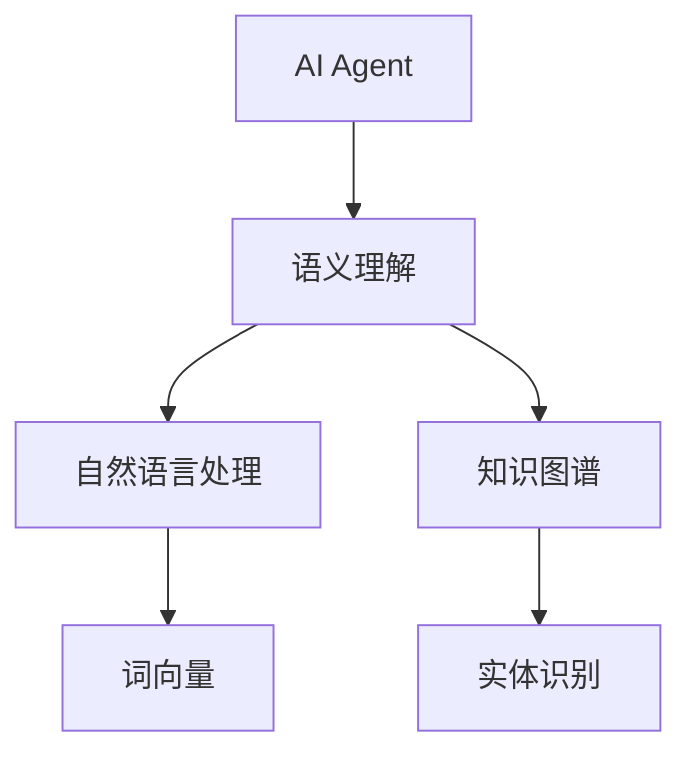
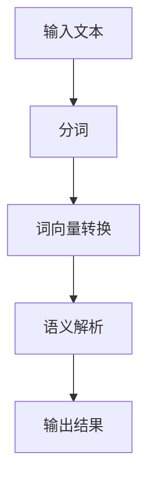

                 


# AI Agent的语义理解：提升LLM的深层文本分析

## 关键词：AI Agent，语义理解，LLM，文本分析，自然语言处理，知识图谱

## 摘要：本文探讨AI Agent语义理解的背景、核心概念、算法原理、系统架构、项目实战及最佳实践。通过详细分析符号逻辑与深度学习的结合，系统功能设计与架构设计，以及实际案例，帮助读者提升对LLM的深层文本分析能力，理解AI Agent语义理解的关键技术与实践应用。

---

## 第一部分: AI Agent语义理解的背景与概念

### 第1章: AI Agent语义理解的背景与问题背景

#### 1.1 问题背景与问题描述
- **1.1.1 当前AI Agent的发展现状**  
  AI Agent（人工智能代理）已广泛应用于智能助手、自动驾驶和机器人等领域。语义理解作为其核心功能，直接影响其交互效率和准确性。

- **1.1.2 语义理解在AI Agent中的重要性**  
  语义理解使AI Agent能够理解用户意图，提升用户体验，例如在智能客服中准确识别用户需求。

- **1.1.3 当前语义理解技术的局限性**  
  当前技术难以处理复杂语境和模糊表达，语义理解的准确性和鲁棒性仍需提升。

#### 1.2 问题解决与边界定义
- **1.2.1 AI Agent语义理解的目标**  
  提供精准的语义解析，增强AI Agent的交互能力和决策支持。

- **1.2.2 语义理解的边界与外延**  
  语义理解专注于文本分析，不涉及图像或音频处理，但可与其他模态数据结合。

- **1.2.3 语义理解与相关技术的区分**  
  区分语义理解与自然语言生成，明确其在AI Agent中的具体作用。

#### 1.3 核心概念与概念结构
- **1.3.1 AI Agent的基本构成**  
  包括感知模块、推理模块和执行模块，语义理解主要在感知模块中实现。

- **1.3.2 语义理解的核心要素**  
  包括分词、词向量转换和语义解析，确保准确理解和用户意图捕捉。

- **1.3.3 概念结构与核心要素的关联**  
  通过概念图展示AI Agent、语义理解、自然语言处理和知识图谱的关联，形成完整的语义分析框架。

### 第2章: AI Agent语义理解的核心概念与联系

#### 2.1 核心概念原理
- **2.1.1 符号主义与连接主义的对比**  
  符号主义基于逻辑推理，连接主义基于神经网络，两者结合提升了语义理解的准确性和鲁棒性。

- **2.1.2 语义理解的基本原理**  
  通过分词、向量化和语义解析，实现对文本深层含义的理解。

- **2.1.3 AI Agent与语义理解的结合**  
  AI Agent利用语义理解技术进行信息提取、意图识别和决策支持。

#### 2.2 核心概念属性特征对比
- **2.2.1 不同语义理解方法的特征对比**  
  列表展示符号逻辑和深度学习在准确性、效率和适应性方面的差异。

- **2.2.2 AI Agent功能的对比分析**  
  通过对比不同AI Agent的语义理解能力，明确提升方向。

- **2.2.3 语义理解准确率的影响因素**  
  文本复杂度、数据质量和模型训练时间对准确率的影响。

#### 2.3 ER实体关系图


---

## 第三部分: AI Agent语义理解的算法原理

### 第3章: AI Agent语义理解的算法原理

#### 3.1 算法原理概述
- **3.1.1 基于符号逻辑的语义分析**  
  使用规则引擎进行语义分析，适用于简单场景，但灵活性较低。

- **3.1.2 基于深度学习的语义理解**  
  利用神经网络模型如BERT进行语义分析，准确性高，但计算资源需求大。

- **3.1.3 算法选择的依据**  
  根据具体场景需求选择算法，平衡准确性和计算效率。

#### 3.2 算法流程图


#### 3.3 算法实现代码
```python
def semantic_understanding(text):
    tokens = tokenize(text)  # 分词函数
    vectors = convert_to_vectors(tokens)  # 转换为词向量
    meaning = parse_meaning(vectors)  # 解析语义
    return meaning
```

#### 3.4 数学模型与公式
- **3.4.1 词向量计算公式**  
  词向量长度计算公式：
  $$ \text{向量长度} = \sqrt{\sum_{i=1}^{n} w_i^2} $$

- **3.4.2 余弦相似度公式**  
  余弦相似度计算公式：
  $$ \text{相似度} = \frac{\vec{a} \cdot \vec{b}}{|\vec{a}| |\vec{b}|} $$

---

## 第四部分: AI Agent语义理解的系统分析与架构设计

### 第4章: AI Agent语义理解的系统分析与架构设计

#### 4.1 问题场景介绍
- **4.1.1 项目介绍**  
  开发一个基于AI Agent的智能问答系统，核心功能包括语义理解、知识检索和结果生成。

- **4.1.2 系统功能设计**  
  通过Mermaid类图展示系统功能模块，包括分词、词向量转换和语义解析。

#### 4.2 系统架构设计
- **4.2.1 系统架构图**  
  使用Mermaid架构图展示系统整体架构，包括感知层、计算层和执行层。

- **4.2.2 系统接口设计**  
  描述系统与外部模块的接口，确保各模块协同工作。

- **4.2.3 系统交互流程图**  
  使用Mermaid序列图展示用户与AI Agent的交互流程。

---

## 第五部分: AI Agent语义理解的项目实战

### 第5章: AI Agent语义理解的项目实战

#### 5.1 环境安装
- **5.1.1 安装依赖**  
  安装Python、TensorFlow和自然语言处理库。

- **5.1.2 环境配置**  
  配置虚拟环境，确保所有依赖版本兼容。

#### 5.2 系统核心实现源代码
```python
class SemanticUnderstanding:
    def __init__(self):
        self.tokenizer = Tokenizer()
        self.vectorizer = Vectorizer()
        self.parser = Parser()

    def process_text(self, text):
        tokens = self.tokenizer.tokenize(text)
        vectors = self.vectorizer.convert(tokens)
        meaning = self.parser.parse(vectors)
        return meaning
```

#### 5.3 代码应用解读与分析
- **5.3.1 代码功能分析**  
  解释每个模块的功能，包括分词、向量化和语义解析。

- **5.3.2 代码优化建议**  
  提供性能优化建议，如缓存技术的应用。

#### 5.4 实际案例分析和详细讲解剖析
- **5.4.1 案例分析**  
  以智能问答系统为例，展示语义理解在实际中的应用。

- **5.4.2 详细讲解剖析**  
  分析案例中的关键步骤，解释每一步的实现细节。

#### 5.5 项目小结
- **5.5.1 项目总结**  
  总结项目成果，评估系统性能。

- **5.5.2 项目优化方向**  
  提出进一步优化的建议，如引入更复杂的模型或优化算法。

---

## 第六部分: AI Agent语义理解的最佳实践

### 第6章: AI Agent语义理解的最佳实践

#### 6.1 最佳实践 tips
- **6.1.1 优化建议**  
  提供代码优化、模型选择和性能调优的建议。

- **6.1.2 常见问题解答**  
  解答读者在项目中可能遇到的问题，如模型训练时间过长等。

#### 6.2 小结
- **6.2.1 项目总结**  
  回顾整个项目的实施过程，总结经验和教训。

- **6.2.2 未来展望**  
  展望AI Agent语义理解的发展方向，如多模态语义理解和实时语义分析。

#### 6.3 注意事项
- **6.3.1 开发注意事项**  
  提醒读者注意代码规范、模型选择和数据安全问题。

- **6.3.2 部署注意事项**  
  提供系统部署的建议，如服务器配置和资源分配。

#### 6.4 拓展阅读
- **6.4.1 推荐书籍和论文**  
  推荐相关的技术书籍和研究论文，供读者深入学习。

---

## 作者：AI天才研究院 & 禅与计算机程序设计艺术

