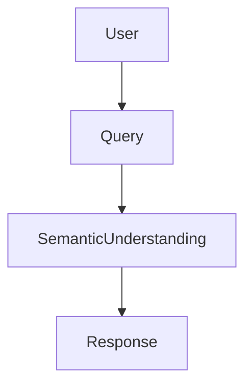
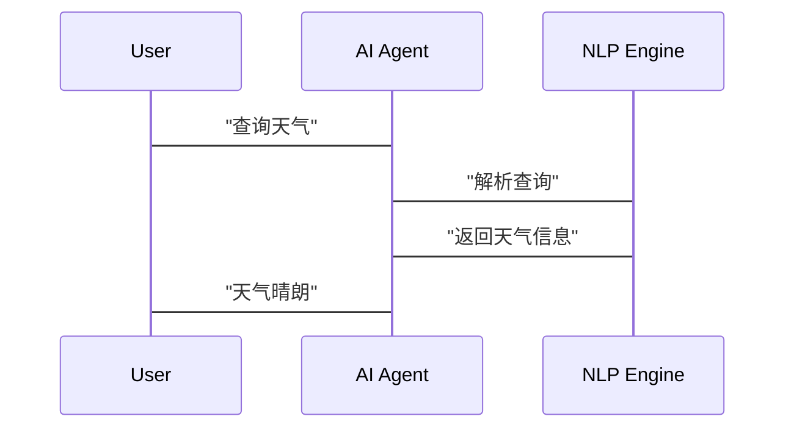

                 


# AI Agent的语义理解：超越关键词匹配

> 关键词：自然语言处理, 语义理解, AI Agent, 深度学习, 关键词匹配

> 摘要：  
> 在人工智能领域，语义理解是实现智能交互的核心技术之一。传统的关键词匹配方法在面对复杂语义需求时显得力不从心，而基于深度学习的语义理解技术正在迅速崛起。本文将从AI Agent的角度出发，详细探讨语义理解的原理、算法实现、系统架构以及实际应用。通过对比传统方法与深度学习模型的优劣，揭示语义理解在AI Agent中的重要性，并通过具体案例展示其实际应用价值。

---

## 第一部分: AI Agent语义理解的背景与核心概念

### 第1章: 语义理解的背景与问题背景

#### 1.1 问题背景与问题描述
人工智能技术的快速发展使得AI Agent（智能体）在各个领域的应用越来越广泛。AI Agent需要能够理解和处理人类的语言输入，以提供准确的服务或响应。然而，传统的自然语言处理技术，如关键词匹配，存在诸多局限性。

##### 1.1.1 传统关键词匹配的局限性
- **语义理解不足**：关键词匹配只能处理显式关键词，无法理解隐含语义。例如，用户输入“附近最好的咖啡店”，关键词匹配可能只关注“咖啡店”，而忽略“附近”和“最好”的语义信息。
- **上下文理解缺失**：关键词匹配无法处理上下文关系。例如，用户说“我需要一杯咖啡”，系统可能无法结合上下文判断用户的需求（如是否需要叫外卖或前往实体店）。
- **模糊匹配能力不足**：关键词匹配难以处理近义词、同义词或语义相似但表达方式不同的情况。

##### 1.1.2 语义理解的需求与重要性
AI Agent需要具备语义理解能力，才能真正实现智能化交互。语义理解能够帮助AI Agent准确捕捉用户意图，提升用户体验，同时降低误判率。例如，在智能音箱、聊天机器人等领域，语义理解是实现人机交互的关键技术。

##### 1.1.3 当前技术面临的挑战
- 数据量需求大：深度学习模型需要大量标注数据进行训练。
- 计算资源消耗高：复杂的模型训练和推理需要高性能计算资源。
- 领域适应性不足：不同领域（如医疗、金融）的语义理解需求差异较大，通用模型的适应性有限。

#### 1.2 AI Agent的基本概念
AI Agent是一种能够感知环境并采取行动以实现目标的智能实体。在语义理解的背景下，AI Agent需要具备以下特点：
- **自主性**：能够独立决策。
- **反应性**：能够实时感知并响应用户输入。
- **学习能力**：能够通过数据不断优化自身的理解能力。

在AI Agent中，语义理解的核心目标是将用户输入的自然语言文本转换为计算机可理解的结构化信息。语义理解的边界包括：
- 不涉及语法分析，专注于语义信息提取。
- 仅处理文本信息，不涉及图像或视频等其他形式的数据。

### 第2章: 语义理解的核心概念与联系

#### 2.1 语义理解的核心原理
语义理解通过深度学习模型（如BERT、GPT）对文本进行分析，提取其中的语义信息。与关键词匹配不同，语义理解能够捕捉文本中的上下文关系、实体关系和意图信息。

##### 2.1.1 语义理解的定义与实现方式
语义理解是通过计算机技术对自然语言文本的语义信息进行解析和表示的过程。其实现方式包括：
- **基于规则的方法**：通过预定义的规则进行语义分析（传统方法）。
- **基于统计的方法**：利用大数据和机器学习模型进行语义分析（主流方法）。
- **基于深度学习的方法**：通过神经网络模型（如BERT、GPT）进行语义分析（前沿方法）。

##### 2.1.2 语义理解的关键技术与方法
语义理解的关键技术包括：
- **词嵌入（Word Embedding）**：将词语映射为低维向量，捕捉词语的语义信息。
- **上下文表示（Contextual Representation）**：通过模型捕捉词语在上下文中的语义变化。
- **意图识别（Intent Recognition）**：识别用户的意图，如“查询天气”、“预订酒店”等。
- **实体识别（Entity Recognition）**：识别文本中的实体信息，如“时间”、“地点”、“人物”等。

##### 2.1.3 语义理解的评估指标与标准
语义理解的评估指标包括：
- **准确率（Accuracy）**：模型正确识别语义的比例。
- **召回率（Recall）**：模型识别出所有相关语义的比例。
- **F1分数（F1 Score）**：准确率和召回率的调和平均值。
- **困惑度（Perplexity）**：模型对测试数据的适应能力。

#### 2.2 核心概念对比与ER实体关系图

##### 2.2.1 关键词匹配与语义理解的特征对比

| 特征对比 | 关键词匹配 | 语义理解 |
|----------|------------|----------|
| 处理方式 | 基于关键词匹配 | 基于语义理解 |
| 理解深度 | 浅层理解，仅匹配关键词 | 深层理解，捕捉语义信息 |
| 适应性 | 适应性差，难以处理模糊输入 | 适应性好，能够处理复杂语义 |
| 应用场景 | 简单查询、搜索引擎 | 复杂交互、智能对话 |

##### 2.2.2 语义理解中的实体关系图
以下是一个简单的实体关系图，展示了语义理解中的实体关系：
```mermaid
er
actor: User
action: Query
object: SemanticUnderstanding
```

---

## 第二部分: 语义理解的算法原理与数学模型

### 第3章: 语义理解的算法原理

#### 3.1 基于深度学习的语义理解模型

##### 3.1.1 BERT模型的结构与原理
BERT（Bidirectional Encoder Representations from Transformers）是一种基于Transformer的预训练模型。其核心思想是通过双向的上下文信息提取语义表示。

##### 3.1.2 GPT模型在语义理解中的应用
GPT（Generative Pre-trained Transformer）模型通过单向的上下文信息生成文本，常用于文本生成和语义理解任务。

##### 3.1.3 其他主流模型的简要介绍
- **GPT-2**：改进版的GPT模型，具有更大的参数规模。
- **RoBERTa**：基于BERT的优化版本，通过增加训练数据和优化训练策略提升性能。

#### 3.2 模型训练与优化
##### 3.2.1 预训练任务的设计
预训练任务包括：
- **Masked Language Model（遮蔽语言模型）**：随机遮蔽部分单词，预测被遮蔽单词的含义。
- **Next Sentence Prediction（下一句预测）**：预测下一句是否是原文中的下一句。

##### 3.2.2 模型调优与微调策略
微调策略包括：
- **全微调**：对整个模型进行微调，适用于特定任务。
- **部分微调**：仅对部分层进行微调，适用于资源受限的情况。

##### 3.2.3 模型压缩与轻量化技术
模型压缩技术包括：
- **剪枝（Pruning）**：移除模型中不重要的参数。
- **知识蒸馏（Knowledge Distillation）**：将大模型的知识迁移到小模型中。

### 第4章: 语义理解的数学模型与公式

#### 4.1 词嵌入与上下文表示
##### 4.1.1 Word2Vec模型的数学表达
Word2Vec模型通过训练词向量来捕捉词语的语义信息。其损失函数如下：
$$
\text{Loss} = -\sum_{i=1}^{n} \log P(w_i|w_{i-1})
$$

##### 4.1.2 BERT模型的Transformer结构
BERT模型的Transformer结构包括自注意力机制（Self-Attention）：
$$
\text{PositionalEncoding}(x) = x + \text{PositionalEncoding}(x)
$$

#### 4.2 模型训练的损失函数
##### 4.2.1 交叉熵损失函数
交叉熵损失函数用于分类任务：
$$
\text{Loss} = -\sum_{i=1}^{n} y_i \log p(y_i|x)
$$

##### 4.2.2 模型优化的数学推导
Adam优化器是一种常用优化算法，其更新规则如下：
$$
\text{Adam} = \beta_1 \text{梯度} + \beta_2 \text{二阶矩}
$$

---

## 第三部分: 语义理解的系统架构与设计

### 第4章: 语义理解的系统架构与设计

#### 4.1 问题场景介绍
AI Agent需要在实际应用场景中处理用户的自然语言输入，例如智能音箱、聊天机器人等。

#### 4.2 系统功能设计
系统功能包括：
- **意图识别**：识别用户的意图。
- **实体识别**：识别文本中的实体信息。
- **语义解析**：将文本转换为结构化信息。

#### 4.3 系统架构设计
以下是系统架构的Mermaid图：


#### 4.4 系统交互序列图
以下是系统交互的Mermaid序列图：


---

## 第四部分: 项目实战与案例分析

### 第5章: 项目实战

#### 5.1 环境安装
需要安装以下工具和库：
- Python 3.8+
- PyTorch或TensorFlow
- Hugging Face的Transformers库

#### 5.2 核心代码实现

##### 5.2.1 模型加载
```python
from transformers import BertTokenizer, BertModel

tokenizer = BertTokenizer.from_pretrained('bert-base-uncased')
model = BertModel.from_pretrained('bert-base-uncased')
```

##### 5.2.2 模型推理
```python
def semantic_analysis(text):
    inputs = tokenizer(text, return_tensors='np')
    outputs = model(**inputs)
    return outputs.last_hidden_state[:, 0, :].tolist()
```

#### 5.3 案例分析
以“附近的餐馆”为例，模型能够提取出用户的意图（餐馆搜索）和实体信息（位置：附近）。

---

## 第五部分: 总结与展望

### 第6章: 总结与展望

#### 6.1 最佳实践 tips
- 数据预处理是关键，需要对文本进行清洗和标注。
- 选择合适的模型和优化策略，根据实际场景进行微调。
- 定期更新模型，保持其适应性。

#### 6.2 小结
语义理解是AI Agent实现智能化交互的核心技术。通过深度学习模型，AI Agent能够超越传统的关键词匹配，实现更准确的语义分析和理解。

#### 6.3 注意事项
- 数据隐私问题需要注意。
- 模型的计算资源消耗较高，需要优化部署环境。
- 不同领域的语义理解需求差异较大，需要针对性优化。

#### 6.4 拓展阅读
- 《Transformers: Pre-training of Self-attentional Neural Networks》
- 《BERT: Pre-training of Deep Bidirectional Transformers for Natural Language Processing》

---

## 作者：AI天才研究院/AI Genius Institute & 禅与计算机程序设计艺术 /Zen And The Art of Computer Programming

