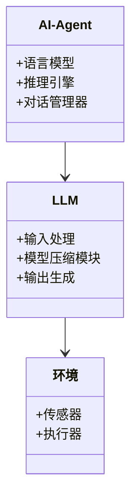
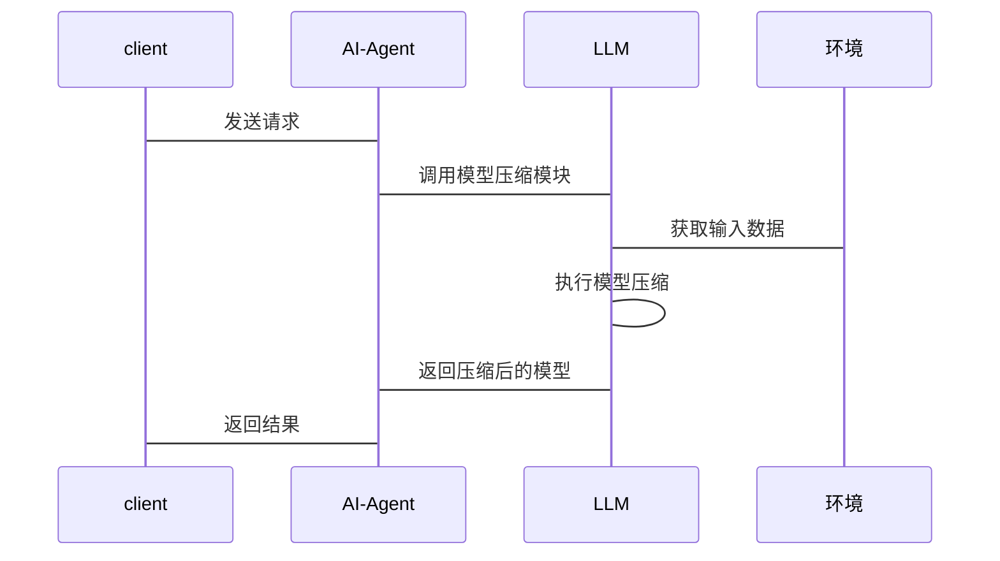

                 


# AI Agent的语言模型压缩：轻量级LLM的实现与优化

> 关键词：AI Agent，语言模型压缩，轻量级LLM，模型优化，机器学习

> 摘要：  
> 随着人工智能技术的快速发展，大语言模型（Large Language Model, LLM）在AI Agent中的应用越来越广泛。然而，这些模型通常需要大量的计算资源和存储空间，限制了其在资源受限环境中的应用。本文深入探讨了如何通过语言模型压缩技术，实现轻量级的LLM，以满足AI Agent在实际应用中的需求。文章从背景介绍、核心概念、算法原理、系统架构设计到项目实战，详细分析了轻量级LLM的实现与优化方法，为读者提供了一套完整的解决方案。

---

## 第1章: AI Agent与语言模型压缩的背景与挑战

### 1.1 AI Agent的基本概念

AI Agent是一种能够感知环境、自主决策并执行任务的智能实体。它可以是一个软件程序，也可以是一个物理机器人。AI Agent的核心能力在于其能够通过传感器获取信息、分析问题、制定解决方案，并通过执行器完成任务。语言模型作为AI Agent的重要组成部分，负责理解和生成自然语言文本，使其能够与人类用户进行有效交互。

#### 1.1.1 AI Agent的定义与特点

- **定义**：AI Agent是一种智能实体，能够感知环境、自主决策并执行任务。
- **特点**：
  - **自主性**：能够在没有外部干预的情况下独立运作。
  - **反应性**：能够实时感知环境并做出响应。
  - **社交能力**：能够与人类或其他AI Agent进行交互。
  - **学习能力**：能够通过经验或数据优化自身的性能。

#### 1.1.2 语言模型在AI Agent中的作用

语言模型是AI Agent实现自然语言处理的核心技术，主要负责以下任务：
- **理解用户输入**：通过自然语言理解（NLU）技术解析用户的意图。
- **生成自然语言输出**：通过自然语言生成（NLG）技术生成符合语境的回复。
- **对话管理**：根据上下文信息维护对话的连贯性。

#### 1.1.3 模型压缩的必要性

尽管大语言模型（如GPT-3、GPT-4）在性能上表现出色，但其计算资源需求和存储空间消耗也极大。对于AI Agent而言，尤其是需要在资源受限的环境中运行的AI Agent，直接使用大语言模型往往面临以下挑战：
- **计算资源不足**：大语言模型需要大量的计算资源，限制了其在移动设备或边缘计算环境中的应用。
- **延迟问题**：模型推理过程中的高计算开销会导致响应延迟，影响用户体验。
- **存储空间限制**：模型参数量庞大，难以在存储空间有限的设备上部署。

---

### 1.2 大语言模型的现状与挑战

#### 1.2.1 大语言模型的计算资源需求

大语言模型通常由数百万甚至数十亿的参数构成，训练和推理过程需要大量的计算资源，包括高性能GPU和大量内存。例如，GPT-3模型包含175亿个参数，训练过程需要数千个GPU小时。

#### 1.2.2 模型压缩的目标与意义

模型压缩的目标是通过减少模型的参数数量或简化模型结构，降低模型的计算和存储需求，同时尽可能保持模型的性能。这对于AI Agent的应用尤为重要：
- **降低计算成本**：减少计算资源的消耗，降低运行成本。
- **提高运行效率**：缩短模型推理时间，提升用户体验。
- **扩展应用场景**：使得AI Agent能够在资源受限的环境中运行。

#### 1.2.3 AI Agent对轻量化模型的需求

AI Agent需要在多种场景中运行，包括但不限于：
- **移动设备**：需要低功耗、快速响应的模型。
- **边缘计算**：需要在本地设备上运行，减少数据传输依赖。
- **实时交互**：需要快速生成回复，降低延迟。

---

## 第2章: 语言模型压缩的核心概念与方法

### 2.1 模型压缩的原理与技术

模型压缩是通过多种技术手段，减少模型的参数数量或简化模型结构，同时保持或提升模型的性能。常用的技术包括知识蒸馏、参数剪枝、量化和模型剪枝等。

#### 2.1.1 知识蒸馏

知识蒸馏是一种通过将大型模型的知识迁移到小型模型的技术。其核心思想是将大模型的输出作为小模型的标签，通过交叉熵损失函数对小模型进行训练。

- **基本原理**：
  - 将大模型（教师模型）的输出作为软标签。
  - 小模型（学生模型）通过最小化预测概率分布与教师模型的差异来学习。
  - 知识蒸馏可以显著减少学生模型的参数数量，同时保留教师模型的性能。

- **数学模型**：
  $$ L_{\text{distill}} = \alpha L_{\text{CE}} + (1-\alpha) \text{KL}(P || Q) $$
  其中，$\alpha$是平衡参数，$L_{\text{CE}}$是交叉熵损失，$\text{KL}(P || Q)$是KL散度。

#### 2.1.2 参数剪枝

参数剪枝是一种通过删除模型中冗余的参数或神经元来减少模型复杂度的技术。剪枝可以通过以下步骤实现：
1. 训练模型并计算每个参数的重要性（如梯度绝对值、参数的贡献度）。
2. 根据重要性对参数进行排序，删除重要性最低的参数。
3. 再训练剩余的参数，恢复模型的性能。

- **实现步骤**：
  - 计算每个参数的重要性。
  - 确定剪枝的阈值。
  - 删除不重要的参数并重新训练模型。

#### 2.1.3 量化技术

量化是一种通过将模型参数从浮点数表示转换为低比特位整数表示的技术，从而减少模型的存储空间和计算成本。

- **实现步骤**：
  - 对模型参数进行量化，通常使用4位或8位整数表示。
  - 在推理过程中，将量化参数转换为浮点数进行计算，或直接使用量化参数进行计算。

- **优势**：
  - 显著减少模型的存储空间。
  - 降低计算过程中的内存消耗。

#### 2.1.4 模型剪枝与稀疏化

模型剪枝是一种通过删除模型中冗余的神经元或层来减少模型复杂度的技术。稀疏化则是通过引入稀疏性约束，使得模型在训练过程中自动去除冗余的参数。

- **实现方法**：
  - 在训练过程中引入L1正则化，迫使某些参数趋近于零。
  - 删除接近零的参数，并重新训练剩余的参数。

---

### 2.2 模型压缩方法的对比分析

#### 2.2.1 不同压缩方法的优缺点

| 压缩方法 | 优点 | 缺点 |
|----------|------|------|
| 知识蒸馏 | 能够保持较高的性能，适用于复杂的任务 | 需要训练教师模型，计算成本高 |
| 参数剪枝 | 显著减少参数数量，提升推理速度 | 可能导致性能下降，需要重新训练剪枝后的模型 |
| 量化技术 | 显著减少存储空间，提升计算效率 | 可能导致模型精度下降，需要精细的参数调整 |
| 模型剪枝 | 通过稀疏化减少计算量 | 需要复杂的优化过程，可能导致性能不稳定 |

#### 2.2.2 压缩方法的选择依据

- **性能要求**：如果对性能要求较高，可以选择知识蒸馏或参数剪枝。
- **计算资源**：如果计算资源有限，可以选择量化技术。
- **应用场景**：如果需要在边缘设备上运行，可以选择模型剪枝。

#### 2.2.3 模型压缩对性能的影响

模型压缩通常会导致模型性能的一定损失，但通过优化压缩方法和调整参数，可以在性能和资源消耗之间找到平衡点。例如，通过结合知识蒸馏和量化技术，可以在保持性能的同时显著减少模型的存储和计算需求。

---

## 第3章: 轻量级LLM的实现基础

### 3.1 轻量级LLM的定义与特点

轻量级LLM是一种经过压缩优化的大语言模型，具有以下特点：
- **低参数数量**：通常只有几百万到几十亿个参数。
- **高效推理**：在资源受限的环境中也能快速完成推理任务。
- **适用性广**：适用于移动设备、边缘计算等多种场景。

#### 3.1.1 轻量级LLM的性能要求

轻量级LLM需要在以下方面达到一定的性能：
- **推理速度**：能够在较短时间内完成推理任务。
- **生成质量**：生成的文本具有较高的可读性和准确性。
- **适应性**：能够适应不同的应用场景和数据分布。

#### 3.1.2 轻量级LLM的资源消耗

轻量级LLM在资源消耗方面具有显著优势：
- **存储空间**：通常只有几十MB到几百MB。
- **计算成本**：推理过程中的计算开销显著降低。

#### 3.1.3 轻量级LLM的应用场景

轻量级LLM适用于以下场景：
- **移动设备**：如智能手机上的AI应用。
- **边缘计算**：如智能家居设备中的语音助手。
- **实时交互**：如在线客服系统的快速响应。

### 3.2 轻量级LLM的实现技术

#### 3.2.1 基于Transformer的轻量化设计

Transformer模型是一种广泛应用于自然语言处理的模型架构，具有并行计算能力强、易于优化等优点。轻量化设计可以通过以下方式实现：
- **减少层数**：降低模型的深度，减少计算量。
- **缩小参数维度**：降低每个层的参数数量。
- **使用轻量化组件**：如使用更小的注意力机制或简化前馈网络。

#### 3.2.2 参数量优化策略

参数量优化策略包括：
- **参数共享**：在不同的层或模块中共享参数，减少总参数数量。
- **动态参数调整**：根据输入数据的特性动态调整参数。
- **稀疏化训练**：在训练过程中引入稀疏性约束，减少冗余参数。

#### 3.2.3 计算效率优化方法

计算效率优化方法包括：
- **并行计算**：利用多核处理器或GPU加速计算。
- **算法优化**：通过优化算法（如降低计算复杂度）提升推理速度。
- **缓存优化**：通过缓存技术减少数据访问的开销。

---

## 第4章: 模型压缩算法的数学模型与公式

### 4.1 知识蒸馏的数学模型

知识蒸馏的核心是通过交叉熵损失函数和KL散度来实现知识迁移。具体公式如下：

#### 4.1.1 KL散度公式
$$ \text{KL}(P || Q) = \sum P_i \log \frac{P_i}{Q_i} $$

#### 4.1.2 蒸馏损失函数
$$ L_{\text{distill}} = \alpha L_{\text{CE}} + (1-\alpha) \text{KL}(P || Q) $$

其中，$\alpha$是平衡参数，通常在0到1之间。

### 4.2 参数剪枝的数学模型

参数剪枝通常通过L1正则化来实现，具体公式如下：

#### 4.2.1 剪枝策略的优化目标
$$ \min_{\theta} \frac{1}{2} \|y - f_{\theta}(x)\|^2 + \lambda \sum |\theta_i| $$

其中，$\lambda$是正则化系数，$\theta_i$是模型参数。

---

## 第5章: 系统分析与架构设计方案

### 5.1 问题场景介绍

AI Agent需要在资源受限的环境中运行，因此需要一个轻量级的LLM来满足以下需求：
- **快速推理**：能够在较短时间内完成推理任务。
- **低存储需求**：能够在存储空间有限的设备上运行。
- **适应性强**：能够适应不同的应用场景和数据分布。

### 5.2 项目介绍

本项目的目标是实现一个轻量级的LLM，并通过模型压缩技术优化其性能和资源消耗。具体包括以下步骤：
1. **选择压缩方法**：根据需求选择合适的模型压缩技术。
2. **实现压缩算法**：编写代码实现压缩算法。
3. **优化模型性能**：通过调整参数和优化算法提升模型性能。
4. **测试与验证**：在实际场景中测试模型的性能和资源消耗。

### 5.3 系统功能设计

#### 5.3.1 领域模型（类图）



#### 5.3.2 系统架构设计（架构图）


#### 5.3.3 系统接口设计

系统接口主要包括：
- **输入接口**：接收用户的自然语言输入。
- **输出接口**：生成自然语言输出并返回给用户。
- **模型压缩接口**：对LLM进行压缩优化。

#### 5.3.4 系统交互流程（序列图）



---

## 第6章: 项目实战

### 6.1 环境安装

需要以下环境和工具：
- **Python**：3.8及以上版本。
- **TensorFlow**或**Keras**：用于模型训练和推理。
- **Transformers**库：用于加载和训练语言模型。
- **GPU支持**：推荐使用NVIDIA GPU加速计算。

### 6.2 系统核心实现源代码

以下是一个基于知识蒸馏的轻量级LLM实现示例：

#### 6.2.1 加载教师模型

```python
from transformers import AutoModelForCausalLM, AutoTokenizer

teacher_model = AutoModelForCausalLM.from_pretrained('gpt2')
teacher_tokenizer = AutoTokenizer.from_pretrained('gpt2')
```

#### 6.2.2 定义学生模型

```python
import torch
import torch.nn as nn

class StudentModel(nn.Module):
    def __init__(self):
        super().__init__()
        self.transformer = nn.Transformer(nhead=4, d_model=256)
        self.embedding = nn.Embedding(30000, 256)
        self.out = nn.Linear(256, 30000)

    def forward(self, input_ids):
        embed = self.embedding(input_ids)
        output = self.transformer(embed, embed)
        output = self.out(output)
        return output
```

#### 6.2.3 知识蒸馏训练

```python
def distillation_loss(student_logits, teacher_logits, alpha=0.5):
    ce_loss = nn.CrossEntropyLoss()(student_logits, teacher_logits.argmax(dim=-1))
    kl_loss = nn.KLDivLoss(reduction='batchmean')(F.log_softmax(student_logits, dim=-1), F.softmax(teacher_logits, dim=-1))
    return alpha * ce_loss + (1 - alpha) * kl_loss

optimizer = torch.optim.Adam(student_model.parameters(), lr=1e-4)
for epoch in range(num_epochs):
    for batch in train_loader:
        student_logits = student_model(batch['input_ids'])
        teacher_logits = teacher_model(batch['input_ids'])
        loss = distillation_loss(student_logits, teacher_logits)
        optimizer.zero_grad()
        loss.backward()
        optimizer.step()
```

---

## 第7章: 最佳实践、小结与注意事项

### 7.1 最佳实践

- **选择合适的压缩方法**：根据具体需求选择知识蒸馏、参数剪枝或量化等方法。
- **优化压缩参数**：通过实验调整压缩参数，找到性能与资源消耗的最佳平衡点。
- **结合多种技术**：将多种压缩技术结合使用，以获得更好的效果。

### 7.2 小结

本文详细探讨了AI Agent语言模型压缩的实现与优化方法，包括背景介绍、核心概念、算法原理、系统架构设计和项目实战。通过知识蒸馏、参数剪枝和量化等技术，可以显著减少模型的参数数量和计算成本，同时保持较高的性能。这对于AI Agent在资源受限环境中的应用具有重要意义。

### 7.3 注意事项

- **性能测试**：在实际应用中，需要对压缩后的模型进行严格的性能测试，确保其满足实际需求。
- **环境适应性**：不同应用场景可能对模型的性能和资源消耗有不同的要求，需要根据具体情况调整压缩策略。
- **持续优化**：模型压缩是一个持续优化的过程，需要不断实验和调整，以获得最佳效果。

---

## 第8章: 拓展阅读与学习资源

### 8.1 推荐书籍

- 《Deep Learning》（Ian Goodfellow）
- 《神经网络与深度学习》（周志华）
- 《Large Language Models：A Comprehensive Survey》（Hugging Face）

### 8.2 推荐论文

- [BERT: Pre-training of Deep Bidirectional Transformers for Language Understanding](https://arxiv.org/abs/1810.0469)
- [ALBERT: A Lite BERT for Self-Supervised Learning](https://arxiv.org/abs/1909.12859)
- [知识蒸馏在自然语言处理中的应用](https://www.researchgate.net/publication/...)

---

## 作者：AI天才研究院/AI Genius Institute & 禅与计算机程序设计艺术 /Zen And The Art of Computer Programming

