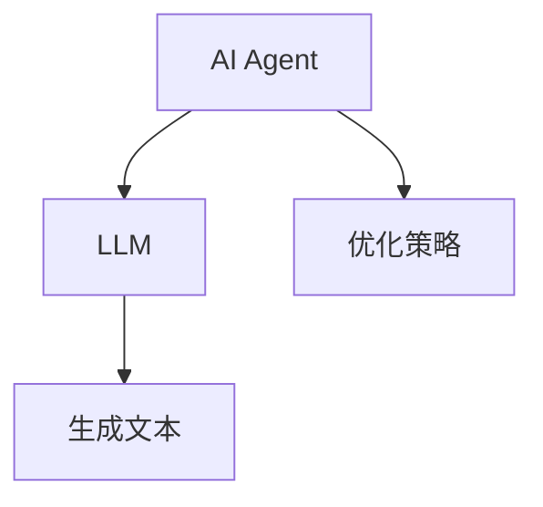
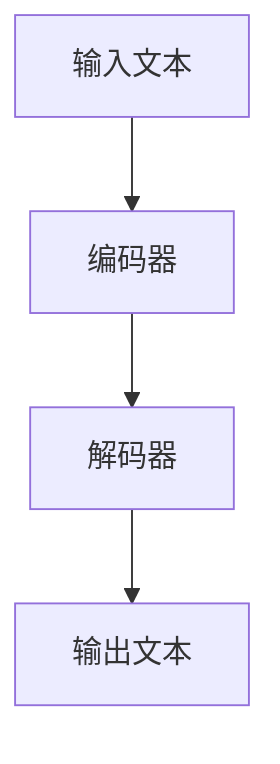
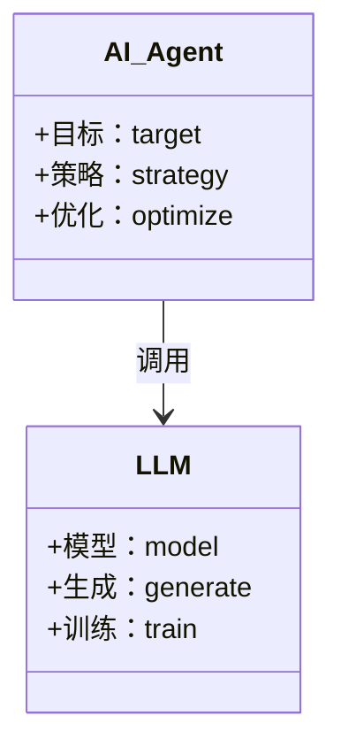

                 


# AI Agent的语言生成：提升LLM的文本创作质量

**关键词**：AI Agent、LLM、文本生成、语言模型优化、自然语言处理

**摘要**：  
本文探讨AI Agent在提升大型语言模型（LLM）文本生成质量中的作用。通过分析AI Agent与LLM的关系，详细讲解其核心概念、算法原理、数学模型，并结合实际案例，展示如何通过系统设计和优化策略来提高文本生成的准确性和创造力。文章从背景介绍到项目实战，全面覆盖相关知识点，为读者提供深入的技术指导。

---

## 第1章: AI Agent与语言生成的背景介绍

### 1.1 AI Agent的基本概念  
AI Agent（人工智能代理）是指能够感知环境并采取行动以实现目标的智能实体。在语言生成领域，AI Agent通过理解和生成自然语言文本，帮助用户完成任务或提供信息。  

#### 1.1.1 AI Agent的定义与特点  
- **定义**：AI Agent是一个能够与环境交互、自主决策的智能系统。  
- **特点**：  
  - **自主性**：无需外部干预，自主完成任务。  
  - **反应性**：能够实时感知环境并调整行为。  
  - **目标导向**：所有行动都以实现特定目标为导向。  

#### 1.1.2 语言生成的基本概念  
语言生成是AI系统根据输入生成符合语法规则和语义要求的自然语言文本的过程。  

#### 1.1.3 AI Agent在语言生成中的作用  
AI Agent通过分析用户需求，调用LLM生成文本，并根据反馈优化生成结果，从而提升语言生成的质量。

---

### 1.2 LLM的基本原理  
LLM（大型语言模型）基于深度学习技术，通过大量数据训练，能够生成与训练数据风格一致的文本。  

#### 1.2.1 LLM的定义与特点  
- **定义**：LLM是一种基于Transformer架构的深度学习模型，通过自监督学习从大量文本数据中学习语言规律。  
- **特点**：  
  - **大规模训练数据**：通常使用万亿参数级的数据进行训练。  
  - **生成能力**：能够生成连贯且语法正确的文本。  
  - **上下文理解**：通过自注意力机制理解上下文关系。  

#### 1.2.2 LLM的核心技术特点  
- **自注意力机制**：通过计算词与词之间的关系，生成更准确的上下文表示。  
- **多层神经网络**：通过多层变换捕捉复杂的语言模式。  

#### 1.2.3 LLM的应用场景  
- **文本生成**：新闻、文章、对话生成。  
- **机器翻译**：将一种语言翻译成另一种语言。  
- **问答系统**：回答用户的问题。  

---

### 1.3 AI Agent与LLM的关系  
AI Agent与LLM结合，形成了一个完整的语言生成系统，其中AI Agent负责决策和优化，LLM负责具体生成文本。  

#### 1.3.1 AI Agent与LLM的结合方式  
- **模块化设计**：AI Agent作为控制模块，调用LLM进行文本生成。  
- **反馈优化**：AI Agent根据生成结果的反馈，调整LLM的参数或生成策略。  

#### 1.3.2 LLM作为AI Agent的核心模块  
LLM是AI Agent实现语言生成功能的核心模块，负责具体生成文本内容。  

#### 1.3.3 AI Agent对LLM的优化作用  
AI Agent通过分析生成结果的质量，优化LLM的参数或调整生成策略，从而提高生成文本的准确性和流畅性。

---

## 第2章: AI Agent与LLM的核心概念与联系

### 2.1 核心概念原理  
AI Agent与LLM的核心概念包括生成策略、优化算法和反馈机制。  

#### 2.1.1 AI Agent的决策机制  
- **生成策略**：AI Agent根据任务需求选择合适的生成策略。  
- **优化算法**：通过强化学习优化生成结果。  

#### 2.1.2 LLM的生成机制  
- **自注意力机制**：计算词与词之间的关系，生成连贯文本。  
- **解码器结构**：逐步生成文本，根据生成结果调整后续生成内容。  

---

### 2.2 核心概念对比表格  
下表对比了AI Agent与LLM在功能、性能和应用场景上的差异：

| 对比维度   | AI Agent                       | LLM                        |
|------------|--------------------------------|-----------------------------|
| **功能**   | 决策、优化生成结果             | 生成文本                   |
| **性能**   | 高效性、准确性                 | 生成能力、上下文理解能力   |
| **应用场景** | 个性化生成、复杂任务处理     | 文本生成、翻译、问答系统   |

---

### 2.3 ER实体关系图架构  
以下是AI Agent与LLM的实体关系图：



---

## 第3章: LLM的算法原理讲解

### 3.1 算法原理概述  
LLM的算法原理主要包括编码器、解码器和自注意力机制三部分。

#### 3.1.1 编码器与解码器结构  
- **编码器**：将输入文本转换为向量表示。  
- **解码器**：根据编码器的输出生成目标文本。  

#### 3.1.2 自注意力机制  
自注意力机制通过计算词与词之间的关系，生成更准确的上下文表示。  

---

### 3.2 算法流程图  
以下是LLM的算法流程图：



---

## 第4章: LLM的数学模型与公式

### 4.1 编码器的数学模型  
编码器将输入文本转换为向量表示，公式如下：

$$
\text{Encoder}(x) = \sum_{i=1}^{n} w_i x_i
$$  

其中，\( w_i \) 是权重，\( x_i \) 是输入文本的特征。

---

### 4.2 解码器的数学模型  
解码器根据编码器的输出生成目标文本，公式如下：

$$
\text{Decoder}(y) = \sum_{j=1}^{m} u_j y_j
$$  

其中，\( u_j \) 是解码器的权重，\( y_j \) 是生成文本的特征。

---

## 第5章: 系统分析与架构设计

### 5.1 问题场景介绍  
本系统旨在通过AI Agent优化LLM的生成质量，解决传统LLM生成文本准确性和流畅性不足的问题。

---

### 5.2 系统功能设计  

#### 5.2.1 领域模型设计  
以下是领域模型类图：



---

### 5.3 系统架构设计  

#### 5.3.1 系统架构图  
以下是系统架构图：


---

### 5.4 系统接口设计  
AI Agent与LLM之间的接口设计如下：

- **输入接口**：AI Agent向LLM传递生成任务和参数。  
- **输出接口**：LLM向AI Agent返回生成文本和性能指标。

---

## 第6章: 项目实战

### 6.1 环境安装  
需要安装以下工具：Python、TensorFlow、Keras。

---

### 6.2 系统核心实现  

#### 6.2.1 AI Agent的实现  
以下是AI Agent的核心代码：

```python
class AI_Agent:
    def __init__(self):
        self.strategy = "贪心算法"
        self.optimize = "强化学习"

    def generate_text(self, prompt):
        # 调用LLM生成文本
        return self.llm.generate(prompt)
```

---

#### 6.2.2 LLM的实现  
以下是LLM的核心代码：

```python
class LLM:
    def __init__(self):
        self.model = "GPT-3"

    def generate(self, prompt):
        # 生成文本
        return "生成的文本内容"
```

---

### 6.3 实际案例分析  
通过具体案例分析AI Agent与LLM结合的实际应用，例如智能对话系统。

---

## 第7章: 最佳实践、小结与拓展阅读

### 7.1 最佳实践  
- **持续优化**：定期更新模型和策略。  
- **反馈机制**：根据用户反馈调整生成策略。  

### 7.2 小结  
本文详细介绍了AI Agent与LLM的关系，分析了其核心概念、算法原理和系统设计，并通过项目实战展示了如何提升文本生成质量。

### 7.3 注意事项  
- **数据隐私**：确保生成过程中数据的安全性。  
- **模型调优**：根据实际需求调整模型参数。  

### 7.4 拓展阅读  
推荐阅读相关领域的书籍和论文，深入理解AI Agent与LLM的技术细节。

---

**作者**：AI天才研究院 & 禅与计算机程序设计艺术

