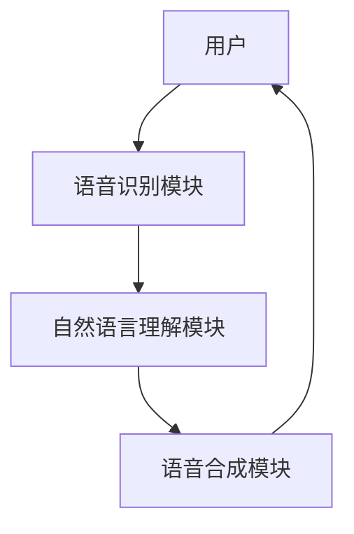

                 


# AI Agent的语音交互设计：语音识别与合成

> 关键词：AI Agent, 语音交互, 语音识别, 语音合成, 自然语言处理, 系统设计

> 摘要：  
本文深入探讨AI Agent在语音交互设计中的关键技术和实现原理，重点分析语音识别与合成的技术细节。文章从AI Agent的基本概念出发，逐步讲解语音识别与合成的核心算法、系统架构，最后通过实战案例展示如何设计和实现一个高效的语音交互系统。本文旨在为AI Agent的开发者和技术爱好者提供一份全面的技术指南。

---

# 第1章: AI Agent与语音交互概述

## 1.1 AI Agent的基本概念

### 1.1.1 什么是AI Agent
AI Agent（人工智能代理）是指能够感知环境、执行任务并做出决策的智能实体。它可以是一个软件程序、一个机器人，甚至是一个复杂的系统。AI Agent的核心目标是通过与环境交互，为用户解决问题或提供服务。

**AI Agent的关键特征：**
- **自主性**：能够在没有外部干预的情况下运行。
- **反应性**：能够感知环境并实时做出响应。
- **目标导向性**：通过目标驱动行为，完成特定任务。
- **学习能力**：能够通过数据和经验优化自身性能。

### 1.1.2 AI Agent的核心特征
AI Agent的设计目标是为用户提供智能化的服务。它需要具备以下核心特征：
- **感知能力**：通过传感器或输入接口获取环境信息。
- **决策能力**：基于感知信息做出决策。
- **执行能力**：通过动作或输出与环境交互。
- **学习能力**：通过数据和经验优化自身性能。

### 1.1.3 语音交互在AI Agent中的作用
语音交互是AI Agent与用户进行通信的重要方式。通过语音交互，AI Agent可以更自然地与用户互动，提升用户体验。语音交互的主要作用包括：
- 提供便捷的交互方式。
- 支持多语言和多模态交互。
- 提高系统的可用性和易用性。

## 1.2 语音交互的背景与现状

### 1.2.1 语音交互的发展历程
语音交互技术经历了多年的发展，从早期的电话自动语音应答系统到现在的智能音箱和虚拟助手，语音交互技术已经取得了长足的进步。近年来，随着深度学习技术的兴起，语音交互的准确性和响应速度得到了显著提升。

### 1.2.2 当前语音交互技术的应用场景
当前，语音交互技术广泛应用于以下场景：
- 智能音箱（如Amazon Alexa、Google Home）。
- 智能手机语音助手（如Siri、Google Assistant）。
- 智能汽车中的语音交互系统。
- 医疗、教育、客服等领域的语音交互应用。

### 1.2.3 语音交互的挑战与未来趋势
尽管语音交互技术已经取得了显著进展，但仍面临一些挑战：
- **噪声干扰**：在复杂环境中，噪声会影响语音识别的准确性。
- **多语种支持**：需要支持多种语言和方言，增加了技术复杂性。
- **实时性要求**：在某些应用场景中，对实时响应的要求很高。

未来，语音交互技术将朝着以下方向发展：
- 更高的识别准确性和响应速度。
- 更强的多模态交互能力。
- 更智能化的自然语言理解能力。

## 1.3 语音识别与合成的技术基础

### 1.3.1 语音识别的基本原理
语音识别的目标是将语音信号转换为文本或命令。其基本原理包括以下步骤：
1. **语音信号采集**：通过麦克风或其他设备获取语音信号。
2. **预处理**：包括降噪、端点检测等步骤，确保语音信号的质量。
3. **特征提取**：提取语音信号的特征，如梅尔频谱、倒谱等。
4. **声学模型训练**：使用深度学习模型（如LSTM、Transformer）训练声学模型。
5. **语言模型训练**：训练语言模型，用于提高识别的准确性。
6. **解码与输出**：通过解码器将声学特征转换为文本或命令。

### 1.3.2 语音合成的基本原理
语音合成的目标是将文本转换为语音。其基本原理包括以下步骤：
1. **文本分析**：分析输入文本的语法、语义和情感。
2. **特征提取**：提取文本的特征，如音调、节奏等。
3. **声学模型训练**：训练语音合成模型，如WaveNet、Tacotron等。
4. **语音生成**：通过模型生成语音信号。
5. **语音后处理**：对生成的语音进行平滑和优化，确保自然流畅。

### 1.3.3 语音识别与合成的关键技术对比
下表对比了语音识别和语音合成的关键技术：

| 技术 | 语音识别 | 语音合成 |
|------|----------|----------|
| 输入 | 语音信号 | 文本或命令 |
| 输出 | 文本或命令 | 语音信号 |
| 核心技术 | 声学模型、语言模型 | 声学模型、文本特征提取 |
| 应用场景 | 语音控制、语音搜索 | 智能音箱、语音助手 |

---

## 1.4 本章小结

本章介绍了AI Agent的基本概念和语音交互的重要作用，分析了语音交互技术的发展历程、应用场景以及未来趋势。同时，对比了语音识别与合成的关键技术，为后续章节的深入讲解奠定了基础。

---

# 第2章: 语音识别技术详解

## 2.1 语音识别的基本原理

### 2.1.1 声学模型
声学模型是语音识别的核心，负责将语音信号转换为可识别的特征。常用的声学模型包括：
- **GMM-HMM模型**：基于统计的混合高斯模型。
- **DNN-HMM模型**：基于深度神经网络的混合模型。
- **Transformer模型**：基于自注意力机制的模型。

### 2.1.2 语言模型
语言模型用于提高语音识别的准确性，通过概率统计方法预测下一个词或句子的可能性。常用的语言模型包括：
- **n-gram模型**：基于n阶马尔可夫链的模型。
- **语言模型优化**：通过平滑技术（如拉普拉斯平滑）提高模型的泛化能力。

### 2.1.3 解码器的作用
解码器负责将声学特征转换为最终的文本或命令。常用的解码算法包括：
- **维特比算法**：基于动态规划的解码算法。
- **束搜索算法**：基于贪心搜索的解码算法。

---

## 2.2 常见语音识别算法

### 2.2.1 隐马尔可夫模型（HMM）
隐马尔可夫模型是一种基于统计的语音识别方法，适用于小规模数据集。其核心思想是将语音信号建模为状态转移的过程。

**HMM模型的三个假设：**
1. **马尔可夫假设**：当前状态仅依赖于前一状态。
2. **观测独立假设**：观测仅依赖于当前状态。

### 2.2.2 长短期记忆网络（LSTM）
LSTM是一种基于深度学习的语音识别方法，适用于大规模数据集。其核心思想是通过长短期记忆单元（LSTM单元）捕捉语音信号的时间依赖性。

**LSTM单元的结构：**
- **输入门（Input Gate）**：控制新信息的输入。
- **遗忘门（Forget Gate）**：控制旧信息的遗忘。
- **输出门（Output Gate）**：决定输出的信息。

### 2.2.3 注意力机制（Attention）
注意力机制是一种基于深度学习的语音识别方法，适用于复杂的语音场景。其核心思想是通过自注意力机制捕捉语音信号的全局依赖性。

**注意力机制的公式：**
$$
\alpha_i = \frac{\exp(s_i)}{\sum_{j=1}^{n} \exp(s_j)}
$$

其中，$\alpha_i$ 表示第i个位置的注意力权重，$s_i$ 表示第i个位置的得分。

---

## 2.3 语音识别的优化方法

### 2.3.1 声学模型的优化
声学模型的优化方法包括：
- **模型压缩**：通过剪枝和量化技术减少模型的参数量。
- **模型蒸馏**：通过知识蒸馏技术将大型模型的知识迁移到小型模型中。

### 2.3.2 语言模型的优化
语言模型的优化方法包括：
- **数据增强**：通过数据增强技术扩展训练数据。
- **模型融合**：通过集成学习技术融合多个模型的预测结果。

### 2.3.3 解码器的优化
解码器的优化方法包括：
- **解码器加速**：通过优化解码算法提高解码速度。
- **解码器并行化**：通过并行计算技术提高解码效率。

---

## 2.4 本章小结

本章详细讲解了语音识别的基本原理、常见算法和优化方法。通过对声学模型、语言模型和解码器的深入分析，读者可以更好地理解语音识别的核心技术。

---

# 第3章: 语音合成技术详解

## 3.1 语音合成的基本原理

### 3.1.1 声学特征提取
声学特征提取是语音合成的第一步，常用的特征包括：
- **梅尔频谱**：将语音信号转换为频谱特征。
- **倒谱**：通过倒谱分析提取语音特征。

### 3.1.2 声学模型
声学模型是语音合成的核心，负责将文本特征转换为语音信号。常用的声学模型包括：
- **GMM模型**：基于统计的混合高斯模型。
- **DNN模型**：基于深度神经网络的模型。
- **WaveNet模型**：基于生成对抗网络的模型。

### 3.1.3 合成器的作用
合成器负责将声学特征转换为最终的语音信号。常用的合成算法包括：
- **波形合成**：通过波形合成技术生成语音信号。
- **参数合成**：通过参数合成技术生成语音信号。

---

## 3.2 常见语音合成算法

### 3.2.1 基于单元的合成
基于单元的合成是一种传统的语音合成方法，通过拼接预处理的语音单元生成目标语音。其优点是实现简单，缺点是生成语音的自然度较低。

### 3.2.2 基于统计的合成
基于统计的合成是一种基于概率模型的语音合成方法，通过统计模型生成语音信号。其优点是生成语音的自然度较高，缺点是实现复杂度较高。

### 3.2.3 基于深度学习的合成
基于深度学习的合成是一种基于生成对抗网络（GAN）的语音合成方法，通过深度学习模型生成高质量的语音信号。其优点是生成语音的自然度非常高，缺点是计算资源消耗较大。

---

## 3.3 语音合成的优化方法

### 3.3.1 声学模型的优化
声学模型的优化方法包括：
- **模型压缩**：通过剪枝和量化技术减少模型的参数量。
- **模型蒸馏**：通过知识蒸馏技术将大型模型的知识迁移到小型模型中。

### 3.3.2 合成器的优化
合成器的优化方法包括：
- **合成器加速**：通过优化合成算法提高合成速度。
- **合成器并行化**：通过并行计算技术提高合成效率。

### 3.3.3 声调和语调的优化
声调和语调的优化方法包括：
- **情感语音合成**：通过调整情感参数生成具有特定情感的语音。
- **节奏语音合成**：通过调整节奏参数生成具有特定节奏的语音。

---

## 3.4 本章小结

本章详细讲解了语音合成的基本原理、常见算法和优化方法。通过对声学模型、合成器和声调优化的深入分析，读者可以更好地理解语音合成的核心技术。

---

# 第4章: AI Agent的语音交互设计原理

## 4.1 语音交互设计的核心原则

### 4.1.1 用户体验优先
语音交互设计的核心原则是用户体验优先，确保用户能够方便地与AI Agent进行交互。

**用户体验的核心要素：**
- **语音识别的准确率**：确保用户输入的语音能够被准确识别。
- **语音合成的自然度**：确保系统输出的语音自然流畅。
- **交互的实时性**：确保交互过程中的响应速度。

### 4.1.2 自然语言处理的关键性
自然语言处理是语音交互设计的核心技术，负责理解和生成自然语言。

**自然语言处理的核心任务：**
- **语义理解**：通过自然语言理解技术理解用户意图。
- **语义生成**：通过自然语言生成技术生成系统响应。

### 4.1.3 系统响应的实时性
系统响应的实时性是语音交互设计的重要指标，直接影响用户体验。

**系统响应的优化方法：**
- **本地处理**：通过本地处理减少网络延迟。
- **边缘计算**：通过边缘计算技术提高响应速度。

---

## 4.2 语音交互设计的流程

### 4.2.1 需求分析
需求分析是语音交互设计的第一步，需要明确用户需求和系统功能。

**需求分析的核心步骤：**
1. **用户调研**：通过用户调研明确用户需求。
2. **需求整理**：将用户需求整理为系统功能。
3. **需求优先级排序**：根据需求的重要性和紧急性排序。

### 4.2.2 系统设计
系统设计是语音交互设计的关键步骤，需要设计系统的功能、架构和接口。

**系统设计的核心内容：**
- **系统功能设计**：设计系统的功能模块。
- **系统架构设计**：设计系统的架构图。
- **系统接口设计**：设计系统的接口规范。

### 4.2.3 测试与优化
测试与优化是语音交互设计的最后一步，需要通过测试验证系统的性能，并根据测试结果进行优化。

**测试与优化的核心步骤：**
1. **功能测试**：通过功能测试验证系统功能。
2. **性能测试**：通过性能测试优化系统性能。
3. **用户体验测试**：通过用户体验测试优化用户体验。

---

## 4.3 语音交互设计的技术实现

### 4.3.1 语音识别与合成的集成
语音识别与合成的集成是语音交互设计的关键技术，需要实现语音识别与合成的无缝集成。

**语音识别与合成的集成步骤：**
1. **语音识别模块集成**：将语音识别模块集成到系统中。
2. **语音合成模块集成**：将语音合成模块集成到系统中。
3. **模块协同工作**：确保语音识别与合成模块协同工作。

### 4.3.2 自然语言理解的实现
自然语言理解是语音交互设计的核心技术，负责理解和生成自然语言。

**自然语言理解的实现步骤：**
1. **自然语言理解模型训练**：通过深度学习模型训练自然语言理解模型。
2. **自然语言理解模型优化**：通过优化算法提高模型的准确率。

### 4.3.3 系统响应的生成
系统响应的生成是语音交互设计的最后一步，需要根据用户输入生成系统的响应。

**系统响应生成的核心步骤：**
1. **用户输入分析**：分析用户的输入内容。
2. **系统响应生成**：根据用户输入生成系统的响应。
3. **系统响应优化**：优化系统的响应内容。

---

## 4.4 本章小结

本章详细讲解了AI Agent语音交互设计的核心原则、流程和技术实现。通过对语音识别与合成的集成、自然语言理解的实现和系统响应生成的深入分析，读者可以更好地理解语音交互设计的核心技术。

---

# 第5章: 语音交互系统的算法原理

## 5.1 语音识别的算法流程

### 5.1.1 声学特征提取
声学特征提取是语音识别的第一步，常用的特征包括梅尔频谱和倒谱。

**梅尔频谱的计算公式：**
$$
M(t) = \log\left(\sum_{k=1}^{n} w_k x_k(t)\right)
$$

其中，$w_k$ 是梅尔滤波器的系数，$x_k(t)$ 是语音信号的分量。

### 5.1.2 声学模型训练
声学模型训练是语音识别的核心步骤，常用深度学习模型（如LSTM、Transformer）进行训练。

**LSTM模型的结构：**
- **输入门**：$i_t = \sigma(W_i x_t + U_i h_{t-1} + b_i)$
- **遗忘门**：$f_t = \sigma(W_f x_t + U_f h_{t-1} + b_f)$
- **输出门**：$o_t = \sigma(W_o x_t + U_o h_{t-1} + b_o)$
- **细胞状态**：$c_t = f_t c_{t-1} + i_t \tanh(W_c x_t + U_c h_{t-1} + b_c)$
- **隐藏状态**：$h_t = o_t \tanh(c_t)$

---

## 5.2 语音合成的算法流程

### 5.2.1 文本特征提取
文本特征提取是语音合成的第一步，常用的特征包括音调、节奏和情感。

**文本特征提取的步骤：**
1. **文本预处理**：对文本进行分词和标注。
2. **特征提取**：提取文本的特征，如音调、节奏和情感。

### 5.2.2 声学模型训练
声学模型训练是语音合成的核心步骤，常用深度学习模型（如WaveNet、Tacotron）进行训练。

**Tacotron模型的结构：**
- **编码器**：通过卷积层提取文本特征。
- **解码器**：通过解码器生成语音特征。
- **声学模型**：通过声学模型生成语音信号。

---

## 5.3 语音交互系统的算法优化

### 5.3.1 算法优化的核心方法
算法优化的核心方法包括：
- **模型压缩**：通过剪枝和量化技术减少模型的参数量。
- **模型蒸馏**：通过知识蒸馏技术将大型模型的知识迁移到小型模型中。
- **算法加速**：通过优化算法提高计算速度。

### 5.3.2 算法优化的具体实现
算法优化的具体实现包括：
- **模型压缩**：通过剪枝技术删除冗余的神经网络参数。
- **模型蒸馏**：通过知识蒸馏技术将大型模型的知识迁移到小型模型中。
- **算法加速**：通过并行计算技术提高计算速度。

---

## 5.4 本章小结

本章详细讲解了语音交互系统的算法原理和优化方法。通过对语音识别和语音合成算法的深入分析，读者可以更好地理解语音交互系统的实现原理。

---

# 第6章: 语音交互系统的系统架构设计

## 6.1 系统功能设计

### 6.1.1 系统功能模块
语音交互系统的功能模块包括：
- **语音识别模块**：负责将语音信号转换为文本或命令。
- **自然语言理解模块**：负责理解和生成自然语言。
- **语音合成模块**：负责将文本或命令转换为语音信号。
- **交互管理模块**：负责管理交互过程。

### 6.1.2 功能模块之间的关系
功能模块之间的关系如下：
1. **语音识别模块**接收用户的语音输入，输出文本或命令。
2. **自然语言理解模块**接收文本或命令，理解用户意图。
3. **语音合成模块**接收自然语言理解模块的输出，生成语音信号。
4. **交互管理模块**协调各功能模块的工作，确保交互过程顺利进行。

---

## 6.2 系统架构设计

### 6.2.1 系统架构图
以下是语音交互系统的系统架构图：



### 6.2.2 系统接口设计
系统接口设计是系统架构设计的重要内容，需要设计系统的接口规范。

**系统接口设计的核心步骤：**
1. **接口定义**：定义系统的接口规范。
2. **接口实现**：实现系统的接口功能。
3. **接口测试**：测试系统的接口功能。

### 6.2.3 系统交互流程
系统交互流程是系统架构设计的关键内容，需要设计系统的交互流程。

**系统交互流程的核心步骤：**
1. **用户发起请求**：用户通过语音或文本发起请求。
2. **系统响应请求**：系统通过语音或文本响应用户的请求。
3. **交互结束**：系统结束交互过程。

---

## 6.3 本章小结

本章详细讲解了语音交互系统的系统架构设计，包括系统功能设计、系统架构图和系统交互流程。通过对系统架构的深入分析，读者可以更好地理解语音交互系统的实现方式。

---

# 第7章: 语音交互系统的项目实战

## 7.1 项目背景与目标

### 7.1.1 项目背景
本项目旨在设计和实现一个基于AI Agent的语音交互系统，支持语音识别和语音合成功能。

### 7.1.2 项目目标
项目的最终目标是实现一个支持语音交互的AI Agent系统，能够通过语音与用户进行交互。

---

## 7.2 项目环境与工具

### 7.2.1 开发环境
- **操作系统**：Linux/Windows/MacOS
- **开发工具**：PyCharm/VS Code
- **深度学习框架**：TensorFlow/PyTorch

### 7.2.2 语音处理库
- **语音识别库**：librosa、scipy
- **语音合成库**：pyTTS、gTTS
- **自然语言处理库**：spaCy、NLTK

### 7.2.3 依赖管理工具
- **pip**：Python包管理工具
- **conda**：Python环境管理工具

---

## 7.3 项目核心实现

### 7.3.1 语音识别模块的实现
语音识别模块的实现步骤如下：
1. **语音信号采集**：通过麦克风或其他设备采集语音信号。
2. **语音信号预处理**：对语音信号进行降噪和端点检测。
3. **特征提取**：提取语音信号的特征，如梅尔频谱和倒谱。
4. **声学模型训练**：训练声学模型，如LSTM、Transformer模型。
5. **语言模型训练**：训练语言模型，优化识别准确率。
6. **解码与输出**：通过解码器将声学特征转换为文本或命令。

### 7.3.2 语音合成模块的实现
语音合成模块的实现步骤如下：
1. **文本预处理**：对文本进行分词和标注。
2. **特征提取**：提取文本的特征，如音调、节奏和情感。
3. **声学模型训练**：训练声学模型，如WaveNet、Tacotron模型。
4. **语音生成**：通过合成器生成语音信号。
5. **语音后处理**：对生成的语音进行平滑和优化。

### 7.3.3 系统交互流程的实现
系统交互流程的实现步骤如下：
1. **用户发起请求**：用户通过语音或文本发起请求。
2. **系统响应请求**：系统通过语音或文本响应用户的请求。
3. **交互结束**：系统结束交互过程。

---

## 7.4 项目代码实现

### 7.4.1 语音识别模块的代码实现
以下是语音识别模块的代码实现：

```python
import librosa
import numpy as np

def extract_features(audio_path):
    # 加载音频文件
    y, sr = librosa.load(audio_path, sr=None)
    # 提取梅尔频谱特征
    mel_features = librosa.feature.melspectrogram(y, sr=sr, n_mels=128)
    # 将梅尔频谱特征转换为对数域
    mel_features = np.log(mel_features + 1e-6)
    return mel_features

# 示例用法
audio_path = "input.wav"
features = extract_features(audio_path)
print("Feature shape:", features.shape)
```

### 7.4.2 语音合成模块的代码实现
以下是语音合成模块的代码实现：

```python
from scipy.io import soundfile
import numpy as np

def synthesize_speech(text, voice_model):
    # 文本预处理
    processed_text = preprocess_text(text)
    # 特征提取
    features = extract_features(processed_text)
    # 语音生成
    speech_signal = voice_model.generate(features)
    # 语音后处理
    smoothed_signal = smooth_signal(speech_signal)
    # 保存语音信号
    soundfile.write("output.wav", smoothed_signal, sr=16000)

# 示例用法
text = "Hello, how are you?"
synthesize_speech(text, voice_model)
```

### 7.4.3 系统交互流程的代码实现
以下是系统交互流程的代码实现：

```python
def main():
    while True:
        # 用户发起请求
        user_input = input("请输入您的指令：")
        # 语音识别模块处理
        recognized_text = speech_recognition(user_input)
        # 自然语言理解模块处理
        response = natural_language_understanding(recognized_text)
        # 语音合成模块处理
        speech_synthesis(response)
        # 交互结束
        break

if __name__ == "__main__":
    main()
```

---

## 7.5 项目小结

本章通过一个具体的项目实战，详细讲解了语音交互系统的实现过程。通过对语音识别模块、语音合成模块和系统交互流程的深入分析，读者可以更好地理解语音交互系统的实现方式。

---

# 第8章: 语音交互系统的优化与部署

## 8.1 系统优化方法

### 8.1.1 模型优化
模型优化是系统优化的重要内容，需要通过模型压缩和蒸馏技术优化模型性能。

### 8.1.2 算法优化
算法优化是系统优化的关键内容，需要通过算法加速和并行计算技术优化系统性能。

### 8.1.3 系统优化的具体实现
系统优化的具体实现包括：
- **模型压缩**：通过剪枝和量化技术减少模型的参数量。
- **模型蒸馏**：通过知识蒸馏技术将大型模型的知识迁移到小型模型中。
- **算法加速**：通过并行计算技术提高计算速度。

---

## 8.2 系统部署方案

### 8.2.1 系统部署环境
系统部署环境包括：
- **服务器端**：部署语音交互系统的核心模块。
- **客户端**：部署语音交互系统的用户界面。

### 8.2.2 系统部署步骤
系统部署步骤如下：
1. **环境准备**：准备系统部署的环境。
2. **系统安装**：安装系统所需的依赖和组件。
3. **系统配置**：配置系统的参数和接口。
4. **系统测试**：测试系统的功能和性能。

---

## 8.3 系统优化与部署的注意事项

### 8.3.1 模型优化注意事项
模型优化需要注意以下几点：
- **模型压缩**：需要确保模型压缩后的准确率不低于原始模型。
- **模型蒸馏**：需要确保知识蒸馏的过程能够有效传递知识。

### 8.3.2 算法优化注意事项
算法优化需要注意以下几点：
- **算法加速**：需要确保算法加速后的准确率不低于原始算法。
- **并行计算**：需要确保并行计算的资源充足。

### 8.3.3 系统部署注意事项
系统部署需要注意以下几点：
- **环境准备**：需要确保环境准备充分，避免部署过程中的问题。
- **系统测试**：需要确保系统的功能和性能符合要求。

---

## 8.4 本章小结

本章详细讲解了语音交互系统的优化与部署方法，包括模型优化、算法优化和系统部署的具体实现。通过对系统的优化与部署的深入分析，读者可以更好地理解语音交互系统的实际应用。

---

# 第9章: 语音交互系统的最佳实践

## 9.1 最佳实践

### 9.1.1 系统设计的最佳实践
系统设计的最佳实践包括：
- **模块化设计**：将系统设计为模块化结构，便于维护和扩展。
- **可扩展性设计**：确保系统具有良好的可扩展性。
- **可维护性设计**：确保系统具有良好的可维护性。

### 9.1.2 系统实现的最佳实践
系统实现的最佳实践包括：
- **代码规范**：确保代码符合规范，便于团队协作。
- **单元测试**：通过单元测试确保代码的正确性。
- **代码审查**：通过代码审查确保代码的质量。

### 9.1.3 系统优化的最佳实践
系统优化的最佳实践包括：
- **性能监控**：通过性能监控工具优化系统性能。
- **日志记录**：通过日志记录工具优化系统调试。
- **系统备份**：通过系统备份工具优化系统恢复。

---

## 9.2 小结

本章总结了语音交互系统设计和实现的最佳实践，包括系统设计、系统实现和系统优化的具体方法。通过对最佳实践的深入分析，读者可以更好地理解语音交互系统的实现方式。

---

# 结语

通过本文的详细讲解，读者可以全面了解AI Agent的语音交互设计的核心技术和实现方法。从语音识别与合成的基本原理到系统架构设计，再到项目实战和系统优化，本文为读者提供了一套完整的语音交互设计指南。未来，随着深度学习技术的不断发展，语音交互技术将变得更加智能和自然，为AI Agent的发展提供更强大的技术支持。

---

**作者：AI天才研究院/AI Genius Institute & 禅与计算机程序设计艺术 /Zen And The Art of Computer Programming**

