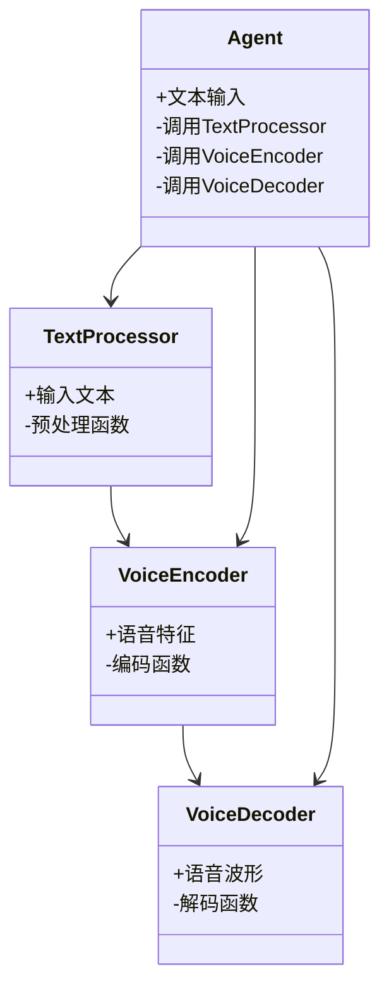
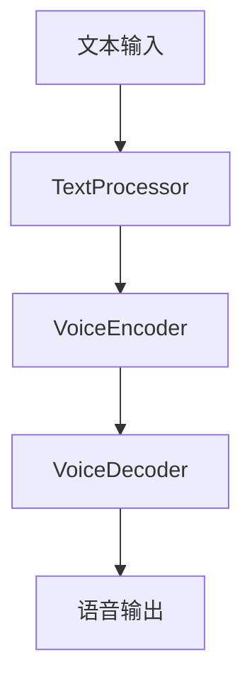
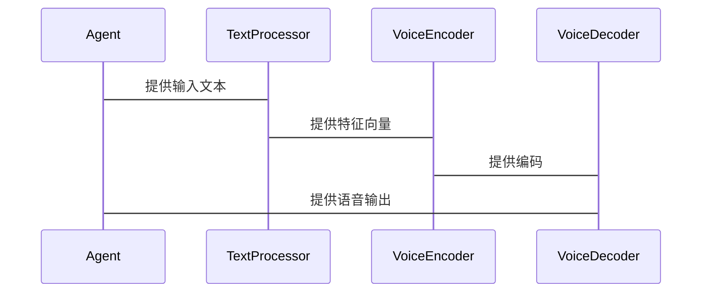

                 


# AI Agent的语音合成与克隆能力实现

## 关键词：AI Agent、语音合成、语音克隆、TTS、说话人编码、深度学习

## 摘要：AI Agent的语音合成与克隆能力是人工智能领域的重要技术。本文从问题背景出发，详细分析了语音合成与克隆的核心概念、算法原理、系统架构设计，并通过项目实战展示了实现过程，最后给出了最佳实践和未来展望。

---

# 第一部分: AI Agent的语音合成与克隆概述

## 第1章: 问题背景与目标

### 1.1 问题背景

#### 1.1.1 语音合成与克隆的定义
语音合成是指将文本转换为自然语音输出的过程，而语音克隆则是模仿特定人的语音特征，生成相似语音的技术。

#### 1.1.2 AI Agent在语音合成中的角色
AI Agent作为智能体，通过语音合成和克隆技术，能够与用户进行自然的语音交互，提升用户体验。

#### 1.1.3 当前技术的发展现状
语音合成技术从基于规则的TTS发展到基于深度学习的端到端模型，语音克隆技术也从简单的语音复制发展到基于说话人编码的个性化克隆。

### 1.2 问题描述

#### 1.2.1 语音合成与克隆的核心问题
语音合成需要解决文本到语音的转换问题，而语音克隆需要解决语音特征的提取与生成问题。

#### 1.2.2 AI Agent的语音能力需求
AI Agent需要具备生成自然语音和模仿特定人语音的能力，以实现个性化的语音交互。

#### 1.2.3 语音合成与克隆的技术挑战
技术挑战包括语音特征提取的准确性、语音生成的自然度以及模型的训练效率等。

### 1.3 问题解决

#### 1.3.1 语音合成与克隆的关键技术
关键技术包括文本处理、语音特征提取、语音合成模型训练等。

#### 1.3.2 AI Agent如何实现语音合成与克隆
通过深度学习模型训练，AI Agent能够生成自然的语音并模仿特定人的语音特征。

#### 1.3.3 技术实现的边界与外延
语音合成与克隆技术的边界在于生成语音的质量和自然度，外延则包括在不同场景下的应用。

### 1.4 概念结构与核心要素

#### 1.4.1 核心概念的层次结构
- 上层：语音合成、语音克隆
- 中层：文本处理、语音特征提取
- 下层：模型训练、语音生成

#### 1.4.2 核心要素的特征对比
| 特征 | 语音合成 | 语音克隆 |
|------|----------|----------|
| 输入 | 文本      | 语音特征 |
| 输出 | 合成语音 | 克隆语音 |
| 核心技术 | TTS模型 | 说话人编码 |

#### 1.4.3 概念之间的关系
语音合成和克隆技术可以结合使用，通过语音克隆生成特定人的语音，再通过语音合成生成目标语音。

---

## 第2章: 语音合成与克隆的核心概念

### 2.1 语音合成技术

#### 2.1.1 文本到语音（TTS）技术
文本到语音技术通过将输入的文本转换为自然的语音输出，常见的TTS模型包括Tacotron、FastSpeech等。

#### 2.1.2 语音合成的实现原理
语音合成的实现原理包括文本预处理、语音特征提取、声学模型训练等步骤。

#### 2.1.3 语音合成的性能指标
性能指标包括语音的自然度、相似度、生成速度等。

### 2.2 语音克隆技术

#### 2.2.1 语音克隆的定义与特点
语音克隆是指通过训练模型，模仿特定人的语音特征，生成相似语音的技术。

#### 2.2.2 语音克隆的关键技术
关键技术包括语音特征提取、说话人编码、语音生成模型训练等。

#### 2.2.3 语音克隆的应用场景
应用场景包括个性化语音助手、语音合成系统、语音增强等。

### 2.3 语音合成与克隆的对比

#### 2.3.1 技术原理对比
语音合成基于文本生成语音，语音克隆基于语音特征生成语音。

#### 2.3.2 实现难度对比
语音合成的实现相对简单，而语音克隆的实现较为复杂，需要较高的技术门槛。

#### 2.3.3 应用场景对比
语音合成适用于通用场景，而语音克隆适用于个性化场景。

---

## 第3章: AI Agent的语音能力实现

### 3.1 AI Agent的语音合成能力

#### 3.1.1 基于TTS的语音合成
通过训练TTS模型，AI Agent能够生成自然的语音输出。

#### 3.1.2 基于端到端模型的语音合成
端到端模型可以直接将输入文本映射到语音波形，生成高质量的语音。

#### 3.1.3 语音合成的优化方法
优化方法包括模型的优化、训练数据的优化等。

### 3.2 AI Agent的语音克隆能力

#### 3.2.1 语音克隆的基本原理
通过训练模型，提取语音特征，生成相似的语音。

#### 3.2.2 基于说话人编码的语音克隆
基于说话人编码的语音克隆技术能够生成与特定人相似的语音。

#### 3.2.3 语音克隆的训练与推理
训练阶段需要大量语音数据，推理阶段通过编码生成语音。

### 3.3 AI Agent语音能力的综合实现

#### 3.3.1 语音合成与克隆的结合
通过结合语音合成和克隆技术，AI Agent能够生成个性化语音。

#### 3.3.2 AI Agent的语音生成流程
语音生成流程包括文本预处理、语音特征提取、模型推理等步骤。

#### 3.3.3 语音生成的性能优化
性能优化包括模型的轻量化、推理速度的提升等。

---

# 第二部分: 语音合成与克隆的算法原理

## 第4章: 语音合成算法原理

### 4.1 Tacotron模型

#### 4.1.1 Tacotron模型简介
Tacotron是一种基于注意力机制的TTS模型，由编码器、注意力机制和解码器组成。

#### 4.1.2 Tacotron模型的流程图
```mermaid
graph TD
    A[文本输入] -> B[编码器] -> C[注意力机制] -> D[解码器] -> E[语音输出]
```

#### 4.1.3 Tacotron模型的数学公式
编码器将输入文本转换为特征向量：
$$
x = \text{Encoder}(X)
$$

解码器通过注意力机制生成语音波形：
$$
Y = \text{Decoder}(x)
$$

### 4.2 FastSpeech模型

#### 4.2.1 FastSpeech模型简介
FastSpeech是一种基于改进的TTS模型，通过引入语言标记来生成更准确的语音。

#### 4.2.2 FastSpeech模型的流程图
```mermaid
graph TD
    A[文本输入] -> B[编码器] -> C[语言标记] -> D[解码器] -> E[语音输出]
```

#### 4.2.3 FastSpeech模型的数学公式
编码器将输入文本转换为特征向量：
$$
x = \text{Encoder}(X)
$$

解码器生成语音波形：
$$
Y = \text{Decoder}(x)
$$

---

## 第5章: 语音克隆算法原理

### 5.1 VALL-E模型

#### 5.1.1 VALL-E模型简介
VALL-E是一种基于说话人编码的语音克隆模型，通过提取语音特征生成相似语音。

#### 5.1.2 VALL-E模型的流程图
```mermaid
graph TD
    A[语音输入] -> B[特征提取器] -> C[编码器] -> D[解码器] -> E[语音输出]
```

#### 5.1.3 VALL-E模型的数学公式
特征提取器将输入语音转换为特征向量：
$$
x = \text{FeatureExtractor}(X)
$$

解码器生成语音波形：
$$
Y = \text{Decoder}(x)
$$

### 5.2 其他语音克隆模型

#### 5.2.1 HIF-TTS模型
HIF-TTS是一种基于混合激励的语音克隆模型，通过结合多个说话人特征生成更自然的语音。

#### 5.2.2 Du韵模型
Du韵模型是一种基于深度学习的语音克隆模型，通过引入韵律特征生成更自然的语音。

---

## 第6章: 系统架构设计

### 6.1 项目场景介绍

#### 6.1.1 项目背景
本项目旨在实现一个基于AI Agent的语音合成与克隆系统，能够生成自然的语音并模仿特定人的语音特征。

#### 6.1.2 项目目标
项目目标包括实现语音合成、语音克隆、语音生成等功能。

### 6.2 系统功能设计

#### 6.2.1 领域模型


#### 6.2.2 系统架构


#### 6.2.3 接口设计
- 文本输入接口：接收输入文本
- 语音输入接口：接收输入语音
- 语音输出接口：输出生成语音

#### 6.2.4 交互流程


---

## 第7章: 项目实战

### 7.1 环境安装

#### 7.1.1 安装Python
安装Python 3.8以上版本。

#### 7.1.2 安装依赖库
安装TensorFlow、Keras、PyTorch等深度学习库。

#### 7.1.3 安装语音处理库
安装Librosa、Soundfile等语音处理库。

### 7.2 系统核心实现

#### 7.2.1 文本预处理代码
```python
import librosa

def preprocess_text(text):
    # 文本预处理代码
    return processed_text
```

#### 7.2.2 语音特征提取代码
```python
import librosa

def extract_features(audio_path):
    audio, sr = librosa.load(audio_path, sr=None)
    features = librosa.stft(audio)
    return features
```

#### 7.2.3 语音生成代码
```python
import tensorflow as tf

model = tf.keras.Model(inputs=encoder_input, outputs=prediction)
model.compile(optimizer='adam', loss='sparse_categorical_crossentropy')
```

### 7.3 案例分析与解读

#### 7.3.1 语音合成案例
输入文本生成语音输出，比较生成语音的自然度和相似度。

#### 7.3.2 语音克隆案例
输入语音生成克隆语音，比较克隆语音与原语音的相似度。

### 7.4 项目总结

#### 7.4.1 项目成果
实现了基于AI Agent的语音合成与克隆系统，能够生成自然的语音并模仿特定人的语音特征。

#### 7.4.2 经验总结
语音合成与克隆技术需要大量的数据和高效的模型设计。

---

## 第8章: 最佳实践

### 8.1 小结

#### 8.1.1 核心技术总结
语音合成与克隆的核心技术包括文本处理、语音特征提取、模型训练等。

#### 8.1.2 实现要点总结
实现要点包括选择合适的模型、优化训练数据、提高生成语音的质量等。

### 8.2 注意事项

#### 8.2.1 数据质量
数据质量对模型性能有重要影响，需要确保数据的多样性和质量。

#### 8.2.2 模型优化
模型优化包括模型结构的优化、训练参数的调整等。

#### 8.2.3 生成语音的评估
生成语音的评估包括自然度、相似度、生成速度等指标。

### 8.3 未来趋势

#### 8.3.1 技术发展趋势
语音合成与克隆技术将更加个性化、智能化，生成语音的质量和自然度将不断提升。

#### 8.3.2 应用场景拓展
语音合成与克隆技术将应用于更多的场景，包括教育、医疗、娱乐等。

### 8.4 拓展阅读

#### 8.4.1 推荐书籍
《生成式AI：语音合成与克隆》、《深度学习与语音处理》

#### 8.4.2 推荐论文
《Tacotron: Towards end-to-end speech synthesis》、《VALL-E: A voice cloning framework》

---

# 作者：AI天才研究院/AI Genius Institute & 禅与计算机程序设计艺术 /Zen And The Art of Computer Programming

