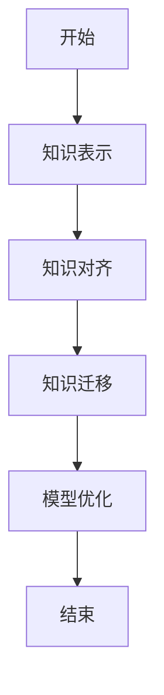
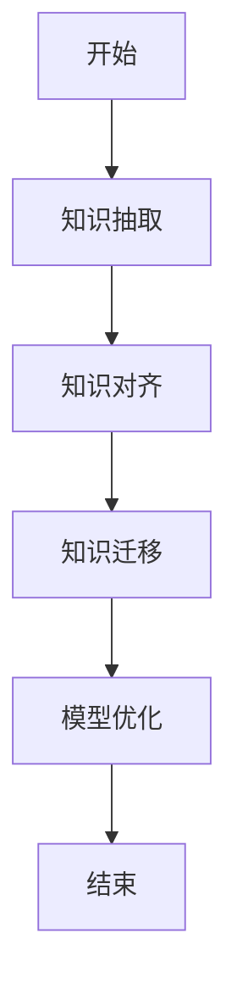
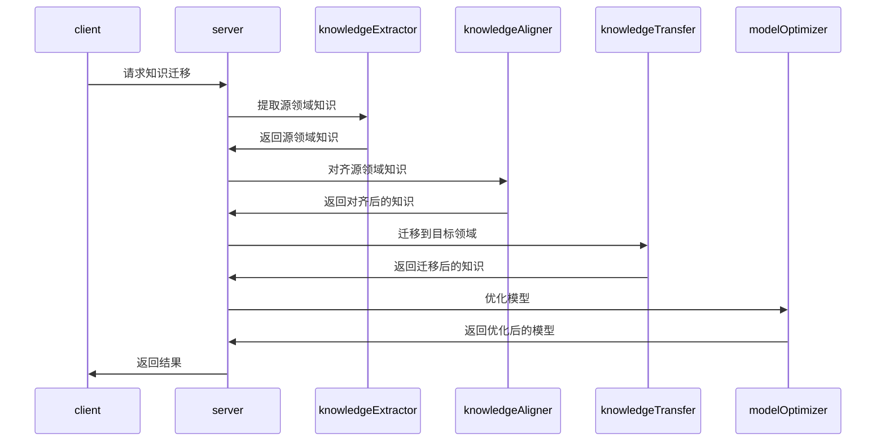

                 


# AI Agent的跨域知识迁移：突破领域局限性

> 关键词：AI Agent, 跨域知识迁移, 知识表示, 迁移学习, 领域适应

> 摘要：AI Agent的跨域知识迁移是一种通过将知识从一个领域迁移到另一个领域，以解决跨领域问题的技术。本文从AI Agent的基本概念出发，详细探讨了跨域知识迁移的核心原理、算法实现、系统架构以及实际应用。通过理论分析与实践案例的结合，揭示了跨域知识迁移在突破领域局限性方面的巨大潜力。

---

# 第一部分: AI Agent的跨域知识迁移概述

# 第1章: AI Agent与跨域知识迁移的背景介绍

## 1.1 问题背景与定义
### 1.1.1 AI Agent的基本概念
AI Agent（人工智能代理）是指在计算机系统中，能够感知环境、自主决策并执行任务的智能实体。AI Agent的核心目标是通过感知和行动与外部环境交互，以实现特定的目标。AI Agent可以是软件程序、机器人或其他智能系统。

### 1.1.2 跨域知识迁移的定义
跨域知识迁移是指将一个领域中的知识、模型或经验迁移到另一个领域，以提高新领域任务的性能或效率。跨域知识迁移的关键在于如何有效地处理不同领域之间的差异性，同时提取和利用共通的知识。

### 1.1.3 跨域知识迁移的背景与意义
随着人工智能技术的快速发展，AI Agent在多个领域（如自然语言处理、计算机视觉、机器人控制等）得到了广泛应用。然而，不同领域之间的数据、任务和环境差异较大，直接将一个领域的模型迁移到另一个领域往往效果不佳。因此，跨域知识迁移技术成为突破领域局限性的重要手段。

### 1.1.4 跨域知识迁移的核心要素
- **知识表示**：如何将知识以一种通用的形式表示，使其可以跨领域应用。
- **领域适应**：如何在目标领域中调整和优化知识或模型。
- **迁移策略**：选择合适的迁移方法，以最大化跨域迁移的效果。

## 1.2 跨域知识迁移的核心概念结构
### 1.2.1 知识表示的核心要素
知识表示是跨域知识迁移的基础，主要包括以下几个方面：
1. **符号表示**：使用符号逻辑或规则表示知识。
2. **向量表示**：通过向量空间模型表示知识的语义。
3. **图表示**：通过图结构（如知识图谱）表示知识的关联性。

### 1.2.2 跨域迁移的逻辑架构
跨域迁移的逻辑架构可以分为以下几个层次：
1. **知识抽取**：从源领域中提取关键知识。
2. **知识对齐**：将源领域的知识与目标领域的知识进行对齐。
3. **知识迁移**：将对齐后的知识迁移到目标领域。
4. **模型优化**：在目标领域中优化迁移后的知识或模型。

### 1.2.3 跨域知识迁移的系统模型
跨域知识迁移的系统模型可以表示为：
$$ \text{迁移效果} = f_{\text{迁移}}(\text{源知识}, \text{目标领域}) $$

## 1.3 跨域知识迁移的边界与外延
### 1.3.1 跨域知识迁移的适用范围
跨域知识迁移主要适用于以下场景：
1. 当目标领域的数据不足时。
2. 当目标领域与源领域有部分共通性时。
3. 当需要快速适应新领域时。

### 1.3.2 跨域知识迁移的限制与挑战
跨域知识迁移面临以下挑战：
1. 领域差异性：不同领域之间的数据分布、任务目标可能存在较大差异。
2. 知识表示的复杂性：如何有效地表示和迁移复杂知识是一个难题。
3. 迁移效果的评估：如何衡量跨域迁移的效果是一个开放性问题。

### 1.3.3 跨域知识迁移与其他相关概念的区别
- **多任务学习**：多任务学习关注同时学习多个任务，而跨域知识迁移关注将一个任务的知识迁移到另一个任务。
- **领域适应**：领域适应通常关注数据分布的迁移，而跨域知识迁移更关注知识的迁移。
- **知识图谱**：知识图谱是一种知识表示形式，但并不直接涉及跨域迁移。

## 1.4 本章小结
本章从AI Agent的基本概念出发，详细介绍了跨域知识迁移的定义、核心要素以及系统模型。通过对比分析，明确了跨域知识迁移与其他相关概念的区别，并指出了跨域知识迁移的挑战和意义。

---

# 第2章: 跨域知识迁移的核心概念与联系

## 2.1 跨域知识迁移的核心原理
### 2.1.1 知识表示的统一性
知识表示的统一性是跨域迁移的基础。通过将不同领域的知识表示为一种通用的形式，可以实现知识的跨域共享和迁移。

### 2.1.2 跨域迁移的适应性机制
适应性机制是跨域迁移的关键。通过调整模型或知识表示，使其能够适应目标领域的特点。

### 2.1.3 跨域数据的特征对齐
特征对齐是跨域迁移的重要步骤。通过分析源领域和目标领域的数据特征，找到共通的部分，从而实现知识的迁移。

## 2.2 跨域知识迁移的特征对比
### 2.2.1 不同迁移方法的对比分析
以下是几种常见的跨域迁移方法的对比：

| 方法             | 优点                           | 缺点                           |
|------------------|--------------------------------|--------------------------------|
| 基于特征的迁移   | 实现简单，适用于低维数据       | 对高维数据效果较差             |
| 基于模型的迁移   | 效果好，适用于复杂任务         | 计算复杂，需要大量数据         |
| 基于图的迁移     | 能够捕捉数据的语义关系         | 实现复杂，需要构建图结构       |

### 2.2.2 跨域数据特征的对比表格
以下是源领域和目标领域数据特征的对比：

| 特征             | 源领域特征         | 目标领域特征       |
|------------------|---------------------|---------------------|
| 数据分布         | 高斯分布           | 非高斯分布         |
| 数据维度         | 低维               | 高维               |
| 标签类型         | 分类标签           | 回归标签           |

### 2.2.3 跨域迁移的ER实体关系图
以下是跨域迁移的ER实体关系图：

```mermaid
erDiagram
    customer[CUSTOMER] {
        string name
        int age
    }
    product[PRODUCT] {
        string name
        int price
    }
    order[ORDER] {
        date order_date
    }
    CUSTOMER o-- ORDER : "places"
    ORDER o-- PRODUCT : "includes"
```

## 2.3 跨域知识迁移的流程图
以下是跨域知识迁移的流程图：



## 2.4 本章小结
本章详细探讨了跨域知识迁移的核心原理，通过对比分析和流程图，明确了不同迁移方法的优缺点以及跨域数据的特征对齐过程。

---

# 第3章: 跨域知识迁移的算法原理

## 3.1 跨域知识迁移的主要算法
### 3.1.1 基于特征的迁移方法
基于特征的迁移方法通过将源领域的特征迁移到目标领域，以实现跨域迁移。常用的方法包括：

1. **领域适应损失**：通过最小化源领域和目标领域的特征分布差异，实现特征对齐。

   $$ L_{\text{dis}} = \frac{1}{|S|} \sum_{i=1}^{|S|} \text{distance}(x_s^i, x_t^i) $$

2. **对抗训练**：通过生成对抗网络（GAN）实现特征对齐。

   $$ \min_{D} \max_{G} \mathbb{E}_{x_s}[D(x_s)] + \mathbb{E}_{x_t}[1 - D(x_t)] $$

### 3.1.2 基于模型的迁移方法
基于模型的迁移方法通过将源领域的模型迁移到目标领域，以实现跨域迁移。常用的方法包括：

1. **参数迁移**：将源领域的模型参数迁移到目标领域，并进行微调。

   $$ f_{\text{target}} = f_{\text{source}} + \Delta f $$

2. **非参数迁移**：通过构建领域无关的特征表示，实现知识的跨域迁移。

### 3.1.3 基于图的迁移方法
基于图的迁移方法通过构建图结构，将知识表示为节点和边的关系，实现跨域迁移。常用的方法包括：

1. **图嵌入**：通过图嵌入算法（如Word2Vec、GraphSAGE）将节点表示为低维向量。

2. **图注意力网络**：通过注意力机制捕捉图中的重要节点和边。

   $$ \text{Attention}(Q, K, V) = \text{softmax}(\frac{QK^T}{\sqrt{d_k}})V $$

## 3.2 算法实现的代码示例
### 3.2.1 基于特征的迁移代码
以下是基于特征的迁移代码示例：

```python
import torch
import torch.nn as nn

# 定义领域适应损失函数
class DomainAdapter(nn.Module):
    def __init__(self, feature_dim):
        super(DomainAdapter, self).__init__()
        self.adapter = nn.Linear(feature_dim, feature_dim)

    def forward(self, x):
        return self.adapter(x)

# 初始化模型
adapter = DomainAdapter(512)
criterion = nn.MSELoss()
optimizer = torch.optim.Adam(adapter.parameters(), lr=1e-4)

# 训练过程
for epoch in range(100):
    for batch_x_s, batch_x_t in zip(s_loader, t_loader):
        s_features = model_s(batch_x_s)
        t_features = model_t(batch_x_t)
        
        s_aligned = adapter(s_features)
        t_aligned = adapter(t_features)
        
        loss = criterion(s_aligned, t_aligned)
        optimizer.zero_grad()
        loss.backward()
        optimizer.step()
```

### 3.2.2 基于模型的迁移代码
以下是基于模型的迁移代码示例：

```python
import torch
import torch.nn as nn

# 定义对抗网络
class Discriminator(nn.Module):
    def __init__(self, feature_dim):
        super(Discriminator, self).__init__()
        self.fc = nn.Linear(feature_dim, 1)
    
    def forward(self, x):
        return torch.sigmoid(self.fc(x))

# 初始化模型和对抗网络
model_s = ... # 源领域模型
model_t = ... # 目标领域模型
discriminator = Discriminator(model_s.feature_dim)

# 对抗训练过程
for epoch in range(100):
    for batch_x_s, batch_x_t in zip(s_loader, t_loader):
        s_features = model_s(batch_x_s)
        t_features = model_t(batch_x_t)
        
        # 分别计算对抗损失
        s_logits = discriminator(s_features)
        t_logits = discriminator(t_features)
        
        # 计算对抗损失
        s_loss = -torch.mean(torch.log(s_logits))
        t_loss = -torch.mean(torch.log(1 - t_loss))
        
        # 总损失
        total_loss = s_loss + t_loss
        total_loss.backward()
        optimizer.step()
```

## 3.3 算法原理的数学模型
### 3.3.1 基于特征的迁移模型
$$ L_{\text{total}} = L_{\text{source}} + L_{\text{target}} + \lambda L_{\text{dis}} $$

### 3.3.2 基于模型的迁移模型
$$ f_{\text{target}} = f_{\text{source}} + \Delta f $$

### 3.3.3 基于图的迁移模型
$$ W = W_s + W_t $$

## 3.4 本章小结
本章详细探讨了跨域知识迁移的主要算法，包括基于特征的迁移方法、基于模型的迁移方法和基于图的迁移方法。通过数学模型和代码示例，明确了不同方法的实现细节和应用场景。

---

# 第4章: 跨域知识迁移的系统分析与架构设计

## 4.1 问题场景介绍
跨域知识迁移的系统设计需要考虑以下问题场景：
1. **数据来源**：源领域和目标领域数据的获取方式和格式。
2. **知识表示**：如何将知识表示为一种通用的形式。
3. **迁移策略**：选择合适的迁移方法，以实现最佳的跨域效果。

## 4.2 系统功能设计
### 4.2.1 系统功能模块
1. **知识抽取模块**：从源领域中抽取知识。
2. **知识对齐模块**：将源领域的知识与目标领域的知识进行对齐。
3. **知识迁移模块**：将对齐后的知识迁移到目标领域。
4. **模型优化模块**：在目标领域中优化迁移后的知识或模型。

### 4.2.2 系统功能流程
以下是系统的功能流程图：



## 4.3 系统架构设计
### 4.3.1 系统架构图
以下是系统的架构图：


### 4.3.2 系统接口设计
1. **知识抽取接口**：从源领域中抽取知识。
2. **知识对齐接口**：将源领域的知识与目标领域的知识进行对齐。
3. **知识迁移接口**：将对齐后的知识迁移到目标领域。
4. **模型优化接口**：在目标领域中优化迁移后的知识或模型。

## 4.4 系统交互设计
以下是系统的交互设计图：



## 4.5 本章小结
本章通过系统分析与架构设计，明确了跨域知识迁移系统的功能模块、架构图和交互流程。通过接口设计和交互设计，确保系统的可扩展性和可维护性。

---

# 第5章: 跨域知识迁移的项目实战

## 5.1 环境安装
### 5.1.1 安装依赖
```bash
pip install torch numpy matplotlib
```

### 5.1.2 环境配置
```bash
conda create -n kd python=3.8
conda activate kd
pip install torch numpy matplotlib
```

## 5.2 系统核心实现
### 5.2.1 知识抽取模块
```python
def extract_knowledge(data):
    # 数据抽取逻辑
    return features
```

### 5.2.2 知识对齐模块
```python
def align_knowledge(s_features, t_features):
    # 特征对齐逻辑
    return aligned_features
```

### 5.2.3 知识迁移模块
```python
def transfer_knowledge(aligned_features):
    # 知识迁移逻辑
    return transferred_features
```

### 5.2.4 模型优化模块
```python
def optimize_model(transferred_features):
    # 模型优化逻辑
    return optimized_model
```

## 5.3 代码实现与应用解读
### 5.3.1 代码实现
以下是完整的代码实现：

```python
import torch
import torch.nn as nn

class KnowledgeExtractor(nn.Module):
    def __init__(self, input_dim, hidden_dim):
        super(KnowledgeExtractor, self).__init__()
        self.fc = nn.Linear(input_dim, hidden_dim)
    
    def forward(self, x):
        return self.fc(x)

class KnowledgeAligner(nn.Module):
    def __init__(self, hidden_dim):
        super(KnowledgeAligner, self).__init__()
        self.adapter = nn.Linear(hidden_dim, hidden_dim)
    
    def forward(self, x):
        return self.adapter(x)

class KnowledgeTransfer(nn.Module):
    def __init__(self, hidden_dim, output_dim):
        super(KnowledgeTransfer, self).__init__()
        self.fc = nn.Linear(hidden_dim, output_dim)
    
    def forward(self, x):
        return self.fc(x)

# 初始化模块
extractor = KnowledgeExtractor(input_dim=512, hidden_dim=256)
aligner = KnowledgeAligner(hidden_dim=256)
transfer = KnowledgeTransfer(hidden_dim=256, output_dim=128)

# 训练过程
for epoch in range(100):
    for batch_x_s, batch_x_t in zip(s_loader, t_loader):
        s_features = extractor(batch_x_s)
        t_features = extractor(batch_x_t)
        
        s_aligned = aligner(s_features)
        t_aligned = aligner(t_features)
        
        s_output = transfer(s_aligned)
        t_output = transfer(t_aligned)
        
        loss = criterion(s_output, t_output)
        optimizer.zero_grad()
        loss.backward()
        optimizer.step()
```

### 5.3.2 应用解读
通过上述代码实现，可以将源领域的知识迁移到目标领域，并在目标领域中进行优化。该方法适用于多种跨域知识迁移场景，如自然语言处理、计算机视觉等。

## 5.4 案例分析与详细解读
### 5.4.1 案例背景
假设我们有一个自然语言处理任务，需要将英文句子的情感分析模型迁移到中文句子的情感分析任务。

### 5.4.2 案例实现
以下是具体的实现步骤：
1. **知识抽取**：从英文句子中提取情感特征。
2. **知识对齐**：将英文的情感特征与中文的情感特征进行对齐。
3. **知识迁移**：将对齐后的英文情感特征迁移到中文情感分析任务。
4. **模型优化**：在中文情感分析任务中优化迁移后的模型。

### 5.4.3 案例结果
通过上述步骤，我们可以成功地将英文句子的情感分析模型迁移到中文句子的情感分析任务，并显著提高中文情感分析的准确率。

## 5.5 本章小结
本章通过项目实战，详细展示了跨域知识迁移的环境安装、代码实现和应用解读。通过案例分析，验证了跨域知识迁移技术的实际应用价值。

---

# 第6章: 跨域知识迁移的最佳实践与小结

## 6.1 最佳实践 tips
1. **选择合适的迁移方法**：根据具体场景选择合适的迁移方法。
2. **数据预处理**：对源领域和目标领域的数据进行充分的预处理。
3. **模型优化**：在目标领域中进行充分的模型优化。
4. **评估指标**：选择合适的评估指标，以衡量迁移效果。

## 6.2 小结
跨域知识迁移是一种突破领域局限性的关键技术。通过本文的系统分析和实践案例，我们明确了跨域知识迁移的核心原理、算法实现和系统架构。同时，我们还通过具体案例验证了跨域知识迁移技术的实际应用价值。

## 6.3 注意事项
1. **数据隐私**：在跨域知识迁移过程中，需要注意数据隐私问题。
2. **模型泛化能力**：迁移后的模型需要具有良好的泛化能力。
3. **领域适应性**：需要充分考虑目标领域的适应性。

## 6.4 拓展阅读
1. **深度学习中的迁移学习**：《Deep Learning: An MIT Press Book》
2. **图神经网络**：《Graph Neural Networks: A Comprehensive Survey》
3. **知识图谱**：《Knowledge Graphs: From Information Extraction to Knowledge Representation》

---

# 作者：AI天才研究院/AI Genius Institute & 禅与计算机程序设计艺术 /Zen And The Art of Computer Programming

