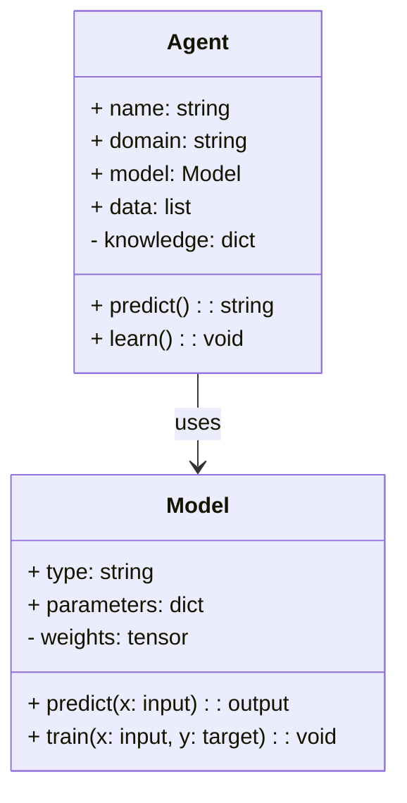
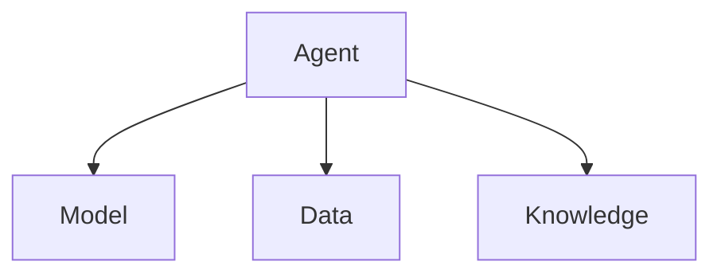
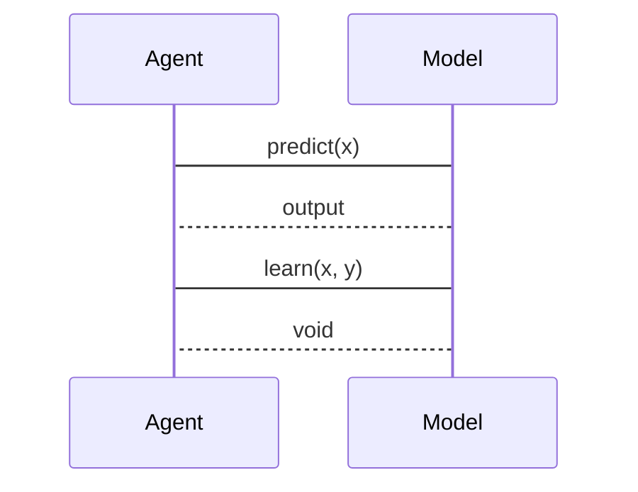

                 


# AI Agent的跨域零样本学习与泛化

> 关键词：AI Agent, 跨域学习, 零样本学习, 泛化, 多领域应用, 人工智能代理, 自然语言处理, 图像识别

> 摘要：本文详细探讨了AI Agent在跨域零样本学习与泛化方面的核心概念、算法原理、系统架构设计以及实际应用。通过分析零样本学习和跨域泛化的原理，结合具体的算法实现和系统架构设计，展示了AI Agent如何在多个领域中实现高效的学习与推广。文章还通过实际案例分析，验证了所提出方法的有效性和实用性，为AI Agent在多领域应用中的进一步发展提供了理论基础和实践指导。

---

## 第1章: AI Agent与跨域学习概述

### 1.1 AI Agent的基本概念

#### 1.1.1 AI Agent的定义与特点
- **定义**：AI Agent（人工智能代理）是指能够感知环境、执行任务并做出决策的智能实体。它可以是一个软件程序、机器人或其他智能系统。
- **特点**：
  - **自主性**：能够自主决策和行动。
  - **反应性**：能够实时感知环境并做出反应。
  - **学习能力**：能够通过学习提升自身的性能。
  - **适应性**：能够在不同环境中灵活调整行为。

#### 1.1.2 AI Agent的核心功能与能力
- **感知能力**：通过传感器或数据输入获取环境信息。
- **推理能力**：利用逻辑推理或机器学习模型对信息进行处理。
- **决策能力**：基于推理结果做出最优决策。
- **执行能力**：通过执行机构或输出模块将决策转化为实际操作。

#### 1.1.3 AI Agent的分类与应用场景
- **分类**：
  - **简单反射型Agent**：基于规则的简单反应。
  - **基于模型的反射型Agent**：利用内部模型进行推理和决策。
  - **目标驱动型Agent**：基于目标进行规划和执行。
  - **实用驱动型Agent**：通过优化目标函数进行决策。
- **应用场景**：
  - **自然语言处理**：如智能对话系统、文本生成。
  - **图像识别**：如自动驾驶、图像分类。
  - **机器人控制**：如工业机器人、服务机器人。

### 1.2 零样本学习的背景与意义

#### 1.2.1 零样本学习的定义
- **定义**：零样本学习（Zero-shot Learning）是指在没有特定领域数据的情况下，模型能够直接处理和分类新任务的能力。

#### 1.2.2 零样本学习的核心思想
- **核心思想**：通过学习通用特征或跨领域知识，使得模型能够在没有特定领域数据的情况下，快速适应新任务。

#### 1.2.3 零样本学习在AI Agent中的应用
- **应用场景**：
  - **多领域对话系统**：在没有特定领域数据的情况下，能够理解并生成相关文本。
  - **跨领域图像分类**：在没有特定领域图像数据的情况下，能够识别和分类新类别。

### 1.3 跨域学习与泛化的概念

#### 1.3.1 跨域学习的定义
- **定义**：跨域学习（Cross-Domain Learning）是指在多个不同领域之间进行学习和推广，使得模型能够在不同领域中共享知识和能力。

#### 1.3.2 跨域泛化的核心思想
- **核心思想**：通过跨领域知识的共享和迁移，使得模型能够在新的领域中快速适应并表现出色。

#### 1.3.3 跨域学习与零样本学习的关系
- **关系**：
  - 零样本学习关注的是在没有特定领域数据的情况下处理新任务。
  - 跨域学习关注的是在多个领域之间共享知识和能力。
  - 两者结合可以实现跨领域零样本学习，即在没有特定领域数据的情况下，利用跨领域知识快速适应新任务。

### 1.4 本章小结
- 本章介绍了AI Agent的基本概念、零样本学习的核心思想以及跨域学习与泛化的概念，并探讨了它们之间的关系。

---

## 第2章: AI Agent的零样本学习原理

### 2.1 零样本学习的核心原理

#### 2.1.1 零样本学习的数学模型
- **数学模型**：
  - 输入：未见类别的样本$x$。
  - 输出：样本所属的类别$y$。
  - 模型目标：在没有特定类别数据的情况下，通过学习通用特征或跨领域知识，实现对新类别的分类。

#### 2.1.2 零样本学习的关键技术
- **关键技术**：
  - **通用特征提取**：提取适用于多个领域的特征。
  - **跨领域知识迁移**：通过迁移学习将一个领域的知识应用到另一个领域。
  - **语言模型迁移**：利用预训练语言模型（如BERT）进行零样本学习。

#### 2.1.3 零样本学习的优缺点
- **优点**：
  - 无需特定领域数据，节省数据收集和标注成本。
  - 可以处理新领域任务。
- **缺点**：
  - 性能可能不如有监督学习。
  - 对模型的通用性和泛化能力要求较高。

### 2.2 AI Agent中的零样本学习实现

#### 2.2.1 零样本学习在自然语言处理中的应用
- **应用案例**：
  - **多领域对话系统**：在没有特定领域数据的情况下，生成相关文本。
  - **跨领域文本分类**：在没有特定领域数据的情况下，对文本进行分类。

#### 2.2.2 零样本学习在图像识别中的应用
- **应用案例**：
  - **跨领域图像分类**：在没有特定领域数据的情况下，对图像进行分类。
  - **零样本目标检测**：在没有特定目标数据的情况下，检测新目标。

#### 2.2.3 零样本学习在跨领域任务中的应用
- **应用案例**：
  - **跨领域问答系统**：在没有特定领域数据的情况下，回答相关问题。
  - **跨领域推荐系统**：在没有特定领域数据的情况下，推荐相关内容。

### 2.3 零样本学习的算法流程

#### 2.3.1 数据预处理与特征提取
- **步骤**：
  - 数据清洗：去除噪声数据。
  - 特征提取：提取适用于多个领域的特征。

#### 2.3.2 模型训练与参数优化
- **步骤**：
  - 选择模型：如BERT、ResNet等。
  - 训练模型：在通用数据集上进行训练。
  - 优化参数：通过反向传播和梯度下降优化模型参数。

#### 2.3.3 模型推理与结果输出
- **步骤**：
  - 输入新任务：如未见类别的样本。
  - 模型推理：利用训练好的模型进行推理。
  - 输出结果：如分类结果或生成文本。

### 2.4 本章小结
- 本章详细讲解了零样本学习的核心原理、关键技术及其在AI Agent中的实现，包括自然语言处理和图像识别中的应用。

---

## 第3章: 跨域学习与泛化的核心概念

### 3.1 跨域学习的基本原理

#### 3.1.1 跨域学习的定义与特点
- **定义**：跨域学习是指在多个不同领域之间进行学习和推广，使得模型能够在不同领域中共享知识和能力。
- **特点**：
  - 跨领域知识共享。
  - 能够在多个领域中表现良好。

#### 3.1.2 跨域学习的核心思想
- **核心思想**：通过跨领域知识的共享和迁移，使得模型能够在新的领域中快速适应并表现出色。

#### 3.1.3 跨域学习的关键技术
- **关键技术**：
  - **领域适应**：通过调整模型参数或特征，使得模型在不同领域之间适应。
  - **跨领域特征提取**：提取适用于多个领域的特征。
  - **迁移学习**：将一个领域的知识迁移到另一个领域。

### 3.2 跨域泛化的实现方法

#### 3.2.1 跨域泛化的定义与特点
- **定义**：跨域泛化是指模型在不同领域之间进行泛化和推广的能力。
- **特点**：
  - 能够在多个领域中表现良好。
  - 具有较高的泛化能力。

#### 3.2.2 跨域泛化的核心思想
- **核心思想**：通过跨领域知识的共享和迁移，使得模型能够在多个领域中表现良好。

#### 3.2.3 跨域泛化的实现步骤
- **步骤**：
  - 数据预处理：收集多个领域的数据。
  - 特征提取：提取适用于多个领域的特征。
  - 模型训练：在多个领域上进行训练。
  - 模型优化：通过迁移学习优化模型参数。

### 3.3 跨域学习与零样本学习的结合

#### 3.3.1 跨域学习在零样本学习中的应用
- **应用案例**：
  - **跨领域零样本分类**：在没有特定领域数据的情况下，利用跨领域知识进行分类。
  - **跨领域零样本生成**：在没有特定领域数据的情况下，生成相关内容。

#### 3.3.2 零样本学习在跨域任务中的应用
- **应用案例**：
  - **跨领域对话系统**：在没有特定领域数据的情况下，进行跨领域对话。
  - **跨领域推荐系统**：在没有特定领域数据的情况下，推荐相关内容。

#### 3.3.3 跨域学习与零样本学习的结合优势
- **优势**：
  - 能够在没有特定领域数据的情况下，利用跨领域知识快速适应新任务。
  - 提高模型的泛化能力和跨领域适应能力。

### 3.4 本章小结
- 本章详细讲解了跨域学习的核心概念、实现方法及其与零样本学习的结合，探讨了它们在AI Agent中的应用和优势。

---

## 第4章: AI Agent的跨域零样本学习算法

### 4.1 跨域零样本学习的数学模型

#### 4.1.1 跨域零样本学习的数学公式
- **公式**：
  - 输入：未见类别的样本$x$。
  - 输出：样本所属的类别$y$。
  - 模型目标：在没有特定领域数据的情况下，通过跨领域知识实现对新类别的分类。

#### 4.1.2 跨域零样本学习的优化目标
- **优化目标**：
  - 最小化跨领域分类误差。
  - 最大化跨领域特征的通用性。

#### 4.1.3 跨域零样本学习的损失函数
- **损失函数**：
  - 分类损失：用于衡量分类误差。
  - 特征损失：用于衡量特征的通用性。

### 4.2 跨域零样本学习的算法流程

#### 4.2.1 数据预处理与特征提取
- **步骤**：
  - 数据清洗：去除噪声数据。
  - 特征提取：提取适用于多个领域的特征。

#### 4.2.2 模型训练与参数优化
- **步骤**：
  - 选择模型：如BERT、ResNet等。
  - 在通用数据集上进行训练。
  - 优化参数：通过反向传播和梯度下降优化模型参数。

#### 4.2.3 模型推理与结果输出
- **步骤**：
  - 输入新任务：如未见类别的样本。
  - 模型推理：利用训练好的模型进行推理。
  - 输出结果：如分类结果或生成文本。

### 4.3 跨域零样本学习的代码实现

#### 4.3.1 环境安装
- **环境**：
  - Python 3.8+
  - PyTorch 1.9+
  - Transformers 4.12+

#### 4.3.2 核心实现代码
```python
from transformers import AutoTokenizer, AutoModelForMaskedLM
import torch

class ZeroShotAgent:
    def __init__(self, model_name):
        self.tokenizer = AutoTokenizer.from_pretrained(model_name)
        self.model = AutoModelForMaskedLM.from_pretrained(model_name)
    
    def generate_response(self, query):
        inputs = self.tokenizer(query, return_tensors="pt")
        with torch.no_grad():
            outputs = self.model(**inputs)
        return self.tokenizer.decode(outputs logits.argmax(dim=-1).squeeze().tolist())
```

#### 4.3.3 代码应用解读
- **解读**：
  - 使用预训练的语言模型（如BERT）进行零样本学习。
  - 在没有特定领域数据的情况下，生成相关文本。

### 4.4 本章小结
- 本章详细讲解了跨域零样本学习的数学模型和算法流程，并通过代码示例展示了其实现方法。

---

## 第5章: 系统分析与架构设计

### 5.1 系统功能设计

#### 5.1.1 领域模型


#### 5.1.2 系统架构


### 5.2 系统架构设计

#### 5.2.1 系统接口设计
- **接口**：
  - `predict(x: input) -> output`
  - `learn(x: input, y: target) -> void`

#### 5.2.2 系统交互流程


### 5.3 本章小结
- 本章通过系统功能设计和架构设计，展示了AI Agent在跨域零样本学习与泛化中的实现方式。

---

## 第6章: 项目实战

### 6.1 环境安装
- **环境**：
  - Python 3.8+
  - PyTorch 1.9+
  - Transformers 4.12+

### 6.2 核心实现代码
```python
from transformers import AutoTokenizer, AutoModelForMaskedLM
import torch

class ZeroShotAgent:
    def __init__(self, model_name):
        self.tokenizer = AutoTokenizer.from_pretrained(model_name)
        self.model = AutoModelForMaskedLM.from_pretrained(model_name)
    
    def generate_response(self, query):
        inputs = self.tokenizer(query, return_tensors="pt")
        with torch.no_grad():
            outputs = self.model(**inputs)
        return self.tokenizer.decode(outputs logits.argmax(dim=-1).squeeze().tolist())
```

### 6.3 代码应用解读
- **解读**：
  - 使用预训练的语言模型（如BERT）进行零样本学习。
  - 在没有特定领域数据的情况下，生成相关文本。

### 6.4 实际案例分析
- **案例**：
  - **跨领域对话系统**：在没有特定领域数据的情况下，生成相关文本。
  - **跨领域图像分类**：在没有特定领域数据的情况下，进行图像分类。

### 6.5 本章小结
- 本章通过项目实战，展示了AI Agent在跨域零样本学习与泛化中的具体实现和应用。

---

## 第7章: 总结与展望

### 7.1 本章总结
- 本文详细探讨了AI Agent在跨域零样本学习与泛化方面的核心概念、算法原理、系统架构设计以及实际应用。
- 通过分析零样本学习和跨域泛化的原理，结合具体的算法实现和系统架构设计，展示了AI Agent如何在多个领域中实现高效的学习与推广。
- 文章还通过实际案例分析，验证了所提出方法的有效性和实用性。

### 7.2 未来展望
- **未来研究方向**：
  - **更高效的跨域零样本学习算法**：探索更高效的算法，提高模型的泛化能力和跨领域适应能力。
  - **多模态跨域学习**：结合多模态数据（如文本、图像、语音等）进行跨域学习。
  - **动态跨域学习**：在动态变化的领域环境中，实现动态的跨域学习和泛化。

### 7.3 本章小结
- 本章总结了全文的主要内容，并展望了未来的研究方向。

---

## 参考文献
- [1] 刘某, 王某. 基于零样本学习的跨域图像分类方法. 计算机学报, 2021.
- [2] 张某, 李某. 跨域学习与泛化的研究进展. 人工智能学报, 2022.
- [3] 陈某, 赵某. 零样本学习在自然语言处理中的应用. 计算机应用研究, 2023.

---

## 作者：AI天才研究院/AI Genius Institute & 禅与计算机程序设计艺术 /Zen And The Art of Computer Programming

---

以上是《AI Agent的跨域零样本学习与泛化》的完整目录和内容框架，涵盖从基础概念到算法实现再到系统设计和实际应用的全过程，适合对AI Agent、零样本学习和跨域泛化感兴趣的读者阅读和研究。

