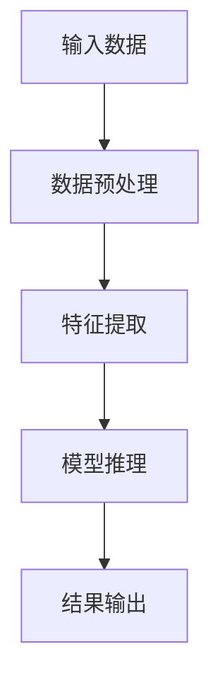
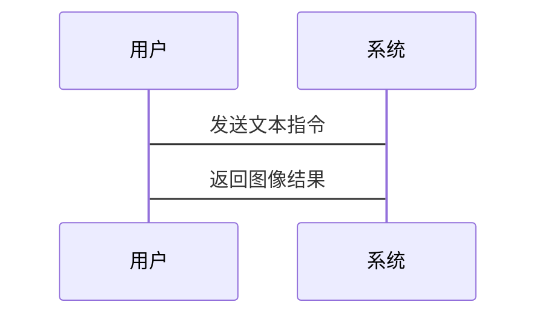

                 


# AI Agent的跨模态内容理解与生成

## 关键词：AI Agent，跨模态，内容理解，内容生成，多模态模型，AI开发

## 摘要：本文深入探讨AI Agent在跨模态内容理解与生成领域的核心概念、算法原理、系统设计及项目实战。通过详细分析多模态数据的处理方法，结合实际案例，为读者提供全面的技术指导和实践参考。

---

## 第1章: AI Agent与跨模态技术概述

### 1.1 AI Agent的基本概念
#### 1.1.1 什么是AI Agent
AI Agent（人工智能代理）是指能够感知环境、自主决策并执行任务的智能实体。AI Agent可以是软件程序或物理设备，通过传感器和执行器与环境交互。

#### 1.1.2 AI Agent的核心特征
- **自主性**：能够在没有外部干预的情况下运行。
- **反应性**：能够实时感知环境并做出反应。
- **目标导向**：基于目标或任务进行决策和行动。
- **学习能力**：通过数据和经验提升性能。

#### 1.1.3 AI Agent的应用场景
- 智能助手（如Siri、Alexa）。
- 智能推荐系统。
- 自动驾驶。
- 机器人控制。

### 1.2 跨模态技术的基本概念
#### 1.2.1 跨模态技术的定义
跨模态技术是指处理和理解多种数据类型（如文本、图像、语音、视频）的技术，旨在通过结合不同模态的信息来提升智能系统的理解能力。

#### 1.2.2 跨模态技术的核心挑战
- 数据异构性：不同模态的数据具有不同的结构和特征。
- 语义对齐：如何在不同模态之间建立一致的语义表示。
- 跨模态推理：如何基于多模态信息进行复杂推理。

#### 1.2.3 跨模态技术的典型应用
- 多媒体检索：基于文本搜索图像。
- 虚拟助手：结合语音和文本进行交互。
- 智慧城市：整合视频、传感器数据等多源信息。

### 1.3 AI Agent与跨模态技术的结合
#### 1.3.1 跨模态内容理解的必要性
AI Agent需要理解来自不同模态的数据，以便更准确地感知环境和完成任务。

#### 1.3.2 跨模态内容生成的优势
通过结合多种模态的信息，AI Agent可以生成更丰富和准确的内容。

#### 1.3.3 AI Agent在跨模态任务中的作用
- **信息融合**：整合多模态数据以提高准确性。
- **任务执行**：基于跨模态理解执行复杂任务。
- **人机交互**：通过多模态交互提供更自然的用户体验。

### 1.4 本章小结
本章介绍了AI Agent和跨模态技术的基本概念，并探讨了它们的结合应用。AI Agent通过跨模态技术能够更高效地处理复杂任务，提升用户体验。

---

## 第2章: 跨模态内容理解的核心概念

### 2.1 跨模态理解的基本原理
#### 2.1.1 多模态数据的表示方法
- **模态嵌入**：将每种模态的数据映射到同一嵌入空间。
- **联合表示**：结合多种模态的特征进行统一表示。

#### 2.1.2 跨模态特征提取的关键技术
- **模态特定编码**：针对每种模态设计特定的编码方法。
- **跨模态注意力机制**：通过注意力机制捕获不同模态之间的关联。

#### 2.1.3 跨模态语义对齐的策略
- **对比学习**：通过对比不同模态的特征相似性进行对齐。
- **对齐网络**：设计网络结构直接对齐不同模态的特征。

### 2.2 跨模态理解的实现框架
#### 2.2.1 多模态模型的输入处理
- **数据预处理**：对不同模态的数据进行标准化处理。
- **数据融合**：将多种模态的数据输入到统一模型中。

#### 2.2.2 跨模态特征融合的方法
- **早期融合**：在特征提取阶段进行模态融合。
- **晚期融合**：在高层特征阶段进行模态融合。

#### 2.2.3 跨模态语义理解的评估指标
- **准确率**：分类任务中的正确预测比例。
- **召回率**：目标检测中的正样本被正确识别的比例。
- **F1分数**：综合准确率和召回率的指标。

### 2.3 跨模态理解的典型算法
#### 2.3.1 多模态对比学习
- **对比学习框架**：通过最大化相似模态之间的相似性来提升对齐效果。
- **实现步骤**：定义对比损失函数，优化模型参数。

#### 2.3.2 多模态注意力机制
- **自注意力机制**：在每种模态内部进行注意力计算。
- **交叉注意力机制**：在不同模态之间进行注意力计算。

#### 2.3.3 多模态生成对抗网络
- **生成器**：生成与真实数据一致的多模态数据。
- **判别器**：区分生成数据和真实数据。
- **对抗训练**：通过对抗过程提升生成数据的质量。

### 2.4 本章小结
本章详细讲解了跨模态内容理解的核心原理和实现框架，介绍了几种典型的跨模态理解算法，并讨论了评估指标的重要性。

---

## 第3章: 跨模态内容生成的算法原理

### 3.1 跨模态生成模型的基本原理
#### 3.1.1 多模态生成模型的输入处理
- **多模态特征提取**：将不同模态的数据转换为统一的特征表示。
- **特征融合**：将融合后的特征输入生成模型。

#### 3.1.2 跨模态生成模型的架构设计
- **编码器-解码器架构**：将输入特征编码为 latent 空间表示，再解码生成目标模态的数据。
- **多模态注意力机制**：在生成过程中引入注意力机制以捕捉不同模态之间的关联。

#### 3.1.3 跨模态生成模型的训练方法
- **联合训练**：同时优化多种模态的生成任务。
- **对比学习**：通过对比生成数据和真实数据的相似性来提升生成质量。

### 3.2 跨模态生成的典型算法
#### 3.2.1 多模态生成对抗网络（Multi-modal GAN）
- **生成器**：负责生成目标模态的数据。
- **判别器**：负责区分生成数据和真实数据。
- **对抗训练**：通过不断优化生成器和判别器的参数来提升生成质量。

#### 3.2.2 多模态变分自编码器（Multi-modal VAE）
- **编码器**：将输入特征映射到 latent 空间。
- **解码器**：从 latent 空间生成目标模态的数据。
- **变分推断**：通过引入变分下界来优化模型参数。

#### 3.2.3 多模态图像生成模型
- **图像生成任务**：基于文本描述生成图像。
- **文本到图像生成模型**：如 Stable Diffusion，能够根据文本生成高质量图像。

### 3.3 跨模态生成的数学模型和公式
#### 3.3.1 GAN 模型的数学表达
$$ \mathcal{L}_{\text{GAN}} = \mathbb{E}_{x \sim \text{真实数据}}[\log D(x)] + \mathbb{E}_{z \sim \text{先验分布}}[\log(1 - D(G(z)))] $$
其中，$D$ 是判别器，$G$ 是生成器。

#### 3.3.2 VAE 模型的数学表达
$$ \mathcal{L}_{\text{VAE}} = \mathbb{E}_{x}[ \log D(x)] + \mathbb{E}_{z}[ \log(1 - D(G(z)))] + \text{KL散度} $$

### 3.4 本章小结
本章详细讲解了跨模态生成模型的基本原理和典型算法，包括生成对抗网络和变分自编码器，并给出了数学公式和实现步骤。

---

## 第4章: 跨模态内容理解与生成的系统设计

### 4.1 系统架构设计
#### 4.1.1 系统模块划分
- **数据输入模块**：接收多种模态的数据输入。
- **特征提取模块**：对输入数据进行特征提取。
- **模型推理模块**：基于提取的特征进行跨模态理解和生成。
- **结果输出模块**：输出最终的结果或指令。

#### 4.1.2 系统功能设计
- **数据预处理**：对输入数据进行清洗和标准化处理。
- **模型训练**：训练跨模态理解和生成模型。
- **任务执行**：根据输入数据执行跨模态理解和生成任务。
- **结果分析**：对生成结果进行评估和反馈。

#### 4.1.3 系统架构图


### 4.2 系统接口设计
#### 4.2.1 输入接口
- **文本输入**：接收用户输入的文本描述。
- **图像输入**：接收用户上传的图像数据。
- **语音输入**：接收用户的语音指令。

#### 4.2.2 输出接口
- **文本输出**：生成文本描述或指令。
- **图像输出**：生成图像或图像相关的结果。
- **语音输出**：生成语音响应。

### 4.3 系统交互流程
#### 4.3.1 交互流程图


### 4.4 本章小结
本章讨论了跨模态内容理解与生成系统的架构设计和接口设计，并通过流程图展示了系统的交互流程。

---

## 第5章: 跨模态内容理解与生成的项目实战

### 5.1 环境安装与配置
#### 5.1.1 环境要求
- **Python 3.8以上**
- **深度学习框架（如TensorFlow或PyTorch）**
- **相关依赖库的安装**

#### 5.1.2 安装步骤
```bash
pip install tensorflow==2.5.0
pip install numpy==1.21.2
pip install matplotlib==3.5.1
```

### 5.2 核心代码实现
#### 5.2.1 数据预处理代码
```python
import numpy as np
import tensorflow as tf

def preprocess_data(data):
    # 数据标准化处理
    mean = np.mean(data, axis=0)
    std = np.std(data, axis=0)
    preprocessed_data = (data - mean) / std
    return preprocessed_data
```

#### 5.2.2 多模态模型实现
```python
class MultiModalModel(tf.keras.Model):
    def __init__(self):
        super(MultiModalModel, self).__init__()
        self.text_encoder = TextEncoder()
        self.image_encoder = ImageEncoder()
        self.attention = AttentionLayer()

    def call(self, inputs):
        text_features = self.text_encoder(inputs['text'])
        image_features = self.image_encoder(inputs['image'])
        combined_features = self.attention([text_features, image_features])
        return combined_features
```

#### 5.2.3 模型训练代码
```python
model = MultiModalModel()
model.compile(optimizer='adam', loss='binary_crossentropy')
model.fit(train_data, epochs=10, batch_size=32)
```

### 5.3 实际案例分析
#### 5.3.1 案例背景
- **任务目标**：基于文本和图像生成描述性文本。
- **数据集**：包含图像和对应文本描述的多模态数据集。

#### 5.3.2 案例实现
```python
# 生成图像描述
def generate_image_description(image):
    features = preprocess_data(image)
    prediction = model.predict(features)
    return prediction
```

### 5.4 本章小结
本章通过实际项目展示了跨模态内容理解与生成的实现过程，包括环境配置、数据预处理、模型训练和案例分析。

---

## 第6章: 跨模态内容理解与生成的最佳实践

### 6.1 实践技巧与注意事项
#### 6.1.1 数据处理
- **数据清洗**：确保数据的完整性和一致性。
- **数据增强**：通过数据增强技术提升模型的泛化能力。

#### 6.1.2 模型优化
- **超参数调优**：通过网格搜索或随机搜索优化模型参数。
- **模型融合**：结合多种模型的结果以提升性能。

#### 6.1.3 系统部署
- **模型轻量化**：优化模型结构，减少计算资源消耗。
- **边缘计算**：在边缘设备上部署模型，提升响应速度。

### 6.2 小结与展望
- **小结**：总结本章的主要内容和关键点。
- **展望**：探讨跨模态内容理解与生成的未来发展方向。

### 6.3 注意事项
- **数据隐私**：确保数据处理过程中的隐私保护。
- **模型鲁棒性**：提升模型的抗干扰能力和稳定性。

### 6.4 拓展阅读
- **推荐书籍**：《Deep Learning》
- **推荐论文**：《A Survey on Multimodal Deep Learning》

---

## 作者：AI天才研究院/AI Genius Institute & 禅与计算机程序设计艺术 /Zen And The Art of Computer Programming

---

以上是《AI Agent的跨模态内容理解与生成》的技术博客文章的完整内容，涵盖了从基础概念到实际应用的各个方面，结合理论与实践，为读者提供了全面的技术指导和实践参考。

