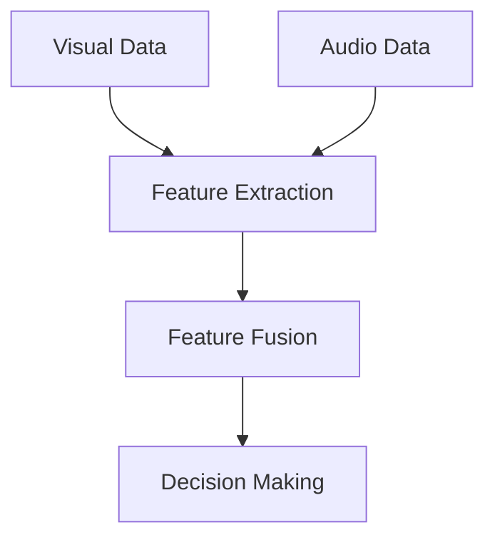

                 


# AI Agent的跨模态学习：促进多种感官信息的融合

## 关键词：AI Agent，跨模态学习，多模态数据，信息融合，感官数据

## 摘要：  
AI Agent的跨模态学习是人工智能领域的重要研究方向，旨在通过融合多种感官信息（如视觉、听觉、触觉等）来提升AI Agent的理解能力与决策能力。本文将从跨模态学习的基本概念、算法原理、系统架构设计、项目实战等方面展开详细分析，探讨如何通过多模态数据的融合来优化AI Agent的性能，并在实际应用中展示跨模态学习的优势与挑战。通过本文的讲解，读者将能够深入了解跨模态学习的核心原理，并掌握实际应用中的一些关键技术和最佳实践。

---

## 第1章：AI Agent与跨模态学习概述

### 1.1 跨模态学习的定义与背景

#### 1.1.1 多模态数据的定义  
多模态数据指的是来自不同感官渠道的数据形式，例如图像（视觉）、语音（听觉）、文本（语言）、触觉反馈等。这些数据具有不同的特征和表现形式，但往往共同描述同一个场景或事件。

#### 1.1.2 跨模态学习的背景与意义  
随着人工智能技术的发展，单一模态的数据处理已经难以满足复杂场景的需求。例如，在智能安防系统中，仅依赖视觉数据可能会遗漏声音中的关键信息。因此，如何有效融合多种模态的数据，以提升AI Agent的理解能力和决策能力，成为当前研究的重点。

#### 1.1.3 AI Agent在跨模态学习中的作用  
AI Agent作为跨模态学习的核心载体，能够通过多种感官渠道获取信息，并通过融合处理后做出更准确的判断。例如，在智能客服系统中，AI Agent可以通过语音识别和情感分析，结合用户的行为数据，提供更个性化的服务。

### 1.2 AI Agent的基本概念

#### 1.2.1 AI Agent的定义  
AI Agent是一种智能体，能够感知环境、执行任务并做出决策。它通常具备感知、推理、规划和执行能力。

#### 1.2.2 AI Agent的分类与特点  
AI Agent可以分为简单反射型、基于模型的反射型、目标驱动型和实用驱动型。跨模态学习主要应用于目标驱动型AI Agent，因为它需要通过多种感官数据来实现复杂目标。

#### 1.2.3 跨模态学习与AI Agent的关系  
跨模态学习为AI Agent提供了多模态数据处理的能力，使其能够更好地理解复杂环境并做出准确决策。

---

## 第2章：跨模态学习的核心概念与原理

### 2.1 跨模态学习的原理

#### 2.1.1 多模态数据的表示方法  
多模态数据的表示通常采用特征提取和模态对齐的方法。例如，图像可以通过卷积神经网络提取特征向量，语音可以通过Mel频谱表示。

#### 2.1.2 跨模态信息融合的机制  
信息融合可以通过模态对齐、联合表示和多任务学习等方法实现。模态对齐旨在消除不同模态之间的语义差异，联合表示则将多种模态的数据映射到同一个空间。

#### 2.1.3 跨模态学习的挑战与解决方案  
跨模态学习的挑战包括模态不平衡、模态独立性和数据稀疏性。解决方案包括引入对比学习、注意力机制和自监督学习。

### 2.2 跨模态学习的关键技术

#### 2.2.1 多模态特征提取  
多模态特征提取通过将不同模态的数据转化为统一的特征表示，为后续的融合提供基础。例如，使用多模态BERT模型同时处理文本和图像数据。

#### 2.2.2 模态间关联建模  
模态间关联建模通过学习不同模态之间的关联关系，提升融合效果。例如，使用图神经网络建模文本和图像之间的语义关系。

#### 2.2.3 跨模态推理与决策  
跨模态推理通过结合多模态数据进行推理，例如在视频问答任务中，结合视频内容和文本问题进行推理。

---

## 第3章：跨模态学习的算法原理

### 3.1 跨模态融合算法概述

#### 3.1.1 多模态数据融合的Mermaid流程图  


#### 3.1.2 跨模态融合算法的Python代码示例  
```python
import numpy as np

def feature_extractor(data):
    # 示例：提取特征向量
    return np.random.randn(128)

def fusion_model(features):
    # 示例：融合特征向量
    return np.mean(features, axis=1)

# 示例数据
visual_feature = feature_extractor([1, 2, 3])
audio_feature = feature_extractor([4, 5, 6])

# 融合特征
fused_feature = fusion_model(np.concatenate([visual_feature, audio_feature]))
print(fused_feature)
```

#### 3.1.3 融合算法的数学模型与公式  
融合模型可以通过线性组合或非线性变换实现，例如：  
$$ f(x) = \sum_{i=1}^{n} \alpha_i x_i $$  
其中，$\alpha_i$ 是权重系数，$x_i$ 是不同模态的特征向量。

---

## 第4章：系统架构设计与实现

### 4.1 项目背景与目标

#### 4.1.1 项目介绍  
本项目旨在开发一个基于跨模态学习的AI Agent，能够同时处理图像和文本数据，实现智能问答功能。

#### 4.1.2 系统功能设计  
系统功能包括图像识别、文本理解、信息融合和决策输出。

### 4.2 系统架构设计

#### 4.2.1 系统架构的Mermaid图  


#### 4.2.2 系统架构设计的详细说明  
系统架构包括数据采集模块、特征提取模块、信息融合模块和决策模块。

---

## 第5章：项目实战

### 5.1 环境安装与配置

#### 5.1.1 环境安装  
安装Python、TensorFlow、Keras和相关库。

#### 5.1.2 核心代码实现  
```python
import tensorflow as tf
from tensorflow.keras import layers

# 示例：多模态融合模型
class MultimodalModel(tf.keras.Model):
    def __init__(self):
        super(MultimodalModel, self).__init__()
        self.image_branch = layers.Dense(64, activation='relu')
        self.text_branch = layers.Dense(64, activation='relu')
        self.fusion_layer = layers.Dense(1, activation='sigmoid')

    def call(self, inputs):
        image_input = inputs['image']
        text_input = inputs['text']
        image_feature = self.image_branch(image_input)
        text_feature = self.text_branch(text_input)
        fused = tf.concat([image_feature, text_feature], axis=-1)
        output = self.fusion_layer(fused)
        return output

# 示例数据
model = MultimodalModel()
image_input = tf.random.normal((1, 128))
text_input = tf.random.normal((1, 128))
output = model({'image': image_input, 'text': text_input})
print(output)
```

### 5.2 代码实现与分析

#### 5.2.1 代码实现  
上述代码定义了一个多模态融合模型，分别处理图像和文本输入，并通过融合层输出最终结果。

#### 5.2.2 代码分析  
模型通过两个分支分别提取图像和文本特征，并将特征向量拼接后进行融合，最后输出结果。

---

## 第6章：最佳实践与注意事项

### 6.1 技术选型与优化

#### 6.1.1 技术选型  
选择适合的深度学习框架和模型架构，例如使用Transformers处理文本，使用CNN处理图像。

#### 6.1.2 性能优化  
通过数据增强、模型压缩和分布式训练等方法提升性能。

### 6.2 实际应用中的注意事项

#### 6.2.1 数据质量  
确保多模态数据的准确性和完整性。

#### 6.2.2 模态对齐  
在不同模态之间建立有效的对齐关系，避免语义差异。

---

## 第7章：未来展望与扩展阅读

### 7.1 未来研究方向

#### 7.1.1 更复杂的多模态融合方法  
研究如何更高效地融合更多模态的数据，例如引入知识图谱。

#### 7.1.2 跨模态学习的可解释性  
提升跨模态学习的透明度和可解释性，以便更好地应用于实际场景。

### 7.2 扩展阅读

#### 7.2.1 推荐书籍  
《Deep Learning》、《Pattern Recognition and Machine Learning》

#### 7.2.2 推荐论文  
"Multimodal Deep Learning for Image-Text Matching"、"Cross-modal hashing for efficient similarity retrieval"

---

## 作者信息：  
作者：AI天才研究院 & 禅与计算机程序设计艺术

---

通过以上内容，我们可以看到，跨模态学习在AI Agent中的应用前景广阔。通过融合多种感官信息，AI Agent能够更全面地理解环境，从而做出更智能的决策。未来的研究将进一步优化跨模态学习的算法和架构，推动人工智能技术的发展。

