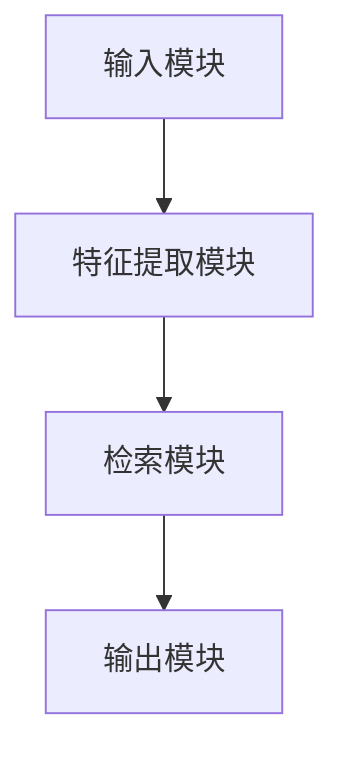

                 


# AI Agent的跨模态检索能力开发

> 关键词：AI Agent，跨模态检索，多模态数据，特征提取，检索算法

> 摘要：本文详细探讨了AI Agent在跨模态检索领域的开发过程，从基本概念到算法原理，再到系统架构和项目实战，全面解析了跨模态检索的核心技术与实现方法。

---

## 第1章: AI Agent与跨模态检索背景介绍

### 1.1 AI Agent的定义与特点
#### 1.1.1 AI Agent的基本概念
AI Agent（人工智能代理）是一种智能实体，能够感知环境、执行任务并做出决策。它具备自主性、反应性、目标导向和社会能力等特点，广泛应用于自动驾驶、智能助手、推荐系统等领域。

#### 1.1.2 AI Agent的核心特点
- **自主性**：AI Agent能够独立决策和行动，无需外部干预。
- **反应性**：能够实时感知环境变化并做出相应反应。
- **目标导向**：通过优化目标函数来实现特定任务。
- **社会能力**：能够与其他系统或用户进行有效交互。

#### 1.1.3 AI Agent的应用场景
AI Agent在多个领域展现出强大的应用潜力，如智能助手（Siri、Alexa）、推荐系统（Netflix、Spotify）、自动驾驶（Tesla）等。

### 1.2 跨模态检索的基本概念
#### 1.2.1 跨模态检索的定义
跨模态检索是指在多种数据类型（如文本、图像、音频、视频）之间进行信息检索的能力，能够跨越不同模态之间的信息鸿沟。

#### 1.2.2 跨模态检索的技术背景
随着多模态数据的广泛应用，跨模态检索成为连接不同数据类型的关键技术，如图像描述生成、视频文字检索等。

#### 1.2.3 跨模态检索的应用价值
通过跨模态检索，AI Agent能够更全面地理解用户需求，提升用户体验，如在搜索引擎中同时检索文本和图像。

---

## 第2章: 跨模态检索的核心概念

### 2.1 跨模态检索的技术背景
#### 2.1.1 跨模态检索的发展历程
从早期的单模态检索到多模态检索，再到如今的跨模态检索，技术不断进步，应用范围逐渐扩大。

#### 2.1.2 跨模态检索的技术挑战
- **异构性**：不同模态的数据特征差异大，难以直接比较。
- **多样性**：数据分布不均匀，影响检索效果。
- **计算复杂度**：处理多模态数据需要更高的计算资源。

#### 2.1.3 跨模态检索的解决方案
- **跨模态特征提取**：将不同模态的数据映射到统一特征空间。
- **多任务学习**：同时优化多个模态的任务，提升整体性能。

### 2.2 跨模态检索的关键技术
#### 2.2.1 多模态数据处理技术
- **文本处理**：使用词嵌入（如Word2Vec）和序列模型（如LSTM）。
- **图像处理**：利用卷积神经网络（CNN）提取特征。
- **音频处理**：通过MFCC和神经网络进行特征提取。

#### 2.2.2 跨模态特征提取方法
- **模态对齐**：将不同模态的特征对齐，如使用对比学习。
- **联合嵌入**：构建跨模态嵌入模型（如CLIP）。

#### 2.2.3 跨模态检索算法
- **相似度计算**：余弦相似度、欧氏距离等。
- **检索策略**：基于阈值的检索、基于排序的检索。

---

## 第3章: 跨模态检索的算法原理

### 3.1 跨模态检索的实现方法
#### 3.1.1 多模态数据的特征表示
- **文本**：使用BERT生成文本嵌入。
- **图像**：通过ResNet提取图像特征。
- **音频**：利用Mel谱图和神经网络提取特征。

#### 3.1.2 跨模态特征对齐
- **对比学习**：通过最大化跨模态相似性对齐特征。
- **对齐模型**：如DAVE-2，通过对比损失函数优化特征对齐。

### 3.2 跨模态检索的数学模型
#### 3.2.1 特征对齐的数学表示
跨模态特征对齐的目标是最小化模态间特征的差异，数学表达为：
$$
L = \sum_{i=1}^n (1 - \text{sim}(x_i, y_i))^2
$$
其中，sim表示相似度函数，x_i和y_i分别来自不同模态。

#### 3.2.2 检索算法的数学模型
基于余弦相似度的检索模型：
$$
\text{sim}(x, y) = \frac{x \cdot y}{\|x\| \|y\|}
$$
其中，x和y分别为两种模态的特征向量。

---

## 第4章: 跨模态检索的系统架构与设计

### 4.1 系统架构设计
#### 4.1.1 系统模块划分
- **输入模块**：接收多模态输入数据。
- **特征提取模块**：分别提取各模态的特征。
- **检索模块**：基于特征对齐和相似度计算进行检索。
- **输出模块**：返回检索结果。

#### 4.1.2 系统交互流程
1. 接收用户输入（如文本查询）。
2. 提取文本特征并检索匹配的图像或音频。
3. 返回结果并展示。

### 4.2 系统架构图


---

## 第5章: 跨模态检索的项目实战

### 5.1 项目环境配置
- **工具**：Python 3.8，PyTorch 1.9，TensorFlow 2.7。
- **库**：Sentence-BERT、ResNet、FAISS。

### 5.2 系统核心实现
#### 5.2.1 文本特征提取
```python
from sentence_transformers import SentenceTransformer

model = SentenceTransformer('bert-base-nli-max')
text_embeddings = model.encode(['hello world', '这是测试'])
```

#### 5.2.2 图像特征提取
```python
import torch
from torchvision import models, transforms

model = models.resnet50(pretrained=True)
transform = transforms.Compose([
    transforms.Resize(256),
    transforms.ToTensor(),
])
```

#### 5.2.3 特征对齐与检索
```python
import faiss

# 将文本和图像嵌入对齐
text_embeds = np.array(text_embeddings)
image_embeds = np.array(image_embeddings)

# 使用余弦相似度计算
similarity_matrix = text_embeds.dot(image_embeds.T) / (np.linalg.norm(text_embeds) * np.linalg.norm(image_embeds))
```

### 5.3 功能模块解读
- **输入模块**：接收用户输入并解析数据。
- **特征提取模块**：分别提取文本、图像和音频特征。
- **检索模块**：基于特征对齐进行跨模态检索。

### 5.4 实际案例分析
通过案例展示如何利用跨模态检索技术实现图像搜索，即用户输入文本查询，系统返回相关图像结果。

---

## 第6章: 跨模态检索的最佳实践与总结

### 6.1 小结
跨模态检索是AI Agent的重要能力，通过特征对齐和多任务学习提升检索性能。

### 6.2 注意事项
- 数据质量：确保多模态数据的标注和对齐。
- 模型选择：根据任务需求选择合适的模型和算法。
- 系统优化：通过分布式计算和索引优化提升检索效率。

### 6.3 拓展阅读
推荐相关书籍和论文，如《Deep Learning》和《Contrastive Learning for Cross-Modal Retrieval》。

---

## 作者

作者：AI天才研究院/AI Genius Institute & 禅与计算机程序设计艺术 /Zen And The Art of Computer Programming

---

# 结语

本文系统地探讨了AI Agent的跨模态检索能力开发，从理论到实践，全面解析了核心技术与实现方法，为读者提供了深入的技术指导和实践参考。

