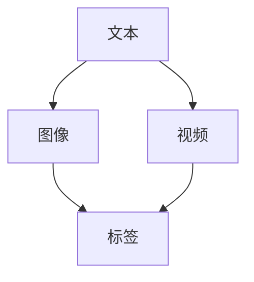
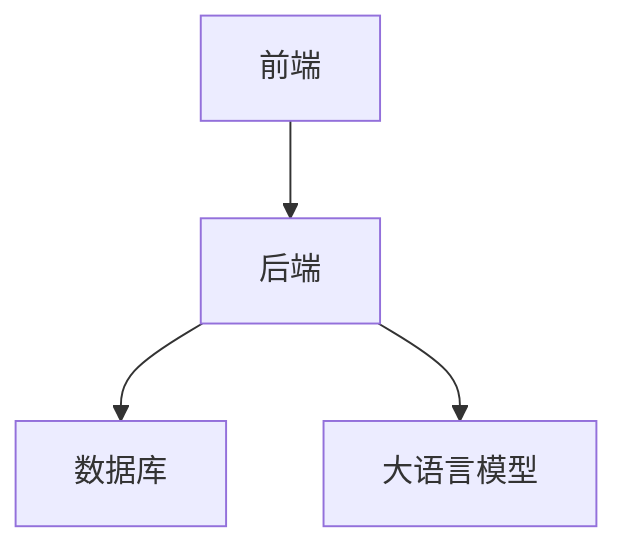

                 


# AI Agent的跨模态检索：整合LLM与多媒体数据库

## 关键词：AI Agent，跨模态检索，LLM，多媒体数据库，算法原理，系统架构，项目实战

## 摘要

随着人工智能技术的快速发展，AI Agent（人工智能代理）在跨模态检索中的应用越来越广泛。跨模态检索是指在不同数据类型之间进行信息检索，例如在文本和图像之间进行检索。本文将探讨如何整合大语言模型（LLM）与多媒体数据库，以实现高效的跨模态检索。通过分析跨模态检索的核心概念、算法原理和系统架构设计，本文旨在为读者提供一个全面的技术视角，帮助其理解并应用这一前沿技术。

---

## 正文

### 第一部分: AI Agent的跨模态检索基础

#### 第1章: AI Agent与跨模态检索概述

##### 1.1 AI Agent的基本概念
AI Agent是指能够感知环境、自主决策并执行任务的智能体。它能够通过与环境交互，完成特定的目标，例如信息检索、数据分析等。AI Agent的核心功能包括感知、推理、规划和执行。

##### 1.2 跨模态检索的背景与意义
跨模态检索是指在不同数据类型之间进行信息检索，例如在文本和图像之间检索相关信息。传统检索方法通常局限于单一模态（如文本或图像），而跨模态检索能够跨越这些限制，实现更广泛的应用。例如，在医疗领域，跨模态检索可以帮助医生快速找到与患者病情相关的文本和图像信息。

##### 1.3 LLM与多媒体数据库的结合
LLM（Large Language Model）是指基于大规模数据训练的大型语言模型，例如GPT-3、PaLM等。LLM具有强大的文本理解和生成能力，而多媒体数据库则存储了大量结构化和非结构化的多媒体数据（如图像、视频、音频等）。通过将LLM与多媒体数据库结合，可以实现跨模态检索，例如通过输入文本描述检索相关图像或视频。

---

#### 1.4 本章小结
本章介绍了AI Agent的基本概念、跨模态检索的背景与意义，以及LLM与多媒体数据库的结合方式。这些内容为后续章节奠定了基础。

---

### 第二部分: 跨模态检索的核心概念与原理

#### 第2章: 跨模态检索的核心概念

##### 2.1 跨模态检索的实体关系分析
跨模态检索涉及多个实体，例如文本、图像、数据库等。实体之间的关系可以通过ER图（实体关系图）进行描述。例如，文本和图像之间存在“描述”关系，即文本描述图像内容。

以下是一个简单的ER图示例：



##### 2.2 跨模态检索的算法原理
跨模态检索的核心是将不同模态的数据映射到一个共同的向量空间中。通过计算不同模态数据之间的相似度，可以实现跨模态检索。例如，将文本和图像映射到向量空间后，可以通过余弦相似度进行检索。

##### 2.3 跨模态检索的数学模型
跨模态检索的数学模型通常基于向量空间模型。假设我们有两组数据：文本向量`X`和图像向量`Y`。我们可以通过计算它们的相似度来实现检索。例如，余弦相似度的公式为：

$$\text{相似度} = \frac{X \cdot Y}{\|X\| \|Y\|}$$

其中，`X \cdot Y`表示向量的点积，` \|X\|`和` \|Y\|`表示向量的模长。

##### 2.4 本章小结
本章详细介绍了跨模态检索的核心概念，包括实体关系分析、算法原理和数学模型。

---

### 第三部分: 跨模态检索的算法实现

#### 第3章: 跨模态检索的算法原理

##### 3.1 跨模态检索的基本算法
跨模态检索的基本算法包括基于向量的检索算法和基于概率的检索算法。例如，基于向量的检索算法可以通过计算文本和图像向量的相似度进行检索。

##### 3.2 跨模态检索的优化算法
为了提高检索效率，可以采用基于聚类的优化算法。例如，将文本和图像数据进行聚类，然后在每个聚类中进行局部检索。

##### 3.3 跨模态检索的算法实现
以下是跨模态检索算法的一个简单实现示例：

```python
import numpy as np

def compute_similarity(text_vector, image_vector):
    # 计算余弦相似度
    similarity = np.dot(text_vector, image_vector) / (np.linalg.norm(text_vector) * np.linalg.norm(image_vector))
    return similarity

# 示例数据
text_vector = np.array([0.5, 0.6, 0.8])
image_vector = np.array([0.7, 0.5, 0.9])

similarity = compute_similarity(text_vector, image_vector)
print("相似度:", similarity)
```

##### 3.4 本章小结
本章详细介绍了跨模态检索的算法实现，包括基本算法和优化算法。

---

### 第四部分: 跨模态检索的系统架构设计

#### 第4章: 跨模态检索系统的架构设计

##### 4.1 系统功能设计
跨模态检索系统的核心功能包括数据输入、检索处理和结果输出。例如，用户可以通过输入文本描述，检索相关图像或视频。

##### 4.2 系统架构设计
跨模态检索系统的架构可以分为前端和后端。前端负责接收用户输入和显示结果，后端负责数据处理和检索逻辑。以下是一个简单的系统架构图：



##### 4.3 系统接口设计
系统接口设计需要考虑数据输入和输出的格式。例如，前端可以通过API向后端发送文本描述，后端接收后调用LLM进行处理，并从数据库中检索相关数据。

##### 4.4 本章小结
本章详细介绍了跨模态检索系统的架构设计，包括功能设计、架构图和接口设计。

---

### 第五部分: 项目实战

#### 第5章: 跨模态检索的项目实战

##### 5.1 环境安装
要实现跨模态检索，需要安装必要的库和工具，例如Python、NumPy、TensorFlow等。

##### 5.2 系统核心实现
以下是跨模态检索系统的核心实现代码：

```python
import numpy as np
from sklearn.metrics.pairwise import cosine_similarity

def compute_similarity_matrix(text_vectors, image_vectors):
    # 计算余弦相似度矩阵
    similarity_matrix = cosine_similarity(text_vectors, image_vectors)
    return similarity_matrix

# 示例数据
text_vectors = np.array([[0.5, 0.6, 0.8], [0.7, 0.5, 0.9]])
image_vectors = np.array([[0.6, 0.7, 0.8], [0.5, 0.6, 0.7]])

similarity_matrix = compute_similarity_matrix(text_vectors, image_vectors)
print("相似度矩阵:\n", similarity_matrix)
```

##### 5.3 案例分析
通过上述代码，我们可以计算出文本和图像之间的相似度矩阵，从而实现跨模态检索。

##### 5.4 本章小结
本章通过实际案例分析，展示了跨模态检索系统的实现过程。

---

## 第六部分: 最佳实践与总结

#### 6.1 最佳实践
在实际应用中，建议采用以下最佳实践：
- 确保数据质量，避免噪声干扰。
- 选择合适的算法和模型，以提高检索效率。
- 定期更新模型和数据，以适应新的需求。

#### 6.2 小结
本文详细介绍了AI Agent的跨模态检索技术，包括核心概念、算法原理和系统架构设计。通过实际案例分析，展示了跨模态检索系统的实现过程。

#### 6.3 注意事项
在实际应用中，需要注意以下几点：
- 数据隐私和安全问题。
- 算法的可解释性和透明度。
- 系统的可扩展性和性能优化。

#### 6.4 拓展阅读
对于感兴趣的技术，可以进一步阅读以下内容：
- 大语言模型的优化与调优。
- 多模态数据的高效存储与检索技术。

---

## 作者

作者：AI天才研究院/AI Genius Institute & 禅与计算机程序设计艺术 /Zen And The Art of Computer Programming

