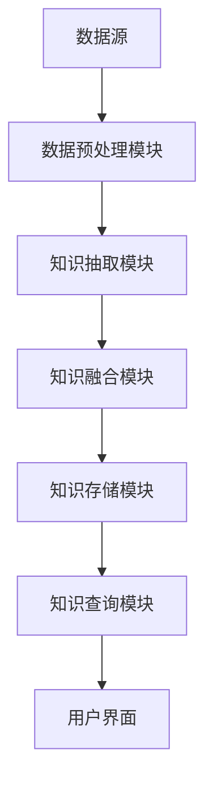
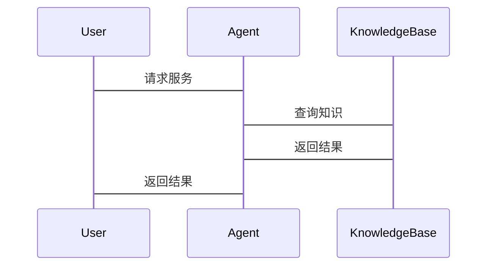

                 


# AI Agent的跨模态知识图谱构建与应用

> 关键词：AI Agent, 跨模态知识图谱, 多模态数据, 知识图谱构建, 跨模态融合, 图嵌入算法, 跨模态对齐

> 摘要：本文深入探讨了AI Agent的跨模态知识图谱构建与应用的核心技术。首先，我们介绍了AI Agent的基本概念和跨模态知识图谱的定义与特点，分析了它们的结合背景与意义。接着，我们详细讲解了跨模态知识图谱的核心概念与联系，包括实体关系、数据特征对比和ER实体关系图。然后，我们从算法原理的角度，分析了跨模态知识图谱构建的关键技术，包括图嵌入、跨模态对齐和知识推理。随后，我们从系统分析与架构设计的角度，探讨了跨模态知识图谱构建的系统功能设计、架构图、接口设计和交互流程。最后，我们通过一个具体的项目实战案例，展示了跨模态知识图谱的实际应用，并总结了相关的最佳实践和注意事项。

---

## 第一部分: 跨模态知识图谱的构建背景与意义

### 第1章: AI Agent的基本概念与应用背景

#### 1.1 AI Agent的定义与特点
AI Agent（人工智能代理）是一种能够感知环境、自主决策并执行任务的智能实体。它具有以下几个核心特点：
1. **自主性**：能够在没有外部干预的情况下自主运行。
2. **反应性**：能够实时感知环境并做出反应。
3. **目标导向**：具有明确的目标，并根据目标调整行为。
4. **学习能力**：能够通过经验或数据不断优化自身的行为。

#### 1.2 跨模态知识图谱的定义与特点
跨模态知识图谱是一种将不同模态（如文本、图像、语音等）的数据进行语义对齐和知识融合的知识图谱。其特点包括：
1. **多模态性**：整合多种数据模态，提供更丰富的语义信息。
2. **语义关联**：能够将不同模态的数据进行语义关联，形成知识网络。
3. **动态更新**：能够实时更新知识图谱，保持知识的最新性。

#### 1.3 AI Agent与跨模态知识图谱的结合
AI Agent通过跨模态知识图谱可以实现对多源异构数据的高效理解与利用。跨模态知识图谱为AI Agent提供了丰富的语义知识，使其能够更好地理解用户需求、执行复杂任务和提供智能服务。

---

### 第2章: 跨模态知识图谱的构建背景与意义

#### 2.1 当前AI Agent技术的发展现状
AI Agent技术在各个领域得到了广泛应用，但其智能水平受限于知识表示和推理能力。传统的单一模态知识图谱难以满足复杂场景的需求，而跨模态知识图谱的出现为AI Agent的智能升级提供了新的可能性。

#### 2.2 跨模态知识图谱构建的背景
随着大数据和多模态技术的发展，跨模态数据（如图像、文本、语音等）的采集和处理能力不断提升。然而，如何有效整合这些数据并构建高效的跨模态知识图谱成为了一个亟待解决的问题。

#### 2.3 跨模态知识图谱构建的意义
跨模态知识图谱的构建为AI Agent提供了以下几方面的支持：
1. **提升智能水平**：通过跨模态数据的融合，AI Agent能够更全面地理解用户需求和环境信息。
2. **促进数据融合**：跨模态知识图谱能够整合多源异构数据，形成统一的知识表示。
3. **支持复杂任务**：跨模态知识图谱为AI Agent执行复杂任务提供了知识基础。

---

## 第二部分: 跨模态知识图谱的核心概念与联系

### 第3章: 跨模态知识图谱的核心概念

#### 3.1 跨模态知识图谱的核心概念
跨模态知识图谱的核心概念包括：
1. **实体与属性**：实体是知识图谱中的基本单位，属性用于描述实体的特征。
2. **关系与边**：关系用于描述实体之间的关联，边是关系的具象化表示。
3. **跨模态数据的表示方法**：通过多模态数据的联合表示，实现不同模态数据的语义对齐。

#### 3.2 跨模态知识图谱的属性特征对比
以下是不同模态数据的特征对比：

| 模态类型 | 特征描述 |
|----------|----------|
| 文本      | 高维稀疏，语义丰富 |
| 图像      | 低维稠密，特征鲜明 |
| 语音      | 时序性较强，语义依赖上下文 |

#### 3.3 跨模态知识图谱的ER实体关系图
```mermaid
erDiagram
    actor User {
        <属性> id
        <属性> name
    }
    actor Agent {
        <属性> agent_id
        <属性> capability
    }
    actor KnowledgeBase {
        <属性> kb_id
        <属性> content
    }
    User --> Agent: 请求服务
    Agent --> KnowledgeBase: 查询知识
    KnowledgeBase --> User: 返回结果
```

---

## 第三部分: 跨模态知识图谱的算法原理

### 第4章: 跨模态知识图谱的构建算法

#### 4.1 图嵌入算法
图嵌入是将图结构数据映射到低维向量空间的技术。以下是常用的图嵌入算法：

1. **DeepWalk**：通过随机游走生成节点表示。
2. **Node2Vec**：基于图的结构特征生成节点表示。
3. **GraphSAGE**：通过归纳式学习生成节点表示。

#### 4.2 跨模态对齐算法
跨模态对齐算法用于将不同模态的数据映射到同一个语义空间。以下是常用的对齐算法：

1. **Contrastive Learning**：通过对比学习实现跨模态对齐。
2. **Multi-modal Clustering**：通过聚类技术实现跨模态对齐。
3. **Cross-attention Network**：通过交叉注意力机制实现跨模态对齐。

#### 4.3 知识推理算法
知识推理算法用于在知识图谱中进行推理和问答。以下是常用的推理算法：

1. **Path-based Reasoning**：基于路径的推理。
2. **Rule-based Reasoning**：基于规则的推理。
3. **Neural Reasoning**：基于神经网络的推理。

---

## 第四部分: 跨模态知识图谱的系统分析与架构设计

### 第5章: 跨模态知识图谱的系统架构

#### 5.1 系统功能设计
跨模态知识图谱的系统功能包括：
1. **数据采集与预处理**：采集多模态数据并进行预处理。
2. **知识抽取与融合**：从多模态数据中抽取知识并进行融合。
3. **知识存储与查询**：存储知识图谱并支持高效的查询操作。

#### 5.2 系统架构设计
以下是跨模态知识图谱的系统架构图：



#### 5.3 系统接口设计
跨模态知识图谱的系统接口包括：
1. **数据输入接口**：接收多模态数据。
2. **知识查询接口**：支持基于关键词或实体的查询。
3. **结果输出接口**：返回查询结果。

#### 5.4 系统交互流程
以下是跨模态知识图谱的系统交互流程图：



---

## 第五部分: 跨模态知识图谱的项目实战

### 第6章: 跨模态知识图谱的应用案例

#### 6.1 项目背景与目标
本项目旨在构建一个支持多模态数据查询的智能问答系统。

#### 6.2 项目实现
以下是项目的实现步骤：
1. **环境安装**：安装Python、TensorFlow、Keras等工具。
2. **数据采集**：采集多模态数据，包括文本、图像和语音。
3. **数据预处理**：对数据进行清洗和标准化处理。
4. **知识抽取与融合**：使用NLP技术从文本中抽取实体和关系，使用图像识别技术从图像中提取特征。
5. **知识存储与查询**：将抽取的知识存储到知识图谱中，并支持基于关键词或实体的查询。

#### 6.3 核心代码实现
以下是项目的部分核心代码：
```python
import tensorflow as tf
from tensorflow.keras import layers

# 定义图嵌入模型
class GraphSAGE(layers.Model):
    def __init__(self, input_dim, hidden_dim):
        super(GraphSAGE, self).__init__()
        self.embeddings = layers.Embedding(input_dim, hidden_dim)
        self.pooling = layers.GlobalAveragePoolingLayer()

    def call(self, inputs):
        x = self.embeddings(inputs)
        x = self.pooling(x)
        return x

# 定义跨模态对齐模型
class CrossModalAligner(layers.Model):
    def __init__(self, text_dim, image_dim):
        super(CrossModalAligner, self).__init__()
        self.text_proj = layers.Dense(128, activation='relu')
        self.image_proj = layers.Dense(128, activation='relu')
        self.attention = layers.Attention()

    def call(self, text_features, image_features):
        text_aligned = self.text_proj(text_features)
        image_aligned = self.image_proj(image_features)
        aligned_features = self.attention([text_aligned, image_aligned])
        return aligned_features
```

#### 6.4 案例分析与详细解读
通过本项目，我们实现了对多模态数据的高效理解和利用。AI Agent能够基于跨模态知识图谱提供更智能、更准确的服务。

---

## 第六部分: 总结与展望

### 第7章: 跨模态知识图谱的总结与展望

#### 7.1 核心总结
跨模态知识图谱为AI Agent提供了强大的知识支持，能够提升其智能水平和任务执行能力。

#### 7.2 最佳实践
1. **数据质量**：确保数据的多样性和代表性。
2. **模型调优**：通过实验不断优化模型参数。
3. **隐私保护**：在数据处理和知识存储过程中，注意保护用户隐私。

#### 7.3 拓展阅读
1. 图嵌入算法的研究进展
2. 跨模态对齐的最新技术
3. 知识推理的创新方法

---

## 作者：AI天才研究院/AI Genius Institute & 禅与计算机程序设计艺术 /Zen And The Art of Computer Programming

