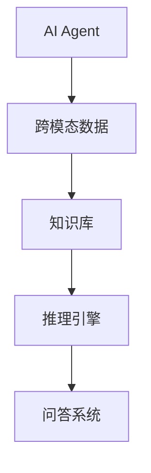
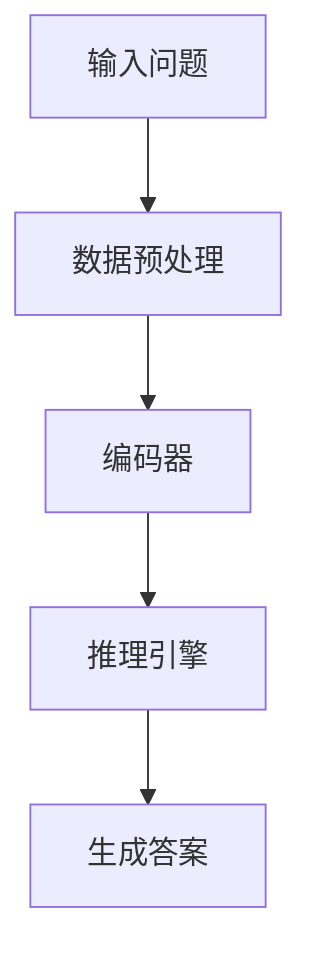
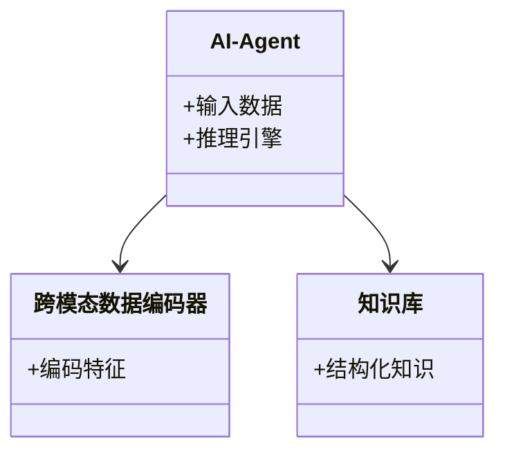

                 


# AI Agent的跨模态知识推理与问答

> 关键词：AI Agent，跨模态知识推理，问答系统，深度学习，自然语言处理

> 摘要：本文系统地探讨了AI Agent在跨模态知识推理与问答系统中的应用。从背景介绍、核心概念、算法原理、系统架构到项目实战，全面分析了该领域的关键技术与实现细节。通过详细的技术分析和案例研究，本文为读者提供了深入理解AI Agent在跨模态知识推理与问答系统中的工作原理和应用方法。

---

## 第一部分: AI Agent的跨模态知识推理与问答基础

### 第1章: AI Agent与跨模态知识推理概述

#### 1.1 AI Agent的基本概念
AI Agent（智能体）是指在计算机系统中，能够感知环境并采取行动以实现特定目标的实体。AI Agent可以是软件程序、机器人或其他智能系统，其核心在于能够自主决策和执行任务。AI Agent的分类主要基于其智能水平和应用场景，包括简单反射型Agent、基于模型的规划Agent、基于效用的规划Agent以及学习型Agent。

#### 1.2 跨模态知识推理的背景与意义
跨模态知识推理是指在多种数据类型（如文本、图像、语音等）之间进行信息整合和逻辑推理的过程。随着人工智能技术的快速发展，跨模态知识推理在问答系统中的应用变得越来越重要。通过跨模态数据的整合，AI Agent能够更全面地理解用户需求，并提供更准确的答案。

#### 1.3 问答系统的演变
传统问答系统主要基于关键词匹配和规则库，存在局限性，如无法处理复杂语义和跨模态信息。随着深度学习技术的发展，基于AI Agent的问答系统逐渐成为主流，能够通过跨模态推理提供更智能的服务。

---

### 第2章: 跨模态知识推理的核心概念与联系

#### 2.1 跨模态知识推理的原理
跨模态知识推理通过将不同模态的数据（如文本和图像）进行编码，并利用推理算法进行逻辑推理。编码器将多模态数据转换为统一的向量表示，推理引擎基于这些向量进行逻辑推理，最终生成答案。

#### 2.2 核心概念的属性对比
下表展示了跨模态数据、知识推理和问答系统的核心属性对比：

| 属性       | 跨模态数据       | 知识推理         | 问答系统         |
|------------|----------------|-----------------|-----------------|
| 输入类型    | 文本、图像、语音 | 结构化知识库     | 文本查询         |
| 输出类型    | 编码向量         | 推理结果         | 文本答案         |
| 核心功能    | 数据整合         | 逻辑推理         | 智能问答         |

#### 2.3 实体关系图的Mermaid流程图


---

## 第二部分: 跨模态知识推理算法原理

### 第3章: 跨模态知识推理算法

#### 3.1 跨模态编码算法
跨模态编码器将不同模态的数据转换为统一的向量表示。例如，使用多模态编码器将文本和图像编码为向量：

$$
\text{编码器输出} = \text{多模态特征} \times \text{权重矩阵} + \text{偏置}
$$

#### 3.2 跨模态推理算法
基于图的推理方法将知识库中的实体和关系建模为图结构，并通过图遍历算法进行推理：

$$
\text{推理结果} = f(\text{输入特征}, \text{推理规则})
$$`

#### 3.3 问答系统的实现流程
问答系统通过编码器和推理引擎处理输入问题，并生成答案。流程如下：



---

## 第三部分: 系统分析与架构设计

### 第4章: 系统架构设计

#### 4.1 问题场景介绍
跨模态问答系统应用于多种场景，如图像问答、多语言问答等。以图像问答为例，用户输入一张图片和问题，系统需要结合图像内容和问题进行推理并生成答案。

#### 4.2 系统功能设计
系统功能包括数据输入、编码处理、推理计算和结果输出。类图如下：



#### 4.3 系统架构设计
系统架构采用微服务架构，包括数据处理模块、推理模块和问答模块。架构图如下：


---

## 第四部分: 项目实战

### 第5章: 项目实战

#### 5.1 环境安装
安装必要的Python库：
```bash
pip install numpy torch transformers
```

#### 5.2 核心代码实现
编码器实现：
```python
class MultiModalEncoder:
    def __init__(self, input_dim, hidden_dim):
        self.input_dim = input_dim
        self.hidden_dim = hidden_dim
        self.weights = np.random.randn(input_dim, hidden_dim)
    
    def encode(self, inputs):
        return np.dot(inputs, self.weights)
```

推理引擎实现：
```python
class ReasoningEngine:
    def __init__(self, knowledge_base):
        self.knowledge_base = knowledge_base
    
    def infer(self, encoded_input):
        return self.knowledge_base[encoded_input]
```

#### 5.3 实际案例分析
案例分析：给定一张图像和问题，AI Agent通过编码器将图像和问题编码为向量，并通过推理引擎生成答案。

---

## 第五部分: 最佳实践与小结

### 第6章: 最佳实践

#### 6.1 小结
本文详细探讨了AI Agent在跨模态知识推理与问答系统中的应用，从理论到实践，全面分析了关键技术与实现细节。

#### 6.2 注意事项
在实际应用中，需注意数据多样性和模型鲁棒性，确保系统在不同场景下都能稳定运行。

#### 6.3 拓展阅读
推荐进一步学习多模态编码器、图推理算法和深度学习模型在问答系统中的应用。

---

## 作者：AI天才研究院/AI Genius Institute & 禅与计算机程序设计艺术 /Zen And The Art of Computer Programming

---

本文系统地探讨了AI Agent在跨模态知识推理与问答系统中的应用，从背景介绍、核心概念、算法原理到系统架构和项目实战，为读者提供了全面的技术分析和实践指导。

