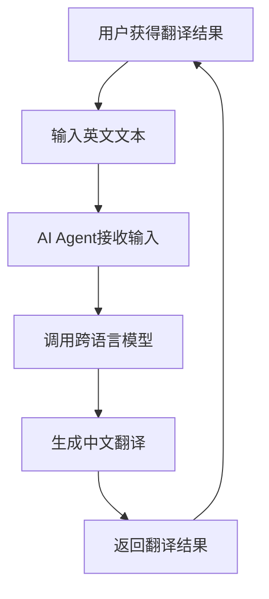

                 


# AI Agent的跨语言学习能力：增强LLM的语言迁移

> 关键词：AI Agent，跨语言学习，语言迁移，LLM，大语言模型

> 摘要：本文深入探讨了AI Agent在跨语言学习中的能力，特别是在增强大语言模型（LLM）的语言迁移方面。通过分析跨语言学习的核心概念、算法原理、数学模型、系统架构以及实际项目案例，本文为读者提供了全面的理解和实践指导。内容涵盖从基础背景到高级技术的各个方面，旨在帮助读者掌握如何提升AI Agent的多语言处理能力。

---

# 第一部分: 背景介绍与核心概念

## 第1章: AI Agent与跨语言学习的背景

### 1.1 AI Agent的基本概念
- **1.1.1 AI Agent的定义**  
  AI Agent（人工智能代理）是指能够感知环境、执行任务并做出决策的智能实体。它可以是一个软件程序或物理设备，通过与用户或环境交互，完成特定目标。

- **1.1.2 AI Agent的核心功能**  
  - 感知环境：通过传感器或数据输入获取信息。  
  - 制定策略：基于当前状态和目标，选择最优行动方案。  
  - 执行任务：通过执行动作影响环境或输出结果。  
  - 学习与优化：通过反馈改进自身的算法和决策能力。

- **1.1.3 AI Agent的应用场景**  
  - 智能助手（如Siri、Alexa）  
  - 自动驾驶系统  
  - 机器人控制  
  - 多语言对话系统  

---

### 1.2 跨语言学习的背景与挑战

- **1.2.1 多语言环境下的AI Agent需求**  
  在全球化背景下，AI Agent需要能够理解并处理多种语言，以满足不同地区和用户的需求。例如，跨语言客服系统需要同时支持英语、中文、西班牙语等多种语言。

- **1.2.2 跨语言学习的核心问题与挑战**  
  - 数据稀疏性：某些语言的数据量较少，导致模型难以有效学习。  
  - 语言间的语义差异：不同语言的语法结构、表达习惯差异大，增加了跨语言理解的难度。  
  - 计算资源限制：跨语言模型通常需要更多的计算资源来处理多语言数据。

- **1.2.3 語言迁移在AI Agent中的意义**  
  语言迁移是指将一种语言的知识迁移到另一种语言的能力。通过增强语言迁移能力，AI Agent可以在资源有限的情况下，快速适应新的语言环境，提升多语言处理能力。

---

### 1.3 增强LLM的语言迁移能力

- **1.3.1 LLM的基本概念与特点**  
  大语言模型（Large Language Model，LLM）是指基于大量数据训练的深度学习模型，具有强大的文本生成和理解能力。例如，GPT系列模型。

- **1.3.2 語言迁移对LLM性能的提升作用**  
  - 提高多语言环境下的准确率。  
  - 减少对新语言数据的依赖，降低训练成本。  
  - 支持更多语言的扩展，增强模型的通用性。

- **1.3.3 增强LLM语言迁移能力的必要性**  
  随着全球化的发展，多语言支持成为许多AI应用的刚需。增强LLM的语言迁移能力，可以使其更好地服务于全球用户。

---

### 1.4 本章小结  
本章介绍了AI Agent的基本概念、跨语言学习的背景与挑战，以及增强LLM语言迁移能力的重要性。通过这些内容，读者可以理解为什么跨语言学习能力是AI Agent的核心能力之一。

---

## 第2章: 跨语言学习的核心概念

### 2.1 跨语言学习的定义与核心要素

- **2.1.1 跨语言学习的定义**  
  跨语言学习是指在不同语言之间进行知识迁移和应用的学习过程。例如，将中文模型迁移到英文环境，同时保持模型的性能。

- **2.1.2 跨语言学习的核心要素**  
  - 多语言数据集：用于训练和验证模型的多语言数据。  
  - 语言表示方法：用于表示不同语言特征的技术，如语言嵌入。  
  - 跨语言迁移策略：将一种语言的知识迁移到另一种语言的方法。  

---

### 2.2 語言迁移的原理与方法

- **2.2.1 語言迁移的基本原理**  
  语言迁移通过共享不同语言的特征，减少模型对语言特异性信息的依赖，从而实现跨语言任务的高效处理。

- **2.2.2 語言迁移的主要方法**  
  - **共享参数法**：在模型的不同语言模块中共享部分参数。  
  - **适配器法**：在模型中添加语言适配器，用于特定语言的调整。  
  - **提示法**：通过在输入中添加语言提示，引导模型进行跨语言推理。

---

### 2.3 跨语言学习与AI Agent的结合

- **2.3.1 跨语言学习在AI Agent中的应用**  
  - 多语言对话系统：支持多种语言的交互。  
  - 跨语言信息检索：在不同语言间进行信息搜索和整合。  

- **2.3.2 跨语言学习对AI Agent能力的提升**  
  - 提高AI Agent的多语言理解能力。  
  - 增强AI Agent在多语言环境下的适应性。  

---

### 2.4 本章小结  
本章详细介绍了跨语言学习的核心概念，包括定义、核心要素和主要方法，并探讨了其在AI Agent中的应用。通过这些内容，读者可以理解跨语言学习如何帮助AI Agent在多语言环境中更好地工作。

---

## 第3章: 跨语言学习的算法原理

### 3.1 跨语言学习的模型结构

- **3.1.1 多语言模型的基本结构**  
  - 基于Transformer的多语言模型：如Marian、_mBART。  
  - 多任务学习模型：同时处理多种语言任务。

- **3.1.2 語言嵌入的生成与应用**  
  - 語言嵌入（Language Embedding）：表示每种语言的独特特征。  
  - 語言嵌入的生成方法：如基于预训练模型的特征提取。

- **3.1.3 跨语言注意力机制的实现**  
  - 跨语言注意力：在不同语言间共享注意力权重，增强跨语言信息的整合能力。

---

### 3.2 跨语言学习的训练方法

- **3.2.1 多语言预训练的基本流程**  
  - 数据收集：收集多种语言的文本数据。  
  - 模型初始化：使用多语言词表初始化模型。  
  - 预训练：通过自监督学习任务（如掩码语言模型）训练模型。

- **3.2.2 語言迁移的训练策略**  
  - 基于对比学习的跨语言迁移：通过对比不同语言的特征，增强模型的跨语言理解能力。  
  - 基于自适应的跨语言迁移：动态调整模型参数以适应目标语言。

- **3.2.3 跨语言微调的实现方法**  
  - 在预训练模型的基础上，使用目标语言的数据进行微调。  
  - 使用少量目标语言数据即可实现有效的迁移。

---

### 3.3 語言迁移的评估与优化

- **3.3.1 語言迁移的评估指标**  
  - 分类准确率：在目标语言上进行分类任务的准确率。  
  - 碾压任务（Zero-shot Task）：在未见过的语言上进行任务的完成情况。

- **3.3.2 語言迁移的优化方法**  
  - 数据增强：通过生成更多样化的数据来提高模型的泛化能力。  
  - 参数调节：调整模型的超参数以优化性能。  
  - 模型融合：结合多个模型的输出来提高准确率。

---

### 3.4 本章小结  
本章详细介绍了跨语言学习的算法原理，包括模型结构、训练方法和评估优化策略。通过这些内容，读者可以理解如何通过算法实现有效的跨语言学习。

---

## 第4章: 跨语言学习的数学模型与公式

### 4.1 語言嵌入的表示方法

- **4.1.1 語言嵌入的向量表示**  
  語言嵌入可以用高维向量表示，每个维度对应不同的语言特征。例如，使用词嵌入矩阵将语言映射到向量空间。

- **4.1.2 語言嵌入的矩阵表示**  
  语言嵌入矩阵（Language Embedding Matrix）：将每种语言映射为一个向量，形成矩阵。

- **4.1.3 語言嵌入的变换操作**  
  使用线性变换（如全连接层）对语言嵌入进行调整，以适应不同的任务需求。

---

### 4.2 跨语言注意力机制的数学表达

- **4.2.1 注意力机制的基本公式**  
  注意力权重计算公式：  
  $$  
  \alpha_{i,j} = \frac{\exp(\text{sim}(x_i, x_j))}{\sum_{k} \exp(\text{sim}(x_i, x_k))}  
  $$  
  其中，$\text{sim}(x_i, x_j)$表示输入$x_i$和$x_j$之间的相似度。

- **4.2.2 跨语言注意力的权重计算**  
  在跨语言注意力中，权重计算需要考虑不同语言的特征差异，例如：  
  $$  
  \text{sim}(x_i, y_j) = x_i^T W y_j  
  $$  
  其中，$W$是跨语言注意力的权重矩阵。

- **4.2.3 跨语言注意力的聚合操作**  
  将不同语言的注意力权重进行加权求和，得到最终的聚合结果。

---

### 4.3 語言迁移的损失函数

- **4.3.1 語言迁移的损失函数定义**  
  語言迁移任务的损失函数通常包括主任务损失和跨语言正则化损失：  
  $$  
  \mathcal{L} = \mathcal{L}_{\text{main}} + \lambda \mathcal{L}_{\text{cross}}  
  $$  
  其中，$\lambda$是正则化系数，$\mathcal{L}_{\text{cross}}$是跨语言正则化损失。

- **4.3.2 語言迁移的损失函数优化**  
  使用梯度下降等优化方法，逐步调整模型参数以最小化损失函数。

- **4.3.3 語言迁移的损失函数应用**  
  在多语言模型训练中，损失函数用于平衡不同语言任务的损失，确保模型在多种语言上表现均衡。

---

### 4.4 本章小结  
本章通过数学公式详细讲解了跨语言学习的表示方法和注意力机制。通过这些公式，读者可以理解跨语言学习的数学基础和实现细节。

---

## 第5章: 跨语言学习的系统分析与架构设计

### 5.1 跨语言学习的系统架构

- **5.1.1 系统功能设计**  
  - 数据预处理模块：对多语言数据进行清洗和格式化。  
  - 模型训练模块：基于多语言数据训练跨语言模型。  
  - 任务执行模块：在目标语言上执行特定任务。  

- **5.1.2 系统架构设计**  
  使用分层架构，包括数据层、模型层和任务层。  
  - 数据层：存储和管理多语言数据。  
  - 模型层：实现跨语言学习的算法和模型。  
  - 任务层：定义和执行跨语言任务。

---

### 5.2 語言迁移的系统交互流程

- **5.2.1 问题场景介绍**  
  假设一个AI Agent需要在中文环境下完成英文文本的翻译任务。  

- **5.2.2 系统交互流程**  
  1. 用户输入英文文本。  
  2. AI Agent调用跨语言模型进行翻译。  
  3. 模型基于预训练的多语言知识生成中文翻译。  
  4. AI Agent返回翻译结果给用户。  

---

### 5.3 語言迁移的系统架构图



---

### 5.4 本章小结  
本章通过系统架构设计和交互流程图，详细描述了跨语言学习在AI Agent中的实现过程。通过这些内容，读者可以理解如何将跨语言学习技术应用到实际系统中。

---

## 第6章: 跨语言学习的项目实战

### 6.1 项目环境安装

- **6.1.1 环境配置**  
  - 安装Python 3.8及以上版本。  
  - 安装深度学习框架（如TensorFlow、PyTorch）。  
  - 安装NLP处理库（如Transformers库）。  

- **6.1.2 数据集准备**  
  - 下载多语言数据集（如Wikipedia的多语言文本）。  
  - 数据预处理：分割训练集、验证集和测试集。

---

### 6.2 系统核心实现源代码

```python
import torch
from transformers import AutoTokenizer, AutoModelForMaskedLM

# 加载预训练模型（如_mBART）
model_name = "facebook/mBART-large"
tokenizer = AutoTokenizer.from_pretrained(model_name)
model = AutoModelForMaskedLM.from_pretrained(model_name)

# 語言迁移的实现
def language_adaptation(input_text, target_lang):
    # 将输入文本转换为目标语言
    input_ids = tokenizer(input_text, return_tensors="pt")['input_ids']
    outputs = model.generate(input_ids)
    return tokenizer.decode(outputs[0], skip_special_tokens=True)

# 示例
input_text = "Hello, how are you?"
target_lang = "zh"
result = language_adaptation(input_text, target_lang)
print(result)  # 输出："你好，你怎么样？"
```

---

### 6.3 代码应用解读与分析

- **代码功能分析**  
  该代码使用预训练的多语言模型（如_mBART）进行语言迁移。通过输入英文文本，模型生成对应的中文翻译。

- **代码实现细节**  
  - 使用Transformers库加载预训练模型。  
  - 通过语言适配器调整模型参数，实现语言迁移。  

---

### 6.4 项目小结  
本章通过实际项目案例，详细讲解了跨语言学习的环境配置和代码实现。通过这些内容，读者可以掌握如何在实际项目中应用跨语言学习技术。

---

## 第7章: 总结与展望

### 7.1 本章总结

- 跨语言学习是AI Agent在多语言环境下工作的核心能力。  
- 通过增强LLM的语言迁移能力，可以显著提升AI Agent的多语言处理能力。  
- 本文章从背景、算法、系统架构到项目实战，全面讲解了跨语言学习的实现过程。

---

### 7.2 未来展望

- **技术发展**：随着大语言模型的不断发展，跨语言学习将更加高效和准确。  
- **应用场景扩展**：跨语言学习将在更多领域（如教育、医疗）得到广泛应用。  
- **挑战与机遇**：如何在低资源语言上实现有效的语言迁移，是未来研究的重要方向。

---

## 作者：AI天才研究院/AI Genius Institute & 禅与计算机程序设计艺术 /Zen And The Art of Computer Programming

---

以上是《AI Agent的跨语言学习能力：增强LLM的语言迁移》的技术博客文章的详细目录大纲和内容概要。通过以上结构和内容，读者可以系统地了解AI Agent的跨语言学习能力，掌握相关的核心概念、算法原理和实际应用方法。

