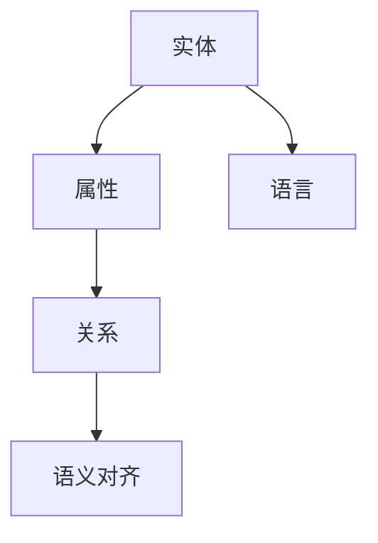
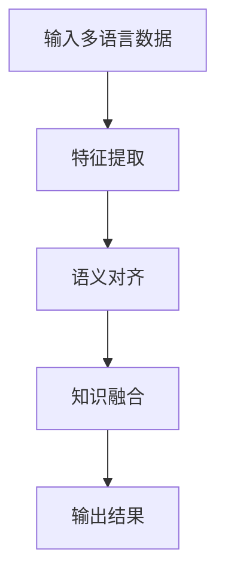
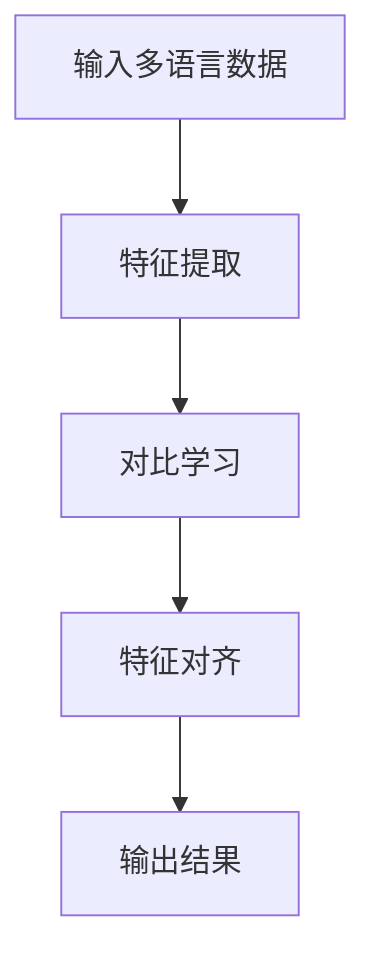
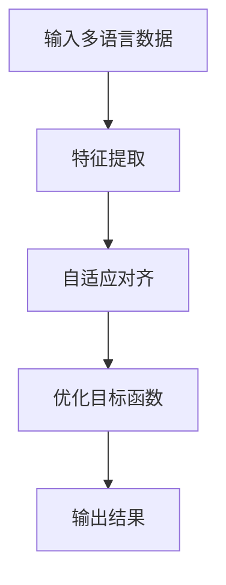
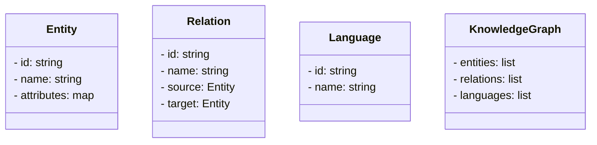
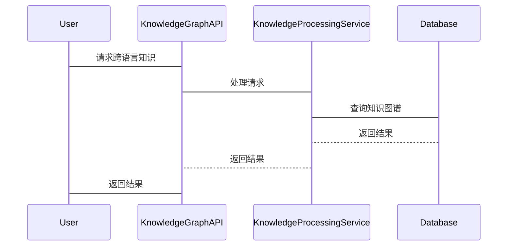

                 


# AI Agent的跨语言知识迁移与融合

## 关键词
AI Agent, 跨语言知识迁移, 知识融合, 多语言模型, 对比学习, 语义对齐, 知识图谱

## 摘要
本文系统地探讨了AI Agent在跨语言知识迁移与融合中的关键技术和应用。首先，我们介绍了AI Agent的基本概念及其在跨语言知识处理中的重要性。接着，详细分析了跨语言知识迁移的核心原理，包括知识表示、语义对齐和知识融合等技术。随后，我们从算法原理、系统架构设计、项目实战等多个角度深入探讨了跨语言知识迁移与融合的实现过程。最后，通过实际案例展示了跨语言知识迁移在AI Agent中的应用，并总结了最佳实践和未来研究方向。

---

## 第一部分: AI Agent的跨语言知识迁移与融合概述

### 第1章: AI Agent与跨语言知识迁移概述

#### 1.1 AI Agent的基本概念
##### 1.1.1 AI Agent的定义
AI Agent（人工智能代理）是指在计算机系统中，能够感知环境、自主决策并执行任务的智能实体。它可以是一个软件程序，也可以是一个硬件设备，通过传感器和执行器与外部环境交互。

##### 1.1.2 AI Agent的核心特征
AI Agent具有以下核心特征：
1. **自主性**：能够在没有外部干预的情况下自主运行。
2. **反应性**：能够实时感知环境并做出反应。
3. **目标导向**：具有明确的目标，并根据目标进行决策。
4. **学习能力**：能够通过经验或数据进行学习和优化。

##### 1.1.3 AI Agent的应用场景
AI Agent广泛应用于各个领域，包括：
- **自然语言处理**：如智能对话系统。
- **推荐系统**：根据用户行为推荐相关内容。
- **机器人控制**：如工业机器人和家庭服务机器人。
- **自动驾驶**：如自动驾驶汽车中的决策系统。

#### 1.2 跨语言知识迁移的背景与意义
##### 1.2.1 知识迁移的定义
知识迁移是指将某一领域的知识应用到另一个领域的过程。在AI Agent中，跨语言知识迁移是指将一种语言中的知识迁移到另一种语言中，以实现多语言环境下的知识共享和应用。

##### 1.2.2 跨语言知识迁移的必要性
在全球化的背景下，AI Agent需要处理多种语言的信息。跨语言知识迁移可以提高AI Agent的通用性和智能性，使其能够更好地服务于多语言环境下的用户。

##### 1.2.3 跨语言知识迁移的应用价值
跨语言知识迁移在以下方面具有重要意义：
1. **多语言对话系统**：支持多种语言的对话交互。
2. **跨语言信息检索**：在多语言环境中高效检索信息。
3. **知识图谱构建**：构建多语言的知识图谱，促进跨语言知识共享。

#### 1.3 跨语言知识迁移的核心问题
##### 1.3.1 知识表示的跨语言一致性
不同语言中的知识表示可能存在差异，如何实现跨语言知识表示的一致性是跨语言知识迁移的核心问题。

##### 1.3.2 跨语言语义对齐的挑战
语义对齐是指在不同语言中找到语义相同或相似的概念。跨语言语义对齐的挑战包括语言差异、语义模糊性和数据稀疏性。

##### 1.3.3 跨语言知识融合的复杂性
跨语言知识融合是指将不同语言中的知识整合到一个统一的知识表示中。其复杂性主要来源于语言差异、知识结构差异和语义冲突。

---

### 第2章: 跨语言知识迁移的核心概念与联系

#### 2.1 跨语言知识迁移的原理
##### 2.1.1 知识表示与语义对齐
知识表示是跨语言知识迁移的基础。语义对齐是通过某种方法将不同语言中的概念对齐，确保它们在语义上一致。

##### 2.1.2 跨语言特征提取方法
跨语言特征提取方法包括：
1. **基于翻译的特征提取**：将一种语言的特征翻译成另一种语言。
2. **跨语言表示学习**：通过学习得到跨语言的特征表示。

##### 2.1.3 知识融合与一致性维护
知识融合是指将不同来源或不同语言的知识整合到一个统一的知识表示中。一致性维护是确保融合后的知识在语义上一致。

#### 2.2 跨语言知识迁移的关键技术
##### 2.2.1 多语言模型的构建
多语言模型是跨语言知识迁移的基础。常用的技术包括：
1. **多语言词嵌入模型**：如BERT。
2. **跨语言注意力机制**：用于跨语言信息的对齐。

##### 2.2.2 跨语言表示学习方法
跨语言表示学习方法包括：
1. **对比学习**：通过对比不同语言的特征，学习跨语言的表示。
2. **自适应对齐**：通过自适应的方法将不同语言的特征对齐。

##### 2.2.3 知识图谱的跨语言扩展
知识图谱的跨语言扩展是指将一种语言的知识图谱扩展到其他语言。常用方法包括：
1. **翻译扩展**：将一种语言的知识图谱翻译成另一种语言。
2. **跨语言对齐**：通过语义对齐将不同语言的知识图谱整合。

#### 2.3 跨语言知识迁移的实体关系图


#### 2.4 跨语言知识迁移的流程图


---

### 第3章: 跨语言知识迁移的算法原理

#### 3.1 对比学习算法
##### 3.1.1 对比学习的基本原理
对比学习是一种通过比较不同样本的相似性来学习特征表示的方法。其基本原理是通过最大化正样本对的相似性和最小化负样本对的相似性来学习特征表示。

##### 3.1.2 跨语言对比学习的数学模型
跨语言对比学习的数学模型如下：
$$ L = \text{ContrastiveLoss}(X_1, X_2) $$
其中，$X_1$ 和 $X_2$ 分别是两种语言的特征表示。

##### 3.1.3 跨语言对比学习的流程图


#### 3.2 自适应对齐算法
##### 3.2.1 自适应对齐的基本原理
自适应对齐是一种通过动态调整对齐参数来实现跨语言特征对齐的方法。其基本原理是通过优化目标函数来实现特征对齐。

##### 3.2.2 自适应对齐的数学模型
自适应对齐的数学模型如下：
$$ L = \text{AlignmentLoss}(X_1, X_2, \theta) $$
其中，$\theta$ 是对齐参数。

##### 3.2.3 自适应对齐的流程图


---

## 第二部分: 系统分析与架构设计

### 第4章: 系统分析与架构设计

#### 4.1 项目背景
跨语言知识迁移与融合系统旨在实现多语言环境下的知识共享和应用。该系统可以应用于多语言对话系统、跨语言信息检索和知识图谱构建等领域。

#### 4.2 系统功能设计
##### 4.2.1 领域模型


##### 4.2.2 系统架构
```mermaid
rectangle Database {
    KnowledgeGraph
}
rectangle Service {
    KnowledgeProcessingService
}
rectangle API {
    KnowledgeGraphAPI
}
Database --> Service
Service --> API
```

#### 4.3 接口设计
系统接口设计如下：
- **输入接口**：接收多语言数据。
- **输出接口**：输出跨语言对齐后的知识表示。
- **服务接口**：提供跨语言知识处理服务。

#### 4.4 交互设计


---

## 第三部分: 项目实战

### 第5章: 项目实战

#### 5.1 环境安装
以下是项目实战所需的环境安装步骤：
1. 安装Python：`python --version`
2. 安装依赖库：`pip install numpy, pandas, transformers, mermaid`

#### 5.2 核心代码实现
##### 5.2.1 特征提取代码
```python
def extract_features(text, model):
    inputs = tokenizer(text, return_tensors="np")
    outputs = model(**inputs)
    return outputs.last_hidden_state.numpy()
```

##### 5.2.2 对比学习代码
```python
def contrastive_loss(x1, x2, temperature=1.0):
    similarity = torch.cosine_similarity(x1, x2)
    numerator = torch.exp(similarity / temperature)
    denominator = torch.sum(torch.exp(similarity / temperature), dim=1, keepdim=True)
    loss = -torch.mean(torch.log(numerator / denominator))
    return loss
```

#### 5.3 案例分析
##### 5.3.1 知识图谱对齐
假设我们有中文和英文的知识图谱，我们需要通过语义对齐将两种语言的知识图谱整合。

##### 5.3.2 跨语言对话系统
通过跨语言知识迁移，我们可以实现多语言对话系统，支持用户使用不同语言进行交互。

#### 5.4 项目小结
通过本项目，我们实现了跨语言知识迁移与融合，验证了算法的有效性和系统的可行性。

---

## 第四部分: 最佳实践

### 第6章: 最佳实践

#### 6.1 小结
跨语言知识迁移与融合是实现AI Agent多语言能力的关键技术。通过对比学习和自适应对齐算法，我们可以有效地实现跨语言知识迁移。

#### 6.2 注意事项
在实际应用中，需要注意以下几点：
1. **数据质量**：确保多语言数据的质量。
2. **算法选择**：根据具体场景选择合适的算法。
3. **系统优化**：优化系统的性能和可扩展性。

#### 6.3 拓展阅读
建议读者进一步阅读以下内容：
- **对比学习**：深入理解对比学习的原理和应用。
- **知识图谱**：学习知识图谱的构建和应用。
- **多语言NLP**：研究多语言自然语言处理的前沿技术。

---

## 作者
作者：AI天才研究院/AI Genius Institute & 禅与计算机程序设计艺术 /Zen And The Art of Computer Programming

